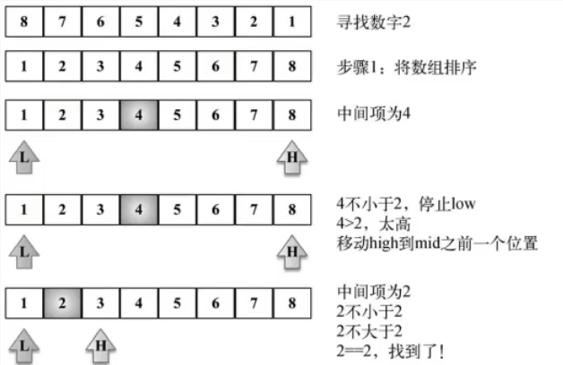

## 二分查找



````javascript
/**
 * 二分查找
 * @param {number} target 
 * @param {Array} arr 
 * @param {number} start 
 * @param {number} end 
 * @returns {number} index
 */
export const binarySearch = (target, arr, start = 0, end = arr.length - 1) => {
    if (arr[0] === target) {
        return 0
    }
    if (arr[end] === target) {
        return end
    }
    if (start < end) {
        const middle = Math.floor((end - start) / 2 + start)
        if (target === arr[middle]) {
            return middle
        }
        if (target < arr[middle]) {
            return binarySearch(target, arr, start, middle - 1)
        }
        if (target > arr[middle]) {
            return binarySearch(target, arr, middle + 1, end)
        }
    }
    return -1
}
````

## 内插搜索

内插搜索和二叉搜索的区别只有 `middle` 的算法不同。内插搜索是利用搜索目标的大小算出其在数组内大概的位置（比例），从而提高搜索的效率，适用于数字较为均匀的数组，对于离散型特别高的数组效率不高。

````javascript
/**
 * 内插查找
 * @param {number} target 
 * @param {Array} arr 
 * @param {number} start 
 * @param {number} end 
 * @returns {number} index
 */
export const insertSearch = (target, arr, start = 0, end = arr.length - 1) => {
    if (arr[0] === target) {
        return 0
    }
    if (arr[end] === target) {
        return end
    }
    if (start < end) {
        const middle = Math.floor(start + (target - arr[start]) / (arr[end] - arr[start]))
        if (target === arr[middle]) {
            return middle
        }
        if (target < arr[middle]) {
            return binarySearch(target, arr, start, middle - 1)
        }
        if (target > arr[middle]) {
            return binarySearch(target, arr, middle + 1, end)
        }
    }
    return -1
}
````