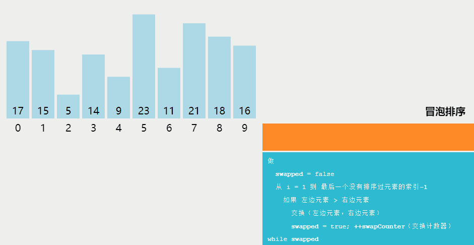
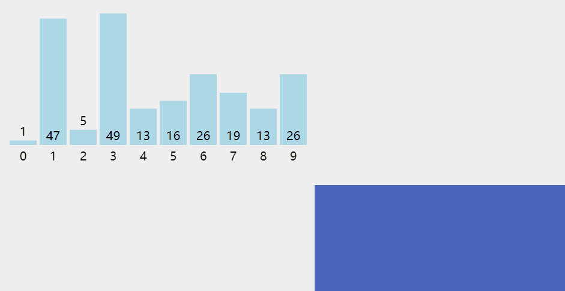
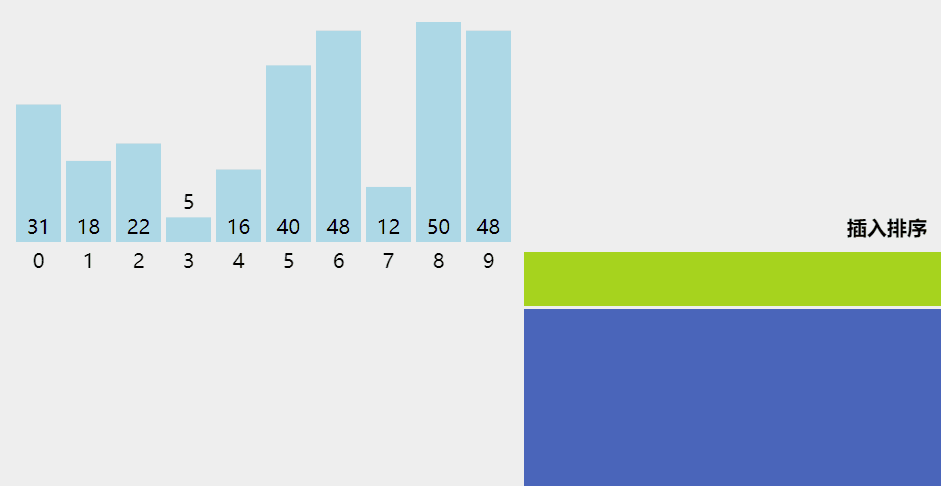
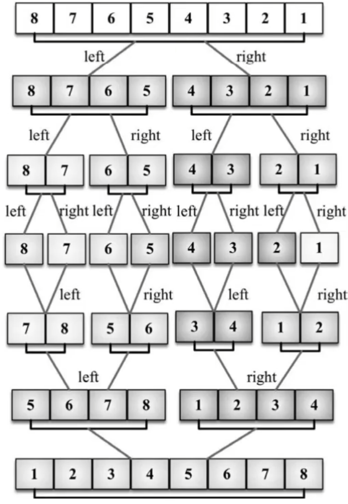
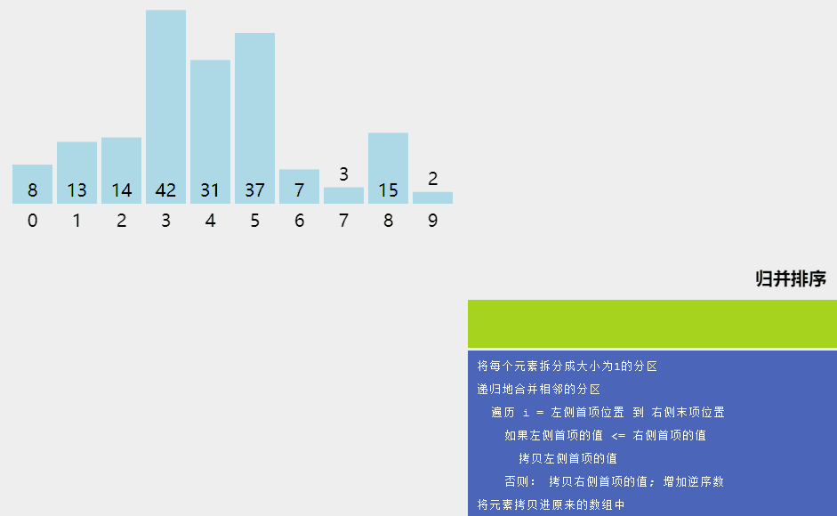
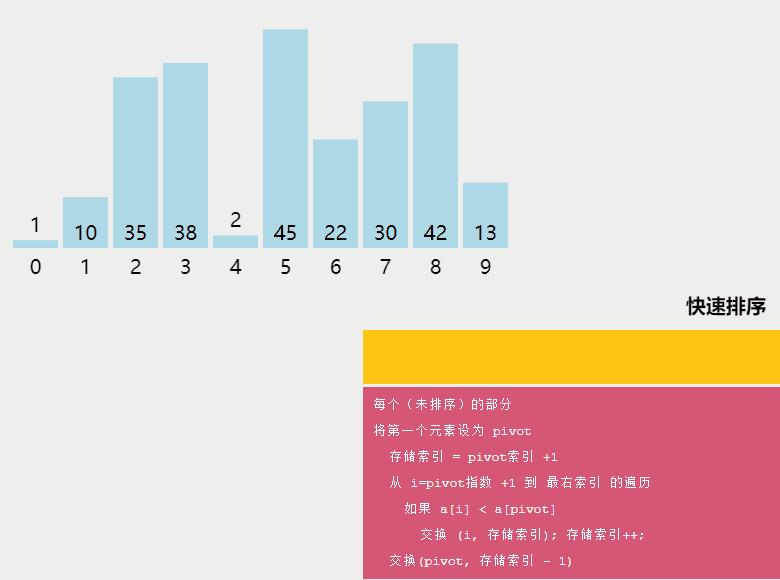
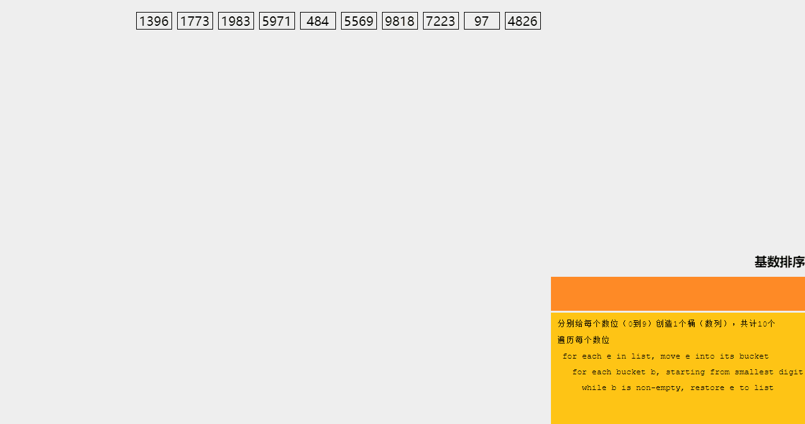

## 冒泡排序

> 冒泡排序将数组中所有相邻的两项进行比较，如果前一个比后一个大（小），则交换它们的位置。元素向上移动至最后的位置而完成排序。



````javascript
/**
 * 冒泡排序（升序）
 * @param {Array} arr 
 * @returns {Array} sorted Array
 */
export const bubbleSort = arr => {
    const copiedArr = JSON.parse(JSON.stringify(arr))
    for (let i = 0; i < copiedArr.length; i++) {
        for (let j = 0; j < copiedArr.length - i; j++) {
            if (copiedArr[j] > copiedArr[j + 1]) {
                swap(copiedArr, j, j + 1)
            }
        }
    }
    return copiedArr
}
````

## 选择排序

> 选择排序是一种原址比较排序算法。选择排序大致的思路是找到数据结构中的最小值并将其放置在第一位，接着找到第二小的值并将其放在第二位，以此类推。



````javascript
/**
 * 选择排序
 * @param {Array} arr 
 * @returns {Array} sorted Array
 */
export const selectionSort = arr => {
    const copiedArr = [...arr]
    for (let i = 0; i < copiedArr.length; i++) {
        let minIndex = i
        for (let j = minIndex; j < copiedArr.length; j++) {
            if (copiedArr[j] < copiedArr[minIndex]) {
                minIndex = j
            }
        }
        if (i !== minIndex) {
            swap(copiedArr, i, minIndex)
        }
    }
    return copiedArr
}
````


## 插入排序

> 插入排序将数组中每个元素取出，并挨个与前面的数据进行对比，如果比前面的数据小（大），则将前面的数据往后挪位置，直到找到前面比该值小（大）的数据，则将取出数据插入到该值后面，从而实现升（降）序排序。



````javascript
/**
 * 插入排序
 * @param {Array} arr 
 * @returns {Array} sorted Array
 */
export const insertSort = arr => {
    const copiedArr = [...arr]
    for (let i = 1; i < copiedArr.length; i++) {
        const temp = copiedArr[i]
        let j = i
        while (j > 0 && copiedArr[j-1] > temp) {
            debugger
            copiedArr[j] = copiedArr[j - 1]
            j--
        }
        copiedArr[j] = temp
    }
    return copiedArr
}
````

## 归并排序

> 归并排序是一种分治排序法。其思想如下：
>
> - 将原数组无限二分成小数组，直至子数组只有一个元素.
> - 再将子数组合并并排序，直到再将所有子数组合并成一个大数组。





````javascript
/**
 * 归并排序
 * @param {Array} arr 
 * @returns {Array} sorted array
 */
export const mergeSort = arr => {
    let copiedArr = [...arr]
    // 如果输入数组长度大于1，则拆分，再排序合并
    if (copiedArr.length > 1) {
        const middle = Math.floor(copiedArr.length / 2)
        const left = mergeSort(copiedArr.slice(0, middle))
        const right = mergeSort(copiedArr.slice(middle, copiedArr.length))
        copiedArr = mergeArray(left, right)
    }
    return copiedArr
}

/**
 * 排序并合并拆分后的左右两个数组
 * @param {Array} left 
 * @param {Array} right 
 * @returns {Array} merged array
 */
const mergeArray = (left, right) => {
    let i = 0
    let j = 0
    const result = []
    // 比较被拆分数组的左右，按照大小顺序拼接
    while (i < left.length && j < right.length) {
        result.push(left[i] < right[j] ? left[i++] : right[j++])
    }
    // 当一个数组完全拼接进结果数组中后，另外一个数组剩余的部分直接拼接至尾部（因为左右两个拆分过的数组实际上已经经过下层级的递归完成了排序，直接拼接即可）
    return result.concat(i < left.length ? left.slice(i) : right.slice(j))
}
````

## 快速排序

> 快速排序需要先设定一个基准，然后根据基准将数组分成两部分（大于基准的一部分和小于基准的一部分），然后递归对两部分进行快速排序，再将两部分和基准拼接起来，就可以完成排序。



````javascript
/**
 * 快速排序（chorme sort方法采用该方法）
 * @param {Array} arr 
 * @returns {Array} Sorted array
 */
export const quickSort = arr => {
    const copiedArr = [...arr]
    // 如果输入数组只有一个元素或者是空的，那么直接返回
    if (copiedArr.length <= 1) {
        return copiedArr
    }
    // 以输入数组第一个数为基准
    const base = arr[0]
    // 比基准小的提取出来准备拼到新数组左边
    const left = copiedArr.slice(1).filter(item => item < base)
    // 比基准大的提取出来准备拼到新数组的右边
    const right = copiedArr.slice(1).filter(item => item >= base)
    // 对左右两个数组递归进行相同的拆分操作，再拿到结果拼接起来
    return quickSort(left).concat(base).concat(quickSort(right))
}
````

## 计数排序

> 计数排序原理：
>
> - 将原数组存放进计数数组中，计数数组的index设为原数组的各个值，计数数组的value为各个值在原数组中出现的次数
> - 使用  `Array.forEach` 遍历计数数组，将排序后的数组重新构建出来
>
> 缺点：浪费内存！

````javascript
/**
 * 计数排序
 * @param {Array} arr 
 */
export const countSort = arr => {
    // 计数数组，index 为原数组的各个值，value 为原数组中 index 对应值的出现次数
    const counts = []
    arr.forEach(item => {
        if (!counts[item]) {
            counts[item] = 0
        }
        counts[item]++
    });
    // 结果数组，用来存放排序结果
    const result = []
    // forEach 可以自动过滤数组中的空值，并且按照index的从小到大的顺序输出
    counts.forEach((count, index) => {
        for (let i = 0; i < count; i++) {
            result.push(index)
        }
    })
    return result
}
````

## 桶排序

> 桶排序（也称之为箱排序）也是分布式排序算法，它将元素分为不同的桶（较小的数组），再使用一个简单的排序算法，如插入排序（用来排序小数组的不错的算法），来进行桶排序。然后将桶合并成结果数组

````javascript
/**
 * 桶排序
 * @param {Array} arr 
 * @param {Number} bucketSize 
 * @returns {Array} sortedArray
 */
export const bucketSort = (arr, bucketSize) => {
    const minValue = Math.min(...arr)
    const maxValue = Math.max(...arr)
    const bucketCount = Math.floor((maxValue - minValue) / bucketSize) + 1
    // 1.准备一个大桶，内部小桶的数量 = (桶内最大值 - 桶内最小值)/小桶的大小
    const bucket = []
    for (let i = 0; i < bucketCount; i++) {
        bucket[i] = []
    }
    console.log('bucket:', bucket)

    // 2. 遍历每个小桶。使用以下算法将所有值放到各个小桶中，小桶与小桶之间数据排列为从小至大
    arr.forEach(item => {
        const index = Math.floor((item - minValue) / bucketSize)
        bucket[index].push(item)
    })
    console.log('loaded bucket:', bucket)

    // 3.将每个小桶中的数据从小至大排序（插入排序）
    const sortedBucket = bucket.map(subBucket => insertSort(subBucket))
    console.log(sortedBucket)

    // 4.将每个小桶展开拼成一个大数组，即为升序排列的数组
    const sortedArray = []
    sortedBucket.forEach(bucket => {
        sortedArray.push(...bucket)
    })
    return sortedArray
}
````

## 基数排序

> 基数排序（radix sort）属于“分配式排序”（distribution sort），又称“桶子法”（bucket sort）或bin sort，顾名思义，它是透过键值的部份资讯，将要排序的[元素分配](https://baike.baidu.com/item/元素分配/2107419?fromModule=lemma_inlink)至某些“桶”中，藉以达到排序的作用，基数排序法是属于稳定性的排序，其[时间复杂度](https://baike.baidu.com/item/时间复杂度/1894057?fromModule=lemma_inlink)为O (nlog(r)m)，其中r为所采取的基数，而m为堆数，在某些时候，基s数排序法的效率高于其它的稳定性排序法。



````javascript
/**
 * 基数排序
 * @param {Array} arr 
 * @returns 
 */
export const radixSort = arr => {
    let copiedArr = [...arr]
    const radix = 10
    // 现在取的位数（1：个位；2：十位；3：百位）
    let divider = 1
    const maxValue = Math.max(...copiedArr)
    while (divider <= maxValue) {
        // 创建一个二维数组，第二维数组为空数组，作为“桶”
        const buckets = [...Array(radix)].map(() => [])
        // 遍历传入数组，根据其对应基数位的大小，由小至大放入对应桶中
        for (let value of copiedArr) {
            // 获取到该数组元素应该存放的桶的索引
            const index = Math.floor(value / divider) % radix
            // 将该数组元素放到其应该所在的桶
            buckets[index].push(value)
        }
        // 将二维数组展开覆盖原数组（此时对应基数位已经从小到大啊排列）
        copiedArr = [].concat(...buckets)
        divider *= radix
    }
    return copiedArr
}
````