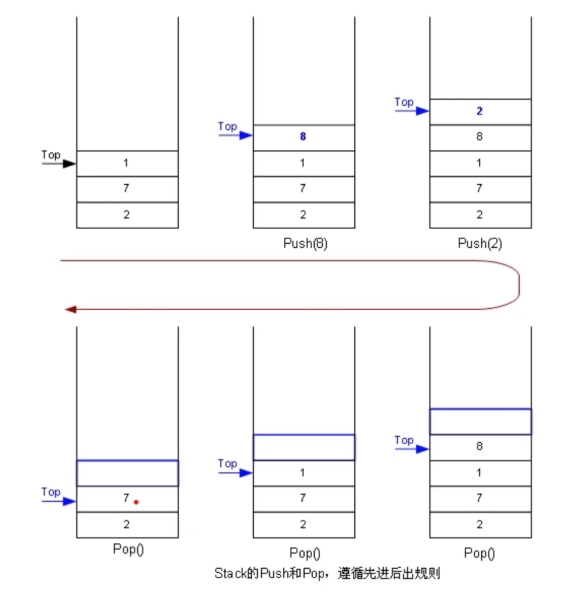
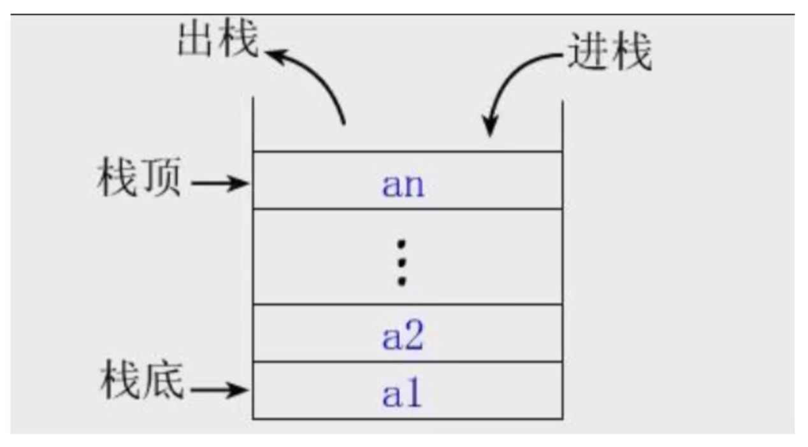

> 栈（stack），是一种运算受限的线性表，限定*仅在表尾进行插入和删除操作的线性表*。入栈的一端被称为栈顶，相对的另外一端称为栈底。向一个栈插入新元素称作进栈，它是把新元素放到栈顶元素的上面，使之成为新的栈顶元素；从一个栈删除元素又称作出栈或者退栈，它是把栈顶元素删除掉，使其相邻的元素称为新的栈顶元素。

**特点：后进先出 Last In First Out (LIFO)**



**函数调用栈**



## 栈结构的封装

````javascript
class Stack {
    // 栈体（以 # 开头定义为私有属性，以防直接篡改）
    #items = []
    // 出栈
    pop = () => this.#items.pop()
    // 入栈
    push = data => this.#items.push(data)
    // 返回栈顶
    peek = () => this.#items.at(-1)
    // 清栈
    clear = () => this.#items = []
    // 是否空栈
    isEmplty = () => this.#items.length === 0
    // 当前栈大小
    size = () => this.#items.length
    // 输出形式
    toString = () => this.#items.join(',')
}
````

## 栈结构的应用（进制转换）

进制转换示例：

````javascript
const Stack = require('../01.栈的封装/stack.cjs')
/**
 * 
 * @param {number} input 数字
 * @param {number} mode 进制
 */
module.exports = function convert(input, mode) {
    const stack = new Stack()

    // 基本字符集
    const baseCharSet = '0123456789ABCDEF'
    
    // 辗转相除，得到输入对进制的余数，并进栈
    while (input) {
        stack.push(baseCharSet[input % mode])
        input = Math.floor(input / mode)
    }

    let output = ''

    // 倒序出栈拼接成进制转换后的数字
    while (!stack.isEmplty()) {
        output += stack.pop()
    }

    return output
}
````