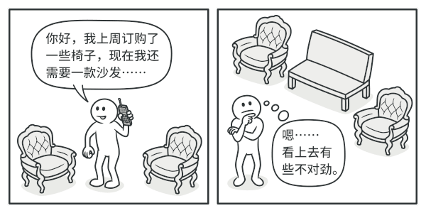
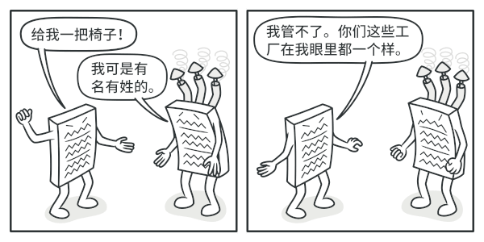

## 意图

抽象工厂模式是一种创建型设计模式， 它能创建一系列相关的对象， 而无需指定其具体类。


## 问题

假设你正在开发一款家具商店模拟器。 你的代码中包括一些类， 用于表示：

一系列相关产品， 例如 椅子`Chair` 、 ​ 沙发`Sofa`和 咖啡桌`Coffee­Table` 。

系列产品的不同变体。 例如， 你可以使用 现代`Modern` 、 ​ 维多利亚`Victorian` 、 ​ 装饰风艺术`Art­Deco`等风格生成 椅子 、 ​ 沙发和 咖啡桌 。


你需要设法单独生成每件家具对象， 这样才能确保其风格一致。 如果顾客收到的家具风格不一样， 他们可不会开心。



此外， 你也不希望在添加新产品或新风格时修改已有代码。 家具供应商对于产品目录的更新非常频繁， 你不会想在每次更新时都去修改核心代码的。

## 解决方案

首先， 抽象工厂模式建议为系列中的每件产品明确声明接口 （例如椅子、 沙发或咖啡桌）。 然后， 确保所有产品变体都继承这些接口。 例如， 所有风格的椅子都实现 `椅子`接口； 所有风格的咖啡桌都实现 `咖啡桌`接口， 以此类推。


接下来， 我们需要声明抽象工厂——包含系列中所有产品构造方法的接口。 例如 `create­Chair`创建椅子 、 ​ `create­Sofa`创建沙发和 `create­Coffee­Table`创建咖啡桌 。 这些方法必须返回抽象产品类型， 即我们之前抽取的那些接口：`椅子`,`沙发`和 `咖啡桌`等等。


那么该如何处理产品变体呢？ 对于系列产品的每个变体， 我们都将基于 抽象工厂接口创建不同的工厂类。 每个工厂类都只能返回特定类别的产品， 例如， ​ 现代家具工厂`Modern­Furniture­Factory`只能创建 现代椅子`Modern­Chair` 、 ​ 现代沙发`Modern­Sofa`和 现代咖啡桌`Modern­Coffee­Table`对象。

客户端代码可以通过相应的抽象接口调用工厂和产品类。 你无需修改实际客户端代码， 就能更改传递给客户端的工厂类， 也能更改客户端代码接收的产品变体。



假设客户端想要工厂创建一把椅子。 客户端无需了解工厂类， 也不用管工厂类创建出的椅子类型。 无论是现代风格， 还是维多利亚风格的椅子， 对于客户端来说没有分别， 它只需调用抽象 椅子接口就可以了。 这样一来， 客户端只需知道椅子以某种方式实现了 `sit­On` 坐下方法就足够了。 此外， 无论工厂返回的是何种椅子变体， 它都会和由同一工厂对象创建的沙发或咖啡桌风格一致。

最后一点说明： 如果客户端仅接触抽象接口， 那么谁来创建实际的工厂对象呢？ 一般情况下， 应用程序会在初始化阶段创建具体工厂对象。 而在此之前， 应用程序必须根据配置文件或环境设定选择工厂类别。

## 抽象工厂模式结构


1. **抽象产品** （Abstract Product） 为构成系列产品的一组不同但相关的产品声明接口。
2. **具体产品** （Concrete Product） 是抽象产品的多种不同类型实现。 所有变体 （维多利亚/现代） 都必须实现相应的抽象产品 （椅子/沙发）。
3. **抽象工厂** （Abstract Factory） 接口声明了一组创建各种抽象产品的方法。
4. **具体工厂** （Concrete Factory） 实现抽象工厂的构建方法。 每个具体工厂都对应特定产品变体， 且仅创建此种产品变体。
5. 尽管具体工厂会对具体产品进行初始化， 其构建方法签名必须返回相应的抽象产品。 这样， 使用工厂类的客户端代码就不会与工厂创建的特定产品变体耦合。 客户端 （Client） 只需通过抽象接口调用工厂和产品对象， 就能与任何具体工厂/产品变体交互。

## 伪代码
下面例子通过应用抽象工厂模式， 使得客户端代码无需与具体 UI 类耦合， 就能创建跨平台的 UI 元素， 同时确保所创建的元素与指定的操作系统匹配。


跨平台应用中的相同 UI 元素功能类似， 但是在不同操作系统下的外观有一定差异。 此外， 你需要确保 UI 元素与当前操作系统风格一致。 你一定不希望在 Windows 系统下运行的应用程序中显示 macOS 的控件。

抽象工厂接口声明一系列构建方法， 客户端代码可调用它们生成不同风格的 UI 元素。 每个具体工厂对应特定操作系统， 并负责生成符合该操作系统风格的 UI 元素。

其运作方式如下： 应用程序启动后检测当前操作系统。 根据该信息， 应用程序通过与该操作系统对应的类创建工厂对象。 其余代码使用该工厂对象创建 UI 元素。 这样可以避免生成错误类型的元素。

使用这种方法， 客户端代码只需调用抽象接口， 而无需了解具体工厂类和 UI 元素。 此外， 客户端代码还支持未来添加新的工厂或 UI 元素。

这样一来， 每次在应用程序中添加新的 UI 元素变体时， 你都无需修改客户端代码。 你只需创建一个能够生成这些 UI 元素的工厂类， 然后稍微修改应用程序的初始代码， 使其能够选择合适的工厂类即可。

```py
# 抽象工厂接口声明了一组能返回不同抽象产品的方法。这些产品属于同一个系列
# 且在高层主题或概念上具有相关性。同系列的产品通常能相互搭配使用。系列产
# 品可有多个变体，但不同变体的产品不能搭配使用。
interface GUIFactory is
    method createButton():Button
    method createCheckbox():Checkbox


# 具体工厂可生成属于同一变体的系列产品。工厂会确保其创建的产品能相互搭配
# 使用。具体工厂方法签名会返回一个抽象产品，但在方法内部则会对具体产品进
# 行实例化。
class WinFactory implements GUIFactory is
    method createButton():Button is
        return new WinButton()
    method createCheckbox():Checkbox is
        return new WinCheckbox()

# 每个具体工厂中都会包含一个相应的产品变体。
class MacFactory implements GUIFactory is
    method createButton():Button is
        return new MacButton()
    method createCheckbox():Checkbox is
        return new MacCheckbox()


# 系列产品中的特定产品必须有一个基础接口。所有产品变体都必须实现这个接口。
interface Button is
    method paint()

# 具体产品由相应的具体工厂创建。
class WinButton implements Button is
    method paint() is
        # 根据 Windows 样式渲染按钮。

class MacButton implements Button is
    method paint() is
        # 根据 macOS 样式渲染按钮

# 这是另一个产品的基础接口。所有产品都可以互动，但是只有相同具体变体的产
# 品之间才能够正确地进行交互。
interface Checkbox is
    method paint()

class WinCheckbox implements Checkbox is
    method paint() is
        # 根据 Windows 样式渲染复选框。

class MacCheckbox implements Checkbox is
    method paint() is
        # 根据 macOS 样式渲染复选框。

# 客户端代码仅通过抽象类型（GUIFactory、Button 和 Checkbox）使用工厂
# 和产品。这让你无需修改任何工厂或产品子类就能将其传递给客户端代码。
class Application is
    private field factory: GUIFactory
    private field button: Button
    constructor Application(factory: GUIFactory) is
        this.factory = factory
    method createUI() is
        this.button = factory.createButton()
    method paint() is
        button.paint()


# 程序会根据当前配置或环境设定选择工厂类型，并在运行时创建工厂（通常在初
# 始化阶段）。
class ApplicationConfigurator is
    method main() is
        config = readApplicationConfigFile()

        if (config.OS == "Windows") then
            factory = new WinFactory()
        else if (config.OS == "Mac") then
            factory = new MacFactory()
        else
            throw new Exception("错误！未知的操作系统。")

        Application app = new Application(factory)
```

## 抽象工厂模式优缺点

√ 你可以确保同一工厂生成的产品相互匹配。
√ 你可以避免客户端和具体产品代码的耦合。
√ 单一职责原则。 你可以将产品生成代码抽取到同一位置， 使得代码易于维护。
√ 开闭原则。 向应用程序中引入新产品变体时， 你无需修改客户端代码。
× 由于采用该模式需要向应用中引入众多接口和类， 代码可能会比之前更加复杂。

## 与其他模式的关系

-   在许多设计工作的初期都会使用工厂方法模式 （较为简单， 而且可以更方便地通过子类进行定制）， 随后演化为使用抽象工厂模式、 原型模式或生成器模式 （更灵活但更加复杂）。

-   生成器重点关注如何分步生成复杂对象。 抽象工厂专门用于生产一系列相关对象。 抽象工厂会马上返回产品， 生成器则允许你在获取产品前执行一些额外构造步骤。

-   抽象工厂模式通常基于一组工厂方法， 但你也可以使用原型模式来生成这些类的方法。

-   当只需对客户端代码隐藏子系统创建对象的方式时， 你可以使用抽象工厂来代替外观模式。

-   你可以将抽象工厂和桥接模式搭配使用。 如果由桥接定义的抽象只能与特定实现合作， 这一模式搭配就非常有用。 在这种情况下， 抽象工厂可以对这些关系进行封装， 并且对客户端代码隐藏其复杂性。

-   抽象工厂、 生成器和原型都可以用单例模式来实现。
