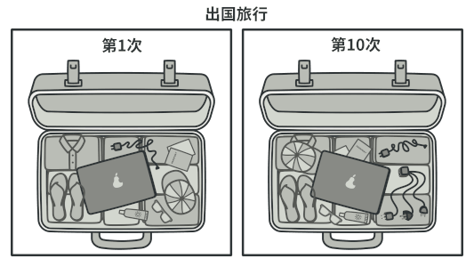

## 意图

**适配器模式**是一种结构型设计模式， 它能使接口不兼容的对象能够相互合作。


## 问题

假如你正在开发一款股票市场监测程序， 它会从不同来源下载 XML 格式的股票数据， 然后向用户呈现出美观的图表。

在开发过程中， 你决定在程序中整合一个第三方智能分析函数库。 但是遇到了一个问题， 那就是分析函数库只兼容 JSON 格式的数据。


你可以修改程序库来支持 XML。 但是， 这可能需要修改部分依赖该程序库的现有代码。 甚至还有更糟糕的情况， 你可能根本没有程序库的源代码， 从而无法对其进行修改。

## 解决方案

你可以创建一个适配器。 这是一个特殊的对象， 能够转换对象接口， 使其能与其他对象进行交互。

适配器模式通过封装对象将复杂的转换过程隐藏于幕后。 被封装的对象甚至察觉不到适配器的存在。 例如， 你可以使用一个将所有数据转换为英制单位 （如英尺和英里） 的适配器封装运行于米和千米单位制中的对象。

适配器不仅可以转换不同格式的数据， 其还有助于采用不同接口的对象之间的合作。 它的运作方式如下：

1. 适配器实现与其中一个现有对象兼容的接口。
2. 现有对象可以使用该接口安全地调用适配器方法。
3. 适配器方法被调用后将以另一个对象兼容的格式和顺序将请求传递给该对象。

有时你甚至可以创建一个双向适配器来实现双向转换调用。


让我们回到股票市场程序。 为了解决数据格式不兼容的问题， 你可以为分析函数库中的每个类创建将 XML 转换为 JSON 格式的适配器， 然后让客户端仅通过这些适配器来与函数库进行交流。 当某个适配器被调用时， 它会将传入的 XML 数据转换为 JSON 结构， 并将其传递给被封装分析对象的相应方法。

## 真实世界类比



如果你是第一次从美国到欧洲旅行， 那么在给笔记本充电时可能会大吃一惊。 不同国家的电源插头和插座标准不同。 美国插头和德国插座不匹配。 同时提供美国标准插座和欧洲标准插头的电源适配器可以解决你的难题。

## 适配器模式结构

**对象适配器**

实现时使用了构成原则： 适配器实现了其中一个对象的接口， 并对另一个对象进行封装。 所有流行的编程语言都可以实现适配器。


1. **客户端** （Client） 是包含当前程序业务逻辑的类。
2. **客户端接口** （Client Interface） 描述了其他类与客户端代码合作时必须遵循的协议。
3. **服务** （Service） 中有一些功能类 （通常来自第三方或遗留系统）。 客户端与其接口不兼容， 因此无法直接调用其功能。
4. **适配器** （Adapter） 是一个可以同时与客户端和服务交互的类： 它在实现客户端接口的同时封装了服务对象。 适配器接受客户端通过适配器接口发起的调用， 并将其转换为适用于被封装服务对象的调用。
5. 客户端代码只需通过接口与适配器交互即可， 无需与具体的适配器类耦合。 因此， 你可以向程序中添加新类型的适配器而无需修改已有代码。 这在服务类的接口被更改或替换时很有用： 你无需修改客户端代码就可以创建新的适配器类。

---

**类适配器**

这一实现使用了继承机制： 适配器同时继承两个对象的接口。 请注意， 这种方式仅能在支持多重继承的编程语言中实现， 例如 C++。


1. **类适配器**不需要封装任何对象， 因为它同时继承了客户端和服务的行为。 适配功能在重写的方法中完成。 最后生成的适配器可替代已有的客户端类进行使用。

## 伪代码

下列**适配器**模式演示基于经典的 “方钉和圆孔” 问题。


适配器假扮成一个圆钉 （Round­Peg）， 其半径等于方钉 （Square­Peg） 横截面对角线的一半 （即能够容纳方钉的最小外接圆的半径）。

```py
# 假设你有两个接口相互兼容的类：圆孔（Round­Hole）和圆钉（Round­Peg）。
class RoundHole is
    constructor RoundHole(radius) { …… }

    method getRadius() is
        # 返回孔的半径。

    method fits(peg: RoundPeg) is
        return this.getRadius() >= peg.getRadius()

class RoundPeg is
    constructor RoundPeg(radius) { …… }

    method getRadius() is
        # 返回钉子的半径。


# 但还有一个不兼容的类：方钉（Square­Peg）。
class SquarePeg is
    constructor SquarePeg(width) { …… }

    method getWidth() is
        # 返回方钉的宽度。


# 适配器类让你能够将方钉放入圆孔中。它会对 RoundPeg 类进行扩展，以接收适
# 配器对象作为圆钉。
class SquarePegAdapter extends RoundPeg is
    # 在实际情况中，适配器中会包含一个 SquarePeg 类的实例。
    private field peg: SquarePeg

    constructor SquarePegAdapter(peg: SquarePeg) is
        this.peg = peg

    method getRadius() is
        # 适配器会假扮为一个圆钉，其半径刚好能与适配器实际封装的方钉搭配
        # 起来。
        return peg.getWidth() * Math.sqrt(2) / 2


# 客户端代码中的某个位置。
hole = new RoundHole(5)
rpeg = new RoundPeg(5)
hole.fits(rpeg) # true

small_sqpeg = new SquarePeg(5)
large_sqpeg = new SquarePeg(10)
hole.fits(small_sqpeg) # 此处无法编译（类型不一致）。

small_sqpeg_adapter = new SquarePegAdapter(small_sqpeg)
large_sqpeg_adapter = new SquarePegAdapter(large_sqpeg)
hole.fits(small_sqpeg_adapter) # true
hole.fits(large_sqpeg_adapter) # false
```

## 适配器模式优缺点

√ 单一职责原则你可以将接口或数据转换代码从程序主要业务逻辑中分离。
√ 开闭原则。 只要客户端代码通过客户端接口与适配器进行交互， 你就能在不修改现有客户端代码的情况下在程序中添加新类型的适配器。
× 代码整体复杂度增加， 因为你需要新增一系列接口和类。 有时直接更改服务类使其与其他代码兼容会更简单。

## 与其他模式的关系

-   [**桥接模式**](./bridge.md)通常会于开发前期进行设计， 使你能够将程序的各个部分独立开来以便开发。 另一方面， **适配器模式**通常在已有程序中使用， 让相互不兼容的类能很好地合作。

-   **适配器**可以对已有对象的接口进行修改，[**装饰模式**](./decorator.md)则能在不改变对象接口的前提下强化对象功能。 此外，_装饰_ 还支持递归组合， _适配器_ 则无法实现。

-   **适配器**能为被封装对象提供不同的接口， [**代理模式**](./proxy.md)能为对象提供相同的接口， [**装饰**](./decorator.md)则能为对象提供加强的接口。

-   [**外观模式**](./facade.md)为现有对象定义了一个新接口， **适配器**则会试图运用已有的接口。 _适配器_ 通常只封装一个对象， _外观_ 通常会作用于整个对象子系统上。

-   [**桥接**](./bridge.md)、 [**状态模式**](../behavioral/state.md)和[**策略模式**](../behavioral/strategy.md) （在某种程度上包括**适配器**） 模式的接口非常相似。 实际上， 它们都基于[**组合模式**](./composite.md)——即将工作委派给其他对象， 不过也各自解决了不同的问题。 模式并不只是以特定方式组织代码的配方， 你还可以使用它们来和其他开发者讨论模式所解决的问题。
