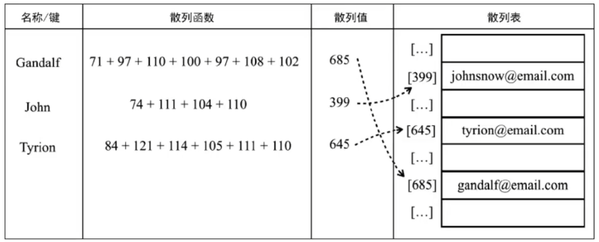

> 字典和集合很相似，集合以 [value, value] 的形式存储元素，字典则是以 [键, 值] 的形式来存储元素。字典也称作映射、符号表或者关联数组。	

## 字典结构的封装

````javascript
export default class Dictionary {
    #table = {}

    set(key, value) {
        if (key != null && value != null) {
            const tableKey = this.toStrFn(key)
            this.#table[tableKey] = new ValuePair(key, value)
        }
    }

    get(key) {
        const tableKey = this.toStrFn(key)
        return this.#table[tableKey]?.value
    }

    hasKey(key) {
        return this.#table[this.toStrFn(key)] != null
    }

    remove(key) {
        if (this.hasKey(key)) {
            delete this.#table[this.toStrFn(key)]
            return true
        }
        return false
    }

    keys() {
        return this.keyValues().map(valuePair => valuePair.key)
    }

    values() {
        return this.keyValues().map(valuePair => valuePair.value)
    }

    keyValues() {
        return Object.values(this.#table)
    }

    size() {
        return Object.keys(this.#table).length
    }

    isEmpty() {
        return this.size() === 0
    }

    clear() {
        this.#table = {}
    }

    forEach(callback) {
        const valuePair = this.valuePair()
        for (let i = 0; i < valuePair.length; i++) {
            callback(valuePair[i].vkey, valuePair[i].value)
        }
    }

    toStrFn(key) {
        if (key === null) {
            return 'NULL'
        } else if (key === undefined) {
            return 'UNDEFINED'
        } else if (typeof key === 'string' || key instanceof String) {
            return key
        }
        return JSON.stringify(key)
    }
}

class ValuePair {
    constructor(key, value) {
        this.key = key
        this.value = value
    }
}
````

## 散列表

> HashMap类是一种 Dictionary 类的一种散列表实现方式，散列表算法的作用是尽可能快地在数据结构中找到一个值。



````javascript
export class HashMap {
    #table = {}

    set(key, value) {
        if (key != null && value != null) {
            const position = this.hashCode(key)
            this.#table[position] = new valuePair(position, value)
            return true
        }
        return false
    }

    get(key) {
        if (key != null) {
            const position = this.hashCode(key)
            const valuePair = this.#table[position]
            return valuePair == null ? undefined : valuePair.value
        }
    }

    remove(key) {
        if (key != null) {
            const hashKey = this.hashCode(key)
            const valuePair = this.#table[hashKey]
            if(valuePair != null){
                delete this.#table[hashKey]
                return true
            }
            return false
        }
    }

    // 打散方法
    hashCode(key) {
        const tableKey = this.toStrFn(key)
        let hash = 5381
        for (let i = 0; i < tableKey.length; i++) {
            hash = (hash * 33) + tableKey.charCodeAt(i)
        }
        return hash % 1013
    }

    toStrFn(key) {
        if (key === null) {
            return 'NULL'
        } else if (key === undefined) {
            return 'UNDEFINED'
        } else if (typeof key === 'string' || key instanceof String) {
            return key
        }
        return JSON.stringify(key)
    }
}

class valuePair {
    constructor(key, value) {
        this.key = key
        this.value = value
    }
}
````

## ES6中的Map

````javascript
const map = new Map()
map.set('name','Lucy')
map.set({a:1}, '{a:1}')
console.log(map.get('name')) // Lucy
console.log(map.get({a:1})) // undefined  因为在 js 中 {a:1} 不等于 {a:1}。如果需要用对象作为 key，需要使用其引用
        
const obj = {b: 2}
map.set(obj, '{b:2}')
console.log(map.get(obj)) // {b:2}

// 注意，Map 定义的以对象指针为 key 的散列，如果指针指向了其他对象，其原指针指向内容作为key的键值对将永远残留在 map 中，造成内存泄漏
let obj2 = {c:3}
map.set(obj2, '{c:3}')
console.log(map)
console.log(map.get(obj2)) // {c:3}
obj2 = '666'
console.log(map.get(obj2)) // undefined
console.log(map) // value 为 {c:3} 的键值对依旧在散列中

// WeakMap 产生的 map 只能接收以对象为key的键值对，且如果 key 为 null，该键值对会从散列中去除
const weakmap = new WeakMap()
let obj3 = {d:4}
weakmap.set(obj3, '{d:4}')
console.log(weakmap)
console.log(weakmap.get(obj3)) // {c:3}
obj3 = null
console.log(weakmap.get(obj3)) // undefined
console.log(weakmap) // 空散列
````