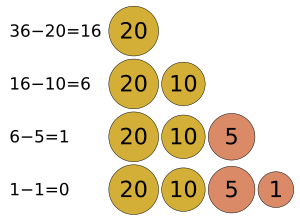
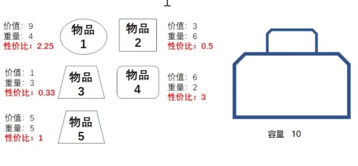
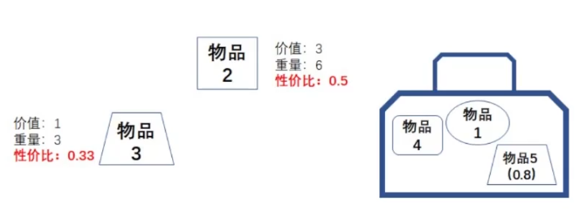

贪心算法（英语：greedy algorithm），又称贪婪算法，是一种在每一步选择中都采取在当前状态下最好或最优（即最有利）的选择，从而希望导致结果是最好或最优的算法。比如在旅行推销员问题中，如果旅行员每次都选择最近的城市，那这就是一种贪心算法。
 
贪心算法在有最优子结构的问题中尤为有效。最优子结构的意思是局部最优解能决定全局最优解。简单地说，问题能够分解成子问题来解决，子问题的最优解能递推到最终问题的最优解。

贪心算法与动态规划的不同在于它对每个子问题的解决方案都做出选择，不能回退。动态规划则会保存以前的运算结果，并根据以前的结果对当前进行选择，有回退功能。

贪心法可以解决一些最优化问题，如：求图中的最小生成树、求哈夫曼编码……对于其他问题，贪心法一般不能得到我们所要求的答案。一旦一个问题可以通过贪心法来解决，那么贪心法一般是解决这个问题的最好办法。由于贪心法的高效性以及其所求得的答案比较接近最优结果，贪心法也可以用作辅助算法或者直接解决一些要求结果不特别精确的问题。在不同情况，选择最优的解，可能会导致辛普森悖论（Simpson's Paradox），不一定出现最优的解。

> 
> 一般人换零钱的时候也会应用到贪心算法。把$36换散︰$20 > $10 > $5 > $1
 

## 背包（可拆分）问题





思路：算出每个物品的性价比（价值/重量），按照性价比从高到低放入背包，放不进了就切开来放，放满为止。

````javascript
/**
 * 【贪心算法】背包问题
 * @param {Array<number>} weights 
 * @param {Array<number>} values 
 * @param {number} capacity
 * @returns {number}
 */
export const knapSack = (weights, values, capacity) => {
    const objectList = []
    // 遍历物品，构建物品的详细信息（算出性价比）
    for (let i = 0; i < weights.length; i++) {
        objectList.push({
            index: i,
            weight: weights[i],
            value: values[i],
            costEffient: values[i] / weights[i]
        })
    }
    // 按照性价比给物品排序
    objectList.sort((a, b) => b.costEffient - a.costEffient)

    const knapSack = {
        productInKnapSack: [],
        value: 0,
        weight: 0,
        capacity: capacity
    }

    // 将物品按照性价比由高到低放入背包，放不下的切开来放进去能放进去的部分
    for (let i = 0; i < objectList.length; i++) {
        if (knapSack.capacity >= objectList[i].weight) {
            knapSack.productInKnapSack.push({ ...objectList[i], ratio: 1 })
            knapSack.value += objectList[i].value
            knapSack.weight += objectList[i].weight
            knapSack.capacity -= objectList[i].weight
        } else if (knapSack.capacity > 0) {
            const ratio = knapSack.capacity / objectList[i].weight
            knapSack.productInKnapSack.push({ ...objectList[i], ratio })
            knapSack.value += (objectList[i].value * ratio)
            knapSack.weight += objectList[i].weight * ratio
            knapSack.capacity -= objectList[i].weight * ratio
            break
        } else {
            break
        }
    }

    console.log('knapSack:', knapSack)
    return knapSack.value
}
````