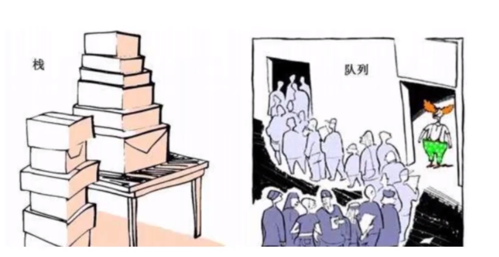
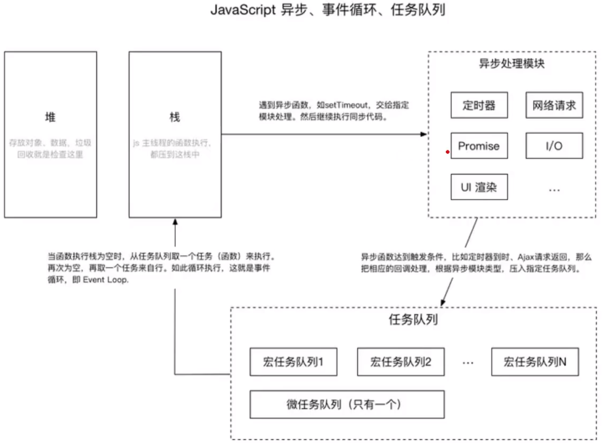

> 队列是一种特殊的线性表，其只允许表的前端（front）进行删除，标的后端（rear）进行插入，和栈一样，队列是一种操作受限制的线性表。进行插入操作的一端称为队尾，进行删除操作的一端叫做队头。队列中没有元素时，称为空队列。

队列的数据元素又称为队列元素。在队列中插入一个队列元素叫做**入队**，从队列中删除一个队列元素将成为**出队**。因为队列只允许在一端插入，在另一端删除，所以只有最早进入队列的元素最先从队列中删除，故队列又称为**先进先出**（FIFO --- First In First Out）线性表。





## 队列的封装

````javascript
class Queue {
    // 队列容器
    #items = {}
    // 队列头指针
    #headPointer = 0
    // 队列尾指针
    #endPointer = 0

    // 入队
    enQueue(data) {
        // 队尾入队
        this.#items[this.#endPointer] = data
        // 队尾指针后移
        this.#endPointer++
        console.log('入队成功了，当前队列为：', this.#items)
    }

    // 出队
    deQueue() {
        // 队首出队（直接删除队首元素）
        delete this.#items[this.#headPointer]
        // 队首指针后移
        this.#headPointer++
        console.log('出队成功了，当前队列为：', this.#items);
    }

    // 清栈
    clear() {
        this.#items = {}
        this.#headPointer
    }

    // 队列当前规模
    size() {
        return this.#endPointer - this.#headPointer
    }

    // 是否是空队列
    isEmpty() {
        return this.size() === 0
    }

    toString() {
        let str = ''
        for(let i = this.#headPointer; i < this.#endPointer; i++){
            str += `${this.#items[i]} `
        }
        return str
    }
}
````

## 队列的应用（击鼓传花游戏）

````javascript
const Queue = require('../03.队列的封装/queue.cjs')

module.exports = function game(data, interval) {
    const queue = new Queue()
    // 所有人员入队
    for (let i = 0; i < data.length; i++) {
        queue.enQueue(data[i])
    }

    while (queue.size() > 1) {
        // 当击鼓次数没有结束时
        for (let j = 1; j < interval; j++) {
            // 队首出队，进入队尾
            queue.enQueue(queue.deQueue())
        }
        // 击鼓结束，队首淘汰
        console.log(`${queue.deQueue()} out!`)
    }

    const winner = queue.deQueue()
    console.log(`${winner} is the winner!` );
    return winner
}
````

## 双向队列的封装

> 双向队列：可以从队列两头进行入队和出队的队列。

````javascript
module.exports = class Queue {
    // 队列容器
    #items = {}
    // 队列头指针
    #headPointer = 0
    // 队列尾指针
    #endPointer = 0

    // 入队
    enQueue(data) {
        // 队尾入队
        this.#items[this.#endPointer] = data
        // 队尾指针后移
        this.#endPointer++
    }

    // 出队
    deQueue() {
        let res = this.#items[this.#headPointer]
        // 队首出队（直接删除队首元素）
        delete this.#items[this.#headPointer]
        // 队首指针后移
        this.#headPointer++
        // 返回出队元素
        return res
    }

    // 清栈
    clear() {
        this.#items = {}
        this.#headPointer
    }

    // 队列当前规模
    size() {
        return this.#endPointer - this.#headPointer
    }

    // 是否是空队列
    isEmpty() {
        return this.size() === 0
    }

    toString() {
        let str = ''
        for (let i = this.#headPointer; i < this.#endPointer; i++) {
            str += `${this.#items[i]} `
        }
        return str
    }
}
````

## 双向队列的应用(回文字符串)

````javascript
const DoubleEndQueue = require('../05.双端队列/doubleEndQueue.cjs')

module.exports = function checkPalindromicString(string) {
    // 处理字符换（去空，转为全小写）
    string = string.toLowerCase().split(' ').join('')

    const queue = new DoubleEndQueue()
    for (let i = 0; i < string.length; i++) {
        queue.addFromEnd(string[i])
    }

    let result = true

    // 当队列长度大于1的时候，循环操作
    while (queue.size() > 1) {
        // 前后出队，对比是否相等
        if (queue.removeFromEnd() !== queue.removeFromHead()) {
            result = false
            break
        }
    }

    return result
}
````