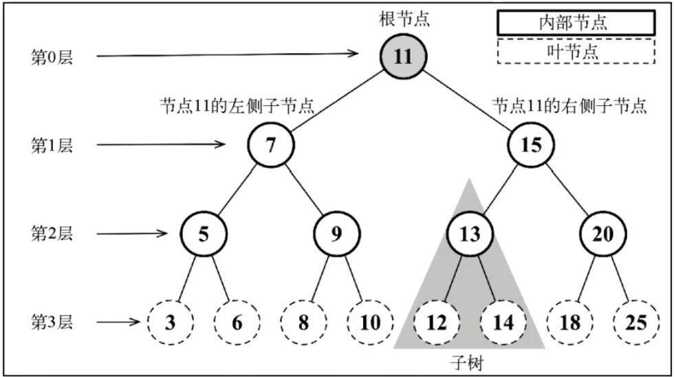
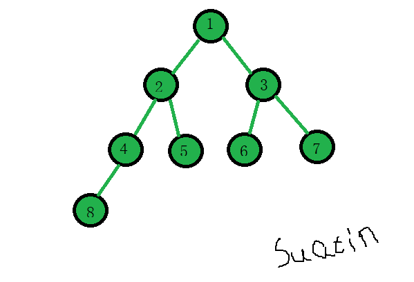
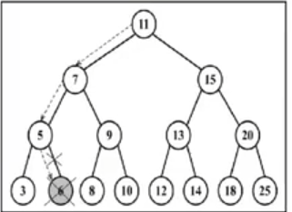
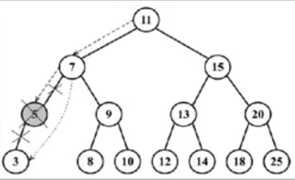
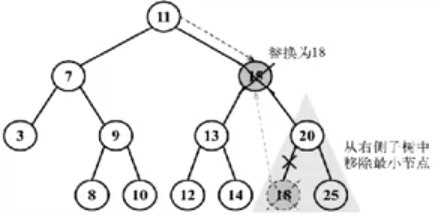

> 树是一种分层数据的抽象模型



## 二叉树

> 二叉树中的节点最多只能有两个子节点：一个是左侧子节点，另一个是右侧子节点。

## 二叉搜索树

> 二叉搜索树（BST）是二叉树的一种，但是只允许在左侧节点存储（比父节点）小的值，在右侧节点存储（比父节点）大的值。

### 插入

````javascript
/**
 * 二叉搜索树节点
 */
class BSTNode {
    constructor(key) {
        this.key = key
        this.left = null
        this.right = null
    }
}

const ComparisonResults = {
    BIGGER: 'bigger',
    SMALLER: 'smaller',
    EQUAL: 'equal'
}

/**
 * 二叉搜索树
 */
export default class BinarySearchTree {
    #root = null

    /**
     * 想二叉树中插入节点
     * @param {number} key 
     * @returns {BSTNode} root
     */
    insert(key) {
        if (this.#root === null) {
            this.#root = new BSTNode(key)  // 如果是一课空树，将插入的树节点作为根节点
        } else {
            this.#insertNode(key, this.#root) // 否则，向根节点下方插入节点
        }
        return this.#root
    }

    /**
     * 向指定树节点下方插入子节点
     * @param {number} key 
     * @param {BSTNode} node 
     */
    #insertNode(key, node) {
        if (this.#compare(key, node.key) === ComparisonResults.SMALLER) { // 如果要插入的值小于指定节点的值
            if (node.left === null) { // 如果指定节点的左枝为空
                node.left = new BSTNode(key) // 将该值包装成节点放在指定根节点的左枝上
            } else {
                this.#insertNode(key, node.left) // 否则继续将该值放在指定节点的左枝下方
            }
        } else if (this.#compare(key, node.key) === ComparisonResults.BIGGER) { // 如果要插入的值大于指定节点的值
            if (node.right === null) { // 如果指定节点的右枝为空
                node.right = new BSTNode(key) // 将该值包装成节点放在指定根节点的右枝上
            } else {
                this.#insertNode(key, node.right) // 否则继续将该值放在指定节点的右枝下方
            }
        }
    }

    
}
````

### 遍历

#### 深度优先遍历

- 中序遍历（DLR）--- 左中右

  > 中序遍历是一种从小至大顺序访问 BST 所有节点的遍历方式。因此可以用用于对树种内容进行排序。

​	

- 先序遍历（DLR）--- 中左右

  > 先序遍历是以优先于后代节点的顺序访问每个节点。先序遍历的应用是打印一个结构化的文档

  

- 后序遍历（LRD）--- 左右中

  > 后序遍历则是优先访问节点的后代节点，在访问节点本身。后序遍历的一个应用是计算一个目录及其子目录中所有文件所占空间的大小。

  

````javascript
/**
 * 中序遍历（按照 search tree 节点值大小由小至大遍历）
 * @param {Function} callback 
 */
inOrderMap(callback) {
    this.#inOrderMapNode(this.#root, callback)
}

/**
 * 中序深入节点
 * @param {BSTNode} node 
 * @param {Function} callback 
 */
#inOrderMapNode(node, callback) {
    if (node != null) { // 如果输入节点不为空
        this.#inOrderMapNode(node.left, callback) // 继续向左侧深入该节点
        callback(node) // 如果该节点左节点已遍历完毕，执行回调函数
        this.#inOrderMapNode(node.right, callback) // 继续向右侧深入该节点
    }
}

/**
 * 先序遍历（顺延左支遍历所有节点）
 * @param {Function} callback 
 */
preOrderMap(callback) {
    this.#preOrderMapNode(this.#root, callback)
}

/**
 * 先序深入节点
 * @param {BSTNode} node 
 * @param {Function} callback 
 */
#preOrderMapNode(node, callback) {
    if (node !== null) {
        callback(node)
        this.#preOrderMapNode(node.left, callback)
        this.#preOrderMapNode(node.right, callback)
    }
}

/**
 * 后序遍历（由左底层往右至上遍历所有节点）
 * @param {Function} callback 
 */
postOrderMap(callback){
    this.#postOrderMapNode(this.#root, callback)
}

/**
 * 后序深度节点
 * @param {BSTNode} node 
 * @param {Function} callback 
 */
#postOrderMapNode(node, callback){
    if(node != null){
        this.#postOrderMapNode(node.left,callback)
        this.#postOrderMapNode(node.right,callback)
        callback(node)
    }
}

/**
 * 比较两个值的大小
 * @param {number} keyA 
 * @param {number} keyB 
 * @returns {string} 'bigger' | 'smaller' | 'equal'
 */
#compare(keyA, keyB) {
    if (keyA > keyB) {
        return ComparisonResults.BIGGER
    }
    if (keyA < keyB) {
        return ComparisonResults.SMALLER
    }
    if (keyA === keyB) {
        return ComparisonResults.EQUAL
    }
}
````

#### 广度优先遍历


### 搜索

#### 搜索二叉树节点下指定key的节点

````javascript
/**
 * 搜索二叉树节点下指定key的节点
 * @param {number} key 
 * @param {BSTNode} node 
 * @returns {BSTNode} note with the key
 */
#search(key, node) {
    if (node == null) {
        return null
    }
    if (key === node.key) {
        return node
    } else if (key < node.key) {
        return this.#search(key, node.left)
    } else {
        return this.#search(key, node.right)
    }
}
````

#### 检查二叉树中是否包含指定的key

````javascript
/**
 * 检查二叉树中是否包含指定的key
 * @param {number} key 
 * @returns true or false
 */
includes(key) {
    return !!this.#search(key, this.#root)
}
````

#### 获取树中最大的key

````javascript
/**
 * 获取树中最大的key
 * @returns {number} Maxmum key
 */
getMaxmum() {
    return this.#max(this.#root)
}

/**
 * 获取指定节点下最大的key
 * @param {BSTNode} node 
 * @returns {number} Maxmum key
 */
#max(node) {
    let maxmumNode = node
    while (maxmumNode.right != null) {// 节点一路向右深入，取最右侧的节点对应key即为最大值
        maxmumNode = maxmumNode.right
    }
    return maxmumNode.key
}
````

#### 获取树中最小的key

````javascript
/**
 * 获取树中最小的key
 * @returns {number} Minimum key
 */
getMinimum() {
    return this.#min(this.#root)
}

/**
 * 获取指定节点下最小的key
 * @param {BSTNode} node 
 * @returns {number} Minimum key
 */
#min(node) {
    let minimumNode = node
    while (minimumNode.left != null) { // 节点一路向左深入，取最左侧的节点对应key即为最小值
        minimumNode = minimumNode.left
    }
    return minimumNode.key
}
````

### 删除节点

- 情形一：不存在需要删除的节点，什么也不做。

- 情形二：需要删除的节点正好没有任何子节点，直接将该节点删除（将该节点置为null返回给上个节点的分支）。

  

- 情形三：需要删除的节点只有一侧子节点，将该侧自己点赋给该节点的上层节点。

  

- 情形四：需要删除的节点有两侧子节点，找出右侧节点中最小的那个节点，用该节点的值替换需要删除节点的值，再删除掉右侧最小节点。

  

````javascript
/**
 * 删除输入key对应的节点
 * @param {number} key 
 */
remove(key) {
    this.#root = this.#removeNode(this.#root, key)
}

/**
 * 删除指定node下输入的key所对应的节点
 * @param {BSTNode} node 
 * @param {number} key 
 * @returns {BSTNode} note with the key
 */
#removeNode(node, key) {
    if (node == null) {
        return null
    }
    if (this.#compare(key, node.key) === ComparisonResults.SMALLER) {
        node.left = this.#removeNode(node.left, key)
        return node
    }
    if (this.#compare(key, node.key) === ComparisonResults.BIGGER) {
        node.right = this.#removeNode(node.right, key)
        return node
    }
    if (this.#compare(key, node.key) === ComparisonResults.EQUAL) {
        if (node.left == null && node.right == null) {
            return null
        } else if (node.right == null) {
            return node.left
        } else if (node.left == null) {
            return node.right
        } else {
            const minNodeOfTheRightBranch = this.#minNode(node.right)
            node.key = minNodeOfTheRightBranch.key
            node.right = this.#removeNode(node.right, minNodeOfTheRightBranch.key)
            return node
        }
    }
}
````