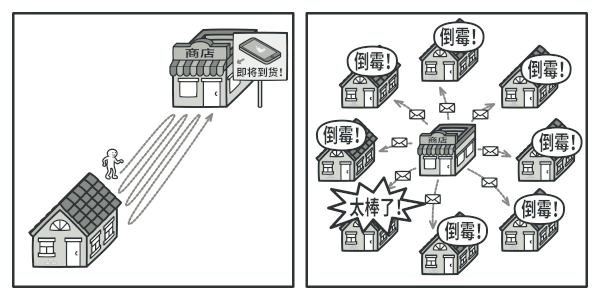

## 意图

观察者模式是一种行为设计模式， 允许你定义一种订阅机制， 可在对象事件发生时通知多个 “观察” 该对象的其他对象。

## 问题

假如你有两种类型的对象：`​顾客`和`商店`。顾客对某个特定品牌的产品非常感兴趣 （例如最新型号的 iPhone 手机）， 而该产品很快将会在商店里出售。

顾客可以每天来商店看看产品是否到货。 但如果商品尚未到货时， 绝大多数来到商店的顾客都会空手而归。

另一方面， 每次新产品到货时， 商店可以向所有顾客发送邮件 （可能会被视为垃圾邮件）。 这样， 部分顾客就无需反复前往商店了， 但也可能会惹恼对新产品没有兴趣的其他顾客。

我们似乎遇到了一个矛盾： 要么让顾客浪费时间检查产品是否到货， 要么让商店浪费资源去通知没有需求的顾客。

## 解决方案

拥有一些值得关注的状态的对象通常被称为目标， 由于它要将自身的状态改变通知给其他对象， 我们也将其称为发布者 （publisher）。 所有希望关注发布者状态变化的其他对象被称为订阅者 （subscribers）。

观察者模式建议你为发布者类添加订阅机制， 让每个对象都能订阅或取消订阅发布者事件流。 不要害怕！ 这并不像听上去那么复杂。 实际上， 该机制包括 1） 一个用于存储订阅者对象引用的列表成员变量； 2） 几个用于添加或删除该列表中订阅者的公有方法。

现在， 无论何时发生了重要的发布者事件， 它都要遍历订阅者并调用其对象的特定通知方法。

实际应用中可能会有十几个不同的订阅者类跟踪着同一个发布者类的事件， 你不会希望发布者与所有这些类相耦合的。 此外如果他人会使用发布者类， 那么你甚至可能会对其中的一些类一无所知。

因此， 所有订阅者都必须实现同样的接口， 发布者仅通过该接口与订阅者交互。 接口中必须声明通知方法及其参数， 这样发布者在发出通知时还能传递一些上下文数据。

如果你的应用中有多个不同类型的发布者， 且希望订阅者可兼容所有发布者， 那么你甚至可以进一步让所有发布者遵循同样的接口。 该接口仅需描述几个订阅方法即可。 这样订阅者就能在不与具体发布者类耦合的情况下通过接口观察发布者的状态。

## 真实世界类比

如果你订阅了一份杂志或报纸， 那就不需要再去报摊查询新出版的刊物了。 出版社 （即应用中的 “发布者”） 会在刊物出版后 （甚至提前） 直接将最新一期寄送至你的邮箱中。

出版社负责维护订阅者列表， 了解订阅者对哪些刊物感兴趣。 当订阅者希望出版社停止寄送新一期的杂志时， 他们可随时从该列表中退出。

## 观察者模式结构

1. **发布者** （Publisher） 会向其他对象发送值得关注的事件。 事件会在发布者自身状态改变或执行特定行为后发生。 发布者中包含一个允许新订阅者加入和当前订阅者离开列表的订阅构架。
2. 当新事件发生时， 发送者会遍历订阅列表并调用每个订阅者对象的通知方法。 该方法是在订阅者接口中声明的。
3. **订阅者** （Subscriber） 接口声明了通知接口。 在绝大多数情况下， 该接口仅包含一个 update 更新方法。 该方法可以拥有多个参数， 使发布者能在更新时传递事件的详细信息。
4. **具体订阅者** （Concrete Subscribers） 可以执行一些操作来回应发布者的通知。 所有具体订阅者类都实现了同样的接口， 因此发布者不需要与具体类相耦合。
5. 订阅者通常需要一些上下文信息来正确地处理更新。 因此， 发布者通常会将一些上下文数据作为通知方法的参数进行传递。 发布者也可将自身作为参数进行传递， 使订阅者直接获取所需的数据。
6. **客户端** （Client） 会分别创建发布者和订阅者对象， 然后为订阅者注册发布者更新。

## 伪代码

在本例中， **观察者**模式允许文本编辑器对象将自身的状态改变通知给其他服务对象。

