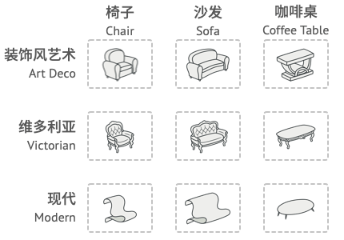

## 意图

抽象工厂模式是一种创建型设计模式， 它能创建一系列相关的对象， 而无需指定其具体类。


## 问题

假设你正在开发一款家具商店模拟器。 你的代码中包括一些类， 用于表示：

一系列相关产品， 例如 椅子`Chair` 、 ​ 沙发`Sofa`和 咖啡桌`Coffee­Table` 。

系列产品的不同变体。 例如， 你可以使用 现代`Modern` 、 ​ 维多利亚`Victorian` 、 ​ 装饰风艺术`Art­Deco`等风格生成 椅子 、 ​ 沙发和 咖啡桌 。



你需要设法单独生成每件家具对象， 这样才能确保其风格一致。 如果顾客收到的家具风格不一样， 他们可不会开心。


此外， 你也不希望在添加新产品或新风格时修改已有代码。 家具供应商对于产品目录的更新非常频繁， 你不会想在每次更新时都去修改核心代码的。

## 解决方案

首先， 抽象工厂模式建议为系列中的每件产品明确声明接口 （例如椅子、 沙发或咖啡桌）。 然后， 确保所有产品变体都继承这些接口。 例如， 所有风格的椅子都实现 `椅子`接口； 所有风格的咖啡桌都实现 `咖啡桌`接口， 以此类推。


接下来， 我们需要声明抽象工厂——包含系列中所有产品构造方法的接口。 例如 `create­Chair`创建椅子 、 ​ `create­Sofa`创建沙发和 `create­Coffee­Table`创建咖啡桌 。 这些方法必须返回抽象产品类型， 即我们之前抽取的那些接口：`椅子`,`沙发`和 `咖啡桌`等等。


那么该如何处理产品变体呢？ 对于系列产品的每个变体， 我们都将基于 抽象工厂接口创建不同的工厂类。 每个工厂类都只能返回特定类别的产品， 例如， ​ 现代家具工厂`Modern­Furniture­Factory`只能创建 现代椅子`Modern­Chair` 、 ​ 现代沙发`Modern­Sofa`和 现代咖啡桌`Modern­Coffee­Table`对象。

客户端代码可以通过相应的抽象接口调用工厂和产品类。 你无需修改实际客户端代码， 就能更改传递给客户端的工厂类， 也能更改客户端代码接收的产品变体。


假设客户端想要工厂创建一把椅子。 客户端无需了解工厂类， 也不用管工厂类创建出的椅子类型。 无论是现代风格， 还是维多利亚风格的椅子， 对于客户端来说没有分别， 它只需调用抽象 椅子接口就可以了。 这样一来， 客户端只需知道椅子以某种方式实现了 `sit­On` 坐下方法就足够了。 此外， 无论工厂返回的是何种椅子变体， 它都会和由同一工厂对象创建的沙发或咖啡桌风格一致。

最后一点说明： 如果客户端仅接触抽象接口， 那么谁来创建实际的工厂对象呢？ 一般情况下， 应用程序会在初始化阶段创建具体工厂对象。 而在此之前， 应用程序必须根据配置文件或环境设定选择工厂类别。

## 抽象工厂模式结构


1. **抽象产品** （Abstract Product） 为构成系列产品的一组不同但相关的产品声明接口。
2. **具体产品** （Concrete Product） 是抽象产品的多种不同类型实现。 所有变体 （维多利亚/现代） 都必须实现相应的抽象产品 （椅子/沙发）。
3. **抽象工厂** （Abstract Factory） 接口声明了一组创建各种抽象产品的方法。
4. **具体工厂** （Concrete Factory） 实现抽象工厂的构建方法。 每个具体工厂都对应特定产品变体， 且仅创建此种产品变体。
5. 尽管具体工厂会对具体产品进行初始化， 其构建方法签名必须返回相应的抽象产品。 这样， 使用工厂类的客户端代码就不会与工厂创建的特定产品变体耦合。 客户端 （Client） 只需通过抽象接口调用工厂和产品对象， 就能与任何具体工厂/产品变体交互。

## 抽象工厂模式优缺点

√ 你可以确保同一工厂生成的产品相互匹配。
√ 你可以避免客户端和具体产品代码的耦合。
√ 单一职责原则。 你可以将产品生成代码抽取到同一位置， 使得代码易于维护。
√ 开闭原则。 向应用程序中引入新产品变体时， 你无需修改客户端代码。
× 由于采用该模式需要向应用中引入众多接口和类， 代码可能会比之前更加复杂。

## 与其他模式的关系

-   在许多设计工作的初期都会使用工厂方法模式 （较为简单， 而且可以更方便地通过子类进行定制）， 随后演化为使用抽象工厂模式、 原型模式或生成器模式 （更灵活但更加复杂）。

-   生成器重点关注如何分步生成复杂对象。 抽象工厂专门用于生产一系列相关对象。 抽象工厂会马上返回产品， 生成器则允许你在获取产品前执行一些额外构造步骤。

-   抽象工厂模式通常基于一组工厂方法， 但你也可以使用原型模式来生成这些类的方法。

-   当只需对客户端代码隐藏子系统创建对象的方式时， 你可以使用抽象工厂来代替外观模式。

-   你可以将抽象工厂和桥接模式搭配使用。 如果由桥接定义的抽象只能与特定实现合作， 这一模式搭配就非常有用。 在这种情况下， 抽象工厂可以对这些关系进行封装， 并且对客户端代码隐藏其复杂性。

-   抽象工厂、 生成器和原型都可以用单例模式来实现。

## 代码示例

### index.ts: 概念示例

```typescript
/**
 * The Abstract Factory interface declares a set of methods that return
 * different abstract products. These products are called a family and are
 * related by a high-level theme or concept. Products of one family are usually
 * able to collaborate among themselves. A family of products may have several
 * variants, but the products of one variant are incompatible with products of
 * another.
 */
interface AbstractFactory {
    createProductA(): AbstractProductA

    createProductB(): AbstractProductB
}

/**
 * Concrete Factories produce a family of products that belong to a single
 * variant. The factory guarantees that resulting products are compatible. Note
 * that signatures of the Concrete Factory's methods return an abstract product,
 * while inside the method a concrete product is instantiated.
 */
class ConcreteFactory1 implements AbstractFactory {
    public createProductA(): AbstractProductA {
        return new ConcreteProductA1()
    }

    public createProductB(): AbstractProductB {
        return new ConcreteProductB1()
    }
}

/**
 * Each Concrete Factory has a corresponding product variant.
 */
class ConcreteFactory2 implements AbstractFactory {
    public createProductA(): AbstractProductA {
        return new ConcreteProductA2()
    }

    public createProductB(): AbstractProductB {
        return new ConcreteProductB2()
    }
}

/**
 * Each distinct product of a product family should have a base interface. All
 * variants of the product must implement this interface.
 */
interface AbstractProductA {
    usefulFunctionA(): string
}

/**
 * These Concrete Products are created by corresponding Concrete Factories.
 */
class ConcreteProductA1 implements AbstractProductA {
    public usefulFunctionA(): string {
        return 'The result of the product A1.'
    }
}

class ConcreteProductA2 implements AbstractProductA {
    public usefulFunctionA(): string {
        return 'The result of the product A2.'
    }
}

/**
 * Here's the the base interface of another product. All products can interact
 * with each other, but proper interaction is possible only between products of
 * the same concrete variant.
 */
interface AbstractProductB {
    /**
     * Product B is able to do its own thing...
     */
    usefulFunctionB(): string

    /**
     * ...but it also can collaborate with the ProductA.
     *
     * The Abstract Factory makes sure that all products it creates are of the
     * same variant and thus, compatible.
     */
    anotherUsefulFunctionB(collaborator: AbstractProductA): string
}

/**
 * These Concrete Products are created by corresponding Concrete Factories.
 */
class ConcreteProductB1 implements AbstractProductB {
    public usefulFunctionB(): string {
        return 'The result of the product B1.'
    }

    /**
     * The variant, Product B1, is only able to work correctly with the variant,
     * Product A1. Nevertheless, it accepts any instance of AbstractProductA as
     * an argument.
     */
    public anotherUsefulFunctionB(collaborator: AbstractProductA): string {
        const result = collaborator.usefulFunctionA()
        return `The result of the B1 collaborating with the (${result})`
    }
}

class ConcreteProductB2 implements AbstractProductB {
    public usefulFunctionB(): string {
        return 'The result of the product B2.'
    }

    /**
     * The variant, Product B2, is only able to work correctly with the variant,
     * Product A2. Nevertheless, it accepts any instance of AbstractProductA as
     * an argument.
     */
    public anotherUsefulFunctionB(collaborator: AbstractProductA): string {
        const result = collaborator.usefulFunctionA()
        return `The result of the B2 collaborating with the (${result})`
    }
}

/**
 * The client code works with factories and products only through abstract
 * types: AbstractFactory and AbstractProduct. This lets you pass any factory or
 * product subclass to the client code without breaking it.
 */
function clientCode(factory: AbstractFactory) {
    const productA = factory.createProductA()
    const productB = factory.createProductB()

    console.log(productB.usefulFunctionB())
    console.log(productB.anotherUsefulFunctionB(productA))
}

/**
 * The client code can work with any concrete factory class.
 */
console.log('Client: Testing client code with the first factory type...')
clientCode(new ConcreteFactory1())

console.log('')

console.log('Client: Testing the same client code with the second factory type...')
clientCode(new ConcreteFactory2())
```

### Output.txt: 执行结果

```txt
Client: Testing client code with the first factory type...
The result of the product B1.
The result of the B1 collaborating with the (The result of the product A1.)

Client: Testing the same client code with the second factory type...
The result of the product B2.
The result of the B2 collaborating with the (The result of the product A2.)
```
