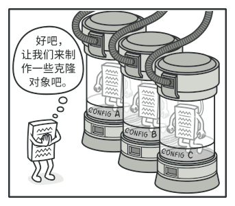
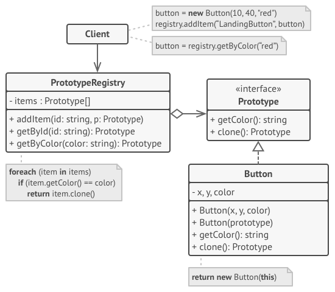

## 意图

原型模式是一种创建型设计模式， 使你能够复制已有对象， 而又无需使代码依赖它们所属的类。


## 问题

如果你有一个对象， 并希望生成与其完全相同的一个复制品， 你该如何实现呢？ 首先， 你必须新建一个属于相同类的对象。 然后， 你必须遍历原始对象的所有成员变量， 并将成员变量值复制到新对象中。

不错！ 但有个小问题。 并非所有对象都能通过这种方式进行复制， 因为有些对象可能拥有私有成员变量， 它们在对象本身以外是不可见的。


直接复制还有另外一个问题。 因为你必须知道对象所属的类才能创建复制品， 所以代码必须依赖该类。 即使你可以接受额外的依赖性， 那还有另外一个问题： 有时你只知道对象所实现的接口， 而不知道其所属的具体类， 比如可向方法的某个参数传入实现了某个接口的任何对象。

## 解决方案

原型模式将克隆过程委派给被克隆的实际对象。 模式为所有支持克隆的对象声明了一个通用接口， 该接口让你能够克隆对象， 同时又无需将代码和对象所属类耦合。 通常情况下， 这样的接口中仅包含一个`克隆`方法。

所有的类对`克隆`方法的实现都非常相似。 该方法会创建一个当前类的对象， 然后将原始对象所有的成员变量值复制到新建的类中。 你甚至可以复制私有成员变量， 因为绝大部分编程语言都允许对象访问其同类对象的私有成员变量。

支持克隆的对象即为**原型**。 当你的对象有几十个成员变量和几百种类型时， 对其进行克隆甚至可以代替子类的构造。



其运作方式如下： 创建一系列不同类型的对象并不同的方式对其进行配置。 如果所需对象与预先配置的对象相同， 那么你只需克隆原型即可， 无需新建一个对象。

## 真实世界类比

现实生活中， 产品在得到大规模生产前会使用原型进行各种测试。 但在这种情况下， 原型只是一种被动的工具， 不参与任何真正的生产活动。


由于工业原型并不是真正意义上的自我复制， 因此细胞有丝分裂 （还记得生物学知识吗？） 或许是更恰当的类比。 有丝分裂会产生一对完全相同的细胞。 原始细胞就是一个原型， 它在复制体的生成过程中起到了推动作用。

## 原型模式结构

### 基本实现


1. **原型** （Prototype） 接口将对克隆方法进行声明。 在绝大多数情况下， 其中只会有一个名为 clone 克隆的方法。
2. **具体原型** （Concrete Prototype） 类将实现克隆方法。 除了将原始对象的数据复制到克隆体中之外， 该方法有时还需处理克隆过程中的极端情况， 例如克隆关联对象和梳理递归依赖等等。
3. **客户端** （Client） 可以复制实现了原型接口的任何对象。

### 原型注册表实现



**原型注册表** （Prototype Registry） 提供了一种访问常用原型的简单方法， 其中存储了一系列可供随时复制的预生成对象。 最简单的注册表原型是一个 名称 → 原型的哈希表。 但如果需要使用名称以外的条件进行搜索， 你可以创建更加完善的注册表版本。

## 原型模式优缺点

√ 你可以克隆对象， 而无需与它们所属的具体类相耦合。
√ 你可以克隆预生成原型， 避免反复运行初始化代码。
√ 你可以更方便地生成复杂对象。
√ 你可以用继承以外的方式来处理复杂对象的不同配置。
× 克隆包含循环引用的复杂对象可能会非常麻烦。

## 与其他模式的关系

-   在许多设计工作的初期都会使用工厂方法模式 （较为简单， 而且可以更方便地通过子类进行定制）， 随后演化为使用抽象工厂模式、 原型模式或生成器模式 （更灵活但更加复杂）。

-   抽象工厂模式通常基于一组工厂方法， 但你也可以使用原型模式来生成这些类的方法。

-   原型可用于保存命令模式的历史记录。

-   大量使用组合模式和装饰模式的设计通常可从对于原型的使用中获益。 你可以通过该模式来复制复杂结构， 而非从零开始重新构造。

-   原型并不基于继承， 因此没有继承的缺点。 另一方面， 原型需要对被复制对象进行复杂的初始化。 工厂方法基于继承， 但是它不需要初始化步骤。

-   有时候原型可以作为备忘录模式的一个简化版本， 其条件是你需要在历史记录中存储的对象的状态比较简单， 不需要链接其他外部资源， 或者链接可以方便地重建。

-   抽象工厂、 生成器和原型都可以用单例模式来实现。

## 代码示例

### index.ts: 概念示例

```ts
/**
 * The example class that has cloning ability. We'll see how the values of field
 * with different types will be cloned.
 */
class Prototype {
    public primitive: any
    public component: object
    public circularReference: ComponentWithBackReference

    public clone(): this {
        const clone = Object.create(this)

        clone.component = Object.create(this.component)

        // Cloning an object that has a nested object with backreference
        // requires special treatment. After the cloning is completed, the
        // nested object should point to the cloned object, instead of the
        // original object. Spread operator can be handy for this case.
        clone.circularReference = {
            ...this.circularReference,
            prototype: {...this}
        }

        return clone
    }
}

class ComponentWithBackReference {
    public prototype

    constructor(prototype: Prototype) {
        this.prototype = prototype
    }
}

/**
 * The client code.
 */
function clientCode() {
    const p1 = new Prototype()
    p1.primitive = 245
    p1.component = new Date()
    p1.circularReference = new ComponentWithBackReference(p1)

    const p2 = p1.clone()
    if (p1.primitive === p2.primitive) {
        console.log('Primitive field values have been carried over to a clone. Yay!')
    } else {
        console.log('Primitive field values have not been copied. Booo!')
    }
    if (p1.component === p2.component) {
        console.log('Simple component has not been cloned. Booo!')
    } else {
        console.log('Simple component has been cloned. Yay!')
    }

    if (p1.circularReference === p2.circularReference) {
        console.log('Component with back reference has not been cloned. Booo!')
    } else {
        console.log('Component with back reference has been cloned. Yay!')
    }

    if (p1.circularReference.prototype === p2.circularReference.prototype) {
        console.log('Component with back reference is linked to original object. Booo!')
    } else {
        console.log('Component with back reference is linked to the clone. Yay!')
    }
}

clientCode()
```

### Output.txt: 执行结果

```txt
Primitive field values have been carried over to a clone. Yay!
Simple component has been cloned. Yay!
Component with back reference has been cloned. Yay!
Component with back reference is linked to the clone. Yay!
```
