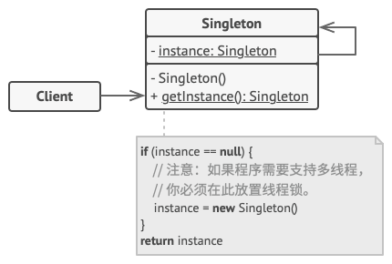

## 意图

单例模式是一种创建型设计模式， 让你能够保证一个类只有一个实例， 并提供一个访问该实例的全局节点。


## 问题

单例模式同时解决了两个问题， 所以违反了单一职责原则：

1. **保证一个类只有一个实例**。 为什么会有人想要控制一个类所拥有的实例数量？ 最常见的原因是控制某些共享资源 （例如数据库或文件） 的访问权限。

它的运作方式是这样的： 如果你创建了一个对象， 同时过一会儿后你决定再创建一个新对象， 此时你会获得之前已创建的对象， 而不是一个新对象。

注意， 普通构造函数无法实现上述行为， 因为构造函数的设计决定了它必须总是返回一个新对象。


2. **为该实例提供一个全局访问节点**。 还记得你 （好吧， 其实是我自己） 用过的那些存储重要对象的全局变量吗？ 它们在使用上十分方便， 但同时也非常不安全， 因为任何代码都有可能覆盖掉那些变量的内容， 从而引发程序崩溃。
   和全局变量一样， 单例模式也允许在程序的任何地方访问特定对象。 但是它可以保护该实例不被其他代码覆盖。
   还有一点： 你不会希望解决同一个问题的代码分散在程序各处的。 因此更好的方式是将其放在同一个类中， 特别是当其他代码已经依赖这个类时更应该如此。

如今， 单例模式已经变得非常流行， 以至于人们会将只解决上文描述中任意一个问题的东西称为单例。

## 解决方案

所有单例的实现都包含以下两个相同的步骤：

-   将默认构造函数设为私有， 防止其他对象使用单例类的 new 运算符。
-   新建一个静态构建方法作为构造函数。 该函数会 “偷偷” 调用私有构造函数来创建对象， 并将其保存在一个静态成员变量中。 此后所有对于该函数的调用都将返回这一缓存对象。

如果你的代码能够访问单例类， 那它就能调用单例类的静态方法。 无论何时调用该方法， 它总是会返回相同的对象。

## 真实世界类比

政府是单例模式的一个很好的示例。 一个国家只有一个官方政府。 不管组成政府的每个人的身份是什么， ​ “某政府” 这一称谓总是鉴别那些掌权者的全局访问节点。

## 单例模式结构



1. 单例 （Singleton） 类声明了一个名为 get­Instance 获取实例的静态方法来返回其所属类的一个相同实例。
   单例的构造函数必须对客户端 （Client） 代码隐藏。 调用 获取实例方法必须是获取单例对象的唯一方式。

## 单例模式优缺点

√ 你可以保证一个类只有一个实例。
√ 你获得了一个指向该实例的全局访问节点。
√ 仅在首次请求单例对象时对其进行初始化。
× 违反了单一职责原则。 该模式同时解决了两个问题。
× 单例模式可能掩盖不良设计， 比如程序各组件之间相互了解过多等。
× 该模式在多线程环境下需要进行特殊处理， 避免多个线程多次创建单例对象。
× 单例的客户端代码单元测试可能会比较困难， 因为许多测试框架以基于继承的方式创建模拟对象。 由于单例类的构造函数是私有的， 而且绝大部分语言无法重写静态方法， 所以你需要想出仔细考虑模拟单例的方法。 要么干脆不编写测试代码， 或者不使用单例模式。

## 与其他模式的关系

-   外观模式类通常可以转换为单例模式类， 因为在大部分情况下一个外观对象就足够了。

-   如果你能将对象的所有共享状态简化为一个享元对象， 那么享元模式就和单例类似了。 但这两个模式有两个根本性的不同。
    1. 只会有一个单例实体， 但是享元类可以有多个实体， 各实体的内在状态也可以不同。
    2. 单例对象可以是可变的。 享元对象是不可变的。
-   抽象工厂模式、 生成器模式和原型模式都可以用单例来实现。

## 代码示例

### index.ts: 概念示例
```ts
/**
 * The Singleton class defines an `instance` getter, that lets clients access
 * the unique singleton instance.
 */
class Singleton {
    static #instance: Singleton;

    /**
     * The Singleton's constructor should always be private to prevent direct
     * construction calls with the `new` operator.
     */
    private constructor() { }

    /**
     * The static getter that controls access to the singleton instance.
     *
     * This implementation allows you to extend the Singleton class while
     * keeping just one instance of each subclass around.
     */
    public static get instance(): Singleton {
        if (!Singleton.#instance) {
            Singleton.#instance = new Singleton();
        }

        return Singleton.#instance;
    }

    /**
     * Finally, any singleton can define some business logic, which can be
     * executed on its instance.
     */
    public someBusinessLogic() {
        // ...
    }
}

/**
 * The client code.
 */
function clientCode() {
    const s1 = Singleton.instance;
    const s2 = Singleton.instance;

    if (s1 === s2) {
        console.log(
            'Singleton works, both variables contain the same instance.'
        );
    } else {
        console.log('Singleton failed, variables contain different instances.');
    }
}

clientCode();
```
### Output.txt: 执行结果

```txt
Singleton works, both variables contain the same instance.
```