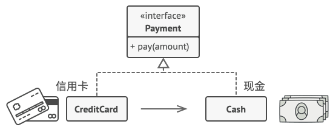

## 意图

代理模式是一种结构型设计模式， 让你能够提供对象的替代品或其占位符。 代理控制着对于原对象的访问， 并允许在将请求提交给对象前后进行一些处理。


## 问题

为什么要控制对于某个对象的访问呢？ 举个例子： 有这样一个消耗大量系统资源的巨型对象， 你只是偶尔需要使用它， 并非总是需要。


你可以实现延迟初始化： 在实际有需要时再创建该对象。 对象的所有客户端都要执行延迟初始代码。 不幸的是， 这很可能会带来很多重复代码。

在理想情况下， 我们希望将代码直接放入对象的类中， 但这并非总是能实现： 比如类可能是第三方封闭库的一部分。

## 解决方案

代理模式建议新建一个与原服务对象接口相同的代理类， 然后更新应用以将代理对象传递给所有原始对象客户端。 代理类接收到客户端请求后会创建实际的服务对象， 并将所有工作委派给它。


这有什么好处呢？ 如果需要在类的主要业务逻辑前后执行一些工作， 你无需修改类就能完成这项工作。 由于代理实现的接口与原类相同， 因此你可将其传递给任何一个使用实际服务对象的客户端。

## 真实世界类比



信用卡是银行账户的代理， 银行账户则是一大捆现金的代理。 它们都实现了同样的接口， 均可用于进行支付。 消费者会非常满意， 因为不必随身携带大量现金； 商店老板同样会十分高兴， 因为交易收入能以电子化的方式进入商店的银行账户中， 无需担心存款时出现现金丢失或被抢劫的情况。

## 代理模式结构


1. **服务接口** （Service Interface） 声明了服务接口。 代理必须遵循该接口才能伪装成服务对象。
2. **服务** （Service） 类提供了一些实用的业务逻辑。
3. **代理** （Proxy） 类包含一个指向服务对象的引用成员变量。 代理完成其任务 （例如延迟初始化、 记录日志、 访问控制和缓存等） 后会将请求传递给服务对象。
通常情况下， 代理会对其服务对象的整个生命周期进行管理。
4. **客户端** （Client） 能通过同一接口与服务或代理进行交互， 所以你可在一切需要服务对象的代码中使用代理。

## 伪代码

本例演示如何使用**代理**模式在第三方腾讯视频 （TencentVideo， 代码示例中记为 TV） 程序库中添加延迟初始化和缓存。


程序库提供了视频下载类。 但是该类的效率非常低。 如果客户端程序多次请求同一视频， 程序库会反复下载该视频， 而不会将首次下载的文件缓存下来复用。

代理类实现和原下载器相同的接口， 并将所有工作委派给原下载器。 不过， 代理类会保存所有的文件下载记录， 如果程序多次请求同一文件， 它会返回缓存的文件。

```py
# 远程服务接口。
interface ThirdPartyTVLib is
    method listVideos()
    method getVideoInfo(id)
    method downloadVideo(id)

# 服务连接器的具体实现。该类的方法可以向腾讯视频请求信息。请求速度取决于
# 用户和腾讯视频的互联网连接情况。如果同时发送大量请求，即使所请求的信息
# 一模一样，程序的速度依然会减慢。
class ThirdPartyTVClass implements ThirdPartyTVLib is
    method listVideos() is
        # 向腾讯视频发送一个 API 请求。

    method getVideoInfo(id) is
        # 获取某个视频的元数据。

    method downloadVideo(id) is
        # 从腾讯视频下载一个视频文件。

# 为了节省网络带宽，我们可以将请求结果缓存下来并保存一段时间。但你可能无
# 法直接将这些代码放入服务类中。比如该类可能是第三方程序库的一部分或其签
# 名是`final（最终）`。因此我们会在一个实现了服务类接口的新代理类中放入
# 缓存代码。当代理类接收到真实请求后，才会将其委派给服务对象。
class CachedTVClass implements ThirdPartyTVLib is
    private field service: ThirdPartyTVLib
    private field listCache, videoCache
    field needReset

    constructor CachedTVClass(service: ThirdPartyTVLib) is
        this.service = service

    method listVideos() is
        if (listCache == null || needReset)
            listCache = service.listVideos()
        return listCache

    method getVideoInfo(id) is
        if (videoCache == null || needReset)
            videoCache = service.getVideoInfo(id)
        return videoCache

    method downloadVideo(id) is
        if (!downloadExists(id) || needReset)
            service.downloadVideo(id)

# 之前直接与服务对象交互的 GUI 类不需要改变，前提是它仅通过接口与服务对
# 象交互。我们可以安全地传递一个代理对象来代替真实服务对象，因为它们都实
# 现了相同的接口。
class TVManager is
    protected field service: ThirdPartyTVLib

    constructor TVManager(service: ThirdPartyTVLib) is
        this.service = service

    method renderVideoPage(id) is
        info = service.getVideoInfo(id)
        # 渲染视频页面。

    method renderListPanel() is
        list = service.listVideos()
        # 渲染视频缩略图列表。

    method reactOnUserInput() is
        renderVideoPage()
        renderListPanel()

# 程序可在运行时对代理进行配置。
class Application is
    method init() is
        aTVService = new ThirdPartyTVClass()
        aTVProxy = new CachedTVClass(aTVService)
        manager = new TVManager(aTVProxy)
        manager.reactOnUserInput()
```

## 代理模式优缺点
√ 你可以在客户端毫无察觉的情况下控制服务对象。
√ 如果客户端对服务对象的生命周期没有特殊要求， 你可以对生命周期进行管理。
√ 即使服务对象还未准备好或不存在， 代理也可以正常工作。
√ 开闭原则。 你可以在不对服务或客户端做出修改的情况下创建新代理。
× 代码可能会变得复杂， 因为需要新建许多类。
× 服务响应可能会延迟。

## 与其他模式的关系
- [**适配器模式**](./adapter.md)能为被封装对象提供不同的接口， **代理模式**能为对象提供相同的接口， [**装饰模式**](./decorator.md)则能为对象提供加强的接口。

- [**外观模式**](./facade.md)与**代理**的相似之处在于它们都缓存了一个复杂实体并自行对其进行初始化。 *代理* 与其服务对象遵循同一接口， 使得自己和服务对象可以互换， 在这一点上它与 *外观* 不同。

- [**装饰**](./decorator.md)和**代理**有着相似的结构， 但是其意图却非常不同。 这两个模式的构建都基于组合原则， 也就是说一个对象应该将部分工作委派给另一个对象。 两者之间的不同之处在于 *代理* 通常自行管理其服务对象的生命周期， 而 *装饰* 的生成则总是由客户端进行控制。