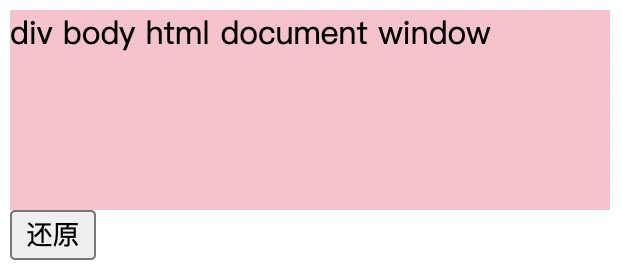
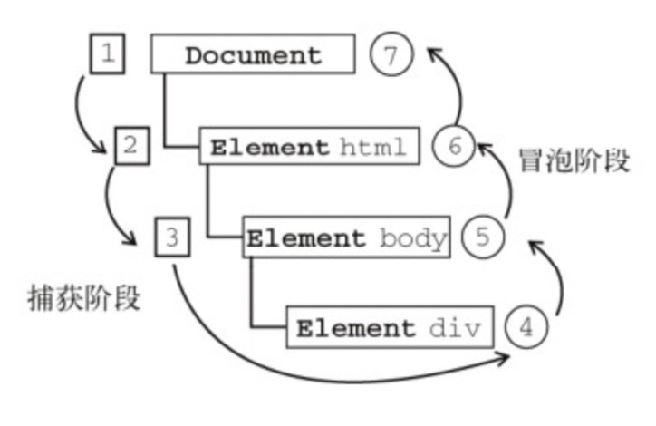

## 1 事件与事件流

事件最早是在 *IE3* 和 *NetscapeNavigator2* 中出现的，当时是作为分担服务器运算负担的一种手段。

要实现和网页的互动，就需要通过 *JavaScript* 里面的事件来实现。

每次用户与一个网页进行交互，例如点击链接，按下一个按键或者移动鼠标时，就会触发一个事件。我们的程序可以检测这些事件，然后对此作出响应。从而形成一种交互。

这样可以使我们的页面变得更加的有意思，而不仅仅像以前一样只能进行浏览。

在早期拨号上网的年代，如果所有的功能都放在服务器端进行处理的话，效率是非常低的。

所以 *JavaScript* 最初被设计出来就是用来解决这些问题的。通过允许一些功能在客户端处理，以节省到服务器的往返时间。

*JavaScript* 中采用一个叫做事件监听器的东西来监听事件是否发生。这个事件监听器类似于一个通知，当事件发生时，事件监听器会让我们知道，然后程序就可以做出相应的响应。

通过这种方式，就可以避免让程序不断地去检查事件是否发生，让程序在等待事件发生的同时，可以继续做其他的任务。

### 1.1 事件流

当浏览器发展到第 *4* 代时（*IE4* 及 *Netscape4*），浏览器开发团队遇到了一个很有意思的问题：页面的哪一部分会拥有某个特定的事件？

好在两家公司的浏览器开发团队在看待浏览器事件方面还是一致的。

如果单击了某个按钮，他们都认为单击事件不仅仅发生在按钮上，甚至也单击了整个页面。

但有意思的是，*IE* 和 *Netscape* 开发团队居然提出了差不多是完全相反的事件流的概念。

*IE* 的事件流是事件冒泡流，而 *Netscape* 的事件流是事件捕获流。

### 1.2 事件冒泡流

*IE* 的事件流叫做事件冒泡（*event bubbling*），即事件开始时由最具体的元素（文档中嵌套层次最深的那个节点）接收，然后逐级向上传播到较为不具体的节点（文档）。

以下列 *HTML* 结构为例，来说明事件冒泡。如下：

```html
<!DOCTYPE html>
<html lang="en">
    <head>
        <meta charset="UTF-8">
        <title>Document</title>
    </head>
    <body>
        <div></div>
    </body>
</html>
```

如果单击了页面中的 `div` 元素，那么这个 `click` 事件沿 *DOM* 树向上传播，在每一级节点上都会发生，按照如下顺序进行传播：

1. `div`
2. `body`
3. `html`
4. `document`

所有现代浏览器都支持事件冒泡，但在具体实现在还是有一些差别。

*IE9、Firefox、Chrome、Safari* 将事件一直冒泡到 `window` 对象。

我们可以通过下面的代码，来查看文档具体的冒泡顺序，示例如下：

```html
<div id="box" style="height:100px;width:300px;background-color:pink;"></div>
<button id="reset">还原</button>
// IE8 以下浏览器返回 div body html document
// 其他浏览器返回 div body html document window
reset.onclick = function () {
  history.go();
}
box.onclick = function () {
  box.innerHTML += 'div\n';
}
document.body.onclick = function () {
  box.innerHTML += 'body\n';
}
document.documentElement.onclick = function () {
  box.innerHTML += 'html\n';
}
document.onclick = function () {
  box.innerHTML += 'document\n';
}
window.onclick = function () {
  box.innerHTML += 'window\n';
}
```

在上面的示例中，我们为 `div` 以及它的祖先元素绑定了点击事件，由于事件冒泡的存在，当我们点击 `div` 时，所有祖先元素的点击事件也会被触发。

如下图所示：



### 1.3 事件捕获流

*Netscape Communicator* 团队提出的另一种事件流叫做事件捕获（*event captruing*）。

事件捕获的思想是不太具体的节点应该更早接收到事件，而最具体的节点应该最后接收到事件。

事件捕获的思想是在事件到达预定目标之前就捕获它。

以同样的 *HTML* 结构为例来说明事件捕获，如下：

```html
<!DOCTYPE html>
<html lang="en">
    <head>
        <meta charset="UTF-8">
        <title>Document</title>
    </head>
    <body>
        <div></div>    
    </body>
</html>
```

在事件捕获过程中，`document` 对象首先接收到 `click` 事件，然后事件沿 *DOM* 树依次向下，一直传播到事件的实际目标，即 `div` 元素：

1. `document`
2. `html`
3. `body`
4. `div`

*IE9、Firefox、Chrome、Safari* 等现代浏览器都支持事件捕获，但是也是从`window` 对象开始捕获。

下面我们来演示一个事件捕获流的示例：

```html
<div id="box" style="height:100px;width:300px;background-color:pink;"></div>
<button id="reset">还原</button>
// IE8 以下浏览器不支持
// 其他浏览器返回 window document html body div
reset.onclick = function () {
  history.go();
}
box.addEventListener('click', function () {
  box.innerHTML += 'div\n'
}, true)
document.body.addEventListener('click', function () {
  box.innerHTML += 'body\n';
}, true);
document.documentElement.addEventListener('click', function () {
  box.innerHTML += 'html\n';
}, true);
document.addEventListener('click', function () {
  box.innerHTML += 'document\n';
}, true);
window.addEventListener('click', function () {
  box.innerHTML += 'window\n';
}, true);
```

在上面的示例中，我们为 `div` 以及它所有的祖先元素绑定了点击事件，使用的 *addEventListener* 的方式来绑定的事件，并将第 *2* 个参数设置为了 *true* 表示使用事件捕获的方式来触发事件。

效果如下图所示：


### 1.4 标准 *DOM* 事件流

*DOM* 标准采用的是**捕获 + 冒泡**的方式。

两种事件流都会触发 *DOM* 的所有对象，从 `document` 对象开始，也在 `document` 对象结束。

换句话说，起点和终点都是 `document` 对象（很多浏览器可以一直捕获 + 冒泡到 `window` 对象）

*DOM* 事件流示意图：



*DOM* 标准规定事件流包括三个阶段：**事件捕获阶段**、**处于目标阶段**和**事件冒泡阶段**。

- **事件捕获阶段：**实际目标 `div` 在捕获阶段不会触发事件。捕获阶段从 `window` 开始，然后到 `document`、`html`，最后到 `body` 意味着捕获阶段结束。
- **处于目标阶段：**事件在 `div` 上发生并处理，但是本次事件处理会被看成是冒泡阶段的一部分。
- **冒泡阶段：**事件又传播回文档。

## 2 事件委托

上面介绍了事件冒泡流，事件冒泡一个最大的好处就是可以实现事件委托。

事件委托，又被称之为事件代理。在 *JavaScript* 中，添加到页面上的事件处理程序数量将直接关系到页面整体的运行性能。导致这一问题的原因是多方面的。

首先，每个函数都是对象，都会占用内存。内存中的对象越多，性能就越差。其次，必须事先指定所有事件处理程序而导致的 *DOM* 访问次数，会延迟整个页面的交互就绪时间。

对事件处理程序过多问题的解决方案就是事件委托。

事件委托利用了事件冒泡，只指定一个事件处理程序，就可以管理某一类型的所有事件。

例如，`click` 事件会一直冒泡到 `document` 层次。也就是说，我们可以为整个页面指定一个 *onclick* 事件处理程序，而不必给每个可单击的元素分别添加事件处理程序。

举一个具体的例子，例如现在我的列表项有如下内容：

```html
<ul id="color-list">
  <li>red</li>
  <li>yellow</li>
  <li>blue</li>
  <li>green</li>
  <li>black</li>
  <li>white</li>
</ul>
```

如果我们想把事件监听器绑定到所有的 `li` 元素上面，这样它们被单击的时候就弹出一些文字，为此我们需要给每一个元素来绑定一个事件监听器。

虽然上面的例子中好像问题也不大，但是想象一下如果这个列表有 *100* 个元素，那我们就需要添加 *100* 个事件监听器，这个工作量还是很恐怖的。

这个时候我们就可以利用事件代理来帮助我们解决这个问题。

将事件监听器绑定到父元素 `ul` 上，这样即可对所有的 `li` 元素添加事件，如下：

```js
var colorList = document.getElementById("color-list");
colorList.addEventListener("click",function(){
  alert("Hello");
})
```

现在我们单击列表中的任何一个 `li` 都会弹出东西，就好像这些 `li` 元素就是 `click` 事件的目标一样。

并且如果我们之后再为这个 `ul` 添加新的 `li` 元素的话，新的 `li` 元素也会自动添加上相同的事件。

但是，这个时候也存在一个问题，虽然我们使用事件代理避免了为每一个 `li` 元素添加相同的事件，但是如果用户没有点击 `li`，而是点击的 `ul`，同样也会触发事件。

这也很正常，因为我们事件就是绑定在 `ul` 上面的。

此时我们可以对点击的节点进行一个小小的判断，从而保证用户只在点击 `li` 的时候才触发事件，如下：

```js
var colorList = document.getElementById("color-list");
colorList.addEventListener("click", function (event) {
  if (event.target.nodeName === 'LI') {
    alert('点击 li');
  }
})
```

## 3 真题解答

- 谈一谈事件委托以及冒泡原理

> 参考答案：
>
> 事件委托，又被称之为事件代理。在 *JavaScript* 中，添加到页面上的事件处理程序数量将直接关系到页面整体的运行性能。导致这一问题的原因是多方面的。
>
> 首先，每个函数都是对象，都会占用内存。内存中的对象越多，性能就越差。其次，必须事先指定所有事件处理程序而导致的 *DOM* 访问次数，会延迟整个页面的交互就绪时间。
>
> 对事件处理程序过多问题的解决方案就是事件委托。
>
> 事件委托利用了事件冒泡，只指定一个事件处理程序，就可以管理某一类型的所有事件。例如，`click` 事件会一直冒泡到 `document` 层次。也就是说，我们可以为整个页面指定一个 *onclick* 事件处理程序，而不必给每个可单击的元素分别添加事件处理程序。
>
> 事件冒泡（*event bubbling*），是指事件开始时由最具体的元素（文档中嵌套层次最深的那个节点）接收，然后逐级向上传播到较为不具体的节点（文档）。
