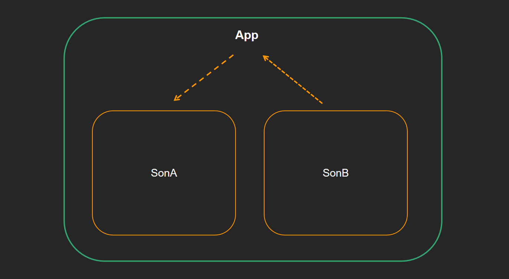
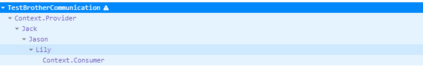

## 1. 父传子

## 2. 子传父

## 3. 兄弟通信

利用状态提升机制，利用共同的父组件实现兄弟通信。

子 → 父 → 另外子



- 父组件

  ````jsx
  import { Component } from "react";
  import {Lucy, Andy} from './components'
  
  export default class App extends Component {
      state = {
          data: ''
      }
  
      // 传给子组件的函数，用于接受子组件传来的 data
      eventBus = (newData) => {
          this.setState({
              data: newData
          })
      }
  
      render(){
          return (
              <div>
                  {/* 将函数传给子组件，用于接受子组件传来的 data */}
                  <Lucy bus = {this.eventBus}></Lucy>
                  {/* 将兄弟组件传来的data，传给自己 */}
                  <Andy {...this.state}></Andy>
              </div>
          )
      }
  }
  ````

- 兄弟组件

  ````jsx
  import {Component} from 'react'
  
  export class Lucy extends Component {
  
      sendData = (event) => {
          // 如果用户按下的不是回车键，不执行任何动作
          if(event.keyCode !== 13) return;
          if(event.target.value.trim() === ''){
              alert('不要啥也不填呀 o(╥﹏╥)o')
              return
          }
  
          // 获取父组件传来的函数，作为向父传递data的介质
          const {bus} = this.props
  
          // 执行父组件传来的函数，将要传递的 data 传入
          bus(event.target.value)
      }
  
      render(){
          return (
              <div>
                  <span>This is Lucy, I say: </span>
                  <input type="text" onKeyUp={this.sendData}/>
              </div>
          )
      }
  }
  ````

  ````jsx
  import {Component} from 'react'
  
  export class Andy extends Component {
      
      render(){
          return (
              // 接收 data
              <div>This is Andy, I heard: {this.props.data}</div>
          )
      }
  }
  ````

  

## 4. 跨组件通信 Context


上图是一个react形成的嵌套组件树，如果我们想从 App 组件向任意一个下层组件传递数据，该怎么办呢？目前我们能采取的方式就是一层一层的 props 往下传，显然很繁琐。

那么，Context 提供了一个**无需为每层组件手动添加 props，就能在组件树间进行数据传递的方法**

**实现步骤：**

- 创建 `Context` 对象，导出 `Provider` 和 `Consumer` 对象

  ````jsx
  const { Provider, Consumer } = createContext()
  ````

- 使用 `Provider` 包裹根组件提供数据

  ````jsx
  <Provider value={this.state.message}>
      {/* 根组件 */}
  </Provider>
  ````

- 需要用到数据的组件使用 `Consumer` 包裹获取数据

  ````jsx
  <Consumer >
      {value => /* 基于 context 值进行渲染*/}
  </Consumer>
  ````

  其中 `value` 就是外层 `Provider` 传过来的数据（注意：不能传对象），`Consumer`标签会显示为标签内部回调函数返回的虚拟DOM。

**注意：**`Provider`, `Consumer` 要成对使用，即一次 create 为一对，不是一对不能通信。

**Example：**

````jsx
import { Component, createContext } from "react";

const { Provider,Consumer } = createContext()

function Jack() {
    return (
        <div>
            <span>This is Jack </span>
            <Jason />
        </div>
    )
}

function Jason() {
    return(
        <div>
            This is Jason
            <Lily />
        </div>
    )
}

function Lily() {
    return(
        <div>
            This is Lily:
            <Consumer>{value => <span>I heard {value}</span>}</Consumer>
        </div>
    )
}

export default class TestBrotherCommunication extends Component {
    state = {
        data: ''
    }
    sendData = (event) => {
        // 如果用户按下的不是回车键，不执行任何动作
        if(event.keyCode !== 13) return;
        if(event.target.value.trim() === ''){
            alert('不要啥也不填呀 o(╥﹏╥)o')
            return
        }

       this.setState({
           data: event.target.value
       })
    }

    render() {

        return (
            <div>
                <input type="text" onKeyUp={this.sendData} />
                <Provider value={this.state}>
                    <Jack />
                </Provider>
                
            </div>
        )
    }
}
````



