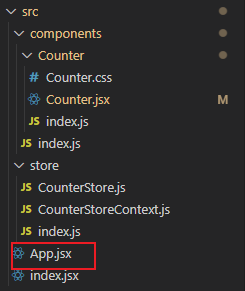
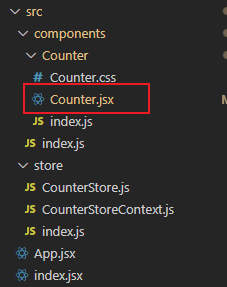
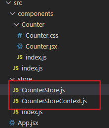

## Hooks概念理解

`本节任务:` 能够理解hooks的概念及解决的问题

### 什么是hooks

> Hooks的本质：**一套能够使函数组件更强大，更灵活的“钩子”**

React体系里组件分为 类组件 和 函数组件

经过多年的实战，函数组件是一个更加匹配React的设计理念 `UI = f(data)`，也更有利于逻辑拆分与重用的组件表达形式，而先前的函数组件是不可以有自己的状态的，为了能让函数组件可以拥有自己的状态，所以从react v16.8开始，Hooks应运而生

**注意点：**

1. 有了hooks之后，为了兼容老版本，class类组件并没有被移除，俩者都可以使用
2. 有了hooks之后，不能在把函数成为无状态组件了，因为hooks为函数组件提供了状态
3. hooks只能在函数组件中使用

### Hooks解决了什么问题

Hooks的出现解决了两个问题：

1. 组件的逻辑复用

   在hooks出现之前，react先后尝试了 mixins混入，HOC高阶组件，render-props等模式

   但是都有各自的问题，比如mixin的数据来源不清晰，高阶组件的嵌套问题等等

2. class组件自身的问题

   class组件就像一个厚重的‘战舰’ 一样，大而全，提供了很多东西，有不可忽视的学习成本，比如各种生命周期，this指向问题等等，而我们更多时候需要的是一个轻快灵活的'快艇'

## useState()

**作用：** `useState` 为函数组件提供状态 `state`

### 基础使用

**使用步骤：**

- 引入 `useState` 

  ````jsx
  import { useState } from 'react'
  ````

- 调用 `useState` 并传入初始值，并从 `useState()` 返回的数组中结构出状态和修改状态的方法

  ````jsx
  const [stateValue, stateEditFunction] = useState(initialValue)
  ````

- 在虚拟 DOM 中使用状态

  ````jsx
  return (
    <div>
        {count}<button onClick={() => {setCount( count +1 )}}>click this to add</button>
    </div>
  )
  ````

### 状态的读取与修改

**状态读取：**

````jsx
const [stateValue, stateEditFunction] = useState(initialValue)
````

- `stateValue` : 是状态本身，是函数内部的局部变量，可以在函数内的任意位置使用。
- `initialValue`: 初始值
  - `initialValue` 可以是一个固定值，该固定值回作为状态的初始值，赋予`stateValue`
  - `initialValue` 可以是一个回调函数： `useState(() => { return value})`
    - 回调函数return出去的值将作为状态的初始值
    - 回调函数中的逻辑只会在组件初始化的时候执行一次


**修改状态：**

````jsx
const [stateValue, stateEditFunction] = useState(initialValue)
````

- `stateEditFunction` 是一个函数，入参是下一次更新的状态值

- `stateEditFunction` 调用后，将使用入参作为新值，替换掉`stateValue`

- `stateValue` 发生改变后，视图会重新渲染

###  组件的更新过程

函数组件使用 **useState** hook 后的执行过程，以及状态值的变化

- 组件第一次渲染

1. 从头开始执行该组件中的代码逻辑
2. 调用 `useState(0)` 将传入的参数作为状态初始值，即：0
3. 渲染组件，此时，获取到的状态 count 值为： 0

- 组件第二次渲染
  1. 点击按钮，调用 `setCount(count + 1)` 修改状态，因为状态发生改变，所以，该组件会重新渲染
  2. 组件重新渲染时，会再次执行该组件中的代码逻辑
  3. 再次调用 `useState(0)`，此时 **React 内部会拿到最新的状态值而非初始值**，比如，该案例中最新的状态值为 1
  4. 再次渲染组件，此时，获取到的状态 count 值为：1

注意：**useState 的初始值(参数)只会在组件第一次渲染时生效**。也就是说，以后的每次渲染，useState 获取到都是最新的状态值，React 组件会记住每次最新的状态值

### 使用规则

- `useState` 函数可以执行多次，每次执行互相独立，每调用一次为函数组件提供一个状态

- `useState` 注意事项：

  - 只能出现在函数组件中
- 不能嵌套在 `if/for` 其它函数中（react按照hooks的调用顺序识别每一个hook）

## useEffect()

**作用：** `useEffect` 为函数组件提供副作用。

**什么事副作用？**

副作用是相对于主作用来说的，一个函数除了主作用，其他的作用就是副作用。对于 React 组件来说，**主作用就是根据数据（state/props）渲染 UI**，除此之外都是副作用（比如，手动修改 DOM） 。

**常见的副作用**

1. 数据请求 ajax发送
2. 手动修改dom
3. localstorage操作

### 基本使用

- 引入 `useEffect`

  ````jsx
  import { useEffect } from 'react'
  ````

- 调用 `useEffect` 函数，并传入回调函数

  ````jsx
  useEffect(() => {
      callbackFunction
  },[...arr])
  ````

  其中 `useEffect` 接收两个参数：

  - `callbackFunction` ：回调函数
  - `[...arr]`：依赖项数组

### 回调函数的执行时机

- 不添加依赖数组
  - 组件**初次渲染**执行一次
  - 组件**每次渲染**都执行一次

- 依赖数组为空数组时
  - 组件**初次渲染**执行一次

- 当依赖数组项有 `state` 时
  - 组件**初次渲染**执行一次
  - 依赖数组项中 `state` 发生变化时执行一次

**注意事项**

 `useEffect` 回调函数中用到的数据（比如，count）就是依赖数据，就应该出现在依赖项数组中，如果不添加依赖项就会有bug出现。

### 副作用的清除

在组件被销毁时，如果有些副作用需要被清理，就可以使用词语发，比如常见的定时器

````jsx
useEffect(() => {   
    console.log('副作用函数执行了')    
    // 副作用函数的执行时机为: 在下一次副作用函数执行之前执行   
    return () => {      
        console.log('清理副作用的函数执行了')      
        // 在这里写清理副作用的代码    
    }
})
````

## useRef

**作用：**  在函数组件中获取**真实的DOM元素对象**或者是**组件对象** (只有类式组件才有组件对象，无法获取函数式组件的虚拟DOM)

### 基本使用

**使用步骤：**

- 引入  `useRef`  

  ````jsx
  import { useRef } from 'react'
  ````

- 执行 `useRef` 函数并传入null，返回值为一个对象 内部有一个current属性存放拿到的dom对象（组件实例）

  ````jsx
  const VD = useRef(null)
  const RD = useRef(null)
  ````

- 通过ref 绑定 要获取的元素或者组件

  ````jsx
  <div>
      <VirtualDOM ref={VD}/>
      <h1 ref={RD}>This is Real DOM</h1>
  </div>
  ````

### 使用示例：

````jsx
import { Component, useEffect, useRef } from 'react'


class VirtualDOM extends Component{
    render() {
        return (<div>This is VirtualDOM</div>)
    }
}

export function UseRefDemo() {
    const VD = useRef(null)
    const RD = useRef(null)

    useEffect(()=> {
       console.log('VD', VD.current); 
       console.log('RD', RD.current);
    },[])
    
    
    return (
        <div>
            <VirtualDOM ref={VD}/>
            <h1 ref={RD}>This is Real DOM</h1>
        </div>
    )
}
````

**注意：** 

>  函数组件由于没有实例，不能使用ref获取，如果想获取组件实例，必须是类组件 

## useContext

**作用: **  跨级向下层组件传递信息

### 基本使用

- 引入 `useContext` 和 `createContext`

  ````jsx
  import { createContext, useContext } from "react";
  ````

- 在外层创建一个 `context` 对象

  ````jsx
  const Context = createContext()
  ````

- 在父组件中创建 `Provider` 包裹需要传递的子组件，在放入传递的值

  ````jsx
  function UseContextDemo() {
      const [person, setPerson] = useState({
          name: 'lucy',
          age: 45
      })
      
      return (
          <div>
              This is Root
              <Context.Provider value={person}>
                  <Father />
              </Context.Provider>
          </div>
      )
  }
  ````

- 在子组件中，将 `context` 对象放入 `useContext` 中执行，获得父组件中传过来的值

  ````jsx
  function Son() {
      const person = useContext(Context)
      return (
          <div>
              This is Son, here is the person: {person.name}
          </div>
      )
  }
  ````

### 在模块化项目中的使用

在模块化项目中，数据往往会保存在各种 `store` 中，各`component` 需要用到哪个 `store` 中的数据，在组件的层面引用即可。一般的

- 父组件会指定往子组件传入一些需要的数据，因此会使用 `context.provider` 跨组件将 `store` 传入子组件：

  

  ````jsx
  import { Component } from "react";
  import { Counter } from "./components";
  import { CounterStoreContext, createCounterStore } from "./store";
  
  export default class App extends Component {
    render() {
      return (
        <div>
          <CounterStoreContext.Provider value={createCounterStore()}>
            <Counter />
          </CounterStoreContext.Provider>
        </div>
      );
    }
  }
  ````

- 子组件在组件内使用 `useContext`  Hook 接收父组件传来的 `store`：

  

  ````jsx
  import './Counter.css'
  import {useCounterStoreContext} from '../../store'
  import { observer} from 'mobx-react'
  export const Counter = observer(() => {
      const {count, addCount} = useCounterStoreContext()
      return (
          <div className="container">
              <div className='title'>This is Counter component</div>
              <div>{count}</div>
              <button onClick = {addCount}>Add Button</button>
          </div>
      )
  })
  ````

- 数据的创建、管理、导出，`context` 的创建和导出，都在 `store` 中完成：

  

  ````jsx
  import {observable, action} from 'mobx'
  
  export class CounterStore {
      @observable count = 1
      @action addCount = () => {
          console.log(666);
          this.count++
      }
  }
  
  export const createCounterStore = () => new CounterStore()
  ````

  ````jsx
  import {createContext, useContext} from 'react'
  
  export const CounterStoreContext = createContext()
  
  export const useCounterStoreContext = () => {
      const store = useContext(CounterStoreContext)
      if (!store) {
          throw new Error('useCounterStoreContext must be used in component scrolled in CounterStoreContext.Provider')
      }
      return store
  }
  ````

## Hooks 进阶（性能优化）

### Pre. 哪些情况一个组件会重新渲染？

- 组件自身的 `state` 变化
- 父组件传递过来的 `props` 变化
- 父组件重新渲染了

### useMemo

#### useMemo 使用场景

如果一些值得计算量很大，那么可以用 `useMemo` 来做一个缓存，只有依赖变化时才会重新计算，而不是每次渲染时都进行重新计算。

#### useMemo 特性

````jsx
const memoizedValue = useMemo(() => computeExpresiveValue(a, b),[a,b])
````

`useMemo` 返回一个  [memoized](https://en.wikipedia.org/wiki/Memoization) 值。

将“创造”函数和依赖项数组作为参数传入 `useMemo`， 它仅会在**某个依赖项改变**时才重新计算 memoized 值。这有助于避免在每次渲染时都进行高开销的计算。

注意，传入 `useMemo` 的函数会在渲染的时候执行，不要再这个函数内部执行与渲染无关的操作。例如一些副作用应该写在 `useEffect` 里，而不是 `useMemo`。

如果没有提供依赖项数组，`useMemo` 在每次渲染时都会计算新的值。

**你可以将 useMemo 作为性能优化的手段，但不要把它当成一种语义上的保证。**在未来，React 可能会选择“遗忘”一些过去的 memoized 值，并且在下次渲染时重新计算它们，比如为不在屏幕上的组件释放掉内存。建议先编写没有在 `useMemo` 的情况下也可以执行的代码，然后再在代码中添加 `useMemo`, 以达到性能优化的目的。

> **注意：**
>
> 依赖项数组并不会作为参数传给“创造”函数。虽然从概念上来说，所有“创建”函数中引用的值都应该出现在依赖项数组中。未来的编辑器会变得更加智能，届时会自动创建依赖项数组。
>
>  我们推荐启用 [`eslint-plugin-react-hooks`](https://www.npmjs.com/package/eslint-plugin-react-hooks#installation) 中的 [`exhaustive-deps`](https://github.com/facebook/react/issues/14920) 规则。此规则会在添加错误依赖时发出警告并给出修复建议。 

### useCallback 

#### useCallback 特性

````jsx
const memoizedCallBack = useCallbacl(
    () => {
        doSomething(a,b)
    },
    [a,b]
)
````

 把内联回调函数及依赖项数组作为参数传入 `useCallback`，它将返回该回调函数的 memoized 版本， 该回调函数仅在某个依赖项改变时才会更新。 

 `useCallback(fn, deps)` 相当于 `useMemo(() => fn, deps)`。 

> **注意：** 依赖项数组不会作为参数传给回调函数。虽然从概念上来说它表现为：所有回调函数中引用的值都应该出现在依赖项数组中。未来编译器会更加智能，届时自动创建数组将成为可能。
>
> 我们推荐启用 [`eslint-plugin-react-hooks`](https://www.npmjs.com/package/eslint-plugin-react-hooks#installation) 中的 [`exhaustive-deps`](https://github.com/facebook/react/issues/14920) 规则。此规则会在添加错误依赖时发出警告并给出修复建议。

### useCallback 的使用场景

- 如果需要传递**函数**给子组件的场合，不适用 useCallback 的话，子组件每次都会重新渲染。

   父组件渲染时，子组件也会重新渲染， `React.memo` 对此行为进行了优化。

  > **补充：**
  >
  > ````jsx
  > const MyComponent = React.memo(function MyComponent(props) {
  >   /* 使用 props 渲染 */
  > });
  > ````
  >
  > 如果该组件在相同的 `props` 的情况下渲染相同的结果，那么可以通过将其包装在 `React.memo` 中调用，以此通过记忆组件渲染结果的方式来提高组件的性能表现。在 `props` 不变的情况下，React 将跳过渲染组件的操作并直接复用最近一次渲染的结果。
  >
  > `React.memo` 仅检查 props 变更。如果函数组件被 `React.memo` 包裹，且其实现中拥有 [`useState`](https://zh-hans.reactjs.org/docs/hooks-state.html)，[`useReducer`](https://zh-hans.reactjs.org/docs/hooks-reference.html#usereducer) 或 [`useContext`](https://zh-hans.reactjs.org/docs/hooks-reference.html#usecontext) 的 Hook，当 state 或 context 发生变化时，它仍会重新渲染。
  >
  > 默认情况下，`React.memo` 只会对 `props` 对象进行浅对比，如果想要控制对比过程，就需要将自定义比较函数作为第二个参数传入来实现：
  >
  > ````jsx
  > function MyComponent(props) {
  >   /* 使用 props 渲染 */
  > }
  > function areEqual(prevProps, nextProps) {
  >   /*
  >   如果把 nextProps 传入 render 方法的返回结果与
  >   将 prevProps 传入 render 方法的返回结果一致则返回 true，
  >   否则返回 false
  >   */
  > }
  > export default React.memo(MyComponent, areEqual);
  > ````

  但是，如果父组件给子组件传递的不是一个值，而是一个函数，即使使用 `React.memo` 包裹子组件，子组件也会跟着父组件重新渲染。因为父组件渲染时，父组件中定义并传给子组件的函数会被重复定义，`props` 接收到的函数实际是一个新的函数。

  使用 `useCallback` 对要传入子组件的函数进行包裹，使其不要再依赖项变化以外的情况下重新声明产生新的函数，可以解决这种问题。

- 在调用节流、防抖函数时