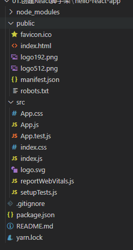

##  使用 create-react-app 创建 react 应用

### react 脚手架

- xxx脚手架：用来帮助快速创建一个基于xxx库的模板项目
  - 包含了所有需要的配置（语法检查，jsx编译，devServer...）
  - 下载好了所有相关的依赖
  - 可以直接运行一个简单的效果

- react 提供了一个用于创建 react 项目的脚手架库：create-react_app
- 项目的整体技术架构为：React + Webpack  + ES6 + ESLint
- 使用脚手架开发的项目的特点：模块化，组件化，工程化

### 创建项目并启动

- 全局安装：

  ````shell
  npm i -g create-react-app
  ````

- 切换需要创建项目的目录，使用命令：

  ````shell
  create-react-app projectName
  ````

- 进入项目文件夹：

  ````shell
  cd projectName
  ````

- 启动项目：

  ````shell
  npm start
  ````

### 脚手架文件分析



- `src` 文件夹：源代码文件夹

  - `./src/index.js`：入口文件

    ````javascript
    // 引入 react 核心库
    import React from 'react';
    // 引入 react-dom
    import ReactDOM from 'react-dom';
    // 引入样式
    import './index.css';
    // 引入 APP 根组件
    import App from './App';
    // 引入 webVitals 用于性能分析
    import reportWebVitals from './reportWebVitals';
    
    ReactDOM.render(
      <React.StrictMode>
        <App />
      </React.StrictMode>,
      document.getElementById('root')
    );
    
    reportWebVitals();
    ````

  - `./src/index.css`：引入样式

  - `./src/app.js`：App 根组件

    ````javascript
    import logo from './logo.svg';
    import './App.css';
    
    // 函数式组件 App
    function App() {
      return (
        <div className="App">
          <header className="App-header">
            
            <p>
              Edit <code>src/App.js</code> and save to reload.
            </p>
            <a
              className="App-link"
              href="https://reactjs.org"
              target="_blank"
              rel="noopener noreferrer"
            >
              Learn React
            </a>
          </header>
        </div>
      );
    }
    
    export default App;
    ````

  - `./src/app.css`：App 组件样式

  - `./src/logo.svg`：logo 矢量图

  - `./src/reportWebVitals.js`：引入 webVitals 用于性能分析

  - `./src/setupTests.js`：单元测试文件

  - `./src/App.test.js`：测试 App 组件有没有问题

- `public` 文件夹：

  - `./public/index.html`：主页面

    ````html
    <!DOCTYPE html>
    <html lang="en">
      <head>
        <meta charset="utf-8" />
        <!-- 引入icon 图标 %PUBLIC_URL% 仅用于react,代表public文件夹的路径  -->
        <link rel="icon" href="%PUBLIC_URL%/favicon.ico" />
        <!-- 下面的 meta 标签，开启理想视口，一般用于移动端 -->
        <meta name="viewport" content="width=device-width, initial-scale=1" />
        <!-- 调整浏览器地址栏的颜色，仅限于安卓手机浏览器（仅支持原生安卓系统） -->
        <meta name="theme-color" content="#000000" />
        <!-- 网页说明，爬虫专看  -->
        <meta
          name="description"
          content="Web site created using create-react-app"
        />
        <!-- IOS 系统中网页添加到桌面后的图标 -->
        <link rel="apple-touch-icon" href="%PUBLIC_URL%/logo192.png" />
    
        <!-- 应用加壳配置文件 -->
        <link rel="manifest" href="%PUBLIC_URL%/manifest.json" />
        
        <title>React App</title>
      </head>
      <body>
        <!-- 浏览器不支持 js 时显示此文字 -->
        <noscript>You need to enable JavaScript to run this app.</noscript>
        <div id="root"></div>
      </body>
    </html>
    ````

  - `./public/logo192.png`：图标

  - `./public/manifest.json`：应用加壳配置文件

  - `./robots.txt`：爬虫协议文件

## Todolist 案例

### 组件通信

#### 父传子

通过 `props` 直接传递：

- 父组件：

  ````jsx
  import { Component } from "react";
  import { Son } from './components'
  export default class Father exenends Component {
      state = {
          data: 'dataaaa'
      }
      render() {
           const { dataFromFather } = this.state
          return ( 
          	<div>
              	<Son dataFromFather = {data}/>
          	</div>
          )
      }
  }
  ````

- 子组件：

  ````jsx
  import { Component } from "react";
  export default class Son extends Component {
      render() {
          const { dataFromFather } = this.props
          return (
              <h1>父组件传来的数据是：{dataFromFather}</h1>
          )
      }
  }
  ````

#### 子传父

先通过父组件向子组件传递一个函数，子组件调用父组件传来的函数，将数据作为参数放入该函数，该函数调用父组件的 `setState()` 来实现子组件向父组件传递数据的功能

父组件：

````jsx
import { Component } from "react";
import { Son } from './components'
export default class Father exenends Component {
    state = {
        data: ''
    }
    
    eventBus = (newData) => {
        this.setState({
            data: newData
        })
    } 
    render() {
        return ( 
        	<div>
                {/* 将函数对象传递给子组件，子组件调用该函数并将数据传入，从而实现子组件向父组件传递数据的功能 */}
            	<Son eventBus = {this.eventBus}/>
        	</div>
=        )
    }
}
````

子组件：

````jsx
import { Component } from "react";
export default class Son extends Component {
    state = {
        sonData: 'sonData'
    }

	CONS
    transformData = () => {
        
    }
    
    // 获取父组件传递过来的函数
    const {eventBus} = this.props;
    // 将新数据传入父组件传递过来的函数内，该函数改变父组件state，实现子向父传递data
    eventBus(this.state.sonData)

    render() {
        const { eventBus } = this.props
        return (
           <button onClick = {this.transformData}></button>
        )
    }
}
````

## 脚手架中配置代理

面对跨域问题，可以使用代理服务器的方式解决。解决思路：

Request：浏览器 → 代理服务器 →服务器

Response：服务器 → 代理服务器 → 浏览器

其中，代理服务器和浏览器保证同源，服务器之间又没有同源政策，所以没有跨域的问题。

### 配置 package.json

在package.json中追加如下配置

````json
{
  "name": "proxy",
  "version": "0.1.0",
  "private": true,
  "dependencies": {
   ...
  },
  "scripts": {
    ...
  },
  "proxy": "http://localhost:5000"
}
````

其中 `"http://localhost:5000"` 是要访问的服务器的地址。

工作方式：上述方式配置代理，会优先在同源本机内查找资源，查找不到后才会将请求转发到服务器。

> 注意：
>
> 该方法虽然配置简单，但是有缺陷：
>
> - 只能配置一个服务器地址
> - 访问服务器资源的地址和本机内某资源同路径时，会访问到本机内的资源，造成问题。

### 配置文件

通过配置文件详细配置代理服务器

- 在脚手架 `src` 目录下创建 `setupProxy.js`

- 在 ``setupProxy.js` 中配置具体的代理规则：

  ````javascript
  const { createProxyMiddleware } = require('http-proxy-middleware');
  
  module.exports = function(app) {
      app.use(
        createProxyMiddleware('/api1', { //api1 转发路由键(所有带有/api1前缀的请求都会转发给5000)
          target: 'http://localhost:5000', // 代理服务器转发的目标地址
          pathRewrite: {'^/api1': ''}, //去除请求前缀，保证交给后台服务器的是正常请求地址(必须配置)
          changeOrigin: true, //控制服务器接收到的请求头中host字段的值
        }),
        createProxyMiddleware('/api2', {
          target: 'http://localhost:5001',
          pathRewrite: {'^/api2': ''}, 
          changeOrigin: true,
        })
      );
    };
  ````

该方法可详细配置多个代理转发服务器，上例中可以对

- http://localhost:3000/api1/studentsW
- http://localhost:3000/api2/cars

进行拦截，并根据路由键匹配转发至不同的服务器
