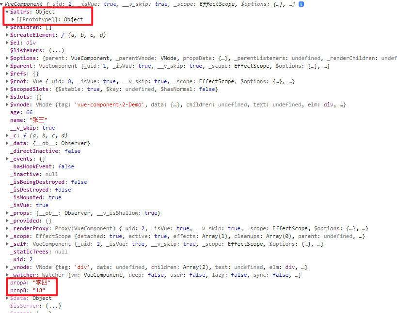
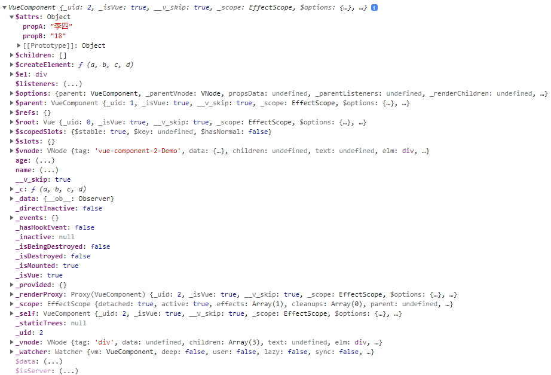
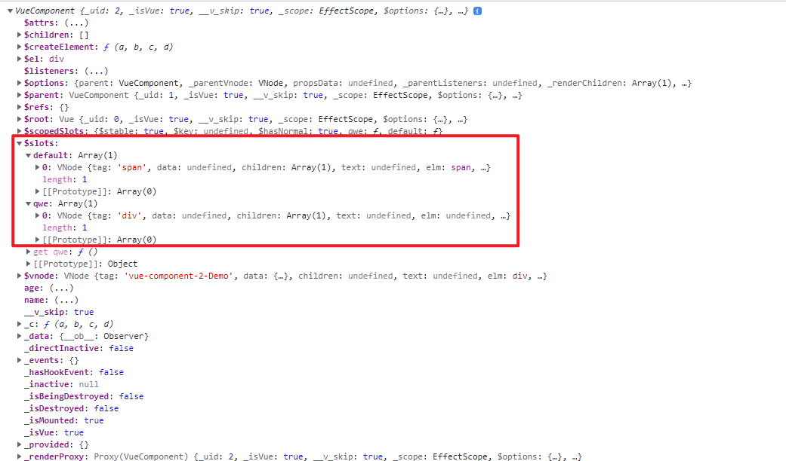
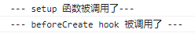
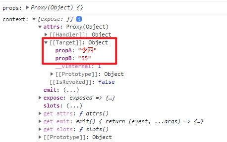
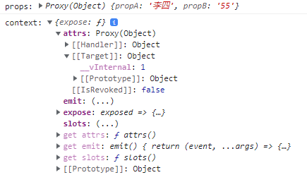
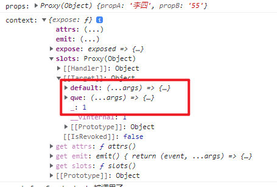

## Vue2.\* 中的几个特性

### 关于 **props**

-   当组件声明了接收 props 的类型：

    App.vue

    ```vue
    <template>
        <div id="app">
            <Demo propA="李四" propB="18"></Demo>
        </div>
    </template>
    ```

    Demo.vue

    ```vue
    <script>
    export default {
        name: 'Demo',
        props: ['propA', 'propB']
    }
    </script>
    ```

    组件对象上会直接挂载 props （`propA`、`propB`）,且 $attr 为空:

    

-   当组件没有声明接收 props 的类型：

    App.vue：

    ```vue
    <template>
        <div id="app">
            <Demo propA="李四" propB="18"></Demo>
        </div>
    </template>
    ```

    Demo.vue:

    ```vue
    <script>
    export default {
        name: 'Demo'
        //props: ["propA", "propB"],
    }
    </script>
    ```

    传递过来的 props 会存进 ￥ attrs 属性中。

    

### 关于 **slots**

-   当组件被传入了插槽

    ```vue
    <template>
        <div id="app">
            <Demo propA="李四" propB="18">
                <template v-slot:qwe>
                    <div>This is qwe slot</div>
                </template>
                <span>this is default slot</span>
            </Demo>
        </div>
    </template>
    ```

    可以在该组件对象上找到这些插槽被保存在了 $slots 属性上：

    

## Vue3.0 中的几个特性

> `setup(props, context)` 函数的入参：
>
> -   props: 组件使用时传进来的属性
> -   context: 上下文信息

### 关于 **setup** 函数的**调用时机**

-   setup 函数会在 beforeCreate 之前调用一次，但是此时 this 指向为 undefined。意味着 setup 函数中不能使用 this。

```vue
export default { name: "Demo", beforeCreate() { console.log('--- beforeCreate hook 被调用了 ---'); }, // setup 函数会在
beforeCreate hook 调用前调用 setup() { console.log('--- setup 函数被调用了---'); const person = reactive({ username:
'张三', age: 45 }) return { username: person.username, age: person.age } }, };
```



### 关于 **props**

-   当组件中没有声明传进来的 props 类型：

    APP.vue:

    ```vue
    <template>
        <h4>这里是 App 组件</h4>
        <Demo propA="李四" propB="55">
            <span>This is a default slot</span>
            <template v-slot:qwe>This is a named template</template>
        </Demo>
    </template>
    ```

    Demo.vue:

    ```vue
    export default { name: "Demo", // setup 函数会在 beforeCreate hook 调用前调用 setup(props, context) {
    console.log('props:', props) console.log('context:', context) const person = reactive({ username: '张三', age: 45 })
    return { username: person.username, age: person.age } }, };
    ```

    `setup` 函数的第一个参数 `props` 不会接收到任何属性，但是未接收到的属性都会存在 `context` 对象中的 `attrs` 属性中：

    

-   当组建中声明了传进来 props 的类型

    ```vue
    <script>
    import {reactive} from 'vue'

    export default {
        name: 'Demo',
        props: ['propA', 'propB']
    }
    </script>
    ```

    `setup` 函数的第一个参数 `props` 则会接收到传入的属性，`context` 对象中的 `attrs` 属性中不会被存入已被存入到 `props` 对象中的属性：

    

### 关于 **slots**

所有组件内传入的 slot 都会保存在 `context` 对象中的 `slots` 属性中：

App.vue

```vue
<template>
    <h4>这里是 App 组件</h4>
    <Demo propA="李四" propB="55">
        <span>This is a default slot</span>
        <template v-slot:qwe>This is a named template</template>
    </Demo>
</template>
```



-   关于自定义事件事件

    `context` 对象中 `emit` 函数可以去主动触发定义在该组件上的自定义事件。

    `emit(eventName, value)`需要传入两个参数：

    -   `ventName`: 定义在该组件上的自定义时间名
    -   `value`: 需要给事件回调函数传入的参数

    App.vue:

    ```vue
    <template>
        <h4>这里是 App 组件</h4>
        <Demo propA="李四" propB="55" @hello="showHelloMsg">
            <span>This is a default slot</span>
            <template v-slot:qwe>This is a named template</template>
        </Demo>
    </template>

    <script>
    import Demo from './components/Demo.vue'
    export default {
        name: 'App',
        components: {
            Demo
        },
        setup() {
            function showHelloMsg(value) {
                alert(`Hello! 我接收到了一个参数: ${value}`)
            }
            return {
                showHelloMsg
            }
        }
    }
    </script>
    ```

    Demo.vue:

    ```vue
    <template>
        <h4>unsername: {{ username }}</h4>
        <h4>age: {{ age }}</h4>
        <slot name="qwe"></slot>
        <button @click="triggerDIYEvent">触发自定义事件</button>
    </template>

    <script>
    import {reactive} from 'vue'

    export default {
        name: 'Demo',
        props: ['propA', 'propB'],

        setup(props, context) {
            const person = reactive({
                username: '张三',
                age: 45
            })

            function triggerDIYEvent() {
                // 触发自定义事件
                context.emit('hello', '王五')
            }

            return {
                username: person.username,
                age: person.age,
                triggerDIYEvent
            }
        }
    }
    </script>
    ```
