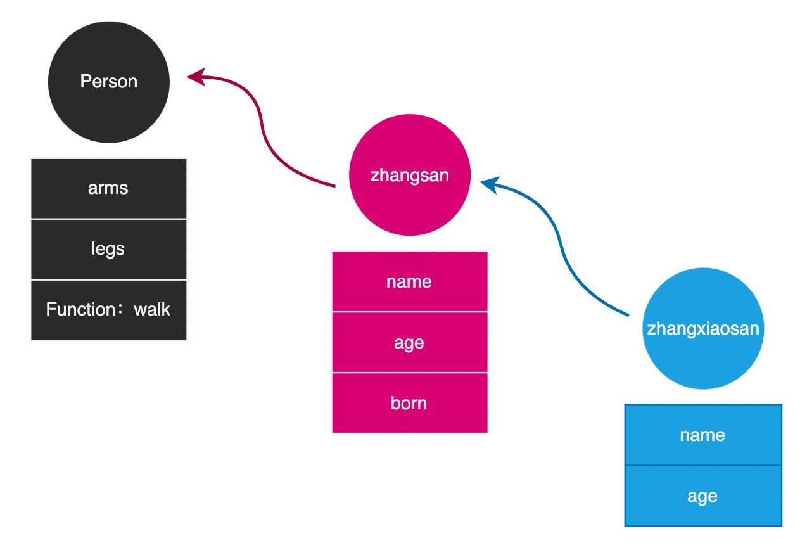
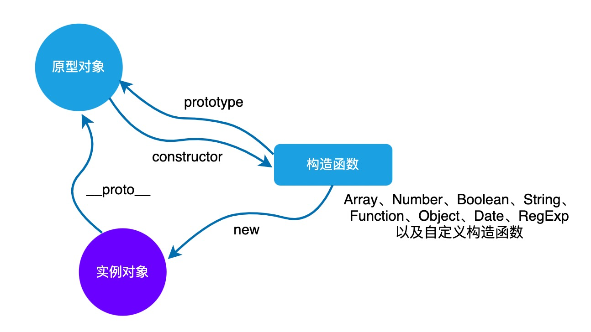
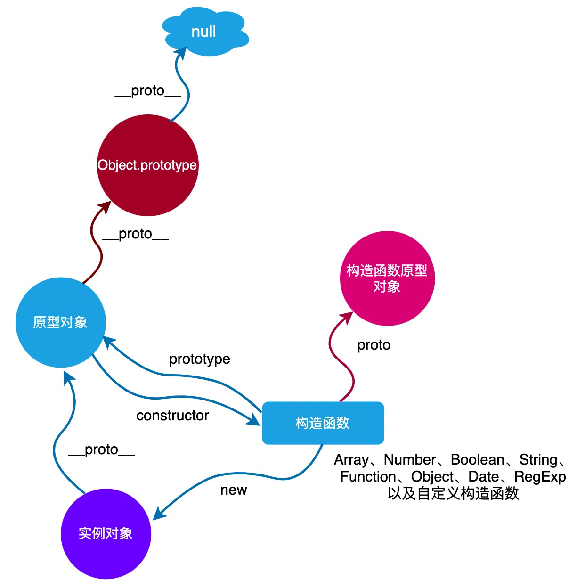

## 1. 解释

在 *Brendan Eich* 设计 *JavaScript* 时，借鉴了 *Self* 和 *Smalltalk* 这两门基于原型的语言。

之所以选择基于原型的对象系统，是因为 *Brendan Eich* 一开始就没有打算在 *JavaScript* 中加入类的概念，因为 *JavaScript* 的设计初衷就是为非专业的开发人员（例如网页设计者）提供一个方便的工具。由于大部分网页设计者都没有任何的编程背景，所以在设计 *JavaScript* 时也是尽可能使其简单、易学。

这因为如此，*JavaScript* 中的原型以及原型链成为了这门语言最大的一个特点，在面试的时候，面试官也经常会围绕原型和原型链展开提问。

*JavaScript* 是一门基于原型的语言，**对象的产生是通过原型对象而来的**。

*ES5* 中提供了 *Object.create* 方法，可以用来克隆对象。

示例如下：

```js
const person = {
    arms: 2,
    legs: 2,
    walk() {
        console.log('walking');
    }
}
const zhangsan = Object.create(person);
console.log(zhangsan.arms); // 2
console.log(zhangsan.legs); // 2
zhangsan.walk(); // walking
console.log(zhangsan.__proto__ === person); // true
```

在上面的示例中，我们通过 `Object.create` 方法来对  `person` 对象进行克隆，克隆出来了一个名为 `zhangsan` 的对象，所以  `person` 对象就是 `zhangsan` 这个对象的原型对象。

 `person` 对象上面的属性和方法，`zhangsan` 这个对象上面都有。

通过 __*proto*__ 属性，我们可以访问到一个对象的原型对象。

从上面的代码可以看出，当我们打印`zhangsan.__proto__ === person`，返回的是 *true* ，因为对于 `zhangsan` 这个对象而言，它的原型对象就是  `person` 这个对象。

我们在使用 *Object.create* 方法来克隆对象的时候，还可以传入第 *2* 个参数，第 *2* 个参数是一个 *JSON* 对象，该对象可以书写新对象的**新属性**以及**属性特性**。

通过这种方式，基于对象创建的新对象，可以继承祖辈对象的属性和方法，这其实就是一个继承的关系，来看一个示例：

```js
const person = {
    arms: 2,
    legs: 2,
    walk() {
        console.log('walking');
    }
}
const zhangsan = Object.create(person, {
    name: {
        value: "zhangsan",
    },
    age: {
        value: 18,
    },
    born: {
        value: "chengdu"
    }
});
const zhangxiaosan = Object.create(zhangsan, {
    name: {
        value: "zhangxiaosan"
    },
    age: {
        value: 1
    }
})
console.log(zhangxiaosan.name); // zhangxiaosan
console.log(zhangxiaosan.age); // 1
console.log(zhangxiaosan.born); // chengdu
console.log(zhangxiaosan.arms); // 2
console.log(zhangxiaosan.legs); // 2
zhangxiaosan.walk(); // walking
console.log(zhangsan.isPrototypeOf(zhangxiaosan)); // true
console.log(person.isPrototypeOf(zhangxiaosan)); // true
```

该例中，`zhangsan` 这个对象是从  `person` 这个对象克隆而来的，而 *zhangxiaosan* 这个对象又是从 `zhangsan` 这个对象克隆而来，以此**形成了一条原型链**。无论是  `person` 对象，还是 `zhangsan` 对象上面的属性和方法，*zhangxiaosan* 这个对象都能继承到。

来看下面的图：



这就是 *JavaScript* 中最原始的创建对象的方式，一个对象是通过克隆另外一个对象所得到的。就像克隆羊多莉一样，通过克隆可以创造一个一模一样的对象，被克隆的对象是新对象的原型对象。

但是，随着 *JavaScript* 语言的发展，这样创建对象的方式还是太过于麻烦了。开发者还是期望 *JavaScript* 能够像 *Java、C#* 等标准面向对象语言一样，通过类来批量的生成对象。于是出现了通过构造函数来模拟类的形式。

来看下面的例子：

```js
function Computer(name, price) {
    // 属性写在类里面 
    this.name = name;
    this.price = price;
}
// 方法挂在原型对象上面
Computer.prototype.showSth = function () {
    console.log(`这是一台${this.name}电脑`);
}

const apple = new Computer("苹果", 12000);
console.log(apple.name); // 苹果
console.log(apple.price); // 12000
apple.showSth(); // 这是一台苹果电脑

const huawei = new Computer("华为", 7000);
console.log(huawei.name); // 华为
console.log(huawei.price); // 7000
huawei.showSth(); // 这是一台华为电脑
```

在上面的例子中，我们书写了一个 *Computer* 的函数，我们称之为构造函数，为了区分普通函数和构造函数，一般构造函数的函数名**首字母会大写**。

区别于普通函数的直接调用，构造函数一般通过配合 *new* 关键字一起使用，每当我们 *new* 一次，就会生成一个新的对象，而在构造函数中的 *this* 就指向这个新生成的对象。

在上面的例子中，我们 *new* 了两次，所以生成了两个对象，我们把这两个对象分别存储到 *apple* 和 *huawei* 这两个变量里面。

有一个非常有意思的现象，就是我们在书写 *Computer* 构造函数的实例方法的时候，并没有将这个方法书写在构造函数里面，而是写在了 *Computer.prototype* 上面，那么这个 *Computer.prototype* 是啥呢？

这个 *Computer.prototype* 实际上就是 *Computer* 实例对象的原型对象。要搞清楚这个，看下面的图：



这是最重要的一个三角关系，也是我往往要求学生记下来的三角关系。

通过上图，我们可以得出以下的结论：

- *JavaScript* 中每个对象都有一个原型对象。可以通过 __*proto*__ 属性来访问到对象的原型对象。
- 构造函数的 *prototype* 属性指向一个对象，这个对象是该构造函数实例化出来的对象的原型对象。
- 原型对象的 *constructor* 属性也指向其构造函数。
- 实例对象的 *constructor* 属性是从它的原型对象上面访问到。

实践才是检验真理的唯一标准。接下来我们在代码中来验证一下：

```js
function Computer(name, price) {
    // 属性写在类里面 
    this.name = name;
    this.price = price;
}
// 方法挂在原型对象上面
Computer.prototype.showSth = function () {
    console.log(`这是一台${this.name}电脑`);
}

const apple = new Computer("苹果", 12000);

console.log(apple.__proto__ === Computer.prototype); // true
console.log(apple.__proto__.constructor === Computer); // true
```

在上面的代码中，*apple* 是从 *Computer* 这个构造函数中实例化出来的对象，我们通过 __*proto*__ 来访问到 *apple* 的原型对象，而这个原型对象和 *Computer.prototype* 是等价的。另外， 我们也发现 *apple* 和它原型对象的 *constructor* 属性都指向 *Computer* 这个构造函数。

接下来我们还可以来验证内置的构造函数是不是也是这样的关系，如下：

```js
function Computer(name, price) {
    // 属性写在类里面 
    this.name = name;
    this.price = price;
}
// 方法挂在原型对象上面
Computer.prototype.showSth = function () {
    console.log(`这是一台${this.name}电脑`);
}

const apple = new Computer("苹果", 12000);

console.log(apple.__proto__ === Computer.prototype); // true
console.log(apple.__proto__.constructor === Computer); // true

// 数组的三角关系
var arr = [];
console.log(arr.__proto__ === Array.prototype); // true

// 其实所有的构造函数的原型对象都相同
console.log(Computer.__proto__ === Array.__proto__); // true
console.log(Computer.__proto__ === Date.__proto__); // true
console.log(Computer.__proto__ === Number.__proto__);  // true
console.log(Computer.__proto__ === Function.__proto__);  // true
console.log(Computer.__proto__ === Object.__proto__);  // true
console.log(Computer.__proto__); // {}
```

通过上面的代码，我们发现所有的构造函数，无论是自定义的还是内置的，它们的原型对象都是同一个对象。

如果你能够把上面的三角关系理清楚，恭喜你，你已经把整个原型和原型链的知识掌握一大部分。

如果你还想继续往下深究，那么上面的图可以扩展成这样：



在 *JavaScript* 中，每一个对象，都有一个原型对象。而原型对象上面也有一个自己的原型对象，一层一层向上找，最终会到达 *null*。

我们可以在上面代码的基础上，继续进行验证，如下：

```js
function Computer(name, price) {
    // 属性写在类里面 
    this.name = name;
    this.price = price;
}
// 方法挂在原型对象上面
Computer.prototype.showSth = function () {
    console.log(`这是一台${this.name}电脑`);
}

var apple = new Computer("苹果", 12000);

console.log(apple.__proto__.__proto__); // [Object: null prototype] {}
console.log(apple.__proto__.__proto__.__proto__); // null
console.log(apple.__proto__.__proto__ === Object.prototype); // true
```

可以看到，在上面的代码中，我们顺着原型链一层一层往上找，最终到达了 *null*。

但是目前来看我们这个图还是不完整，既然构造函数的原型对象也是对象，那么必然该对象也有自己的原型，所以完整的图其实如下：


下面可以简单验证一下，如下：

```js
// 自定义构造函数函数
function Computer() {}

console.log(Computer.__proto__.__proto__.__proto__); // null
console.log(Computer.__proto__.constructor.__proto__ === Computer.__proto__); // true
console.log(Computer.__proto__.__proto__.constructor.__proto__ === Computer.__proto__); // true
```

## 2. 真题解答

- 说一说你对 *JavaScript* 中原型与原型链的理解？（美团 *2019*年）

> 参考答案：
>
> - 每个对象都有一个 __*proto*__ 属性，该属性指向自己的原型对象
> - 每个构造函数都有一个 *prototype* 属性，该属性指向实例对象的原型对象
> - 原型对象里的 *constructor* 指向构造函数本身
>
> 如下图：
>
> 
>
> 每个对象都有自己的原型对象，而原型对象本身，也有自己的原型对象，从而形成了一条原型链条。
>
> 当试图访问一个对象的属性时，它不仅仅在该对象上搜寻，还会搜寻该对象的原型，以及该对象的原型的原型，依次层层向上搜索，直到找到一个名字匹配的属性或到达原型链的末尾。

- 对一个构造函数实例化后，它的原型链指向什么？

> 参考答案：
>
> 指向该构造函数实例化出来对象的原型对象。
>
> 对于构造函数来讲，可以通过 *prototype* 访问到该对象。
>
> 对于实例对象来讲，可以通过隐式属性 __*proto*__ 来访问到。