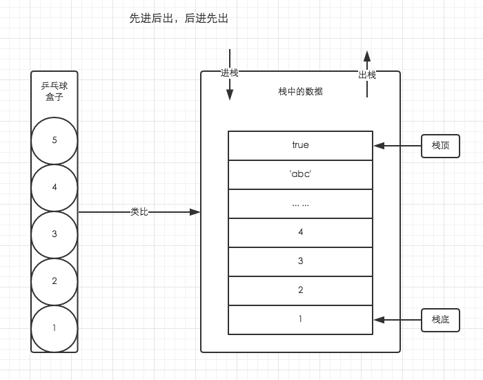
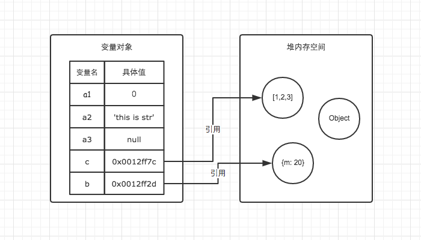

在 *JavaScript* 中，数据类型整体上来讲可以分为两大类：**基本类型**和**引用数据类型**

基本数据类型，一共有 *6* 种：

```
string，symbol，number，boolean，undefined，null
```

其中 *symbol* 类型是在 *ES6* 里面新添加的基本数据类型。

引用数据类型，就只有 *1* 种：

```
object
```

基本数据类型的值又被称之为原始值或原始数据类型，而引用数据类型的值又被称之为引用数据类型或引用值。

那么两者之间具体有什么区别呢？我们一点一点来看：

## 1. 原始数据类型

**原始数据类型是表示 \*JavaScript\* 中可用的数据或信息的最底层形式或最简单形式。**

也就是说，数字是数字，字符串是字符串，布尔值是 `true` 或 `false`，`null` 和 `undefined` 就是 `null` 和 `undefined`。这些值本身很简单，不能够再进行拆分。

由于原始数据类型的数据大小是固定的，所以**原始数据类型的数据是存储于内存中的栈区里面的。**

要简单理解栈的存取方式，我们可以通过类比乒乓球盒子来分析。如下图：


下面是具体的代码示例：

```js
var str = "Hello World";
var num = 10;
var bol = true;
var myNull = null;
var undef = undefined;
console.log(typeof str); // string
console.log(typeof num); // number
console.log(typeof bol); // boolean
console.log(typeof myNull); // object
console.log(typeof undef); // undefined
```

这里面 `null` 比较特殊，打印出来是 *object*，这是由于历史原因所遗留下来的问题。

是来源于 *JavaScript* 从第一个版本开始时的一个 *bug*，并且这个 *bug* 无法被修复。因为修复会破坏现有的代码。

具体原因是因为不同的对象在底层都表现为二进制，在 *JavaScript* 中二进制前三位都为 *0* 的话会被判断为 *object* 类型，`null` 的二进制全部为 *0*，自然前三位也是 *0*，所以执行 `typeof` 值会返回 `object`。

例外，当我们打印 `null == undefined` 的时候，返回的是 `true`，这也是面试时经常会被问到的一个问题。

这两个值都表示“无”的意思。

通常情况下， 当我们试图访问某个不存在的或者没有赋值的变量时，就会得到一个 `undefined` 值。*Javascript* 会自动将声明是没有进行初始化的变量设为 `undifined`。

而 `null` 值表示空，`null` 不能通过 *Javascript* 来自动赋值，也就是说必须要我们自己手动来给某个变量赋值为 `null`。

那么为什么 *JavaScript* 要设置两个表示"无"的值呢？

这其实也是因为历史原因。

*1995* 年 *JavaScript* 诞生时，最初像 *Java* 一样，只设置了 `null` 作为表示"无"的值。根据 *C* 语言的传统，`null` 被设计成可以自动转为 `0`。

但是，*JavaScript* 的设计者，觉得这样做还不够，主要有以下两个原因。

1. `null` 像在 *Java* 里一样，被当成一个对象。但是，*JavaScript* 的数据类型分成原始类型（*primitive*）和复合类型（*complex*）两大类，作者觉得表示“无”的值最好不是对象。
2. *JavaScript* 的最初版本没有包括错误处理机制，发生数据类型不匹配时，往往是自动转换类型或者默默地失败。作者觉得，如果 `null` 自动转为 *0*，很不容易发现错误。

因此，作者又设计了一个 `undefined`。**这里注意：先有 \*null\* 后有 \*undefined\* 出来，\*undefined\* 是为了填补之前的坑。**

*JavaScript* 的最初版本是这样区分的：

`null` 是一个表示“无”的对象（空对象指针），转为数值时为 *0*；

典型用法是：

- 作为函数的参数，表示该函数的参数不是对象。
- 作为对象原型链的终点。

`undefined` 是一个表示"无"的原始值，转为数值时为 *NaN*。

典型用法是：

- 变量被声明了，但没有赋值时，就等于 `undefined`。
- 调用函数时，应该提供的参数没有提供，该参数等于 `undefined`。
- 对象没有赋值的属性，该属性的值为 `undefined`。
- 函数没有返回值时，默认返回 `undefined`。

## 2. 引用数据类型

在 *JavaScript* 中，对象就是一个引用数据类型。因为对象可以向下拆分，拆分成多个原始数据类型或者引用数据类型。

**引用数据类型在内存中的大小是未知的，因为引用数据类型可以包含任何值，而不是一个特定的已知值，所以引用数据类型的数据都是存储于堆区里面。**

如下图所示：



下面是具体的代码示例：

```js
// 原始数据类型
var a1 = 0;
var a2 = "this is str";
var a3 = null

// 引用数据类型
var c = [1, 2, 3];
var d = {m: 20};
```

### 2.1. 访问方式

**按值访问**

原始数据类型是作为不可细化的值进行存储和使用的，引用它们会转移其值。

```js
var str = "Hello";
var str2 = str;
str = null;
console.log(str,str2); // null "Hello"
```

**引用访问**

引用数据类型是通过引用进行存储和操作的，而不是实际的值。创建一个包含复杂对象的变量时，其值是内存中的一个引用地址。引用一个复杂对象时，使用它的名称（即变量或对象属性）通过内存中的引用地址获取该对象值。

```
var obj = {};
var obj2 = obj;
obj.name = "zhangsan";
console.log(obj.name); // zhangsan
console.log(obj2.name); // zhangsan
```

### 2.2. 比较方式

原始数据类型采用值比较，而引用数据类型采用引用比较。引用数据类型只有在引用相同的对象（即有相同的地址）时才相等。即使是包含相同对象的两个变量也彼此不相等，因为它们并不指向同一个对象。

示例 1:

```js
var a = 10;
var b = 10;
var c = new Number(10);
var d = c;
console.log(a === b); // true
console.log(a === c); // false
console.log(a === c); // false
console.log(a == c); // true
d = 10;
console.log(d == c); // true
console.log(d === c); // false
```

示例 2:

```js
var obj = {name : 'zhangsan'};
var obj2 = {name : 'zhangsan'};
console.log(obj == obj2); // false
console.log(obj === obj2); // false
var obj3 = {name : 'zhangsan'};
var obj4 = obj3;
console.log(obj3 == obj4); // true
console.log(obj3 === obj4); // ture
```

### 2.3. 动态属性

对于引用数据类型，可以为其添加属性和方法，也可以改变和删除其属性和方法。但原始数据类型不可以：

```js
var str = 'test';
str.abc = true;
console.log(str.abc); // undefined
var obj = {};
obj.abc = true;
console.log(obj.abc); // true
```

引用数据类型支持动态对象属性，因为我们可以定义对象，然后创建引用，再更新对象，并且所有指向该对象的变量都会获得更新。

一个新变量指向现有的复杂对象，并没有复制该对象。这就是引用数据类型有时被称为引用值的原因。引用数据类型可以根据需求有任意多个引用，即使对象改变，它们也总是指向同一个对象

```js
var obj = {name : 'zhangsan'};
var obj2 = obj;
var obj3 = obj2;
obj.name = 'abc';
console.log(obj.name, obj2.name, obj3.name);
// abc abc abc
```

### 2.4. 变量赋值

最后说一下关于变量的赋值，其实是可以分为直接赋值和引用赋值的。直接赋值，就是指将原始数据类型赋值给变量，而引用赋值是指将一个引用数据类型的引用赋值给变量，这个引用指向堆区实际存在的数据。

**直接赋值**

```js
var a = 3;
var b = a;
b = 5;
console.log(a); // 3
```

**引用赋值**

```js
var a = {value : 1};
var b = a;
b.value = 10;
console.log(a.value); // 10
```

## 3. 真题解答

- *JS* 的基本数据类型有哪些？基本数据类型和引用数据类型的区别

> 参考答案：
>
> 在 *JavaScript* 中，数据类型整体上来讲可以分为两大类：**基本类型**和**引用数据类型**
>
> 基本数据类型，一共有 *6* 种：
>
> ```
> string，symbol，number，boolean，undefined，null
> ```
>
> 其中 *symbol* 类型是在 *ES6* 里面新添加的基本数据类型。
>
> 引用数据类型，就只有 *1* 种：
>
> ```
> object
> ```
>
> 基本数据类型的值又被称之为原始值或原始数据类型，而引用数据类型的值又被称之为引用数据类型或引用值。
>
> 两者的区别在于：
>
> **原始值是表示 *JavaScript* 中可用的数据或信息的最底层形式或最简单形式。简单类型的值被称为原始值，是因为它们是不可细化**的。
>
> 也就是说，数字是数字，字符是字符，布尔值是 `true` 或 `false`，`null` 和 `undefined` 就是 `null` 和 `undefined`。这些值本身很简单，不能够再进行拆分。由于原始值的数据大小是固定的，所以**原始值的数据是存储于内存中的栈区里面的。**
>
> 在 *JavaScript* 中，对象就是一个引用值。因为对象可以向下拆分，拆分成多个原始数据类型或者引用数据类型。**引用值在内存中的大小是未知的，因为引用值可以包含任何值，而不是一个特定的已知值，所以引用值的数据都是存储于堆区里面。**
>
> 最后总结一下两者的区别：
>
> 1. 访问方式
>    - 原始值：访问到的是值
>    - 引用值：访问到的是引用地址
> 2. 比较方式
>    - 原始值：比较的是值
>    - 引用值：比较的是地址
> 3. 动态属性
>    - 原始值：无法添加动态属性
>    - 引用值：可以添加动态属性
> 4. 变量赋值
>    - 原始值：赋值的是值
>    - 引用值：赋值的是地址