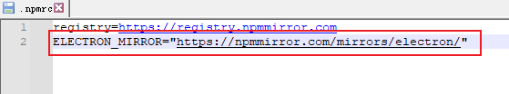
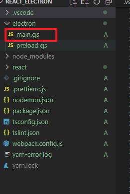
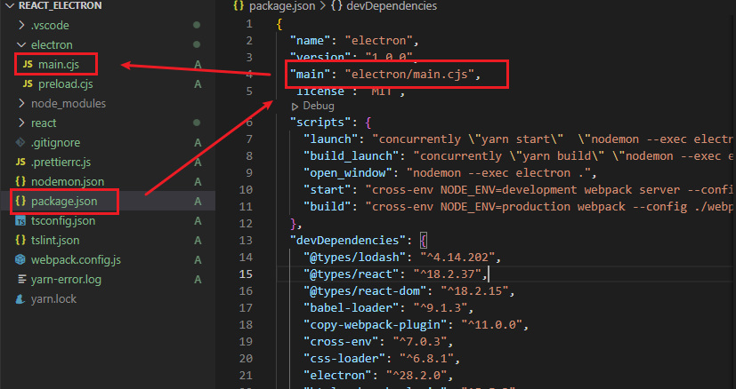
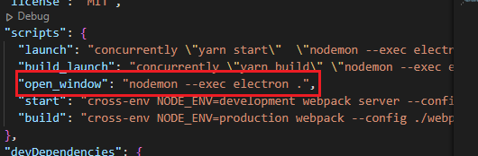
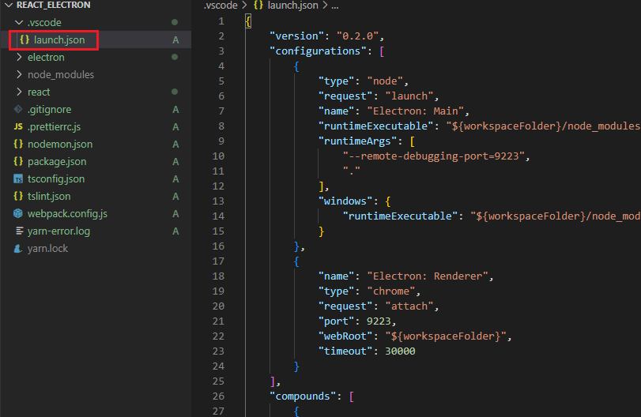
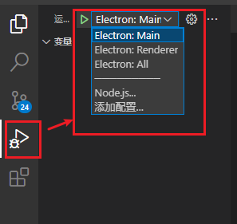
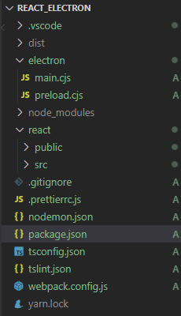
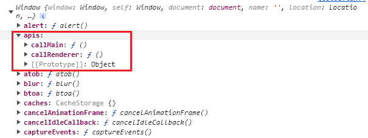

## 项目搭建

### 安装 electron

**npm**

```shell
npm install --save-dev electron
```

**yarn**

```shell
yarn add --dev electron
```

> 注意：
>
> 如果下载失败，在 .npmrc 文件中添加：
>
> 
>
> `ELECTRON_MIRROR="https://npmmirror.com/mirrors/electron/"`

### 启动 electron

-   创建主进程文件 `main.js`

    

    ```javascript
    const {BrowserWindow, app} = require('electron')

    const openWindow = () => {
        // 新建窗口
        const mainWindow = new BrowserWindow({
            width: 500, // 窗口横向长度
            height: 400, // 窗口纵向长度
            alwaysOnTop: true, // 是否永远置顶
            x: 800, // 在显示画面的第 x 个横向像素点显示窗口
            y: 200 // 在画面的第 y 个纵向像素显示窗口
        })

        // 开启调试窗口
        mainWindow.webContents.toggleDevTools()

        mainWindow.loadFile(path.resolve(__dirname, '../dist/index.html')) // 打开的窗口通过 读取文件 加载内容
        mainWindow.loadURL('http://localhost:8080') // 打开的窗口通过 URL 加载内容
    }

    // 当 electron 准备完毕之后
    app.whenReady().then(() => {
        // 打开窗口
        openWindow()
    })
    ```

-   `package.json` 中指定项目入口

    

    ```json
    {
      "name": "electron",
      "version": "1.0.0",
      "main": "main.js",
       ...
    }
    ```

-   `package.json` 中定义脚本，启动 electron

    ```json
    {
      "scripts":{
         "launch": "electron" .
       }
    }
    ```

    > 想要检测代码改动刷新 electron，可以使用 nodemon 进行代码运行并监测：
    >
    > -   nodemon 安装
    >
    >     ```shell
    >     npm install --save-dev nodemon # or using yarn: yarn add nodemon -D
    >     ```
    >
    >     或者全局安装
    >
    >     ```shell
    >     npm install -g nodemon # or using yarn: yarn add nodemon -g
    >     ```
    >
    > -   项目根目录添加 `nodemon.json` 配置文件
    >
    >     ```json
    >     {
    >         "ignore": ["node_modules", "dist"],
    >         "colours": true,
    >         "verbose": true,
    >         "restartable": "rs",
    >         "watch": ["*.*"],
    >         "ext": "html,js,cjs"
    >     }
    >     ```
    >
    > -   使用 nodemon 启动 electron
    >
    >     
    >
    >     ```shell
    >     {
    >       "scripts": {
    >       	"launch": "nodemon --exec electron ."
    >       }
    >     }
    >     ```

### 调试 electron

新增文件 `.vscode/launch.json`



```json
{
    "version": "0.2.0",
    "configurations": [
        {
            "type": "node",
            "request": "launch",
            "name": "Electron: Main",
            "runtimeExecutable": "${workspaceFolder}/node_modules/.bin/electron",
            "runtimeArgs": ["--remote-debugging-port=9223", "."],
            "windows": {
                "runtimeExecutable": "${workspaceFolder}/node_modules/.bin/electron.cmd"
            }
        },
        {
            "name": "Electron: Renderer",
            "type": "chrome",
            "request": "attach",
            "port": 9223,
            "webRoot": "${workspaceFolder}",
            "timeout": 30000
        }
    ],
    "compounds": [
        {
            "name": "Electron: All",
            "configurations": ["Electron: Main", "Electron: Renderer"]
        }
    ]
}
```

配置添加后即可得到调试界面：



## React-Typescript 项目与 electron 的集成

将 React 脚手架放入 electron 项目中，项目结构：



### `package.json` 配置

```json
{
    "name": "electron",
    "version": "1.0.0",
    "main": "electron/main.cjs",
    "license": "MIT",
    "scripts": {
        "launch": "concurrently \"yarn start\"  \"nodemon --exec electron .\"",
        "build_launch": "concurrently \"yarn build\" \"nodemon --exec electron .\"",
        "open_window": "nodemon --exec electron .",
        "start": "cross-env NODE_ENV=development webpack server --config ./webpack.config.js",
        "build": "cross-env NODE_ENV=production webpack --config ./webpack.config.js"
    },
    "devDependencies": {
        "@types/lodash": "^4.14.202",
        "@types/react": "^18.2.37",
        "@types/react-dom": "^18.2.15",
        "babel-loader": "^9.1.3",
        "copy-webpack-plugin": "^11.0.0",
        "cross-env": "^7.0.3",
        "css-loader": "^6.8.1",
        "electron": "^28.2.0",
        "html-webpack-plugin": "^5.5.3",
        "less": "^4.2.0",
        "less-loader": "^11.1.3",
        "mini-css-extract-plugin": "^2.7.6",
        "postcss-loader": "^7.3.3",
        "postcss-preset-env": "^9.3.0",
        "sass-loader": "^13.3.2",
        "style-loader": "^3.3.3",
        "stylus-loader": "^7.1.3",
        "ts-loader": "^9.5.0",
        "tslint": "^6.1.3",
        "tslint-webpack-plugin": "^2.1.1",
        "typescript": "^5.2.2",
        "webpack": "^5.89.0",
        "webpack-cli": "^5.1.4",
        "webpack-dev-server": "^4.15.1"
    },
    "dependencies": {
        "lodash": "^4.17.21",
        "react": "^18.2.0",
        "react-dom": "^18.2.0",
        "react-router-dom": "^6.18.0"
    }
}
```

### `webpack.config.js` 配置

```js
const path = require('path')
const HtmlWebpackPlugin = require('html-webpack-plugin')
const MiniCssExtractPlugin = require('mini-css-extract-plugin')
const TSLintPlugin = require('tslint-webpack-plugin')
const CopyWebpackPlugin = require('copy-webpack-plugin')

const isProduction = process.env.NODE_ENV === 'production'

const getStyleLoaders = additionalLoader =>
    [
        isProduction ? MiniCssExtractPlugin.loader : 'style-loader',
        'css-loader',
        {
            loader: 'postcss-loader',
            options: {
                postcssOptions: {
                    plugins: ['postcss-preset-env']
                }
            }
        },
        additionalLoader
    ].filter(Boolean)

module.exports = {
    entry: path.resolve(__dirname, './react/src/main.tsx'),
    output: {
        filename: isProduction ? 'static/js/[name].[contenthash:10].js' : 'static/js/[name].js',
        path: isProduction ? path.resolve(__dirname, './dist') : undefined,
        publicPath: isProduction ? '' : '/',
        clean: true
    },
    module: {
        rules: [
            {
                oneOf: [
                    {
                        test: /\.css$/,
                        use: getStyleLoaders()
                    },
                    {
                        test: /\.less$/,
                        use: getStyleLoaders('less-loader')
                    },
                    {
                        test: /\.s[ac]ss$/,
                        use: getStyleLoaders('sass-loader')
                    },
                    {
                        test: /\.styl$/,
                        use: getStyleLoaders('stylus-loader')
                    },
                    {
                        test: /\.m?tsx?$/,
                        use: [
                            {
                                loader: 'ts-loader'
                            }
                        ],
                        exclude: [/node_modules/],
                        include: path.resolve(__dirname, './react/src')
                    }
                ]
            }
        ]
    },
    plugins: [
        new HtmlWebpackPlugin({
            template: path.resolve(__dirname, './react/public/index.html')
        }),
        new TSLintPlugin({
            files: ['./react/src/**/*.ts', './react/src/**/*.tsx']
        }),
        isProduction &&
            new MiniCssExtractPlugin({
                filename: 'static/css/[name].[contenthash:10].css',
                chunkFilename: 'static/css/[name].[contenthash:10].chunk.css'
            }),
        new CopyWebpackPlugin({
            patterns: [
                {
                    from: path.resolve(__dirname, './react/public'),
                    to: path.resolve(__dirname, './dist'),
                    globOptions: {
                        ignore: '**/public/index.html'
                    }
                }
            ]
        })
    ],
    devServer: {
        host: '0.0.0.0',
        port: '8080',
        historyApiFallback: true
    },
    mode: isProduction ? 'production' : 'development',
    devtool: 'cheap-module-source-map',
    resolve: {
        extensions: ['.ts', '.tsx', '.jsx', '.js', '.json']
    }
}
```

### `tsconfig.json` 配置

```json
{
    "compilerOptions": {
        /* Visit https://aka.ms/tsconfig to read more about this file */

        /* Projects */
        // "incremental": true,                              /* Save .tsbuildinfo files to allow for incremental compilation of projects. */
        // "composite": true,                                /* Enable constraints that allow a TypeScript project to be used with project references. */
        // "tsBuildInfoFile": "./.tsbuildinfo",              /* Specify the path to .tsbuildinfo incremental compilation file. */
        // "disableSourceOfProjectReferenceRedirect": true,  /* Disable preferring source files instead of declaration files when referencing composite projects. */
        // "disableSolutionSearching": true,                 /* Opt a project out of multi-project reference checking when editing. */
        // "disableReferencedProjectLoad": true,             /* Reduce the number of projects loaded automatically by TypeScript. */

        /* Language and Environment */
        "target": "es2016" /* Set the JavaScript language version for emitted JavaScript and include compatible library declarations. */,
        // "lib": [],                                        /* Specify a set of bundled library declaration files that describe the target runtime environment. */
        "jsx": "react" /* Specify what JSX code is generated. */,
        // "experimentalDecorators": true,                   /* Enable experimental support for legacy experimental decorators. */
        // "emitDecoratorMetadata": true,                    /* Emit design-type metadata for decorated declarations in source files. */
        // "jsxFactory": "",                                 /* Specify the JSX factory function used when targeting React JSX emit, e.g. 'React.createElement' or 'h'. */
        // "jsxFragmentFactory": "",                         /* Specify the JSX Fragment reference used for fragments when targeting React JSX emit e.g. 'React.Fragment' or 'Fragment'. */
        // "jsxImportSource": "",                            /* Specify module specifier used to import the JSX factory functions when using 'jsx: react-jsx*'. */
        // "reactNamespace": "",                             /* Specify the object invoked for 'createElement'. This only applies when targeting 'react' JSX emit. */
        // "noLib": true,                                    /* Disable including any library files, including the default lib.d.ts. */
        // "useDefineForClassFields": true,                  /* Emit ECMAScript-standard-compliant class fields. */
        // "moduleDetection": "auto",                        /* Control what method is used to detect module-format JS files. */

        /* Modules */
        "module": "es6" /* Specify what module code is generated. */,
        // "rootDir": "./",                                  /* Specify the root folder within your source files. */
        "moduleResolution": "node" /* Specify how TypeScript looks up a file from a given module specifier. */,
        // "baseUrl": "./",                                  /* Specify the base directory to resolve non-relative module names. */
        // "paths": {},                                      /* Specify a set of entries that re-map imports to additional lookup locations. */
        // "rootDirs": [],                                   /* Allow multiple folders to be treated as one when resolving modules. */
        // "typeRoots": [],                                  /* Specify multiple folders that act like './node_modules/@types'. */
        // "types": [],                                      /* Specify type package names to be included without being referenced in a source file. */
        // "allowUmdGlobalAccess": true,                     /* Allow accessing UMD globals from modules. */
        // "moduleSuffixes": [],                             /* List of file name suffixes to search when resolving a module. */
        // "allowImportingTsExtensions": true,               /* Allow imports to include TypeScript file extensions. Requires '--moduleResolution bundler' and either '--noEmit' or '--emitDeclarationOnly' to be set. */
        // "resolvePackageJsonExports": true,                /* Use the package.json 'exports' field when resolving package imports. */
        // "resolvePackageJsonImports": true,                /* Use the package.json 'imports' field when resolving imports. */
        // "customConditions": [],                           /* Conditions to set in addition to the resolver-specific defaults when resolving imports. */
        // "resolveJsonModule": true,                        /* Enable importing .json files. */
        // "allowArbitraryExtensions": true,                 /* Enable importing files with any extension, provided a declaration file is present. */
        // "noResolve": true,                                /* Disallow 'import's, 'require's or '<reference>'s from expanding the number of files TypeScript should add to a project. */

        /* JavaScript Support */
        "allowJs": true /* Allow JavaScript files to be a part of your program. Use the 'checkJS' option to get errors from these files. */,
        // "checkJs": true,                                  /* Enable error reporting in type-checked JavaScript files. */
        // "maxNodeModuleJsDepth": 1,                        /* Specify the maximum folder depth used for checking JavaScript files from 'node_modules'. Only applicable with 'allowJs'. */

        /* Emit */
        // "declaration": true,                              /* Generate .d.ts files from TypeScript and JavaScript files in your project. */
        // "declarationMap": true,                           /* Create sourcemaps for d.ts files. */
        // "emitDeclarationOnly": true,                      /* Only output d.ts files and not JavaScript files. */
        // "sourceMap": true,                                /* Create source map files for emitted JavaScript files. */
        // "inlineSourceMap": true,                          /* Include sourcemap files inside the emitted JavaScript. */
        // "outFile": "./",                                  /* Specify a file that bundles all outputs into one JavaScript file. If 'declaration' is true, also designates a file that bundles all .d.ts output. */
        "outDir": "./dist/" /* Specify an output folder for all emitted files. */,
        // "removeComments": true,                           /* Disable emitting comments. */
        // "noEmit": true,                                   /* Disable emitting files from a compilation. */
        // "importHelpers": true,                            /* Allow importing helper functions from tslib once per project, instead of including them per-file. */
        // "importsNotUsedAsValues": "remove",               /* Specify emit/checking behavior for imports that are only used for types. */
        // "downlevelIteration": true,                       /* Emit more compliant, but verbose and less performant JavaScript for iteration. */
        // "sourceRoot": "",                                 /* Specify the root path for debuggers to find the reference source code. */
        // "mapRoot": "",                                    /* Specify the location where debugger should locate map files instead of generated locations. */
        // "inlineSources": true,                            /* Include source code in the sourcemaps inside the emitted JavaScript. */
        // "emitBOM": true,                                  /* Emit a UTF-8 Byte Order Mark (BOM) in the beginning of output files. */
        // "newLine": "crlf",                                /* Set the newline character for emitting files. */
        // "stripInternal": true,                            /* Disable emitting declarations that have '@internal' in their JSDoc comments. */
        // "noEmitHelpers": true,                            /* Disable generating custom helper functions like '__extends' in compiled output. */
        // "noEmitOnError": true,                            /* Disable emitting files if any type checking errors are reported. */
        // "preserveConstEnums": true,                       /* Disable erasing 'const enum' declarations in generated code. */
        // "declarationDir": "./",                           /* Specify the output directory for generated declaration files. */
        // "preserveValueImports": true,                     /* Preserve unused imported values in the JavaScript output that would otherwise be removed. */

        /* Interop Constraints */
        // "isolatedModules": true,                          /* Ensure that each file can be safely transpiled without relying on other imports. */
        // "verbatimModuleSyntax": true,                     /* Do not transform or elide any imports or exports not marked as type-only, ensuring they are written in the output file's format based on the 'module' setting. */
        // "allowSyntheticDefaultImports": true,             /* Allow 'import x from y' when a module doesn't have a default export. */
        "esModuleInterop": true /* Emit additional JavaScript to ease support for importing CommonJS modules. This enables 'allowSyntheticDefaultImports' for type compatibility. */,
        // "preserveSymlinks": true,                         /* Disable resolving symlinks to their realpath. This correlates to the same flag in node. */
        "forceConsistentCasingInFileNames": true /* Ensure that casing is correct in imports. */,

        /* Type Checking */
        "strict": true /* Enable all strict type-checking options. */,
        // "noImplicitAny": true,                            /* Enable error reporting for expressions and declarations with an implied 'any' type. */
        // "strictNullChecks": true,                         /* When type checking, take into account 'null' and 'undefined'. */
        // "strictFunctionTypes": true,                      /* When assigning functions, check to ensure parameters and the return values are subtype-compatible. */
        // "strictBindCallApply": true,                      /* Check that the arguments for 'bind', 'call', and 'apply' methods match the original function. */
        // "strictPropertyInitialization": true,             /* Check for class properties that are declared but not set in the constructor. */
        // "noImplicitThis": true,                           /* Enable error reporting when 'this' is given the type 'any'. */
        // "useUnknownInCatchVariables": true,               /* Default catch clause variables as 'unknown' instead of 'any'. */
        // "alwaysStrict": true,                             /* Ensure 'use strict' is always emitted. */
        // "noUnusedLocals": true,                           /* Enable error reporting when local variables aren't read. */
        // "noUnusedParameters": true,                       /* Raise an error when a function parameter isn't read. */
        // "exactOptionalPropertyTypes": true,               /* Interpret optional property types as written, rather than adding 'undefined'. */
        // "noImplicitReturns": true,                        /* Enable error reporting for codepaths that do not explicitly return in a function. */
        // "noFallthroughCasesInSwitch": true,               /* Enable error reporting for fallthrough cases in switch statements. */
        // "noUncheckedIndexedAccess": true,                 /* Add 'undefined' to a type when accessed using an index. */
        // "noImplicitOverride": true,                       /* Ensure overriding members in derived classes are marked with an override modifier. */
        // "noPropertyAccessFromIndexSignature": true,       /* Enforces using indexed accessors for keys declared using an indexed type. */
        // "allowUnusedLabels": true,                        /* Disable error reporting for unused labels. */
        // "allowUnreachableCode": true,                     /* Disable error reporting for unreachable code. */

        /* Completeness */
        // "skipDefaultLibCheck": true,                      /* Skip type checking .d.ts files that are included with TypeScript. */
        "skipLibCheck": true /* Skip type checking all .d.ts files. */
    }
}
```

### `tslint.json` 配置

```json
{
    "compilerOptions": {
        "jsx": "react",
        "noImplicitAny": false,
        "target": "ES6",
        "diagnostics": false,
        "lib": [
            "dom",
            "es2015",
            "es2017",
            "dom.iterable",
            "scripthost",
            "esnext",
            "esnext.asynciterable",
            "esnext.array"
        ],
        "baseUrl": ".",
        "sourceMap": true,
        "experimentalDecorators": true,
        "emitDecoratorMetadata": true,
        "module": "esnext",
        "declaration": true,
        "moduleResolution": "node",
        "skipLibCheck": true,
        "strict": true,
        "noImplicitReturns": true,
        "allowSyntheticDefaultImports": true,
        "esModuleInterop": true,
        "resolveJsonModule": true,
        "noEmitOnError": true,
        "strictPropertyInitialization": false,
        "types": ["@types/jest", "jest", "jest-extended", "node", "react"]
    },
    "compileOnSave": true,
    "buildOnSave": true,
    "exclude": ["**/node_modules", "**/target"],
    "filesGlob": ["**/*.ts", "**/*.tsx", "!node_modules/**", "!target/**"]
}
```

## 主进程与渲染进程通信

预加载文件 `preload.cjs`

可以配置预加载文件，electron 会在主进程开启，渲染进程开启之后运行预加载文件，预加载文件中默认可以使用部分 `node` api。

渲染进程与预加载文件的内存是隔离的，可以使用 `contextBridge` 进行与渲染进程的通信。

-   `contextBridge.exposeInMainWorld(key: string, callbacks: Object)`

    使用 `contextBridge.exposeInMainWorld` 可以实现与渲染进程分享数据，分享的数据会被存放在渲染进程的 `window` 对象中，如下面的代码就将 `apis` 放入了渲染进程的 `window` 对象中，在页面代码中可以使用 `window.apis` 访问。

    

### 渲染进程 call 主进程

> -   `ipcMain.on(eventName: string, callback: function)`
>
>     主进程中，使用 `ipcMain.on` 可以监听渲染进程中名为 `eventName` 的事件发生，监听到事件发生则执行 `callback`。
>
> -   `ipcRenderer.send(event: string)`
>
>     渲染进程向主进程发送信息，触发 `event` 事件。`ipcMain.on` 可以监听到对应事件的触发。

1. 在主进程文件 `main.js` 中定义监听函数

    ```javascript
    // 主进程监听事件，执行对应方法
    ipcMain.on('listen', () => {
        console.log('I heard')
    })
    ```

2. 在预加载文件 `prelad.js`中定义函数并通过 `contextBridge.exposeInMainWorld`放入渲染进程的 `window` 中，在函数中通过 `ipcRenderer.send` 触发主进程中的事件

    ```javascript
    contextBridge.exposeInMainWorld('apis', {
        callMain: () => {
            // 渲染进程向主进程发送事件
            ipcRenderer.send('listen')
        }
    })
    ```

3. 在页面代码中通过 `window` 对象调用 `contextBridge.exposeInMainWorld` 放入的函数，以触发主进程方法。

    ```jsx
    <button
        onClick={() => {
            // 调用预加载文件中的函数，以触发 ipcRenderer.send 触发主进程事件
            apis.callMain()
        }}
    >
        btn
    </button>
    ```

### 主进程 call 渲染进程

> -   `ipcRenderer.on(eventName, callback: function(eventName, data))`
>
>     渲染进程使用 `ipcRenderer.on` 监听主进程中名为 `eventName` 的事件发生，监听到事件则执行 `callback`
>
> -   `mainWindow.webContents.send(eventName: string, value: any)`
>
> 主线程向渲染进程发送消息，触发 `event` 事件。`ipcRenderer.on` 可以监听到对应事件的触发

1. 在预加载文件`preload`中定义函数并通过 `contextBridge.exposeInMainWorld`放入渲染进程的 `window` 中，在函数中使用 `ipcRenderer.on` 监听来自主进程的事件。事件监听的回调函数调用从页面传来的函数。

    ```javascript
    // 与渲染进程分享数据，将 'apis' 放入渲染进程的 windows 对象中
    contextBridge.exposeInMainWorld('apis', {
        callRenderer: callback => {
            // 监听 messageFromMainProcess 事件的触发
            ipcRenderer.on('messageFromMainProcess', (eventName, data) => {
                // 调用 渲染进程 传来的回调函数，实现主进程与渲染进程的通信
                callback(data)
            })
        }
    })
    ```

2. 在页面中调用`contextBridge.exposeInMainWorld`放入渲染进程的 `window` 中函数，并传入回调函数

    ```javascript
    //将回调函数传入预加载文件传入window对象中的函数中，供主进程调用
    apis.callRenderer((count: number) => {
        console.log(++count)
    })
    ```

3. 主进程中使用 `mainWindow.webContents.send` 触发渲染进程中的事件以达到与渲染进程通信的目的

    ```javascript
    mainWindow.webContents.send('messageFromMainProcess', 1)
    ```

### 主进程与渲染进程相互通信

案例：页面点击按钮，弹出文件选择框，待选择完文件后，将文件路径打印在浏览器控制台上

**方案一**：使用 `ipcRenderer.on` 、 `ipcRenderer.send`和 `ipcMain.on` 、`BrowserWindow.fromWebContents(event.sender).send`进行配合

1. 在预加载文件中通过 `contextBridge.exposeInMainWorld` 在渲染进程的 `window` 对象中放入 `selectFile` 与 `printFileLink` 两个函数

    - `selectFile` 调用 `ipcRenderer.send` 通知主进程打开文件选择框选择文件。
    - `printFileLink` 调用 `ipcRenderer.on` 监听主进程事件，以执行渲染进程传来的回调函数

    ```javascript
    contextBridge.exposeInMainWorld('electronApis', {
        selectFile: () => {
            ipcRenderer.send('openDialog')
        },
        printFileLink: callback => {
            ipcRenderer.on('msg', (event, data) => {
                callback(data)
            })
        }
    })
    ```

2. 在主进程文件中使用 `ipcMain.on` 监听渲染进程触发的事件，用以打开文件选择框，并触发渲染进程中监听的事件，将数据传入事件参数中

    ```javascript
    ipcMain.on('openDialog', async event => {
        const {filePaths} = await dialog.showOpenDialog()
        BrowserWindow.fromWebContents(event.sender).send('msg', filePaths)
    })
    ```

3. 组件中

    - 调用 `selectFile` 触发主进程事件选文件
    - 调用 `printFileLink` 触发渲染进程事件，监听主进程事件，并传入渲染进程事件回调函数

    ```javascript
    export const Test02: FC = () => {
        const openDirectorySelector = useCallback(() => {
            // 触发主进程事件
            window.electronApis.selectFile()
            // 传入渲染进程监听回调
            window.electronApis.printFileLink((fileLink: string) => {
                console.log(fileLink)
            })
        }, [])
        return (
            <>
                <button onClick={openDirectorySelector}>选择文件</button>
            </>
        )
    }
    ```

**方案二**：使用 `ipcRenderer.invoke` 和 `ipcMain.handle` 进行配合

1. 在预加载文件中通过 `contextBridge.exposeInMainWorld` 在渲染进程的 `window` 对象中放入 `selectFile` 函数，用于触发主函数事件。

    ```javascript
    contextBridge.exposeInMainWorld('electronApis', {
        selectFile: async () => {
            const filePaths = await ipcRenderer.invoke('openDialog')
            return filePaths
        }
    })
    ```

    `ipcRenderer.invoke` 的返回值就是主函数事件的返回值，`Promise` 对象通过 `await` 直接获取其值，并返回给调用处。

2. 在主函数中通过 `ipcMain.handle` 监听渲染进程的事件，打开选择文件框，并将选择的文件结果返回出去

    ```javascript
    ipcMain.handle('openDialog', async event => {
        const {filePaths} = await dialog.showOpenDialog()
        return filePaths
    })
    ```

3. 组件中调用 `selectFile` 函数触发主进程事件，并通过返回值拿到主进程事件的返回结果

    ```javascript
    export const Test03: FC = () => {
        const {selectFile} = window.electronApis
        const onSelectFile = async () => {
            const fileNames = await selectFile()
            console.log(fileNames)
        }
        return (
            <>
                <button onClick={onSelectFile}>select files</button>
            </>
        )
    }
    ```

## React 与 Electron 集成的脚手架

https://gitee.com/damiaoxi/stars/tree/master/Electron/React_Electron
