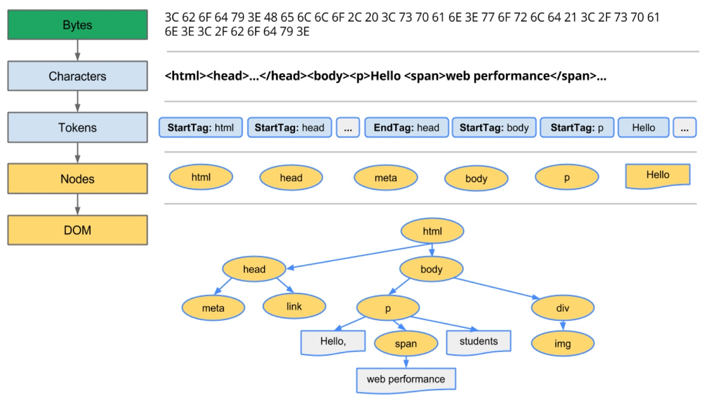
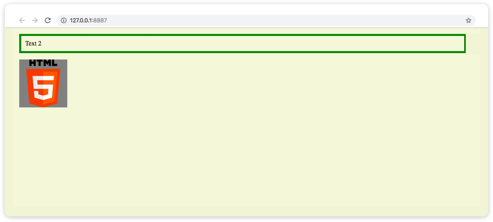
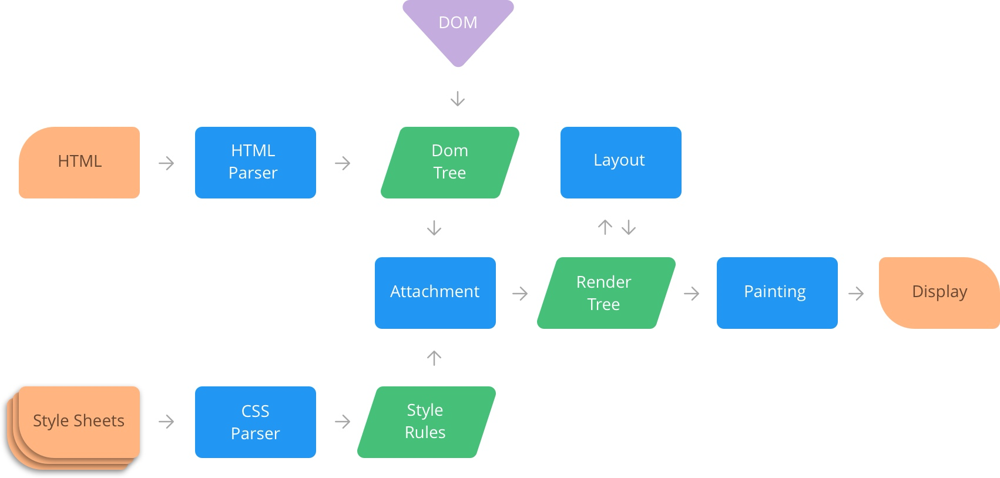

下图是关于浏览器的架构图：

一个 *Web* 浏览器中，主要组件有：

- 用户界面（*user interface*）

- 浏览器引擎（*browser engine*）

- 渲染引擎（*rendering engine*）

- 网络（*networking*）

- *JS* 解释器（*JavaScript interpreter*）

- 用户界面后端（*UI backend*）

- 数据存储（*data storage*）

下面我们来具体看一下每一个部分的作用。

## 用户界面（*user interface*）

用户界面用于呈现浏览器窗口部件，比如地址栏、前进后退按钮、书签、顶部菜单等。

如下图所示：

## 浏览器引擎（*browser engine*）

它是 *UI* 和渲染引擎之间的桥梁。接收来自 *UI* 的输入，然后通过操纵渲染引擎将网页或者其他资源显示在浏览器中。

## 渲染引擎（*rendering engine*）

负责在浏览器窗口上显示请求的内容。例如，用户请求一个 *HTML* 页面，则它负责解析 *HTML* 文档和 *CSS*，并将解析和格式化的内容显示在屏幕上。我们平时说的浏览器内核就是指这部分。

现代网络浏览器的渲染引擎：

- *Firefox：Gecko Software*

- *Safari：WebKit*

- *Chrome、Opera* (*15* 版本之后)：*Blink*

- *Internet Explorer：Trident*

在第一小节我们已经介绍过渲染引擎渲染页面的整体流程了，这里做一个简单的复习。

为了在屏幕上绘制像素（第一次渲染），浏览器在从网络接收数据（*HTML、CSS、JavaScript*）后必须经过一系列称为关键渲染路径的过程/技术。这包括 *DOM*、*CSSOM*、渲染树、布局和绘画。

### 从数据到 *DOM*

来自网络层的请求内容以二进制流格式在渲染引擎中接收（通常为 *8kb* 块）。然后将原始字节转换为 *HTML* 文件的字符（基于字符编码）。

然后将字符转换为标记。词法分析器执行词法分析，将输入分解为标记。在标记化期间，文件中的每个开始和结束标记都被考虑在内。它知道如何去除不相关的字符，如空格和换行符。然后解析器进行语法分析，通过分析文档结构，应用语言语法规则来构建解析树。

解析过程是迭代的。它将向词法分析器询问新的标记，如果语言语法规则匹配，则该标记将被添加到解析树中。然后解析器将要求另一个令牌。如果没有规则匹配，解析器将在内部存储令牌并不断询问令牌，直到找到与所有内部存储的令牌匹配的规则。如果未找到规则，则解析器将引发异常。这意味着该文档无效并且包含语法错误。

这些节点在称为 *DOM*（文档对象模型）的树数据结构中链接，该结构建立了父子关系、相邻兄弟关系。

### *CSS* 数据到 *CSSOM*

*CSS* 数据的原始字节被转换成字符、标记、节点，最后在 *CSSOM*（*CSS* 对象模型）中。 因为 *CSS* 存在层叠机制，该机制决定了将什么样式应用于元素，也就是说，元素的样式数据可以来自父项（通过继承）或设置为元素本身。因此浏览器必须递归遍历 *CSS* 树结构并确定特定元素的样式。

### *DOM* 和 *CSSOM* 渲染树

*DOM* 树包含有关 *HTML* 元素关系的信息，而 *CSSOM* 树包含有关如何设置这些元素样式的信息。

渲染引擎会将样式信息和 *HTML* 元素关系信息进行汇总，用于创建另一棵树，称为“渲染树”。

渲染树包含具有视觉属性（如颜色和尺寸）的矩形。矩形按正确的顺序显示在屏幕上。

### 布局

在构建渲染树之后，它会经历一个“布局”过程。布局过程的输出是一个“盒子模型”，它精确地捕获视口内每个元素的确切位置和大小：所有相对测量值都转换为屏幕上的绝对像素。

在下面的屏幕截图中，您可以看到为 *body* 元素计算的“框模型”（边距、边框、填充、宽度和高度）信息。

### 绘制

在这一阶段渲染树会被遍历，并且会只用 *UI* 后端层绘制每个节点。这个过程也被称为“光栅化”。在这个阶段，渲染树中每个节点的计算布局信息被转换为屏幕上的实际像素。

绘画是一个渐进的过程，其中一些部分被解析和渲染，而该过程继续处理来自网络的项目的其余部分。

### 整体流程图

渲染整体流程如下图所示：

## 网络（*networking*）

该模块处理浏览器内的各种网络通信。它使用一组通信协议，如 *HTTP、HTTPs、FTP*，同时通过 *URL* 获取请求的资源。

## *JS* 解释器（*JavaScript interpreter*）

*JavaScript* 是一种脚本语言，允许我们动态更新 *Web* 内容、控制由浏览器的 *JS* 引擎执行的多媒体和动画图像。 

*DOM* 和 *CSSOM* 为 *JS* 提供了一个接口，可以改变 *DOM* 和 *CSSOM*。由于浏览器不确定特定的 *JS* 会做什么，它会在遇到 *script* 标签后立即暂停 *DOM* 树的构建。

每个脚本都是一个解析拦截器，会让 *DOM* 树的构建停止。

*JS* 引擎在从服务器获取并输入 *JS* 解析器后立即开始解析代码。它将它们转换为机器理解的代表性对象。在抽象句法结构的树表示中存储所有解析器信息的对象称为对象语法树（AST）。这些对象被送入一个解释器，该解释器将这些对象翻译成字节码。

这些是即时 (*JIT*) 编译器，这意味着从服务器下载的 *JavaScript* 文件在客户端的计算机上实时编译。解释器和编译器是结合在一起的。解释器几乎立即执行源代码；编译器生成客户端系统直接执行的机器代码。

不同的浏览器使用不同的 *JS* 引擎：

- *Chrome*： *V8* (*JavaScript* 引擎) (*Node JS* 建立在此之上)

- *Mozilla*： *SpiderMonkey* (旧称“松鼠鱼”)

- *Microsoft Edge*：*Chakra*

- *Safari*：*JavaScriptCore / Nitro WebKit*

## 用户界面后端（*UI backend*）

用于绘制基本的窗口小部件，比如下拉列表、文本框、按钮等，向上提供公开的接口，向下调用操作系统的用户界面。

## 数据存储（*data storage*）

这是一个持久层。浏览器可能需要在本地保存各种数据，例如 *cookie*。浏览器还支持 *localStorage、IndexedDB、WebSQL* 和 *FileSystem* 等存储机制。

详情见：[浏览器的离线存储](/posts/more-than-code/browser/dataStorage.html)

## 总结

最后，我们对浏览器的组成部分进行一个总结。

浏览器由以下几个部分组成：

1. 用户界面（*user interface*）

   用于呈现浏览器窗口部件，比如地址栏、前进后退按钮、书签、顶部菜单等

2. 浏览器引擎（*browser engine*）

   用户在用户界面和渲染引擎中传递指令

3. 渲染引擎（*rendering engine*）

   负责解析 *HTML*、*CSS*，并将解析的内容显示到屏幕上。我们平时说的浏览器内核就是指这部分。

4. 网络（*networking*）

   用户网络调用，比如发送 *http* 请求

5. 用户界面后端（*UI backend*）

   用于绘制基本的窗口小部件，比如下拉列表、文本框、按钮等，向上提供公开的接口，向下调用操作系统的用户界面。

6. *JS* 解释器（*JavaScript interpreter*）

   解释执行 *JS* 代码。我们平时说的 *JS* 引擎就是指这部分。

7. 数据存储（*data storage*）

   用户保存数据到磁盘中。比如 *cookie、localstorage* 等都是使用的这部分功能。
