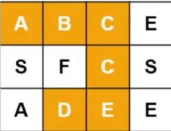

> 回溯算法采用试错的思想，它尝试分步的去解决一个问题。在分步解决问题的过程中，当它通过尝试发现现有的分步答案不能得到有效的正确答案的时候，它将取消上一步甚至是上几步的计算，再通过其他的可能分步解答再次尝试寻找问题的答案。

## 单词搜寻

给定一个二维字符网络 `board` 和一个字符串单词 `word`

如果 `word` 存在于网格中，返回 `true`; 否则，返回 `false`

单词必须按照字母顺序，通过相邻的单元格内的字母构成

````javascript
const board = [["A","B","C","E"],["S","F","C","S"],["A","D","E","E"]]
const work = "ABCCED"
````



````javascript
/**
 * 判断传入单词是否连续出现在给定字母版中
 * @param {Array<Array<string>>} board 
 * @param {string} word 
 * @returns {boolean}
 */
export const wordExisting = (board, word) => {
    const row = board.length
    const column = board[0].length
    for (let i = 0; i < row; i++) {
        for (let j = 0; j < column; j++) {
            // 以字母版上面的每个字母作为起点，搜寻单词
            if (findWord(board, word, i, j, 0)) {
                return true
            }
        }
    }
    return false
}

/**
 * 搜寻字母
 * @param {Array<Array<string>>} board 字母版
 * @param {string} word 搜寻的目标单词
 * @param {number} rowIndex 当前搜寻二维数组行坐标
 * @param {number} columnIndex 当前搜寻二维数组列坐标
 * @param {number} charIndex 当前搜寻祖母在单词中的位置
 * @returns {boolean}
 */
const findWord = (board, word, rowIndex, columnIndex, charIndex) => {
    const row = board.length
    const column = board[0].length
    // 如果搜寻字母所在的坐标越界了，返回false
    if (rowIndex >= row || rowIndex < 0 || columnIndex >= column || columnIndex < 0) {
        return false
    }
    // 如果搜寻字母不与传入板上坐标对应字母相同，返回false
    if (board[rowIndex][columnIndex] !== word[charIndex]) {
        return false
    }

    //如果传入字母与当前位置板上坐标对应字母相同，且已经找到了单词的最后一个字母，则判定为找到对应单词了，返回 true
    if (charIndex == word.length - 1) {
        return true
    }

    // 将当前坐标对应值存入缓存，并抹掉原位置的值，防止无限震荡
    let temp = board[rowIndex][columnIndex]
    board[rowIndex][columnIndex] = null

    // 如果传入字母与当前位置板上坐标对应字母相同，且不是单词的最后一个字母，则向当前位置的上下左右继续搜寻
    const result =
        findWord(board, word, rowIndex - 1, columnIndex, charIndex + 1) ||
        findWord(board, word, rowIndex + 1, columnIndex, charIndex + 1) ||
        findWord(board, word, rowIndex, columnIndex - 1, charIndex + 1) ||
        findWord(board, word, rowIndex, columnIndex + 1, charIndex + 1)

    board[rowIndex][columnIndex] = temp

    return result
}
````