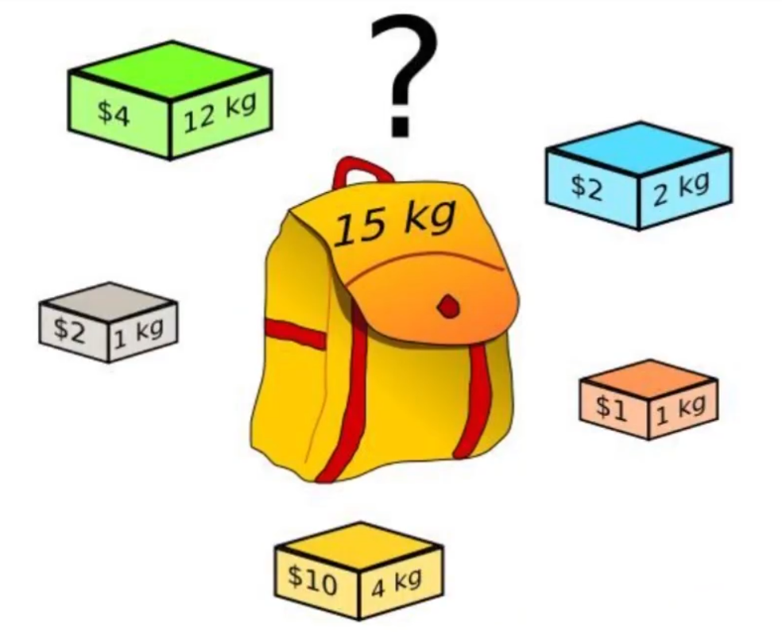
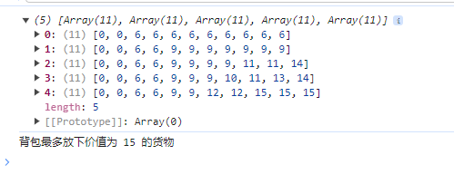
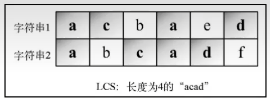
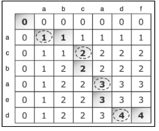

## 背包问题

> 背包问题是一个组合优化问题，它可以描述如下：给定一个固定大小，能够携带重量为 capacity 的背包，以及一组有价值和重量的物品，找出一个最佳解决方案，使得装入背包的物品总重量不超过 capacity，且总价值最大。



| 重量 | 价值 | 物品id | 0    | 1    | 2    | 3    | 4    | 5    | 6    | 7    | 8    | 9    | 10   |
| ---- | ---- | ------ | ---- | ---- | ---- | ---- | ---- | ---- | ---- | ---- | ---- | ---- | ---- |
| 2    | 6    | 0      | 0    | 0    | 6    | 6    | 6    | 6    | 6    | 6    | 6    | 6    | 6    |
| 2    | 3    | 1      | 0    | 0    | 6    | 6    | 9    | 9    | 9    | 9    | 9    | 9    | 9    |
| 6    | 5    | 2      | 0    | 0    | 6    | 6    | 9    | 9    | 9    | 9    | 11   | 11   | 14   |
| 5    | 4    | 3      | 0    | 0    | 6    | 6    | 9    | 9    | 9    | 10   | 11   | 13   | 14   |
| 4    | 6    | 4      | 0    | 0    | 6    | 6    | 9    | 9    | 12   | 12   | 15   | 15   | 15   |

````javascript
/**
 * 【动态规划】背包问题
 * @param {Array<Number>} weights 
 * @param {Array<Number>} values 
 * @param {Number} capacity 
 * @returns 
 */
export const knapSack = (weights, values, capacity) => {
    // 定义一个矩阵用于存放每一种重量下能够放下物品的最大价值
    // 矩阵的 *列* 代表着背包的最大容量
    // 矩阵的 *行* 代表着当前想要放入的物品
    const matrix = [[]]

    // 第一轮遍历：初始化放入第一个物品，在不同背包容量的情况下，背包里物品的价值情况
    for (let j = 0; j <= capacity; j++) {
        // 如果想要放入的物品比当前背包容量要重
        if (weights[0] > j) {
            // 背包啥也放不下去，背包内没有物品，没有价值
            matrix[0][j] = 0
        } else[
            // 如果放入物品比背包容量要轻，直接把这个物品放进去，该背包在当前容量下最大价值就是放入第一个物品的价值
            matrix[0][j] = values[0]
        ]
    }

    // 第二轮遍历：开始放入第二个及以后的物品。
    for (let i = 1; i < weights.length; i++) {
        // 初始化矩阵行，用于存放当前物品想要放入情况下，背包的价值情况
        if (!matrix[i]) {
            matrix[i] = []
        }
        // 开始遍历背包在每一个容量下，放下货物的最大价值情况
        for (let j = 0; j <= capacity; j++) {
            // 当想要放的货物的重量比背包的容量还大，放不下，当前能放下货物的最大价值和不放这个货物的最大价值情况相同
            if (j < weights[i]) {
                matrix[i][j] = matrix[i - 1][j]
            } else {
                // 当想要放的货物重量背包能放下，则开始比较
                // 不放这个物品的最大货物价值 与 放下这个物品并且再放剩余容量可以放下物品的最大价值之和
                // 取大者为此时容量背包的最大价值
                matrix[i][j] = Math.max(matrix[i - 1][j], matrix[i - 1][j - weights[i]] + values[i])
            }
        }
    }

    console.log(matrix)
    // 背包可以放下物品的最大价值为举证的最右下角那个值
    return matrix[weights.length - 1][capacity]
}
````

测试代码：

````javascript
import { knapSack } from './knapSack.js'

const result = knapSack([2, 2, 6, 5, 4], [6, 3, 5, 4, 6], 10)

console.log(`背包最多放下价值为 ${result} 的货物`)
````

测试结果：



## 最大子字符串

> 找出两个字符串序列的最长子序列的长度。最长子序列是指：
>
> 在两个字符串序列中以相同顺序出现，但不要求连续（非字符串子串）的字符串序列





````javascript
/**
 * 【动态规划】最大子字符串
 * @param {String} stringA 
 * @param {String} stringB 
 * @returns {string} result
 */
export const longestSubString = (stringA, stringB) => {
    // 字符串B的每个字母组成二维数组的列
    const matrix = [new Array(stringB.length + 1).fill(0)]
    // 字符串A的每个字母组成二维数组的行
    for (let i = 1; i < stringA.length + 1; i++) {
        matrix[i] = [0]
        for (let j = 1; j < stringB.length + 1; j++) {
            if (stringA[i - 1] === stringB[j - 1]) {
                // 如果当前位置在两个字符串上的字母相同，则发现相同子串的项，当前最大子串长度 + 1
                // 当前最大子串长度的数值在当前位置的 *左上角* 上
                matrix[i][j] = matrix[i - 1][j - 1] + 1
            } else {
                // 如果当前位置在两个字符串上字母不相同，则没有发现相同子串的项
                // 当前情况下最大子串长度要么在当前位置的 *上方* 或者 *左方*
                matrix[i][j] = Math.max(matrix[i - 1][j], matrix[i][j - 1])
            }
        }
    }
    console.log(matrix)
    console.log(matrix[stringA.length][stringB.length])
    return getLongestSubString(matrix, stringA, stringB, stringA.length, stringB.length)
}

/**
 * 获取最大子字符串
 * @param {Array<Array<Number>>} matrix 
 * @param {string} stringA 
 * @param {string} stringB 
 * @returns {string} result
 */
const getLongestSubString = (matrix, stringA, stringB, i, j) => {
    if (i === 0 || j === 0) {
        return ''
    }
    // 如果发现当前矩阵位置在字符串中字符相同，则将该字符拼在结果结尾
    if (stringA[i - 1] === stringB[j - 1]) {
        return getLongestSubString(matrix, stringA, stringB, i - 1, j - 1) + stringA[i - 1]
    } else {
        // 如果当前位置在字符串中位置不同，去判断矩阵中记录的最大子串长度在哪边，那边长，最大子串的下一位就在哪里，往大的方向递归拼接，直至已经找到字符串的头了
        if (matrix[i][j - 1] > matrix[i - 1][j]) {
            return getLongestSubString(matrix, stringA, stringB, i, j - 1)
        } else {
            return getLongestSubString(matrix, stringA, stringB, i - 1, j)
        }
    }
}
````