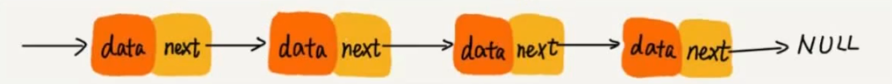
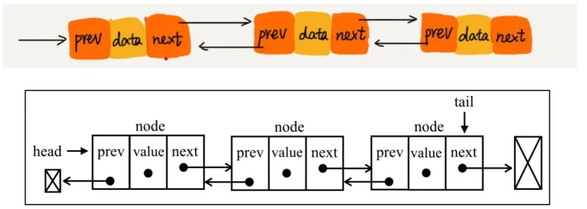
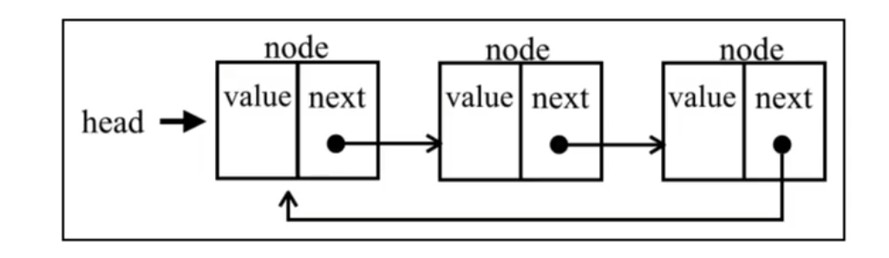

> 链表是一种物理存储单元上非连续、非顺序的存储结构，数据元素的逻辑顺序是通过链表中的指针链接次序实现的，链表中一系列节点（链表中每一个元素称为节点）组成，节点可以在运行时动态生成，每个节点包括两个部分：一个是存储数据元素的数据域，另一个是存储下一个节点地址的指针域。
>
> 使用链表结构可以克服数组链表需要预先知道数据大小的缺点，链表结构可以充分利用计算机内存空间，实现灵活的内存动态管理。但是李安表示去了数组随机读取的优点，同时链表由于增加了节点的指针域，空间开销比较大。

**链表的特点**

- 插入、删除数据效率 O(1) 级别（只需要更改指针指向即可），随机访问效率低 O(n) 级别（需要从表头至链尾进行遍历）。
- 和数组相比，内存空间消耗更大，因为每个存储数据的节点都需要额外的空间存储后继指针。

## 单链表

> 每个节点只包含一个指针，即后继指针



````javascript
class Node {
    constructor(data) {
        this.element = data
        this.next = null
    }
}

module.exports = class LinkedList {
    /**
     * 头结点
     */
    #head = null
    /**
     * 链表长度
     */
    #count = 0

    /**
     * 向链表尾部添加元素
     * @param {any} data 
     * @returns {Node} node
     */
    push(data) {
        debugger
        // 1.创建node节点并放入数据
        const node = new Node(data)
        // 2.如果当前头节点为空，将该节点作为头结点。
        if (this.#head === null) {
            this.#head = node
            this.#count++
            return
        }
        // 3.寻找到当前队列最后一个节点
        const lastNode = this.getNodeByIndex(this.#count - 1)
        // 4.将该节点拼接至当前最后一个节点的后面
        lastNode.next = node
        // 5.链表长度 +1
        this.#count++
        return node
    }

    /**
     * 根据索引删除指定节点
     * @param {*} index 
     * @returns {Node} removed node
     */
    removeNodeByIndex(index) {
        // 1.如果输入索引对应元素不存在，直接返回
        if (index < 0 || index > this.#count) return;
        // 2.如果删除的是头结点，将原头结点的下一个节点作为头结点
        if (index === 0) {
            const currentNode = this.#head
            this.#head = this.#head.next
            this.#count --
            return currentNode
        }
        // 3.如果索引对应元素存在，先找到预删除节点的前一个节点
        const preNode = this.getNodeByIndex(index - 1)
        const currentNode = preNode.next
        // 4.获取预删除节点的后一个节点
        const nextNode = preNode.next.next
        // 5.将预删除节点的前一个节点的 next 指向预删除节点的后一个节点
        preNode.next = nextNode
        // 6.链表长度 -1 
        this.#count--
        return currentNode
    }

    /**
     * 根据输入数据删除对应链表上第一次出现该数据的节点
     * @param {any} data 
     * @returns removed node
     */
    removeNodeByData(data) {
        return this.removeNodeByIndex(this.indexOf(data))
    }

    /**
     * 指定位置插入节点
     * @param {any} data 
     * @param {number} index 
     * @returns true | false
     */
    insert(data, index) {
        // 1.如果插入范围越界，直接返回 false
        if (index > this.#count || index < 0) return false;
        // 2.初始化待插入节点
        const node = new Node(data)
        // 3.如果插入链表头，建原表头连接至节点后面，再将新节点设置成链表头
        if (index === 0) {
            node.next = this.#head
            this.#head = node
            this.#count++
            return true
        }

        // 4.如果插入链表中间，先找到插入位置的前一个元素，将前一个节点的 next 指向插入节点，将插入节点的 next 指向原位置元素
        const preNode = this.getNodeByIndex(index - 1)
        node.next = preNode.next
        preNode.next = node
        this.#count++
        return true
    }

    /**
     * 查找出链表中第一个出现输入数据的链表节点的索引
     * @param {any} data 
     * @returns number
     */
    indexOf(data) {
        for (let i = 0; i < this.#count; i++) {
            if (this.#equalWith(data, this.getNodeByIndex(i).element)) {
                return i
            }
        }
        return -1
    }

    /**
     * 根据索引查找指定节点
     * @param {string | number} index 
     * @returns {Node} node
     */
    getNodeByIndex(index) {
        // 如果输入索引对应元素不存在，直接返回
        if (index < 0 || index >= this.#count) return;
        let result = this.#head
        for (let i = 0; i < index; i++) {
            result = result.next
        }
        return result
    }

    /**
     * 获取链表长度
     * @returns 链表长度
     */
    size() {
        return this.#count
    }

    /**
     * 是否为空链表
     * @returns true | false
     */
    isEmpty(){
        return this.#count === 0
    }

    /**
     * 工具方法，比较输入是否相同
     * @param {any} a 
     * @param {any} b 
     * @returns true | false
     */
    #equalWith(a, b) {
        return JSON.stringify(a) === JSON.stringify(b)
    }
    /**
     * 打印链表
     */
    printList() {
        for (let i = 0; i < this.#count; i++) {
            console.log(this.getNodeByIndex(i));
        }
    }

}
````

## 双向链表

> 节点除了存储数据外，还有两个指针分别指向前一个节点地址（前驱指针 prev）和下一个节点地址（后续指针 next）。



````javascript
class DoblyNode {
    constructor(data) {
        this.element = data;
        this.previous = null;
        this.next = null;
    }
}

export default class DoublyList {
    /**
     * 头节点
     */
    #head = null;
    /**
     * 尾节点
     */
    #tail = null;
    /**
     * 链表长度
     */
    #count = 0;

    /**
     * 向链表尾部添加元素
     * @param {any} data 
     * @returns true | false
     */
    push(data) {
        const node = new DoblyNode(data);
        if (this.#head === null) {
            this.#head = node;
            this.#tail = node;
        } else {
            this.#tail.next = node;
            node.previous = this.#tail;
            this.#tail = node;
        }

        this.#count++;
        return true
    }

    /**
     * 指定位置插入节点
     * @param {any} data 
     * @param {number} index 
     * @returns true | false
     */
    insert(data, index) {
        if (index >= 0 && index <= this.#count) {
            const node = new DoblyNode(data)
            // 如果插入位置在链表头
            if (index === 0) {
                // 如果当前链表是空链表
                if (this.#head === null) {
                    this.#head = node;
                    this.#tail = node;

                } else { // 如果当前链表非空
                    this.#head.previous = node
                    node.next = this.#head
                    this.#head = node
                }
                this.#count++
                return true

            }
            // 如果插入位置在链表尾
            if (index === this.#count) {
                this.#tail.next = node;
                node.previous = this.#tail;
                this.#tail = node

                this.#count++
                return true
            }

            // 如果插入位置在链表中间
            const currentNode = this.getNodeByIndex(index)
            node.previous = currentNode.previous;
            currentNode.previous.next = node;
            currentNode.previous = node;
            node.next = currentNode;
            this.#count++
            return true

        }
        // 未找到节点，报错
        console.error(`该链表没有对应索引为${index}的节点`)
        return false
    }

    /**
     * 根据索引删除指定节点
     * @param {*} index 
     * @returns {Node} removed node
     */
    removeNodeByIndex(index) {
        if (index >= 0 && index < this.#count) {
            let res = null
            // 如果删除的是链表头
            if (index === 0) {
                // 如果链表只有一个节点
                if (this.#count === 1) {
                    this.#head = null;
                    this.#tail = null;
                } else { // 如果链表不止一个节点
                    res = this.#head
                    this.#head = this.#head.next
                    this.#head.previous = null;
                }
            } else if (index === this.#count - 1) { // 如果删除的是队尾
                res = this.#tail
                this.#tail = this.#tail.previous;
                this.#tail.next = null;
            } else { // 如果删除的是链表的中间位置
                const currentNode = this.getNodeByIndex(index)
                res = currentNode
                currentNode.previous.next = currentNode.next
                currentNode.next.previous = currentNode.previous
            }
            this.#count--;
            return res;
        }
        // 未找到节点，报错
        console.error(`该链表没有对应索引为${index}的节点`);
        return null;
    }

    /**
     * 根据索引查找指定节点
     * @param {string | number} index 
     * @returns {Node} node
     */
    getNodeByIndex(index) {
        if (index >= 0 && index < this.#count) {
            let currentNode = this.#head;
            for (let i = 0; i < index; i++) {
                currentNode = currentNode.next
            }
            return currentNode
        }
        // 未找到节点，报错
        console.error(`该链表没有对应索引为${index}的节点`)
    }

    /**
     * 获取链表头节点
     * @returns List head
     */
    getHead() {
        return this.#headn
    }

    /**
     * 获取链表尾节点
     * @returns List tail
     */
    getTail() {
        return this.#tail
    }
}
````

## 循环链表

> 循环链表和链表之间唯一的区别在于：最后一个元素指向下一个元素的指针（tail.next）不是 null，而是指向第一个元素（head）



````javascript
class Node {
    constructor(data) {
        this.element = data;
        this.next = null;
    }
}
export default class CircularLinkedList {
    /**
     * 头结点
     */
    #head = null;
    /**
     * 链表长度
     */
    #count = 0;

    /**
     * 向链表尾部添加元素
     * @param {any} data 
     * @returns {Node} node
     */
    push(data) {
        const node = new Node(data)

        if (this.#head === null) {
            this.#head = node;
            node.next = this.#head
        } else {
            const currentNode = this.getNodeByIndex(this.#count - 1)
            currentNode.next = node;
            node.next = this.#head
        }

        this.#count++
        return node
    }

    /**
     * 指定位置插入节点
     * @param {any} data 
     * @param {number} index 
     * @returns true | false
     */
    insert(data, index) {
        if (index >= 0 && index <= this.#count) {
            const node = new Node(data)
            if (index === 0) { // 如果插入的位置在链表头
                if (this.#head === null) {
                    this.#head = node;
                    node.next = this.#head;
                } else {
                    node.next = this.#head;
                    const lastNode = this.getNodeByIndex(this.#count - 1);
                    lastNode.next = node;
                    this.#head = node;
                }
            } else {
                const previoustNode = this.getNodeByIndex(index - 1);
                node.next = previoustNode.next;
                previoustNode.next = node;
            }
            this.#count++;
            return true;
        }

        // 未找到节点，报错
        console.error(`该链表没有对应索引为${index}的节点`)
        return false;
    }

    /**
     * 根据索引删除指定节点
     * @param {*} index 
     * @returns {Node} removed node
     */
    removeNodeByIndex(index) {
        let result = null
        if (index >= 0 && index < this.#count) {
            if (index === 0) {
                result = this.#head
                if (this.#count === 1) {

                    this.#head = null
                } else {
                    const tail = this.getNodeByIndex(this.#count - 1)
                    tail.next = this.#head.next
                    this.#head = this.#head.next
                }
            } else {
                const previoustNode = this.getNodeByIndex(index - 1)
                result = previoustNode.next
                previoustNode.next = previoustNode.next.next
            }
            this.#count--
        }

        return result
    }

    /**
     * 根据索引查找指定节点
     * @param {string | number} index 
     * @returns {Node} node
     */
    getNodeByIndex(index) {
        if (index < 0 && index >= this.#count) {
            console.error(`该链表没有对应索引为${index}的节点`);
            return
        };
        let result = this.#head;
        for (let i = 0; i < index; i++) {
            result = result.next;
        }
        return result
    }

    /**
     * 获取链表长度
     * @returns 链表长度
     */
     size() {
        return this.#count
    }

    
    /**
     * 是否为空链表
     * @returns true | false
     */
     isEmpty(){
        return this.#count === 0
    }

    /**
     * 打印链表
     */
     printList() {
        for (let i = 0; i < this.#count; i++) {
            console.log(this.getNodeByIndex(i));
        }
    }
}
````