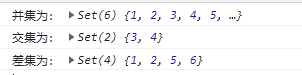

> 集合是由一组无序且唯一（即不能重复）的项组成的。

## 集合的封装

````javascript
export default class MySet {
    

    #items = {}

    /**
     * add data to set
     * @param {*} data 
     * @returns true | false
     */
    add(data) {
        if (!this.has(data)) {
            this.#items[data] = data
            return true
        }
        return false
    }

    delete(data) {
        if(this.has(data)){
            delete this.#items[data]
            return true
        }
        return false
    }

    has(data) {
        return data in this.#items
    }

    clear() {
        this.#items = {}
    }

    size() {
        return Object.keys(this.#items)
    }

    values() {
        return Object.values(this.#items)
    }
}
````

## ES6中的集合

文档参考：https://developer.mozilla.org/zh-CN/docs/Web/JavaScript/Reference/Global_Objects/Set

集合的应用：

- 求并集、交集、差集

````javascript
const setA = new Set([1, 2, 3, 4])
const setB = new Set([3, 4, 5, 6])

// 求并集
function union(setA, setB) {
    return new Set([...setA, ...setB])
}

// 求交集
function intersection(setA, setB) {
    const resultSet = new Set()
    for (let element of setA) {
        if (setB.has(element)) {
            resultSet.add(element)
        }
    }
    return resultSet
}

// 求差集
function difference(setA, setB) {
    const resultSet = new Set(setA)
    for (let element of setB) {
        if (!setA.has(element)) {
            resultSet.add(element)
        } else {
            resultSet.delete(element)
        }
    }
    return resultSet
}

console.log('并集为：', union(setA, setB))
console.log('交集为：', intersection(setA, setB))
console.log('差集为：', difference(setA, setB))
</script>
````

