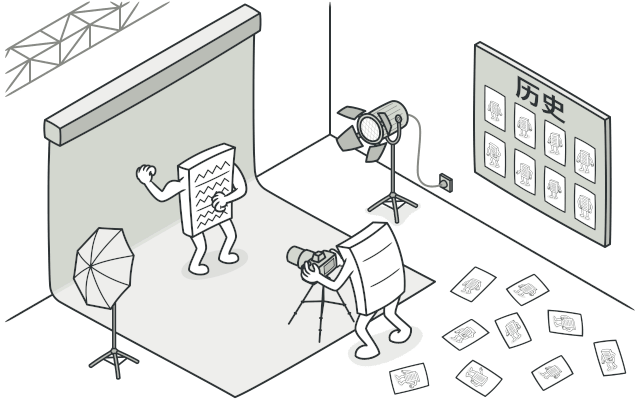
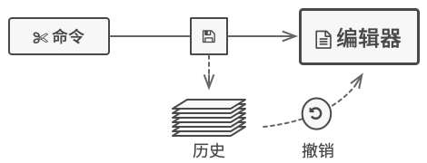

## 意图

**备忘录模式**是一种行为设计模式， 允许在不暴露对象实现细节的情况下保存和恢复对象之前的状态。



## 问题

假如你正在开发一款文字编辑器应用程序。 除了简单的文字编辑功能外， 编辑器中还要有设置文本格式和插入内嵌图片等功能。

后来， 你决定让用户能撤销施加在文本上的任何操作。 这项功能在过去几年里变得十分普遍， 因此用户期待任何程序都有这项功能。 你选择采用直接的方式来实现该功能： 程序在执行任何操作前会记录所有的对象状态， 并将其保存下来。 当用户此后需要撤销某个操作时， 程序将从历史记录中获取最近的快照， 然后使用它来恢复所有对象的状态。



让我们来思考一下这些状态快照。 首先， 到底该如何生成一个快照呢？ 很可能你会需要遍历对象的所有成员变量并将其数值复制保存。 但只有当对象对其内容没有严格访问权限限制的情况下， 你才能使用该方式。 不过很遗憾， 绝大部分对象会使用私有成员变量来存储重要数据， 这样别人就无法轻易查看其中的内容。

现在我们暂时忽略这个问题， 假设对象都像嬉皮士一样： 喜欢开放式的关系并会公开其所有状态。 尽管这种方式能够解决当前问题， 让你可随时生成对象的状态快照， 但这种方式仍存在一些严重问题。 未来你可能会添加或删除一些成员变量。 这听上去很简单， 但需要对负责复制受影响对象状态的类进行更改。


还有更多问题。 让我们来考虑编辑器 （Editor） 状态的实际 “快照”， 它需要包含哪些数据？ 至少必须包含实际的文本、 光标坐标和当前滚动条位置等。 你需要收集这些数据并将其放入特定容器中， 才能生成快照。

你很可能会将大量的容器对象存储在历史记录列表中。 这样一来， 容器最终大概率会成为同一个类的对象。 这个类中几乎没有任何方法， 但有许多与编辑器状态一一对应的成员变量。 为了让其他对象能保存或读取快照， 你很可能需要将快照的成员变量设为公有。 无论这些状态是否私有， 其都将暴露一切编辑器状态。 其他类会对快照类的每个小改动产生依赖， 除非这些改动仅存在于私有成员变量或方法中， 而不会影响外部类。

我们似乎走进了一条死胡同： 要么会暴露类的所有内部细节而使其过于脆弱； 要么会限制对其状态的访问权限而无法生成快照。 那么， 我们还有其他方式来实现 “撤销” 功能吗？

## 解决方案

我们刚才遇到的所有问题都是封装 “破损” 造成的。 一些对象试图超出其职责范围的工作。 由于在执行某些行为时需要获取数据， 所以它们侵入了其他对象的私有空间， 而不是让这些对象来完成实际的工作。

备忘录模式将创建状态快照 （Snapshot） 的工作委派给实际状态的拥有者原发器 （Originator） 对象。 这样其他对象就不再需要从 “外部” 复制编辑器状态了， 编辑器类拥有其状态的完全访问权， 因此可以自行生成快照。

模式建议将对象状态的副本存储在一个名为备忘录 （Memento） 的特殊对象中。 除了创建备忘录的对象外， 任何对象都不能访问备忘录的内容。 其他对象必须使用受限接口与备忘录进行交互， 它们可以获取快照的元数据 （创建时间和操作名称等）， 但不能获取快照中原始对象的状态。


这种限制策略允许你将备忘录保存在通常被称为 _负责人_ （Caretakers） 的对象中。 由于负责人仅通过受限接口与备忘录互动， 故其无法修改存储在备忘录内部的状态。 同时， 原发器拥有对备忘录所有成员的访问权限， 从而能随时恢复其以前的状态。

在文字编辑器的示例中， 我们可以创建一个独立的历史 （History） 类作为负责人。 编辑器每次执行操作前， 存储在负责人中的备忘录栈都会生长。 你甚至可以在应用的 UI 中渲染该栈， 为用户显示之前的操作历史。

当用户触发撤销操作时， 历史类将从栈中取回最近的备忘录， 并将其传递给编辑器以请求进行回滚。 由于编辑器拥有对备忘录的完全访问权限， 因此它可以使用从备忘录中获取的数值来替换自身的状态。

## 备忘录模式结构

**基于嵌套类的实现**

该模式的经典实现方式依赖于许多流行编程语言 （例如 C++、 C# 和 Java） 所支持的嵌套类。


1. **原发器** （Originator） 类可以生成自身状态的快照， 也可以在需要时通过快照恢复自身状态。
2. **备忘录** （Memento） 是原发器状态快照的值对象 （value object）。 通常做法是将备忘录设为不可变的， 并通过构造函数一次性传递数据。
3. **负责人** （Caretaker） 仅知道 “何时” 和 “为何” 捕捉原发器的状态， 以及何时恢复状态。
负责人通过保存备忘录栈来记录原发器的历史状态。 当原发器需要回溯历史状态时， 负责人将从栈中获取最顶部的备忘录， 并将其传递给原发器的恢复 （restoration） 方法。
4. 在该实现方法中， 备忘录类将被嵌套在原发器中。 这样原发器就可访问备忘录的成员变量和方法， 即使这些方法被声明为私有。 另一方面， 负责人对于备忘录的成员变量和方法的访问权限非常有限： 它们只能在栈中保存备忘录， 而不能修改其状态。

 ----

 **基于中间接口的实现**

 另外一种实现方法适用于不支持嵌套类的编程语言 （没错， 我说的就是 PHP）。

 

 1. 在没有嵌套类的情况下， 你可以规定负责人仅可通过明确声明的中间接口与备忘录互动， 该接口仅声明与备忘录元数据相关的方法， 限制其对备忘录成员变量的直接访问权限。
 2. 另一方面， 原发器可以直接与备忘录对象进行交互， 访问备忘录类中声明的成员变量和方法。 这种方式的缺点在于你需要将备忘录的所有成员变量声明为公有。

 ---

 **封装更加严格的实现**

 如果你不想让其他类有任何机会通过备忘录来访问原发器的状态， 那么还有另一种可用的实现方式。

  

## 伪代码

本例结合使用了**命令**模式与备忘录模式， 可保存复杂文字编辑器的状态快照， 并能在需要时从快照中恢复之前的状态。

  

命令 （command） 对象将作为负责人， 它们会在执行与命令相关的操作前获取编辑器的备忘录。 当用户试图撤销最近的命令时， 编辑器可以使用保存在命令中的备忘录来将自身回滚到之前的状态。

备忘录类没有声明任何公有的成员变量、 获取器 （getter） 和设置器， 因此没有对象可以修改其内容。 备忘录与创建自己的编辑器相连接， 这使得备忘录能够通过编辑器对象的设置器传递数据， 恢复与其相连接的编辑器的状态。 由于备忘录与特定的编辑器对象相连接， 程序可以使用中心化的撤销栈实现对多个独立编辑器窗口的支持。

```py
# 原发器中包含了一些可能会随时间变化的重要数据。它还定义了在备忘录中保存
# 自身状态的方法，以及从备忘录中恢复状态的方法。
class Editor is
    private field text, curX, curY, selectionWidth

    method setText(text) is
        this.text = text

    method setCursor(x, y) is
        this.curX = x
        this.curY = y

    method setSelectionWidth(width) is
        this.selectionWidth = width

    # 在备忘录中保存当前的状态。
    method createSnapshot():Snapshot is
        # 备忘录是不可变的对象；因此原发器会将自身状态作为参数传递给备忘
        # 录的构造函数。
        return new Snapshot(this, text, curX, curY, selectionWidth)

# 备忘录类保存有编辑器的过往状态。
class Snapshot is
    private field editor: Editor
    private field text, curX, curY, selectionWidth

    constructor Snapshot(editor, text, curX, curY, selectionWidth) is
        this.editor = editor
        this.text = text
        this.curX = x
        this.curY = y
        this.selectionWidth = selectionWidth

    # 在某一时刻，编辑器之前的状态可以使用备忘录对象来恢复。
    method restore() is
        editor.setText(text)
        editor.setCursor(curX, curY)
        editor.setSelectionWidth(selectionWidth)

# 命令对象可作为负责人。在这种情况下，命令会在修改原发器状态之前获取一个
# 备忘录。当需要撤销时，它会从备忘录中恢复原发器的状态。
class Command is
    private field backup: Snapshot

    method makeBackup() is
        backup = editor.createSnapshot()

    method undo() is
        if (backup != null)
            backup.restore()
    # ……
```

## 备忘录模式优缺点
√ 你可以在不破坏对象封装情况的前提下创建对象状态快照。
√ 你可以通过让负责人维护原发器状态历史记录来简化原发器代码。
× 如果客户端过于频繁地创建备忘录， 程序将消耗大量内存。
× 负责人必须完整跟踪原发器的生命周期， 这样才能销毁弃用的备忘录。
× 绝大部分动态编程语言 （例如 PHP、 Python 和 JavaScript） 不能确保备忘录中的状态不被修改。

## 与其他模式的关系
- 你可以同时使用[**命令模式**](./command.md)和**备忘录模式**来实现 “撤销”。 在这种情况下， 命令用于对目标对象执行各种不同的操作， 备忘录用来保存一条命令执行前该对象的状态。

- 你可以同时使用**备忘录**和[**迭代器模式**](./iterator.md)来获取当前迭代器的状态， 并且在需要的时候进行回滚。

- 有时候[**原型模式**](../creational/prototype.md)可以作为**备忘录**的一个简化版本， 其条件是你需要在历史记录中存储的对象的状态比较简单， 不需要链接其他外部资源， 或者链接可以方便地重建。