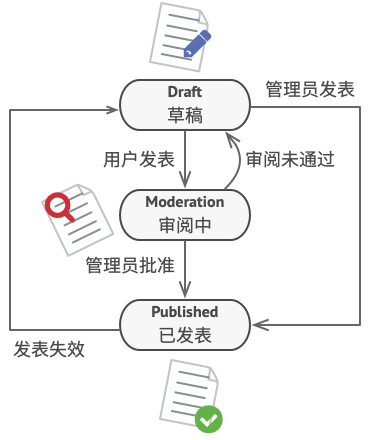
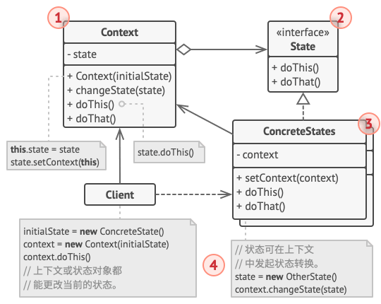

## 意图

**状态模式**是一种行为设计模式， 让你能在一个对象的内部状态变化时改变其行为， 使其看上去就像改变了自身所属的类一样。


## 问题

状态模式与**有限状态机**的概念紧密相关。


其主要思想是程序在任意时刻仅可处于几种有限的状态中。 在任何一个特定状态中， 程序的行为都不相同， 且可瞬间从一个状态切换到另一个状态。 不过， 根据当前状态， 程序可能会切换到另外一种状态， 也可能会保持当前状态不变。 这些数量有限且预先定义的状态切换规则被称为转移。

你还可将该方法应用在对象上。假如你有一个 `文档Document`类。文档可能会处于 `草稿Draft` 、 `审阅中Moderation`和 `已发布Published`三种状态中的一种。 文档的 `publish发布`方法在不同状态下的行为略有不同：

- 处于`草稿`状态时， 它会将文档转移到审阅中状态。
- 处于`审阅`中状态时， 如果当前用户是管理员， 它会公开发布文档。
- 处于`已发布`状态时， 它不会进行任何操作。



状态机通常由众多条件运算符 （`if` 或 `switch` ） 实现， 可根据对象的当前状态选择相应的行为。 ​ “状态” 通常只是对象中的一组成员变量值。 即使你之前从未听说过有限状态机， 你也很可能已经实现过状态模式。 下面的代码应该能帮助你回忆起来。

```py
class Document is
    field state: string
    # ……
    method publish() is
        switch (state)
            "draft":
                state = "moderation"
                break
            "moderation":
                if (currentUser.role == "admin")
                    state = "published"
                break
            "published":
                # 什么也不做。
                break
    # ……
```

当我们逐步在`文档`类中添加更多状态和依赖于状态的行为后， 基于条件语句的状态机就会暴露其最大的弱点。 为了能根据当前状态选择完成相应行为的方法， 绝大部分方法中会包含复杂的条件语句。 修改其转换逻辑可能会涉及到修改所有方法中的状态条件语句， 导致代码的维护工作非常艰难。

这个问题会随着项目进行变得越发严重。 我们很难在设计阶段预测到所有可能的状态和转换。 随着时间推移， 最初仅包含有限条件语句的简洁状态机可能会变成臃肿的一团乱麻。

## 解决方案

状态模式建议为对象的所有可能状态新建一个类， 然后将所有状态的对应行为抽取到这些类中。

原始对象被称为上下文 （context）， 它并不会自行实现所有行为， 而是会保存一个指向表示当前状态的状态对象的引用， 且将所有与状态相关的工作委派给该对象。


如需将上下文转换为另外一种状态， 则需将当前活动的状态对象替换为另外一个代表新状态的对象。 采用这种方式是有前提的： 所有状态类都必须遵循同样的接口， 而且上下文必须仅通过接口与这些对象进行交互。

这个结构可能看上去与策略模式相似， 但有一个关键性的不同——在状态模式中， 特定状态知道其他所有状态的存在， 且能触发从一个状态到另一个状态的转换； 策略则几乎完全不知道其他策略的存在。

## 真实世界类比

智能手机的按键和开关会根据设备当前状态完成不同行为：
- 当手机处于解锁状态时， 按下按键将执行各种功能。
- 当手机处于锁定状态时， 按下任何按键都将解锁屏幕。
- 当手机电量不足时， 按下任何按键都将显示充电页面。

## 状态模式结构


1. 上下文 （Context） 保存了对于一个具体状态对象的引用， 并会将所有与该状态相关的工作委派给它。 上下文通过状态接口与状态对象交互， 且会提供一个设置器用于传递新的状态对象。

2. 状态 （State） 接口会声明特定于状态的方法。 这些方法应能被其他所有具体状态所理解， 因为你不希望某些状态所拥有的方法永远不会被调用。

3. 具体状态 （Concrete States） 会自行实现特定于状态的方法。 为了避免多个状态中包含相似代码， 你可以提供一个封装有部分通用行为的中间抽象类。
状态对象可存储对于上下文对象的反向引用。 状态可以通过该引用从上下文处获取所需信息， 并且能触发状态转移。

4. 上下文和具体状态都可以设置上下文的下个状态， 并可通过替换连接到上下文的状态对象来完成实际的状态转换

## 伪代码

在本例中， **状态**模式将根据当前回放状态， 让媒体播放器中的相同控件完成不同的行为。


播放器的主要对象总是会连接到一个负责播放器绝大部分工作的状态对象中。 部分操作会更换播放器当前的状态对象， 以此改变播放器对于用户互动所作出的反应。

```py
// 音频播放器（Audio­Player）类即为上下文。它还会维护指向状态类实例的引用，
// 该状态类则用于表示音频播放器当前的状态。
class AudioPlayer is
    field state: State
    field UI, volume, playlist, currentSong

    constructor AudioPlayer() is
        this.state = new ReadyState(this)

        // 上下文会将处理用户输入的工作委派给状态对象。由于每个状态都以不
        // 同的方式处理输入，其结果自然将依赖于当前所处的状态。
        UI = new UserInterface()
        UI.lockButton.onClick(this.clickLock)
        UI.playButton.onClick(this.clickPlay)
        UI.nextButton.onClick(this.clickNext)
        UI.prevButton.onClick(this.clickPrevious)

    // 其他对象必须能切换音频播放器当前所处的状态。
    method changeState(state: State) is
        this.state = state

    // UI 方法会将执行工作委派给当前状态。
    method clickLock() is
        state.clickLock()
    method clickPlay() is
        state.clickPlay()
    method clickNext() is
        state.clickNext()
    method clickPrevious() is
        state.clickPrevious()

    // 状态可调用上下文的一些服务方法。
    method startPlayback() is
        // ……
    method stopPlayback() is
        // ……
    method nextSong() is
        // ……
    method previousSong() is
        // ……
    method fastForward(time) is
        // ……
    method rewind(time) is
        // ……


// 所有具体状态类都必须实现状态基类声明的方法，并提供反向引用指向与状态相
// 关的上下文对象。状态可使用反向引用将上下文转换为另一个状态。
abstract class State is
    protected field player: AudioPlayer

    // 上下文将自身传递给状态构造函数。这可帮助状态在需要时获取一些有用的
    // 上下文数据。
    constructor State(player) is
        this.player = player

    abstract method clickLock()
    abstract method clickPlay()
    abstract method clickNext()
    abstract method clickPrevious()


// 具体状态会实现与上下文状态相关的多种行为。
class LockedState extends State is

    // 当你解锁一个锁定的播放器时，它可能处于两种状态之一。
    method clickLock() is
        if (player.playing)
            player.changeState(new PlayingState(player))
        else
            player.changeState(new ReadyState(player))

    method clickPlay() is
        // 已锁定，什么也不做。

    method clickNext() is
        // 已锁定，什么也不做。

    method clickPrevious() is
        // 已锁定，什么也不做。


// 它们还可在上下文中触发状态转换。
class ReadyState extends State is
    method clickLock() is
        player.changeState(new LockedState(player))

    method clickPlay() is
        player.startPlayback()
        player.changeState(new PlayingState(player))

    method clickNext() is
        player.nextSong()

    method clickPrevious() is
        player.previousSong()


class PlayingState extends State is
    method clickLock() is
        player.changeState(new LockedState(player))

    method clickPlay() is
        player.stopPlayback()
        player.changeState(new ReadyState(player))

    method clickNext() is
        if (event.doubleclick)
            player.nextSong()
        else
            player.fastForward(5)

    method clickPrevious() is
        if (event.doubleclick)
            player.previous()
        else
            player.rewind(5)
```

## 状态模式优缺点

√ 单一职责原则。 将与特定状态相关的代码放在单独的类中。
√ 开闭原则。 无需修改已有状态类和上下文就能引入新状态。
√ 通过消除臃肿的状态机条件语句简化上下文代码。
× 如果状态机只有很少的几个状态， 或者很少发生改变， 那么应用该模式可能会显得

## 与其他模式的关系
- [**桥接模式**](../structural/bridge.md)、 **状态模式**和[**策略模式**](./strategy.md) （在某种程度上包括[**适配器模式**](../structural/adapter.md)） 模式的接口非常相似。 实际上， 它们都基于[**组合模式**](../structural/composite.md)——即将工作委派给其他对象， 不过也各自解决了不同的问题。 模式并不只是以特定方式组织代码的配方， 你还可以使用它们来和其他开发者讨论模式所解决的问题。

- **状态**可被视为[**策略**](./strategy.md)的扩展。 两者都基于组合机制： 它们都通过将部分工作委派给 “帮手” 对象来改变其在不同情景下的行为。 *策略* 使得这些对象相互之间完全独立， 它们不知道其他对象的存在。 但 *状态* 模式没有限制具体状态之间的依赖， 且允许它们自行改变在不同情景下的状态。