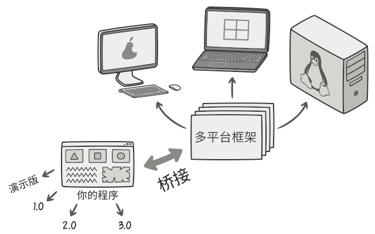
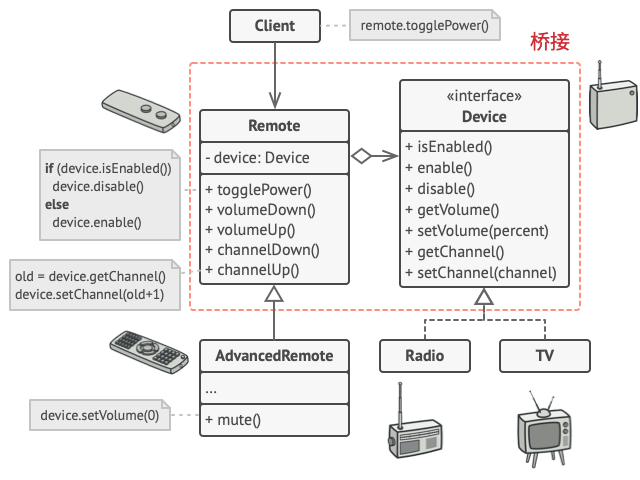

## 意图

桥接模式是一种结构型设计模式， 可将一个大类或一系列紧密相关的类拆分为抽象和实现两个独立的层次结构， 从而能在开发时分别使用。

## 问题
抽象？ 实现？ 听上去挺吓人？ 让我们慢慢来， 先考虑一个简单的例子。

假如你有一个几何`形状Shape`类， 从它能扩展出两个子类：`圆形Circle`和`方形Square`。你希望对这样的类层次结构进行扩展以使其包含颜色， 所以你打算创建名为`红色Red`和`蓝色Blue`的形状子类。 但是， 由于你已有两个子类， 所以总共需要创建四个类才能覆盖所有组合， 例如`蓝色圆形Blue­Circle`和`红色方形Red­Square`。

在层次结构中新增形状和颜色将导致代码复杂程度指数增长。 例如添加三角形状， 你需要新增两个子类， 也就是每种颜色一个； 此后新增一种新颜色需要新增三个子类， 即每种形状一个。 如此以往， 情况会越来越糟糕。

## 解决方案

问题的根本原因是我们试图在两个独立的维度——形状与颜色——上扩展形状类。 这在处理类继承时是很常见的问题。

桥接模式通过将继承改为组合的方式来解决这个问题。 具体来说， 就是抽取其中一个维度并使之成为独立的类层次， 这样就可以在初始类中引用这个新层次的对象， 从而使得一个类不必拥有所有的状态和行为。

根据该方法， 我们可以将颜色相关的代码抽取到拥有`红色`和`蓝色`两个子类的颜色类中， 然后在`形状`类中添加一个指向某一颜色对象的引用成员变量。 现在， 形状类可以将所有与颜色相关的工作委派给连入的颜色对象。 这样的引用就成为了`形状`和`颜色`之间的桥梁。 此后，新增颜色将不再需要修改形状的类层次，反之亦然。

**抽象部分和实现部分**

设计模式四人组的[著作](https://refactoringguru.cn/gof-book)  在桥接定义中提出了 *抽象部分* 和 *实现部分* 两个术语。 我觉得这些术语过于学术了， 反而让模式看上去比实际情况更加复杂。 在介绍过形状和颜色的简单例子后， 我们来看看四人组著作中让人望而生畏的词语的含义。

*抽象部分* （也被称为接口） 是一些实体的高阶控制层。 该层自身不完成任何具体的工作， 它需要将工作委派给 *实现部分层* （也被称为 *平台* ）。

注意， 这里提到的内容与编程语言中的 *接口* 或 *抽象类* 无关。 它们并不是一回事。

在实际的程序中， 抽象部分是图形用户界面 （GUI）， 而实现部分则是底层操作系统代码 （API）， GUI 层调用 API 层来对用户的各种操作做出响应。

一般来说， 你可以在两个独立方向上扩展这种应用：

- 开发多个不同的 GUI （例如面向普通用户和管理员进行分别配置）
- 支持多个不同的 API （例如， 能够在 Windows、 Linux 和 macOS 上运行该程序）。

在最糟糕的情况下， 程序可能会是一团乱麻， 其中包含数百种条件语句， 连接着代码各处不同种类的 GUI 和各种 API。

你可以将特定接口-平台的组合代码抽取到独立的类中， 以在混乱中建立一些秩序。 但是， 你很快会发现这种类的数量很多。 类层次将以指数形式增长， 因为每次添加一个新的 GUI 或支持一种新的 API 都需要创建更多的类。

让我们试着用桥接模式来解决这个问题。 该模式建议将类拆分为两个类层次结构：

- 抽象部分： 程序的 GUI 层。
- 实现部分： 操作系统的 API。

抽象对象控制程序的外观， 并将真实工作委派给连入的实现对象。 不同的实现只要遵循相同的接口就可以互换， 使同一 GUI 可在 Windows 和 Linux 下运行。

最后的结果是： 你无需改动与 API 相关的类就可以修改 GUI 类。 此外如果想支持一个新的操作系统， 只需在实现部分层次中创建一个子类即可。

## 伪代码

示例演示了**桥接**模式如何拆分程序中同时管理设备及其遥控器的庞杂代码。`设备Device`类作为实现部分， 而`遥控器Remote`类则作为抽象部分。

遥控器基类声明了一个指向设备对象的引用成员变量。 所有遥控器通过通用设备接口与设备进行交互， 使得同一个遥控器可以支持不同类型的设备。

你可以开发独立于设备类的遥控器类， 只需新建一个遥控器子类即可。 例如， 基础遥控器可能只有两个按钮， 但你可在其基础上扩展新功能， 比如额外的一节电池或一块触摸屏。

客户端代码通过遥控器构造函数将特定种类的遥控器与设备对象连接起来。

## 桥接模式优缺点
√ 你可以创建与平台无关的类和程序。
√ 客户端代码仅与高层抽象部分进行互动， 不会接触到平台的详细信息。
√ 开闭原则。 你可以新增抽象部分和实现部分， 且它们之间不会相互影响。
√ 单一职责原则。 抽象部分专注于处理高层逻辑， 实现部分处理平台细节。
× 对高内聚的类使用该模式可能会让代码更加复杂。

## 与其他模式的关系
- **桥接模式**通常会于开发前期进行设计， 使你能够将程序的各个部分独立开来以便开发。 另一方面， [适配器模式](./adapter.md)通常在已有程序中使用， 让相互不兼容的类能很好地合作。

- **桥接**、[**状态模式**](../behavioral/state.md)和[**策略模式**](../behavioral/strategy.md) （在某种程度上包括[**适配器**](./adapter.md)） 模式的接口非常相似。 实际上， 它们都基于[**组合模式**](./composite.md)——即将工作委派给其他对象， 不过也各自解决了不同的问题。 模式并不只是以特定方式组织代码的配方， 你还可以使用它们来和其他开发者讨论模式所解决的问题。

- 你可以将[**抽象工厂模式**](../creational/abstract.md)和**桥接**搭配使用。 如果由桥接定义的抽象只能与特定实现合作， 这一模式搭配就非常有用。 在这种情况下， 抽象工厂可以对这些关系进行封装， 并且对客户端代码隐藏其复杂性。

- 你可以结合使用[**生成器模式**](../creational/builder.md)和**桥接模式**： 主管类负责抽象工作， 各种不同的生成器负责实现工作。
