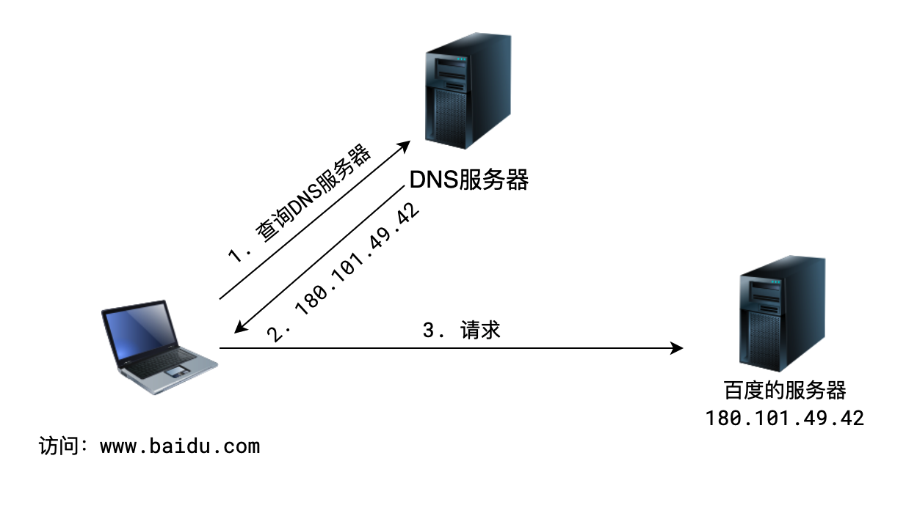
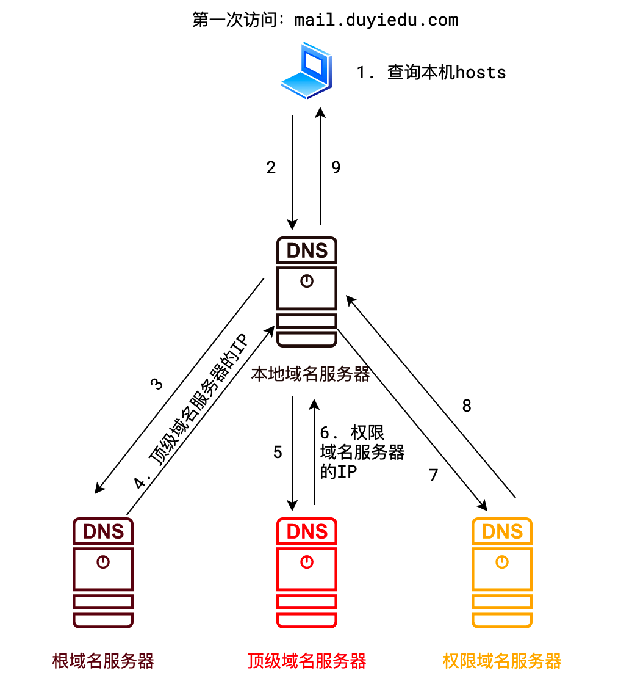

## 域名

域名： `www.baidu.com`

域名的作用是帮助人类记忆网站地址，有了域名，就不用去记ID地址了

域名的类型有以下几种：

- 根域名：`.`
- 顶级域名：`.cn .com .net .us .uk .org`
- 二级域名：`.com .gov .org .edu 自定义 baidu jd taobao ...`
- 三级域名：`自定义 www.baidu.com www.jd.com www.taobao.com`
- 四级域名： `自定义  www.add.edu.cn mail.internal.jd.com`

一般来说，购买二级域名后，三级、四级域名都是可以免费自定义的

## DNS

域名虽然有助于记忆，但是网络传输和域名没有关系。

**网络传输必须依靠IP。**

所以，必须有一个东西，能够将域名转换成 IP 地址，这个东西就是 DNS 服务器，翻译 IP 地址的过程称之为 **域名解析**。

全世界认可的 DNS 服务器一共有三种，外加一种局部使用的本地 DNS 服务器，一共四种。

为了使得解析速度更快，查询的节点更少，上述每个节点都可能设置告诉缓存来加速解析。

## 问答

请简述域名解析过程（百度）

> 参考答案：
>
> 1. 查找本机 hosts 文件中是否有解析记录，如果有，直接使用
> 2. 查找本地域名服务器（一般是路由器）中是否有解析记录，如果有，直接使用
> 3. 查询根域名服务器，得到顶级域名服务器IP
> 4. 查询顶级域名服务器中是否有解析记录，如果有，直接使用
> 5. 根据顶级域名服务器反馈的ip，查询权限域名服务器，如果有解析记录，直接使用
> 6. 如果以上都找不到，域名解析失败
>
> 本机和域名服务器一般都会有高速缓存，它存在的目的是为了减少查询次数和时间