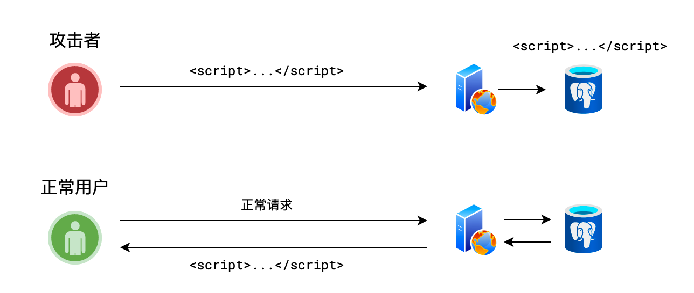

XSS (Cross Site Scripting, 跨站脚本攻击)，是指攻击者利用站点的漏洞，在表单提交时，在表单内容中加入一些恶意脚本，肖其他正常用户浏览页面，而页面中刚好出现攻击者的恶意脚本时，脚本被执行，从而使得页面遭到破坏，或者用户信息被窃取。

## 攻击方式

### 存储型 XSS

1. 恶意用户提交了恶意内容到服务器
2. 服务器没有识别，保存了恶意内容到数据库

3. 正常用户访问服务器
4. 服务器在不知情的情况下，给予了之前的恶意内容，让正常用户遭到攻击

### 反射型

1. 恶意用户分享了一个正常网站的链接，链接中带有恶意内容
2. 正常用户点击了该链接
3. 服务器在不知情的情况，把链接的恶意内容读取了出来，放进了页面中，让正常用户遭到攻击

### DOM 型

1. 恶意用户通过任何方式，向服务器中注入了一些 dom 元素，从而影响了服务器的 dom 结构
2. 普通用户访问时，运行的是服务器的正常 js 代码

## 防御方式

服务器端对用户提交的内容进行过滤或编码

-   过滤：去掉一些危险的标签，去掉一些危险的属性

-   编码：对危险的标签进行 HTML 实体编码

    

## 问答

介绍 XSS 攻击

> 参考答案：
>
> XSS 是指跨站脚本攻击。攻击者利用站点的漏洞，在表单提交时，在表单内容中加入一些恶意脚本，当其他正常用户浏览页面，而页面中刚好出现攻击者的恶意脚本时，脚本被执行，从而使得页面遭到破坏，或者用户信息被窃取。
>
> 要防范 XSS 攻击，需要在服务器端过滤脚本代码，将一些危险的元素和属性去掉或对元素进行 HTML 实体编码。
