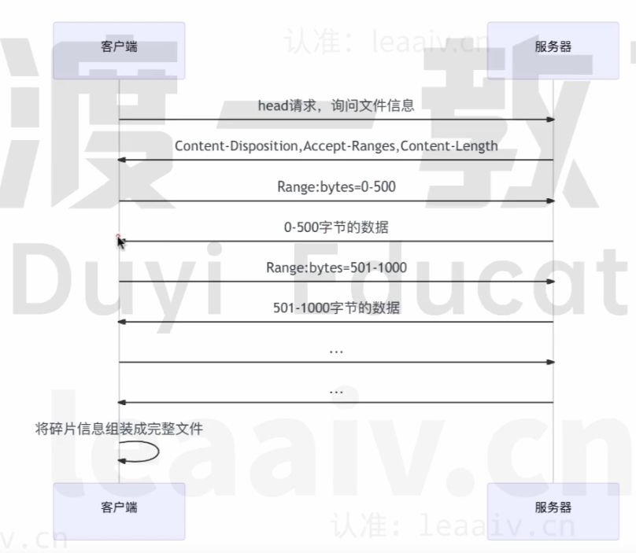
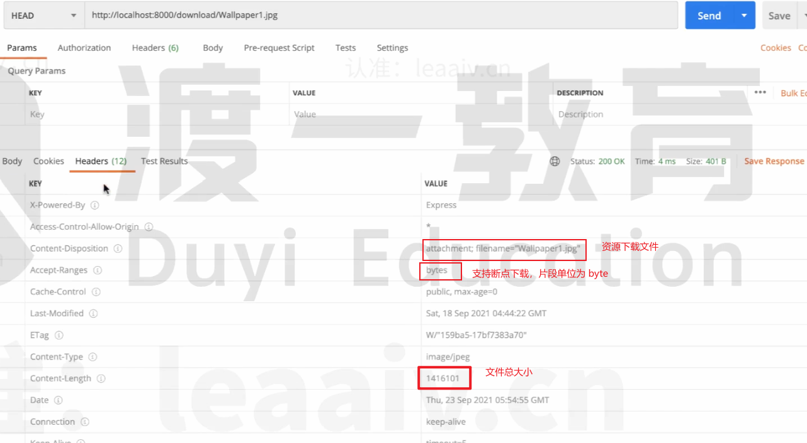
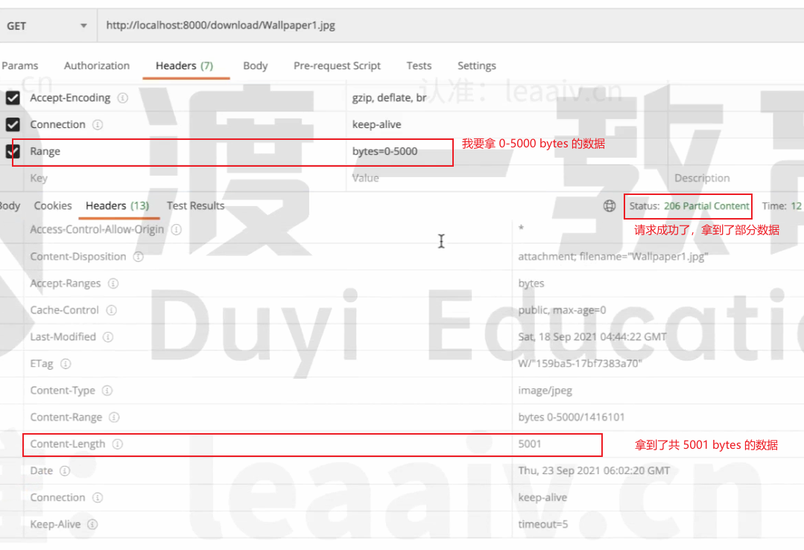
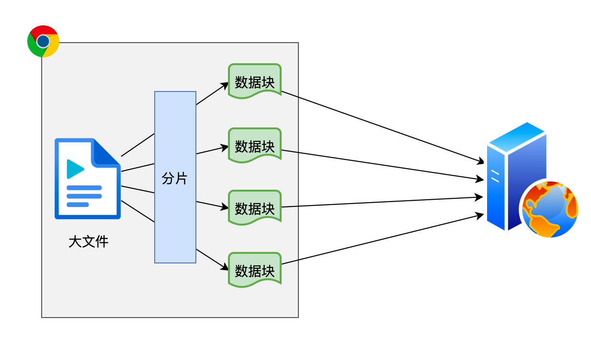

## 断点下载

要实现下载时的断点续传，首先，服务器在响应时，要在头中加入下面的字段

```yaml
Accept-Ranges: bytes
```

这个字段是向客户表明：我这个文件可以支持传输部分数据，你只需要告诉我你需要的是哪一部分的数据即可，单位是 `bytes`

此时，某些支持断点续传的客户端，比如迅雷，他就可以在请求时，告诉服务器需要的数据范围。具体做法是在请求头重加入下面的字段

```yaml
range: bytes=0-5000
```

客户端告诉服务器：请给我传递 0 -5000 字节范围内的数据即可，无需传输全部数据。

完整流程如下：



在请求下载资源之前，下载器先给服务器发一个 head 类型的请求，用于得到资源信息 head 请求的响应没有响应体，所有数据在响应头中。



随后开始使用 GET 请求请求片段数据。



## 断点上传

整体来说，实现断点上传的主要思路就是要把上传的文件切分为多个小的数据块然后进行上传



虽然芬片上传的整体思路一致，但它没有一个统一的、哭提的标准，因此需要根据具体的业务场景制定自己的标准。

由于标准的不同，意味着分片上传需要自行编写代码实现。

下面用一种极简的流程实现分片上传


> MD5 是 hash 算法实现的一个形式。
