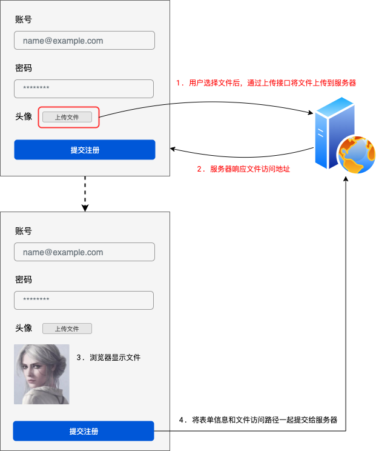

## 文件上传的消息格式

文件上传的本质仍然是-个数据提交，无非就是数据量大一些而已在

实践中，人们逐渐的形成了一种共识，我们自行规定，文件上传默认使用下面的请求格式

````yaml
POST上传地址HTTP/1.1
其他请求头
Content-Type: multipart/form-data; boundary=----WebKitFormBoundary7MA4YWxkTrZu0gW

----WebKitFormBoundary7MA4YWxkTZu0gW
Content-Disposition: form-data; name="avatar"; filename= "小仙女.jpg"
Content Type: image/jpeg

(文件二进制数据)
----WebKitFormBoundary7MA4YWxkTrZu0gW
Content -Disposition: form- data; name= "username"

admin
----WebKitFormBoundary7MA4YWxkTrZu0gW
Content-Disposition: form-data; name="password"

123123
----WebKitFormBoundary7MA4YWxkTrZu0gW
````

- 除非接口文档特别说明，文件上传-般使用 POST 请求
- 接口文档中会规定上传地址，一般一个站点会有一个统一的上传地址

## 文件上传的实现

在现代的网页交互中，带表单的文件上传通常使用下面的方式实现



> 后端开发服务器地址：http://localhost:8000

````html
<!DOCTYPE html>
<html lang="en">
  <head>
    <meta charset="UTF-8" />
    <meta http-equiv="X-UA-Compatible" content="IE=edge" />
    <meta name="viewport" content="width=device-width, initial-scale=1.0" />
    <title>文件上传</title>
  </head>
  <body>
    <div class="form">
      <div class="form-item">
        <div class="title">
          <button id="btnupload">文件上传</button>
          <input type="file" id="fileuploader" style="display: none" />
          
        </div>
      </div>
    </div>
    <script>
      const doms = {
        btnUploader: document.querySelector('#btnupload'),
        fileUploader: document.querySelector('#fileuploader'),
        pic: document.querySelector('#pic')
      }

      // 按钮点击的时候借助隐藏的文件上传按钮弹出文件选择框
      doms.btnUploader.onclick = function () {
        doms.fileUploader.click()
      }

      // 当选中文件的时候触发该事件，通过 fetch 上传文件
      doms.fileUploader.onchange = async function () {
        const formData = new FormData()
        formData.append('file', doms.fileUploader.files[0])

        const resp = await fetch('http://localhost:8000/api/upload', {
          method: 'POST',
          body: formData // fetch 会自动检测到当前数据类型是一个 formData，调整Content-Type: multipart/form-data，并将对应数据拼装成相应格式
        }).then(res => res.json())
        // 显示上传的图片
        doms.pic.sec= resp.data
      }
    </script>
  </body>
</html>
````