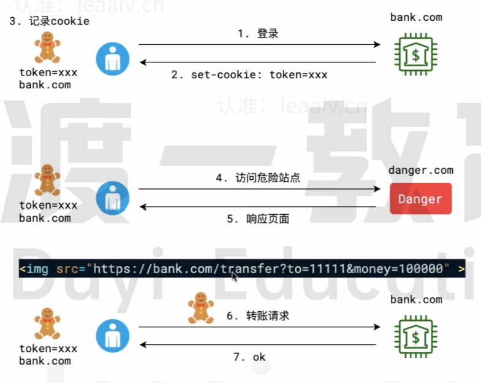

CSRF (Cross-site request forgery, 跨站请求伪造) ，它是指攻击者利用了用户的身份信息，执行了用户非本意的操作。

### 17.1 防御方式

| 防御手段                                                     | 防御力    | 问题                                                         |
| ------------------------------------------------------------ | --------- | ------------------------------------------------------------ |
| 不使用 cookie                                                | * * * * * | 兼容性略差 SSR（浏览器渲染）会遇到困难，但可解决 > 有的网站需要登陆方可显示内容，不带 cookie 在浏览器渲染的时候只会渲染出登陆页面，不利于搜索引擎优化。可以通过中间页跳转，在中间页调用 local storage 中的 token 进行登陆。从而解决该问题。 |
| cookie 中使用 sameSite （ set-cookie: sameSite = strict 的时候，发cookie 的时候会去验证当前所在的页面是否和cookie所属页面相同 set-cookie: sameSite = Lax 的售后，发 cookie 的时候 GET 请求不验证，POST 请求验证 ） | * * * *   | 兼容性差 容易挡住自己人                                 |
| 使用 CSRF token （客户端获取到真网站之后真网站会给客户端一个 token，并将该 token 存在 session 中。在完成真网站操作后，session 直接删除该 token） | * * * * * | 获取到 token 后未进行操作仍然会被攻击                        |
| 使用 referer 防护                                            | **        | 过去很常用，现在已经发现漏洞                                 |

### 17.2 问答

介绍 CSRF 攻击

> CSRF 是跨站请求伪造，是一种挟制用户在当前已登录的Web应用上执行非本意的操作的攻击方法。
>
> 它首先引导用户访问一个危险网站，当用户访问网站后，网站会发送请求到被攻击的站点，这
> 次请求会携带用户的cookie发送，因此就利用了用户的身份信息完成攻击。
>
> 防御 CSRF 攻击有多种手段:
>
> 1. 不使用 cookie
> 2. 为表单添加校验的 token 校验
> 3. cookie中使用 sameSite 字段
> 4. 服务器检查 referer 字段