## SSL、TLS、HTTPS 的关系

SSL (Secure Sockets Layer) ，安全套接字协议

TLS (Transport Layer Security) ，传输层安全性协议

**TLS是SSL的升级版，两者几乎是一样的**

HTTPS (Hyper Text Transfer Protocol over SecureSocket Layer) ，建立在 SSL 协议之上的 HTTP 协议

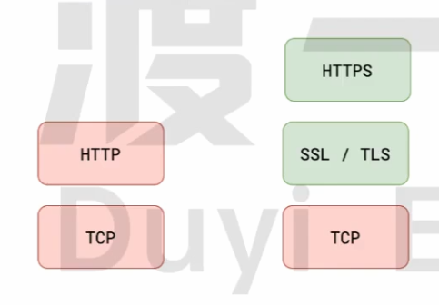

## 怎么保证网络信息传输是安全的

网络信息传输容易被中介人截获篡改

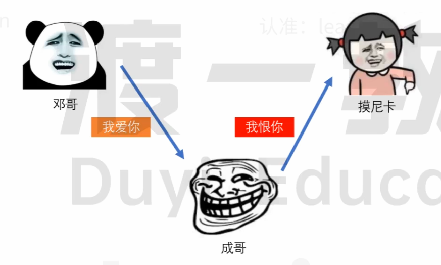

因此需要**加密**！

#### 23.2.1 对称加密

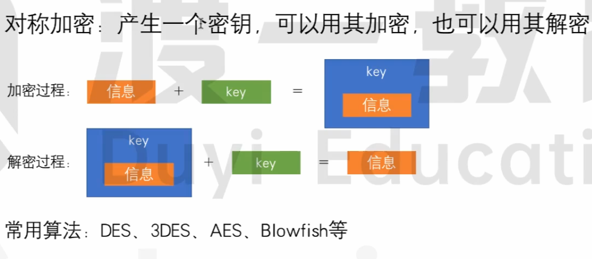

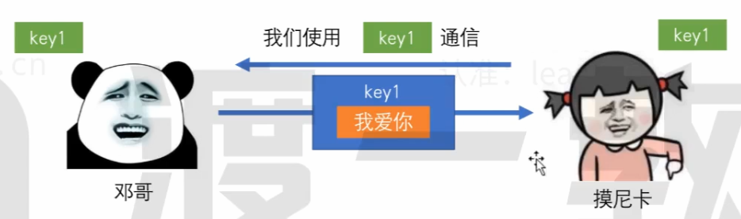

使用堆成加密需要服务器先把秘钥 `key1` 传给客户端，这就完蛋了

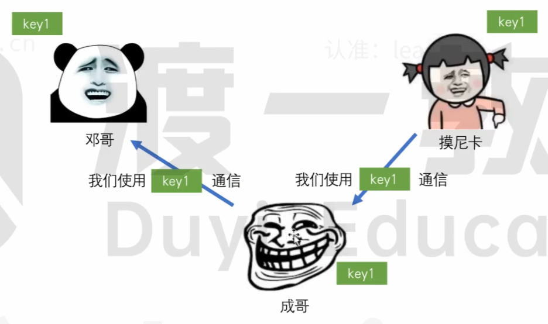

第一个请求被截取就泄露秘钥了。。。

### 23.2.2 非对称加密

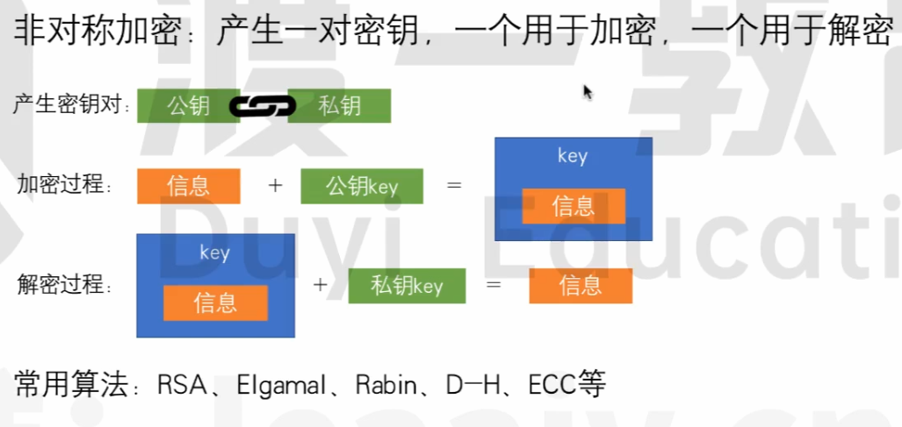

用私钥加密有一个问题：

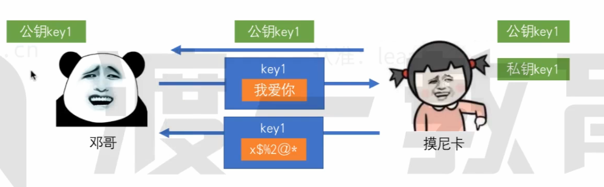

客户端只有公钥用于加密，没有私钥进行解密，客户端收到公钥加密的消息看不懂。

因此可以这么解决这个问题：

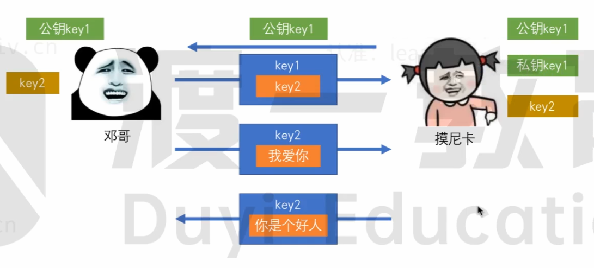

服务器端先把公钥 `key1` 交给客户端，客户端生成公钥 `key2`，并使用公钥 `key1` 把公钥 `key2` 加密起来给服务端，服务端使用私钥 `key1` 解密拿到公钥 `key2`。

然后用公钥 `key2` 进行对称加密通信。

但是有一个破解方法：

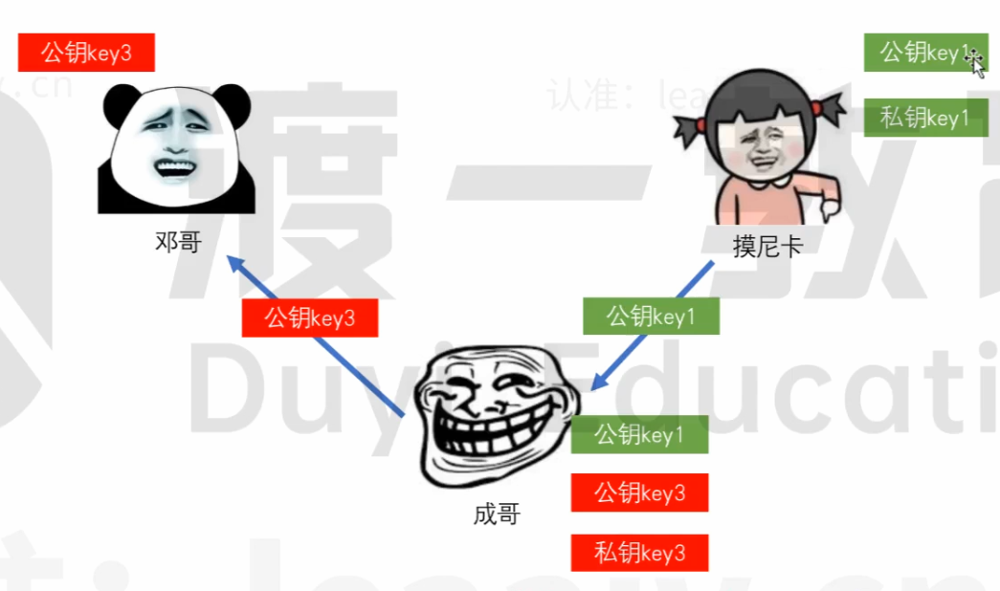

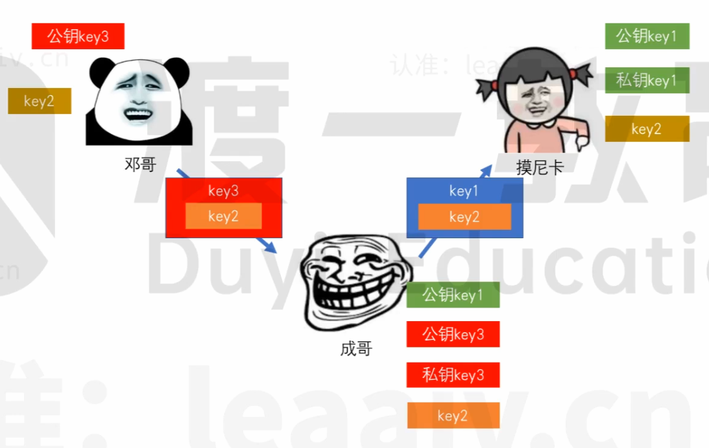

中间人直接拦截公钥 `key1` 然后中间人保持与服务器端通信，用自己的私钥加密数据，发送公钥模拟服务器与客户端通信，从而实现数据拦截修改。

因此问题的关键就是不能让中间人伪造这个中间这个公钥。

因此引入了 CA （Certificate Authority）证书颁发机构。

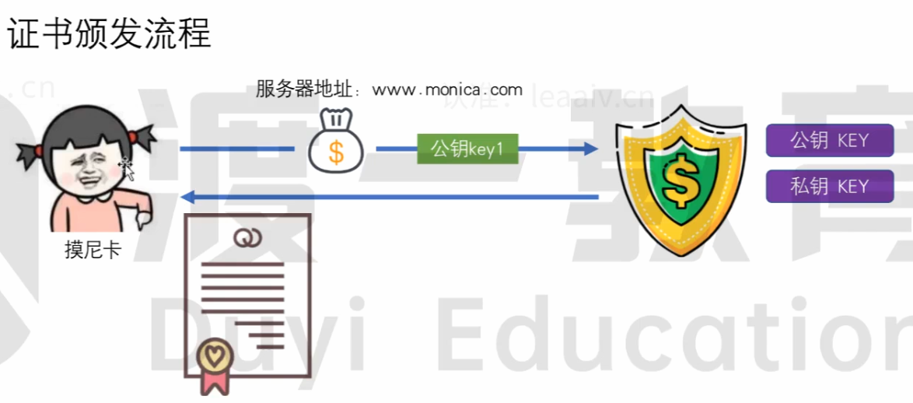

证书办法机构会利用只有机构自己知道的私钥，将服务器的地址和公钥 `key1` 进行加密，得到证书DC（Digital Certificate）。机构的公钥官网可查，因此可以实现公钥 `key1` 的解密

DC的结构如下

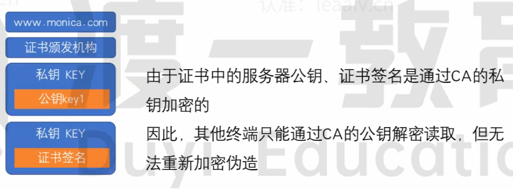

证书签名包括域名和证书办法机构，并使用机构私钥进行加密，因此无法被修改，可用于保证整个证书没有办法被伪造。

因此接下来网络通信可以变成这样：

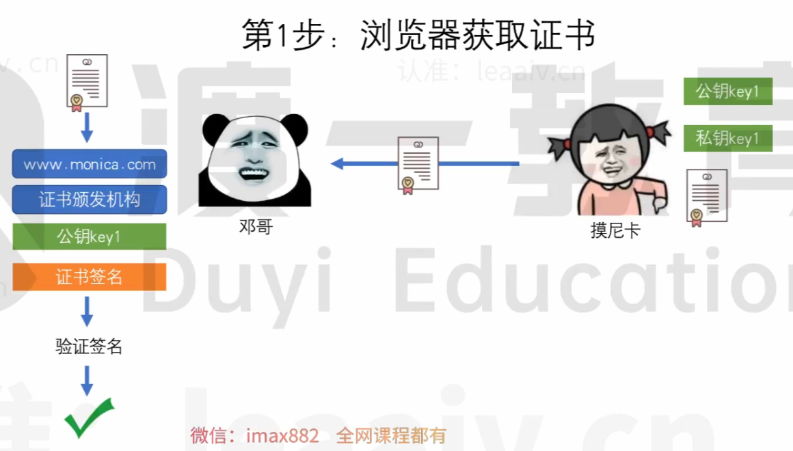

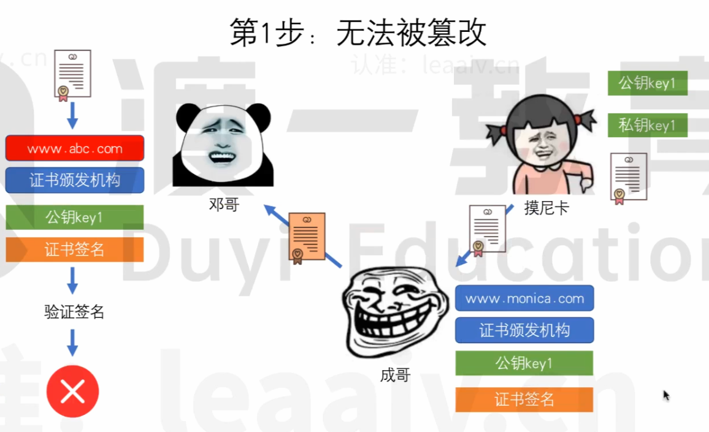

证书就算被中间人拿到了也没有办法篡改，因为中间人拿自己的私钥去加密数据，肯定是通不过客户端机构公钥解密的。而且中间人还没办法修改证书办法机构和域名，因为没有办法使用证书办法机构的私钥对其进行加密形成证书签名。

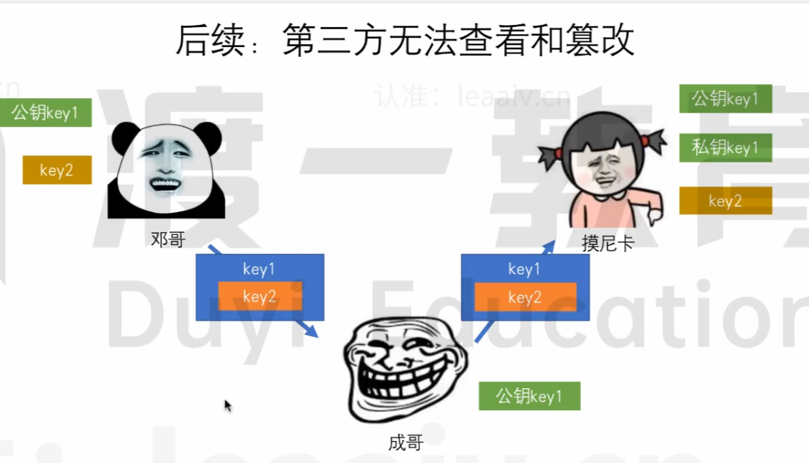

后续中间人只能拿到个公钥 `key1`，没有私钥 `key1` 也解不开公钥 `key1` 加密的公钥 `key2`

接下来客户端和服务器端直接使用公钥 `key2` 对称加密进行通信好了。

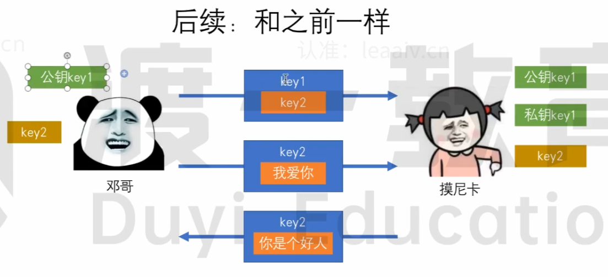

## 问答

1. 介绍下 HTTPS 中间人攻击

   > 参考答案:
   > 针对 HTTPS 攻击主要有 SSL 劫持攻击和 SSL 剥离攻击两种。
   >
   > SSL 劫持攻击是指攻击者劫持了客户端和服务器之间的连接，将服务器的合法证书替换为伪造的证书，从而获取客户端和服务器之间传递的信息。这种方式一般容易被用户发现，浏览器会明确的提示证书错误，但某些用户安全意识不强，可能会点击继续浏览，从而达到攻击目的。
   > SSL 剥离攻击是指攻击者劫持了客户端和服务器之间的连接，攻击者保持自己和服务器之间的 HTTPS 连接，但发送给客户端普通的 HTTP 连接，由于HTTP连接是明文传输的，即可获取客户端传输的所有明文数据。

2. 介绍 HTTPS 握手过程

   > 参考答案:
   >
   > TCP三次握手成功后：
   >
   > 1. 客户端请求服务器，并告诉服务器自身支持的加密算法以及密钥长度等信息
   > 2. 服务器响应公钥和服务器证书
   > 3. 客户端验证证书是否合法，然后生成一个会话密钥，并用服务器的公钥加密密钥，把加密的会话密钥通过请求发送给服务器
   > 4. 服务器使用私钥解密被加密的会话密钥并保存起来，然后使用会话密钥加密消息响应给客户端，表示自己已经准备就绪
   > 5. 客户端使用会话密钥解密消息，知道了服务器已经准备就绪。
   > 6. 后续客户端和服务器使用会话密钥加密信息传递消息

3. HTTPS握手过程中，客户端如何验证证书的合法性

   > 1. 校验证书的颁发机构是否受客户端信任。
   > 2. 通过 CRL（证书办法机构在全世界大的节点共享了一个所有申请证书状态的清单，查阅这个清单） 或 OCSP（直接发消息给证书办法机构） 的方式校验证书是否被吊销。
   > 3. 对比系统时间，校验证书是否在有效期内。
   > 4. 通过校验对方是否存在证书的私钥，判断证书的网站域名是否与证书颁发的域名一致。

4. 阐述 https 验证身份也就是 TSL/SSL 身份验证的过程（同 HTTPS 握手过程）

   > 参考答案: 
   >
   > 1. 客户端请求服务器，并告诉服务器自身支持的加密算法以及密钥长度等信息
   > 2. 服务器响应公钥和服务器证书
   > 3. 客户端验证证书是否合法，然后生成一个会话密钥，并用服务器的公钥加密密钥，把加密的结果通过请求发送给服务器
   > 4. 服务器使用私钥解密被加密的会话密钥并保存起来，然后使用会话密钥加密消息响应给客户端，表示自己已经准备就绪
   > 5. 客户端使用会话密钥解密消息，知道了服务器已经准备就绪。
   > 6. 后续客户端和服务器使用会话密钥加密信息传递消息

5. 为什么需要CA机构对证书签名

   > 主要是为了解决证书的可信问题。如果没有权威机构对证书进行签名 ，客户端就无法知晓
   > 证书是否是伪造的，从而增加了中间人攻击的风险，https就变得毫无意义。

6. 如何劫持https 的请求，提供思路

   > https 有防篡改的特点，只要浏览器证书验证过程是正确的，很难在用户不察觉情况下进行攻击。但若能够更改浏览器的证书验证过程，便有机会实现https 中间人攻击。
   >
   > 所以，要劫持 https， 首先要伪造一个证书，并且要想办法让用户信任这个证书，可以有多种方式，比如病毒、恶意软件、诱导等。一旦证书被信任后，就可以利用普通中间人攻击的方式，使用伪造的证书进行攻击。