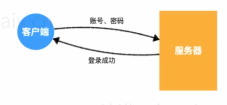
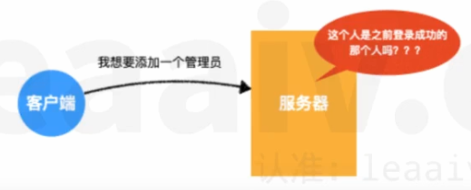
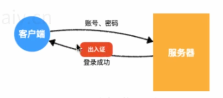
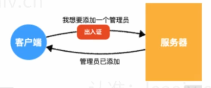
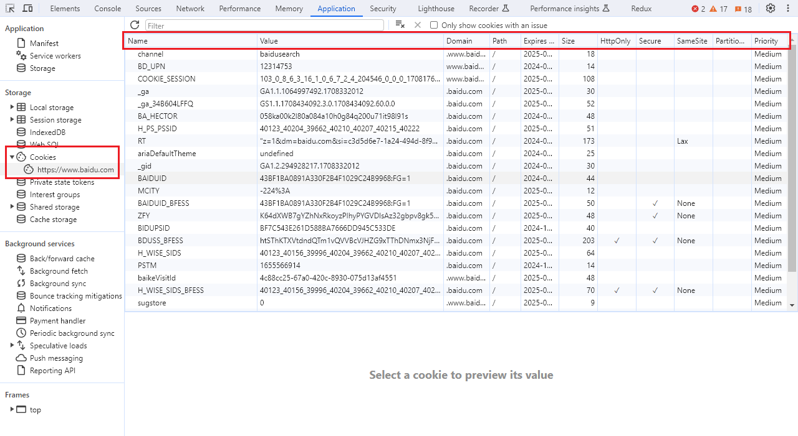
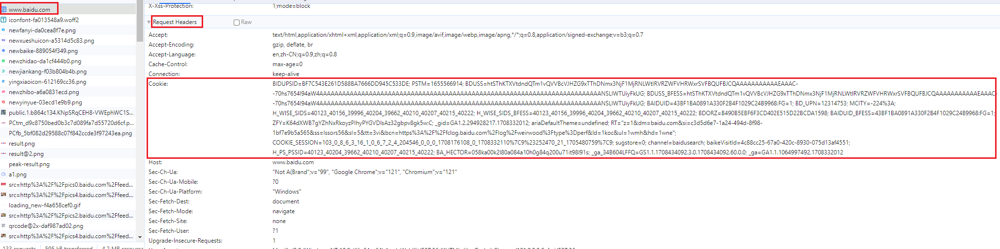
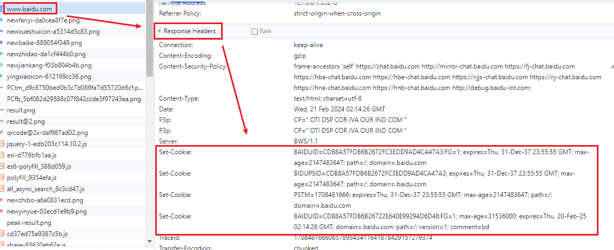

假设服务器有一个接口，通过请求这个接口，可以添加一个管理员

但是，不是任何人都有权力做这种操作的

那么服务器如何知道请求接口的是有否有权力呢？

答案是：只有登陆过的管理员才能做这种操作

可问题是，客户端和服务器的传输使用的是 http 协议， http 协议是无状态的，什么是无状态，就是**服务器不知道这一次请求的人，跟之前登陆请求成功的人是不是同一个人**






由于 http 协议的无状态，服务器忘记了之前的所有请求，它无法确定这一次请求的客户端，就是之前登陆成功的那个客户端。

于是，服务器想了一个办法

它按照下面的流程来认证客户端的身份

1. 客户端登陆成功后，服务器会给客户端一个出入证
2. 后续客户端的每次请求，都必须要附带这个出入证





服务器发扬了认证不认人的优良传统，就可以很轻松的识别身份了。

但是用户不可能只在一个网站登陆，于是客户端会收到来自各个网站的出入证，因此，就要求客户端要有一个类似于卡包的东西，能够具备下面的功能：

1. **能够存多个出入证**。这些出入证来自不同的网站，也可能是一个网站有多个出入证，分别用于出入不同的地方。
2. **能够自动出示出入证**。客户端在访问不同的网站时，能够自动把对应的出入证附带请求发送出去。
3. **正确的出示出入证**。客户端不能将肯德基的出入证发送给麦当劳。
4. **管理出入证的有效期**。客户端要能够自动的发现那些已经过期的出入证，并把它从卡包内移除。

能够满足上面所有要求的，就是 cookie。

cookie 类似于一个卡包，专门用于存放各种出入证，并有着一套机制来自动管理这些证件。卡包内的每一张卡片，称之为**一个 cookie**。

## cookie 的组成

cookie 是浏览器中特有的一个概念，它就像浏览器的专属卡包，管理着各个网站的身份信息。

每个 cookie 就相当于某个网站的一个卡片，它记录了下面的信息：

- key：键，比如 <身份证号>
- value：值，比如 <身份证号> 的具体数值 <188954566513>，可以是任何信息
- domain：域，表达这个 cookie 是属于哪个网站的，`yuanjin.teach`，表示这个 cookie 是属于 `yuanjin.teach` 这个网站的
- path: 路径，表达这个 cookie 是属于该网站哪个路径的，就好比是同一家公司不同部门会颁发不同的出入证。比如 `/news`，表示这个 cookie 属于 `/news` 这个路径的。
- secure：是否使用安全传输
- expire：过期事件，表示该 cookie 在什么时候过期

下图是百度首页所用到的 cookies



当浏览器向服务器发送一个请求的时候，它会瞄一眼自己的卡包，看看哪些卡包适合附带捎给服务器

如果一个 cookie **同时满足** 以下条件，则这个 cookie 会被附带到请求中

- cookie 没有过期

- cookie 中的域和这次请求的域是匹配的

  > - cookie 中的域是 `baidu.com`，则可以匹配的请求域是 `baidu.com`、`www.baidu.com`、`blogs.baidu.com` 等等
  > - cookie 中的域是 `www.baidu.com`，则只能匹配 `www.baidu.com`，`abc.www.baidu.com` 这样的请求域
  > - cookie 是不在乎端口的，只要匹配即可

- cookie 中的 path 和这次请求的 path 是匹配的
  - 比如 cookie 中的 path 是 `/news`，则可以匹配的请求路径可以是 `/news`、`/news/detail`、`/news/a/b/c` 等等，但不能匹配 `/blogs`
  - 如果 cookie 的 path 是 `/`，则能够匹配所有路径
- 验证 cookie 的安全传输
  - 如果 cookie 的 secure 属性时 true，则请求协议必须是 `https`，否则不会发送该 cookie
  - 如果 cookie 的 secure 属性时 false，则请求协议可以是 `http`，也可以是 `https`

如果一个 cookie 满足了上述的所有条件，则浏览器会把它自动加入到这次请求中

具体的加入方式是：**浏览器会将符合条件的 cookie，自动放置到请求头中**，例如，当我们访问百度的时候，它在请求头中附带了下面的 cookie：



这部分就是通过请求头 `cookie` 发送到服务器的，发送的格式为 `key=value; key=value; key=value; ...`，每一个键值对就是一个符合条件的 cookie。

## 如何设置 cookie

### 服务器端设置 cookie

服务器可以通过**设置响应头**，来告诉浏览器应该如何设置 cookie

响应头按照下面的格式设置：

````yaml
Set-Cookie: cookie1
Set-Cookie: cookie2
Set-Cookie: cookie3
...
````

通过这种模式，就可以在一次响应中设置多个 cookie 了，具体设置多少个 cookie，设置什么 cookie，根据需求自行处理。

其中每个 cookie 的格式如下：

````yaml
键=值; path=?; domain=?; expire=? max-age=?; secure; httponly 
````

每个 cookie 除了键值对是必须要设置的，其他的属性都是可选的，并且顺序不限。

当这样的响应头到达客户端后，**浏览器会自动的将 cookie 保存到卡包中，如果卡包中已经存在一模一样的卡片（其他 path、domain相同），则会自动的覆盖之前的设置。**




下面，依次说明每个属性值：

- **path**：设置 cookie 的路径。如果不设置，浏览器会将其自动设置为当前的请求路径。

  比如，浏览器请求的地址是 `/login`，服务器响应了一个 `set-cookie: a=1`，浏览器会将该 cookie 的 path 设置为请求的路径 `/login`。

- **domain**：设置 cookie 的域。如果不设置，浏览器会自动将其设置为当前的请求域。

  比如，浏览器请求的地址是 `http://` 服务器响应了一个 `set-cookie: a=1` 浏览器会将 cookie 的 domain 设置为请求的域 `www.baidu.com`。

  > 注意：
  >
  > 如果服务器响应了一个无效的域，浏览器是不认的
  >
  > 什么是无效的域？就是响应的域连根域都不一样。比如，浏览器请求的域是 `baidu.com`，服务器响应的 cookie 是 `set-cookie: a=1; domain=taobao.com`，这样的域浏览器是不认的。

- **expire**：设置 cookie 的绝对过期时间。这里必须是一个有效的GMT事件，即格林威治标准时间字符串（如：`Fri,17 Apr 2020 09:35:59`）。当客户的事件到达这个事件点后，会自动销毁该 cookie。

- **max-age**：设置 cookie 的相对有效期。expire 和 max-age 通常仅设置一个即可。比如设置 `max-age` 为 `1000`，浏览器在添加 cookie 的时候会自动设置 `expire` 为当前时间加上 1000 秒。

  > - 如果不设置 expire，又没有设置 max-age，则表示会话结束后过期。
  >
  > - 对于大部分浏览器而言，关闭所有浏览器窗口意味着会话结束。

- **secure**：设置 cookie 是否是安全连接。如果设置了该值，则表示该 cookie 后续只能随着 `https` 请求发送。如果不设置，则表示该 `cookie` 会随着所有请求发送。
- **httponly**：设置 cookie 是否仅能用于传输。如果设置了该值，表示 cookie 仅能用于传输，而不允许在客户端通过 JS 获取，这对防止跨站脚本攻击（XSS）会很有用。

下面有一个例子，客户端通过 post 请求服务器 `http://damiaoxi.live/login`，并在消息体中给予了账号和密码，服务器验证登陆成功狗，在响应头中加入了以下内容：

````yaml
set-cookie: token=123456; path=/; max-age=3600; httponly
````

当响应到达浏览器后，浏览器会创建下面的 cookie：

````yaml
key: token
value: 123456
domain: damiaoxi.live
path: /
expire: 2024-02-21 16:25:26
secure:false #任何请求都可以附带这个 cookie，只要满足其他请求
httponly: true # 不允许 JS 获取该 cookie
````

于是，随着浏览器后续对服务器的请求，只要满足要求，这个 cookie 就会被附带给服务器：

````yaml
cookie: token=123456; 其他cookie...
````

现在剩下最后一个问题，如何删除浏览器的一个 cookie 呢？

如果删除浏览器的 cookie，只需要让服务器响应一个相同的域、同样的key，只是时间过期的cookie即可。

所以，**删除 cookie 其实就是修改 cookie**

下面的响应会让浏览器删除 token

````yaml
set-cookie: token=; path=/; max-age=1
````

浏览器按照要求修改了cookie 后，会发现 cookie 已经过期，于是自然就会删除。

> 无论是修改还是删除，都要注意 cookie 的域和路径，因为完全可能存在域或路径不同，但是key相同的 cookie
>
> 因此无法仅通过 key 确定是哪一个 cookie

### 客户端设置 cookie

既然 cookie 是存放在浏览器端的，所以浏览器向JS 公开了接口，让其可以设置 cookie

````javascript
document.cookie = "键=值; path=?; domain=? expire=?; max-age=? secure";
````

可以看出，在客户端设置 cookie，和服务器设置 cookie 的格式一样，只有如下不同：

- 没有 httponly。因为 httponly 本来就是为了限制客户端访问 cookie 的，既然是在客户端配置，也就失去了限制的意义。
- path 的默认值。和 path 同理，客户端设置时默认值是当前网页的 domain
- 其他：一样
- 删除 cookie：和服务器也一样，修改 cookie 的过期时间即可。

## 总结

以上就是 cookie 原理部分的内容。

如果把它用于登陆场景，就是如下的流程：

**登陆请求**

1. 浏览器发送请求到服务器，附带账号密码。
2. 服务器验证账号密码是否正确，如果不正确，响应错误。如果正确，在响应头中设置 cookie，附带登陆认证信息。
3. 客户端收到 cookie，浏览器自动记录下来。

**后续请求**

1. 浏览器发送请求到服务器，希望添加一个管理员，并将 cookie 自动附带到请求中
2. 服务器先获取 cookie，验证 cookie 中的信息是否正确，如果不正确，不予以操作，如果正确，完成正常的业务流程。

## 问答

cookie/session Storage/local Storage 的区别

> 参考答案：
>
> cookie、session Storage、local Storage 都是保存本地数据的方式
>
> 其中，cookie 兼容性较好，所有浏览器均支持。浏览器针对 cookie 会有一些默认行为。比如当响应头中出现 `set-cookie` 字段时，浏览器会自动保存 cookie 的值；再比如，浏览器发送请求时，会附带匹配的 cookie 到请求头中。这些默认行为，使得 cookie 长期以来担任着维持登陆状态的责任。与此同时，也正是因为浏览器的默认行为，给恶意攻击者可乘之机，CSRF 攻击就是一个典型的利用 cookie 的攻击方式。虽然 cookie 不断地改进，但前端任然需要另一种更加安全的保存数据的方式。
>
> HTML5 新增了 session storage 和 local storage，前者用于保存会话级别的数据，后者用于更持久的保存数据。浏览器针对它们没有任何默认行为，这样一来，就把保存数据、读取数据的工作交给前端开发者，这就让恶意攻击者难以针对登陆状态进行攻击。
>
> cookie的大侠是有限制的，一般浏览器会限制同一个域下的 cookie 总量为 4M，而 session storage 和 local storage 则没有限制。
>
> cookie 会与 domain、path 关联，而 session storage 和 local storage 只与 domain 关联。