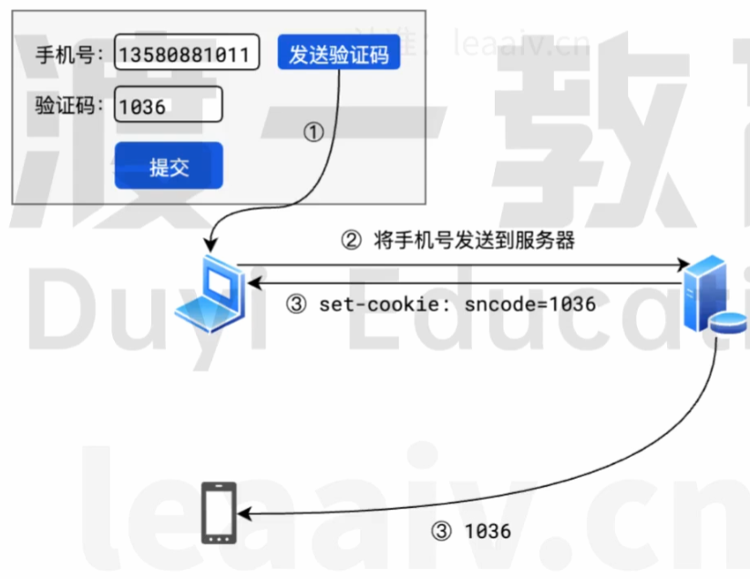
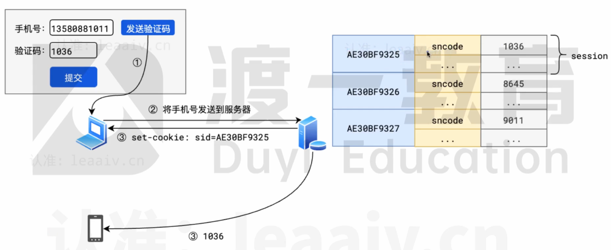

## cookie 的缺陷

cookie是保存在客户端的，虽然为服务器减少了很多压力，但某些情况下，会出现麻烦。
比如，验证码

如果这样做，客户端可以随便填写一个别人的手机号，然后从cookie中获取到验证码，从而绕开整个验证。

因此，有些敏感数据是万万不能发送给客户端的

那要如何实现这一流程呢？

## 问答

1. cookie 和 session 的区别是什么?

  > 参考答案:
  >
  > 1. cookie 的数据保存在浏览器端；session 的数据保存在服务器
  > 2. cookie 的存储空间有限；session 的存储空间不限
  > 3. cookie 只能保存字符串；session 可以保存任何类型的数据
  > 4. cookie 中的数据容易被获取；session中的数据难以获取

2. 如何消除session

  > 参考答案:
  >
  > 1. 过期时间
  >    当客户端长时间没有传递 sessionid 过来时，服务器可以在过期时间之后自动清除 session
  > 2. 客户端主动通知
  >    可以使用 JS 监听客户端页面关闭或其他退出操作，然后通知服务器清除session