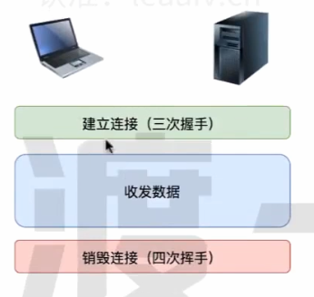
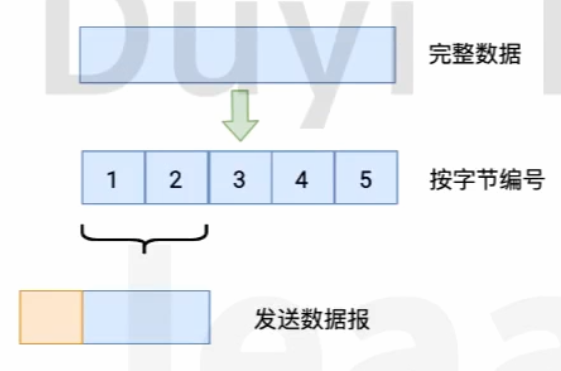
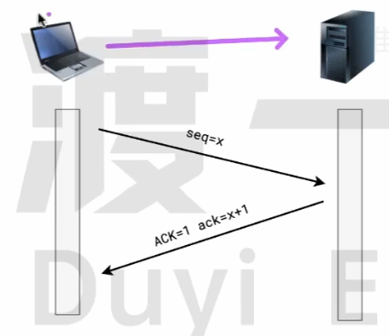
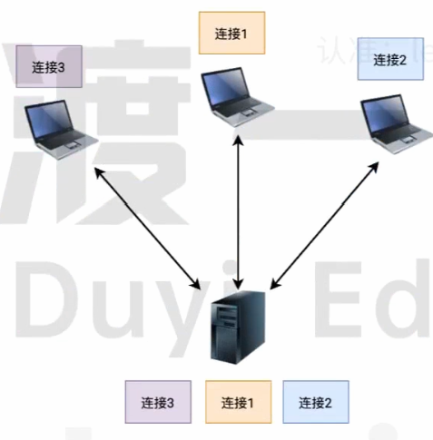
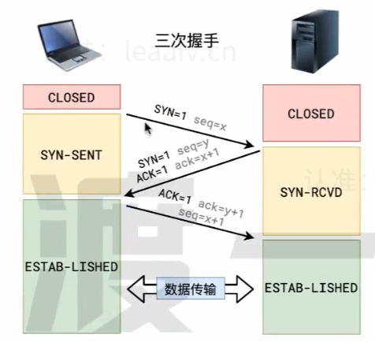
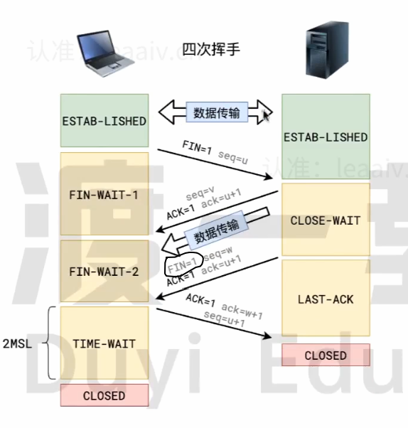
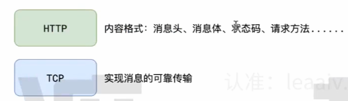

## TCP 收发数据流程

 

TCP 协议允许双发互发数据（HTTP 协议不允许）

## TCP如何收发数据

分段发送

## 可靠传输

在TCP协议中，任何时候、任何一方都可以主动发送数据给另一方

为了解决数据报丢失、数据报错乱等问题，TCP协议要求：**接收方收到数据报后，必须对数据报进行确认!**

- seq:表示这次数据报的序号
- ACK:表示这次数据报是一个确认数据报
- ack:表示期望下一次接收的数据报序号

发送方如果长时间没有收到确认数据报（ACK=1），则会判定丢失或者是错误，然后重发。

## 连接的建立(三次握手)

TCP协议要实现数据的收发，必须要先建立连接

连接的本质其实就是双方各自开辟的一块儿内存空间，空间中主要是数据缓冲区和一些变量

连接建立的过程需要经过三次数据报传输，因此称之为三次握手

> 开始
>
> 客户端:我说话能听见吗?
>
> 服务器:能听见，我说话能听见吗?
>
> 客户端:能听见
>
> 结束

## 连接的销毁(四次挥手)

> 开始
>
> 客户端:我说完了，挂了?
>
> 服务器:我明白你说完了，但别忙挂，我还有话要说。
>
> 服务器继续说.....
>
> 服务器：我也说完了，挂了?
>
> 客户端：好的！
>
> 结束

客户端最后等待 2MSL（最大分节生命周期）是为了防止最后一次挥手失败，如果最后一次挥手失败，服务器会再发一次第三次挥手的消息，直到收到第四次挥手为止。

## HTTP和TCP的关系

HTTP协议是对内容格式的规定，它使用了TCP协议完成消息的可靠传输

在具体使用TCP协议时:

1. 客户端发消息给服务器叫做请求，服务器发消息给客户端叫做响应
2. 使用HTTP协议的服务器不会主动发消息给客户端(尽管TCP可以)，只对请求进行响应
3. 每一个HTTP请求 - 响应，都要先建立TCP连接(三次握手)，然后完成请求 - 响应后，再销毁连接(四次挥)。这就导致每次请求- 响应都是相互独立的，无法保持状态。

## 问答

1. 简述 TCP 连接的过程（淘系）

   > 参考答案：
   >
   > TCP协议通过三次握手建立可靠的点对点连接，具体过程是:
   >
   > 首先服务器进入监听状态，然后即可处理连接
   >
   > 第一次握手:建立连接时，客户端发送syn包到服务器， 并进入SYN_ SENT状态，等待服务器确认。在发送的包中还会包含一一个初始序列号seq。 此次握手的含义是客户端希望与服务器建立连接。
   >
   > 第二次握手:服务器收到 syn 包，然后回应给客户端一个 SYN+ACK 包，此时服务器进入 SYN_ RCVD 状态。此次握手的含义是服务端回应客户端，表示已收到并同意客户端的连接请求。
   >
   > 第三次握手:客户端收到服务器的SYN 包后，向服务器再次发送ACK 包，并进入 ESTAB_ LISHED 状态。
   >
   > 最后，服务端收到客户端的 ACK 包，于是也进入 ESTAB_LISHED 状态，至此，连接建立完成

2. 谈谈你对 TCP 三次握手和四次挥手的理解

   > TCP协议通过三次握手建立可靠的点对点连接，具体过程是:
   >
   > 首先服务器进入监听状态，然后即可处理连接
   >
   > 第一次握手：建立连接时，客户端发送syn 包到服务器，并进入 SYN_ SENT 状态，等待服务器确认。在发送的包中还会包含一个初始序列号 seq。 此次握手的含义是客户端希望与服务器建立连接。
   >
   > 第二次握手：服务器收到 syn 包，然后回应给客户端一个 SYN + ACK 包，此时服务器进入 SYN_ RCVD 状态。此次握手的含义是服务端回应客户端，表示已收到并同意客户端的连接请求。
   >
   > 第三次握手：客户端收到服务器的SYN 包后，向服务器再次发送ACK包，并进入 ESTAB_ LISHED 状态。
   >
   > 最后，服务端收到客户端的 AC K包，于是也进入 ESTAB_LISHED 状态，至此，连接建立完成。
   >
   > **当需要关闭连接时，需要进行四次挥手才能关闭**
   >
   > 1. Client 向Server 发送FIN包，表示Client 主动要关闭连接，然后进入FIN_WAIT_1状态，等待Server 返回 ACK 包。此后Client 不能再向Server 发送数据，但能读取数据。
   > 2. Server 收到 FIN 包后向Client 发送 ACK 包，然后进入CLOSE_ WAIT 状态，此后 Server 不能再读取数据，但可以继续向Client 发送数据。
   > 3. Client 收到Server 返回的 ACK 包后进入 FIN_ WAIT_2 状态，等待 Server 发送 FIN 包。
   > 4. Server 完成数据的发送后，将FIN包发送给 Client，然后进入LAST_ ACK 状态，等待 Client 返回 ACK 包，此后 Server 既不能读取数据，也不能发送数据。
   > 5. Client 收到 FIN 包后向 Server 发送 ACK 包，然后进入TIME_WAIT 状态，接着等待足够长的时间(2MSL) 以确保Server 接收到ACK 包，最后回到 CLOSED 状态，释放网络资源。
   > 6. Server 收到Client 返回的 ACK 包后便回到 CLOSED 状态，释放网络资源。