## 帮助/启动类命令

### 启动 docker

```shell
systemctl start docker
```

### 停止 docker

```shell
systemctl stop docker`
```

### 重启 docker

```shell
systemctl restart docker
```

### 查看 docker 状态

```shell
systemctl status docker
```

### 开机启动

```shell
systemctl enable docker
```

### 查看 docker 概要信息

```shell
docker info
```

### 查看 docker 总体帮助文档

```shell
docker --help
```

### 查看 docker 命令帮助文档

```shell
docker 具体命令 --help
```

## 镜像命令

### 列出本地镜像

```shell
docker images
```

`OPTIONS` 说明：
`-a`：列出本地所有的镜像（含历史映像层）
`-q`：只显示镜像 ID。

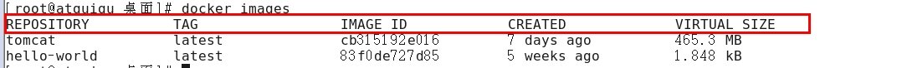

`REPOSITORY`：表示镜像的仓库源
`TAG`：镜像的标签版本号
`IMAGE ID`：镜像 ID
`CREATED`：镜像创建时间
`SIZE`：镜像大小

> 同一仓库源可以有多个 `TAG` 版本，代表这个仓库源的不同个版本，我们使用 REPOSITORY:TAG 来定义不同的镜像。
> 如果不指定一个镜像的版本标签，例如只使用 ubuntu，docker 将默认使用 ubuntu:latest 镜像

### 搜索镜像

```bash
docker search [OPTIONS] imageName
```

`OPTIONS` 说明：
`--limit`: 只列出 N 个镜像，默认 25 个

```shell
docker search --limit 5 redis
```

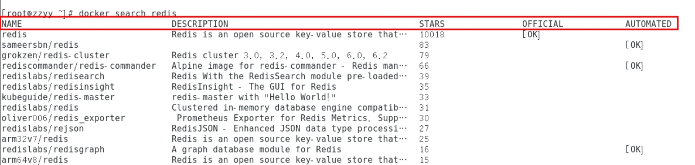

`NAME`：镜像名
`DESCRIPTION`：镜像描述
`STARS`：点赞数
`OFFICIAL`：是否官方镜像
`AUTOMATED`：是否自动构建

### 下载镜像

```bash
docker pull imageName[:TAG]
```

`TAG`：镜像版本，默认为 latest

```bash
docker pull ubuntu
```

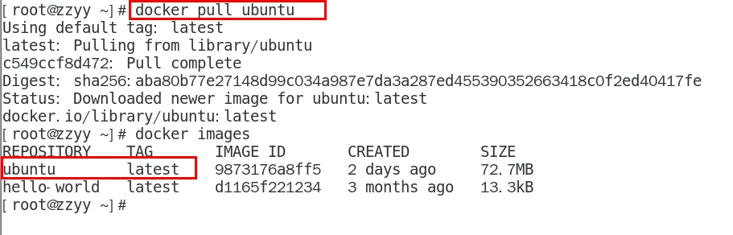

### 查看镜像/容器/数据卷所占的空间

```bash
docker system df
```

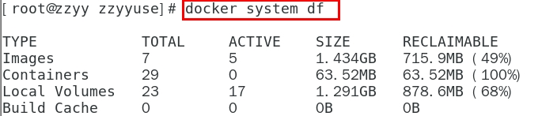

### 删除镜像

-   删除单个

```bash
docker rmi [-f] imageID
```

-   删除多个

```bash
docker rmi [-f] imageName1:TAG imageName2:TAG
```

-   删除所有

```bash
docker rmi -f $(docker images -qa)
```

## 容器命令

### 列出当前所有<font color=red>正在运行</font>的容器

```bash
docker ps [OPTIONS]
```

`OPTIONS`说明
`-a`：列出当前所有正在运行的（历史上运行过的）容器
`-l`：显示最近创建的容器。
`-n`：显示最近 n 个创建的容器。
`-q`：静默模式，只显示容器编号。

### 新建 + 启动容器

```bash
docker run [OPTIONS] IMAGE [COMMAND] [ARG...]
```

`OPTIONS` 说明
`--name="ContainerName"`：为容器指定一个名称；
`-d`：后台运行容器并返回容器 ID，也即启动守护式容器(后台运行)；
`-i`：以交互模式运行容器，通常与 `-t` 同时使用；
`-t`：为容器重新分配一个伪输入终端，通常与 `-i` 同时使用；也即启动交互式容器(前台有伪终端，等待交互)；
`-P`：随机端口映射，大写 P
`-p`：指定端口映射，小写 p
|参数|举例|
|-|-|
|`-p hostPort:containerPort`|端口映射 `-p 8080:80`|
|`-p hostIp:hostPort:containerPort`|配置监听地址 `-p 192.168.0.1:8080:80`|
|`-p hostIp::containerPort`|随机分配端口 `-p 192.168.0.1::80`|
|`-p hostPort:containerPort:udp`|指定协议 `-p 8080:80:udp`|
|`-p **** -p ****`|指定多个 `-p 87:80 -p 433:433`|

### 启动交互式容器(前台命令行)

使用镜像 `centos:latest` 以交互模式启动一个容器,在容器内执行 `/bin/bash` 命令。

```bash
docker run -it centos /bin/bash
```

> `-i`: 交互式操作。
> `-t`: 终端。
> `centos` : centos 镜像。
> `/bin/bash`：放在镜像名后的是命令，这里我们希望有个交互式 Shell，因此用的是 /bin/bash。
> 要退出终端，直接输入 `exit`

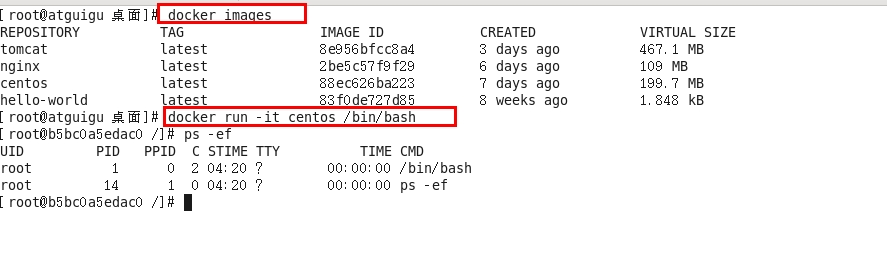

### 退出容器(正在运行的容器并以命令行交互)

两种退出方式

-   `run` 进入容器，`exit` 退出，<font color=blue>容器停止</font>。
-   `run` 进入容器，`ctrl+p+q`退出，<font color=blue>容器不停止</font>。

### 启动已停止运行的容器

```bash
docker start containId
```

```bash
docker start containName
```

### 重启容器

```bash
docker restart containId
```

```bash
docker restart containName
```

### 停止容器

```bash
docker stop containId
```

```bash
docker stop containName
```

### 强制停止容器

```bash
docker kill containId
```

```bash
docker kill containName
```

### 删除已停止的容器

-   停止一个容器

```bash
docker rm containId
```

-   一次性删除多个容器实例

```bash
docker rm -f $(docker ps -a -q)

docker ps -a -q | xargs docker rm
```

### 启动容器后会自动退出？

在大部分的场景下，我们希望 docker 的服务是在后台运行的， 我们可以过 `-d` 指定容器的后台运行模式。

```bash
# 使用镜像 centos:latest 以后台模式启动一个容器
docker run -d centos
```

运行 `docker ps -a` 进行查看, 会发现容器已经退出了

很重要的要说明的一点：<font color=red>Docker 容器后台运行，就必须有一个前台进程</font>。

容器运行的命令如果不是那些一直挂起的命令（比如运行 `top`，`tail`），就是会自动退出的。

这是 docker 的机制问题,比如 web 容器,以 nginx 为例，正常情况下,配置启动服务只需要启动响应的 service 即可。
例如

```bash
service nginx start
```

但是这样做启动的 nginx 运行在后台进程模式，就会导致 docker 前台没有运行的应用，这样的容器后台启动后，会立即自杀，因为 docker 认为它没事可做了。

所以，最佳的解决方案是将要运行的程序以前台进程的形式运行，<font color=red>常见就是命令行模式，表示接下来还有交互操作，不要中断</font>。

### 案例：启动 Ubuntu

-   启动 Ubuntu

    -   前台交互式启动：

    ```bash
    docker run -it ubuntu /bin/bash
    ```

    -   启动后台进程：

    ```bash
    docker run -d ubuntu
    ```

-   查看容器日志

```bash
docker logs ContainerID
```

-   查看容器内运行的进程

```bash
docker top containerID
```

-   查看容器内部细节

```bash
docker inspect containerID
```

-   进入正在运行的容器并以命令行交互

```bash
docker exec -it containerID bashShell
```

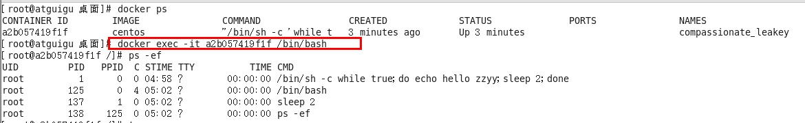
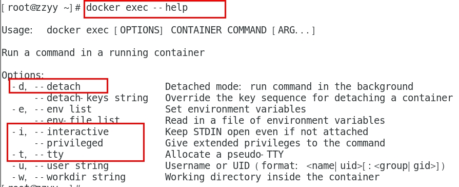

-   退出后，重新进入容器

```bash
docker attach containerID
```

> `docker exec` 与 `docker attach` 的区别
>
> -   `attach` 直接进入容器启动命令的终端，不会启动新的进程 用 `exit` 退出，会导致容器的停止。
>     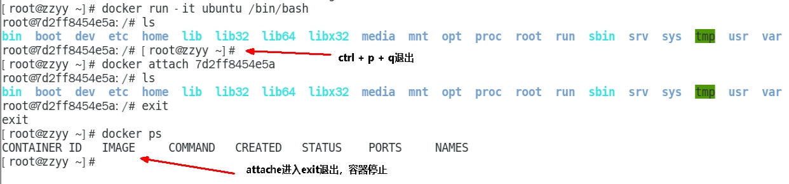
> -   `exec` 是在容器中打开新的终端，并且可以启动新的进程 用`exit`退出，不会导致容器的停止。
>     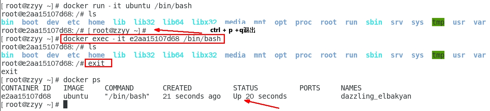

### 导入和导出容器

-   导出容器

```bash
docker export containerID > filename.tar
```

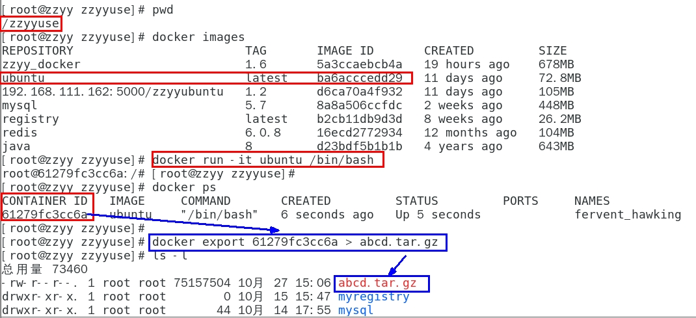

-   导入容器

```bash
cat filename.tar | docker import - imageUser/imageName:imageTag
```

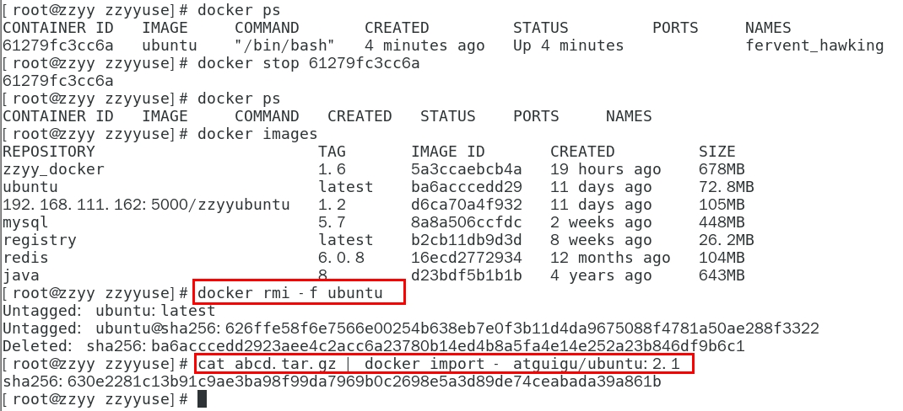

## 总结

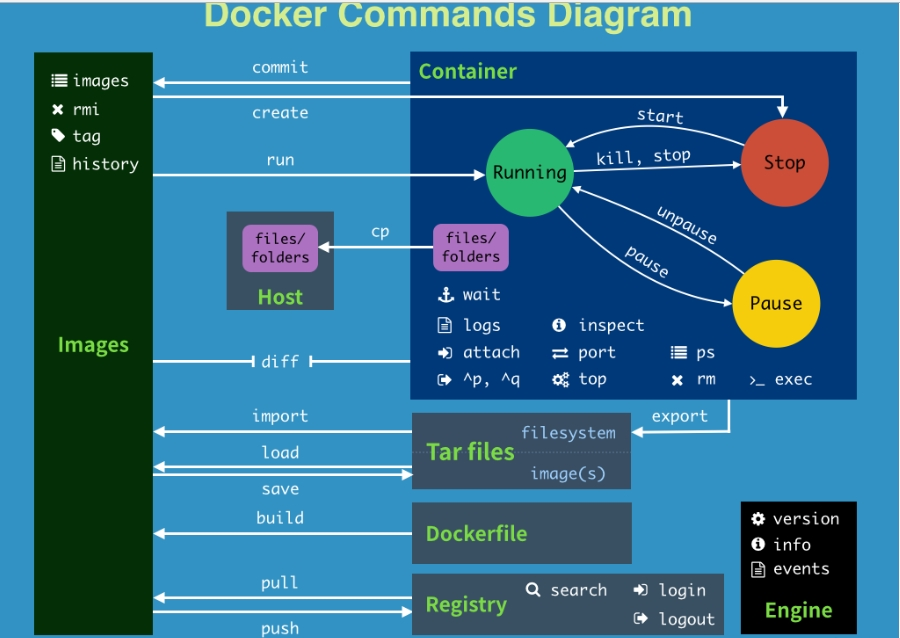

| command     | description                                                                                                             |
| ----------- | ----------------------------------------------------------------------------------------------------------------------- |
| `attach`    | Attach to a running container - 当前 shell 下 attach 连接指定运行镜像                                                   |
| `build`     | Build an image from a Dockerfile - 通过 Dockerfile 定制镜像                                                             |
| `commit`    | Create a new image from a container changes - 提交当前容器为新的镜像                                                    |
| `cp`        | Copy files/folders from the containers filesystem to the host path - 从容器中拷贝指定文件或者目录到宿主机中             |
| `create`    | Create a new container - 创建一个新的容器，同 `run`，但不启动容器                                                       |
| `diff`      | Inspect changes on a container filesystem - 查看 docker 容器变化                                                        |
| `events`    | Get real time events from the server - 从 docker 服务获取容器实时事件                                                   |
| `exec`      | Run a command in an existing container - 在已存在的容器上运行命令                                                       |
| `export`    | Stream the contents of a container as a tar archive - 导出容器的内容流作为一个 tar 归档文件[对应 `import` ]             |
| `history`   | Show the history of an image - 展示一个镜像形成历史                                                                     |
| `images`    | List images - 列出系统当前镜像                                                                                          |
| `import`    | Create a new filesystem image from the contents of a tarball - 从 tar 包中的内容创建一个新的文件系统映像[对应 `export`] |
| `info`      | Display system-wide information - 显示系统相关信息                                                                      |
| `inspect`   | Return low-level information on a container - 查看容器详细信息                                                          |
| `kill`      | Kill a running container - kill 指定 docker 容器                                                                        |
| `load`      | Load an image from a tar archive - 从一个 tar 包中加载一个镜像[对应 save]                                               |
| `login`     | Register or Login to the docker registry server - 注册或者登陆一个 docker 源服务器                                      |
| `logout`    | Log out from a Docker registry server - 从当前 Docker registry 退出                                                     |
| `logs`      | Fetch the logs of a container - 输出当前容器日志信息                                                                    |
| `port`      | Lookup the public-facing port which is NAT-ed to PRIVATE_PORT - 查看映射端口对应的容器内部源端口                        |
| `pause`     | Pause all processes within a container - 暂停容器                                                                       |
| `ps`        | List containers - 列出容器列表                                                                                          |
| `pull`      | Pull an image or a repository from the docker registry server - 从 docker 镜像源服务器拉取指定镜像或者库镜像            |
| `push`      | Push an image or a repository to the docker registry server - 推送指定镜像或者库镜像至 docker 源服务器                  |
| `restart`   | Restart a running container - 重启运行的容器                                                                            |
| `rm`        | Remove one or more containers - 移除一个或者多个容器                                                                    |
| `rmi`       | Remove one or more images - 移除一个或多个镜像[无容器使用该镜像才可删除，否则需删除相关容器才可继续或 `-f` 强制删除]    |
| `run`       | Run a command in a new container - 创建一个新的容器并运行一个命令                                                       |
| `save`      | Save an image to a tar archive - 保存一个镜像为一个 tar 包[对应 load]                                                   |
| `search`    | Search for an image on the Docker Hub - 在 docker hub 中搜索镜像                                                        |
| `start`     | Start a stopped containers - 启动容器                                                                                   |
| `stop`      | Stop a running containers - 停止容器                                                                                    |
| `tag`       | Tag an image into a repository - 给源中镜像打标签                                                                       |
| `top`       | Lookup the running processes of a container - 查看容器中运行的进程信息                                                  |
| `unpause`   | Unpause a paused container - 取消暂停容器                                                                               |
| `version`   | Show the docker version information - 查看 docker 版本号                                                                |
| `wait`      | Block until a container stops, then print its exit code - 截取容器停止时的退出状态值                                    |
