镜像是一种轻量级、可执行的独立软件包，它包含运行某个软件所需的所有内容，我们把应用程序和配置依赖打包好形成一个可交付的运行环境(包括代码、运行时需要的库、环境变量和配置文件等)，这个打包好的运行环境就是 image 镜像文件。

## Docker 镜像加载原理

docker 的镜像实际上由一层一层的文件系统组成，这种层级的文件系统 UnionFS。
bootfs(boot file system)主要包含 bootloader 和 kernel, bootloader 主要是引导加载 kernel, Linux 刚启动时会加载 bootfs 文件系统，在 Docker 镜像的最底层是引导文件系统 bootfs。这一层与我们典型的 Linux/Unix 系统是一样的，包含 boot 加载器和内核。当 boot 加载完成之后整个内核就都在内存中了，此时内存的使用权已由 bootfs 转交给内核，此时系统也会卸载 bootfs。

rootfs (root file system) ，在 bootfs 之上。包含的就是典型 Linux 系统中的 /dev, /proc, /bin, /etc 等标准目录和文件。rootfs 就是各种不同的操作系统发行版，比如 Ubuntu，Centos 等等。

> 平时安装进虚拟机的 CentOS 都是好几个 G，为什么 docker 这里才 200M？？
> 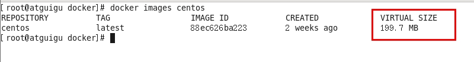
> 对于一个精简的 OS，rootfs 可以很小，只需要包括最基本的命令、工具和程序库就可以了，因为底层直接用 Host 的 kernel，自己只需要提供 rootfs 就行了。由此可见对于不同的 linux 发行版, bootfs 基本是一致的, rootfs 会有差别, 因此不同的发行版可以公用 bootfs。

## Docker 镜像层都是只读的，容器层是可写的

当容器启动时，一个新的可写层被加载到镜像的顶部。这一层通常被称作“容器层”，“容器层”之下的都叫“镜像层”。
所有对容器的改动 - 无论添加、删除、还是修改文件都只会发生在容器层中。只有容器层是可写的，容器层下面的所有镜像层都是只读的。

> 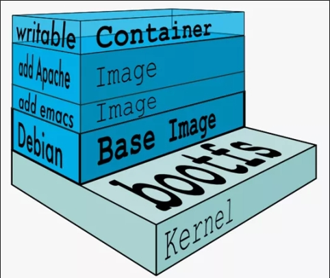

## Docker 镜像 `commit` 操作案例

`docker commit`：提交容器副本使之成为一个新的镜像

```bash
docker commit -m="提交的描述信息" -a="作者" 容器ID 要创建的目标镜像名:[标签名]
```

**案例演示 ubuntu 安装 vim**

-   从 Hub 上下载 ubuntu 镜像到本地并成功运行
-   原始的默认 Ubuntu 镜像是不带着 `vim` 命令的
    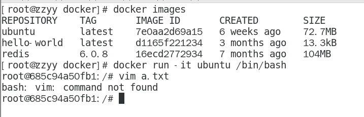
-   外网连通的情况下，安装 vim
    ```bash
    # 更新包管理工具
    apt-get update
    # 安装 vim
    apt-get install -y vim
    ```
    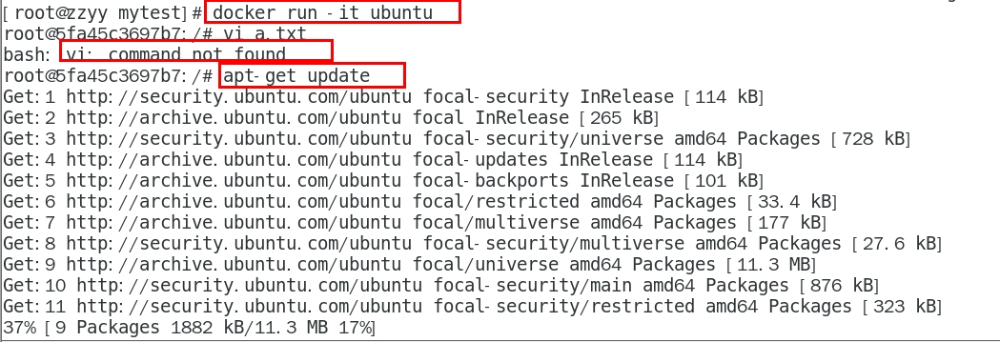
    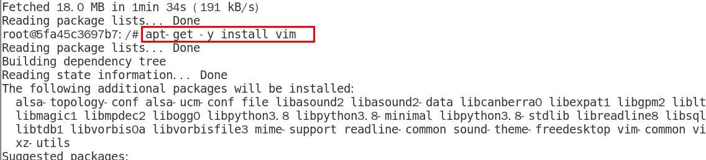
-   安装完成后，`commit` 自己的新镜像
    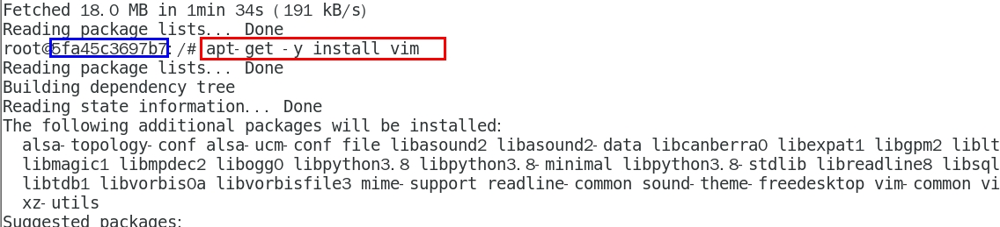
    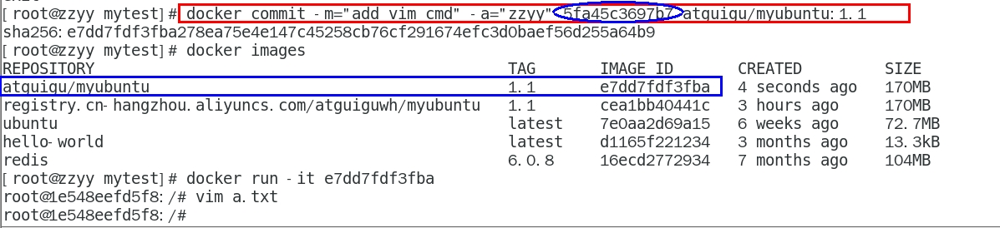
-   启动新镜像并和原来的对比
    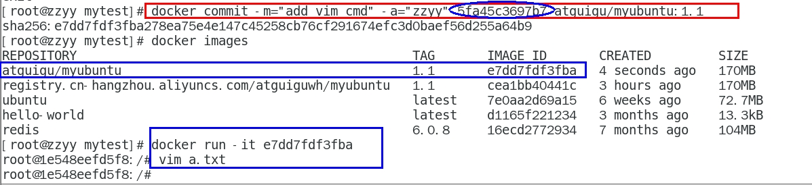
    -   官网是默认下载的 Ubuntu 没有 `vim` 命令
    -   自己 `commit` 构建的镜像，新增加了 `vim` 功能，可以成功使用。

## 本地镜像发布到阿里云

### 本地镜像发布到阿里云流程

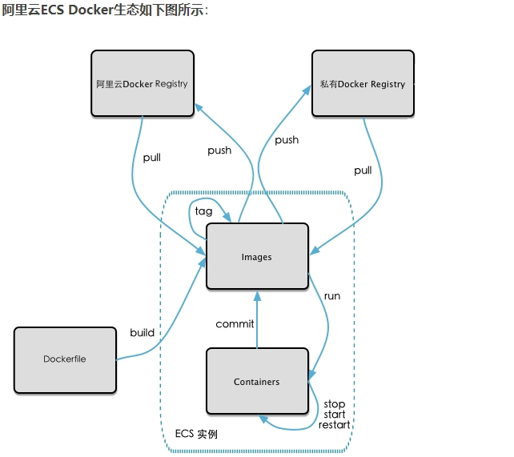

### 生成镜像

基于当前容器创建一个新的镜像，新功能增强

```bash
docker commit [OPTIONS] 容器ID [REPOSITORY[:TAG]]
```

OPTIONS 说明：
`-a` :提交的镜像作者；
`-m` :提交时的说明文字；

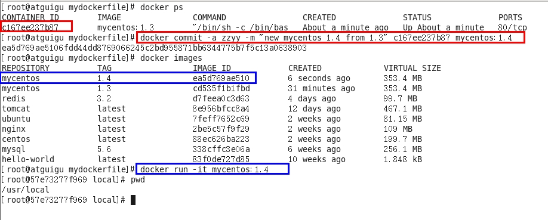

### 将本地镜像推送到阿里云

-   本地镜像素材原型
    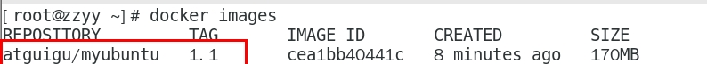
-   阿里云开发者平台
    https://promotion.aliyun.com/ntms/act/kubernetes.html
    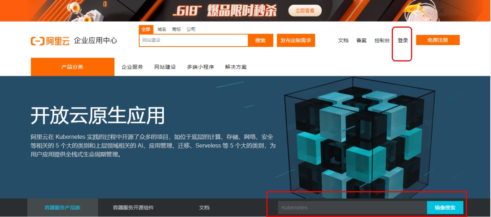
    -   创建仓库镜像
        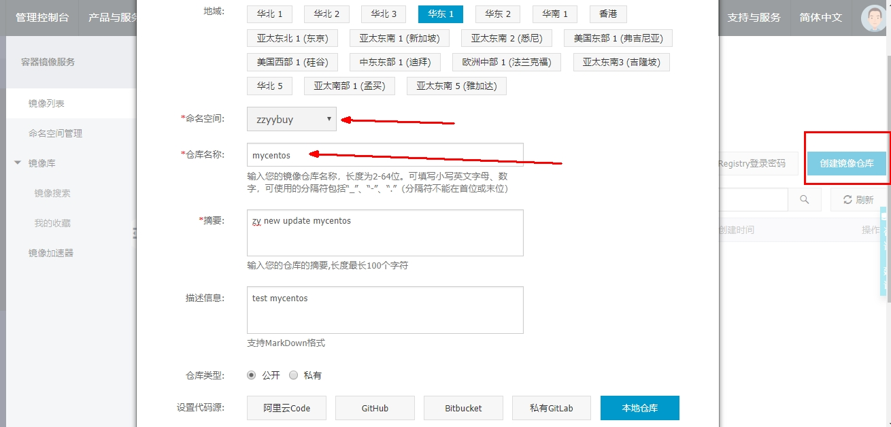
    -   选择控制台，进入容器镜像服务
        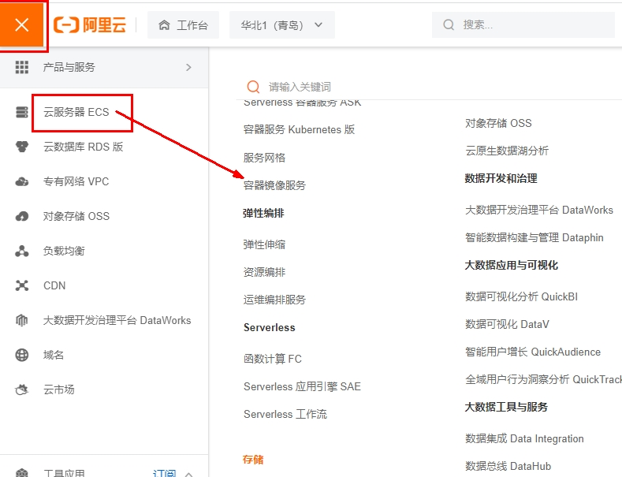
    -   选择个人实例
        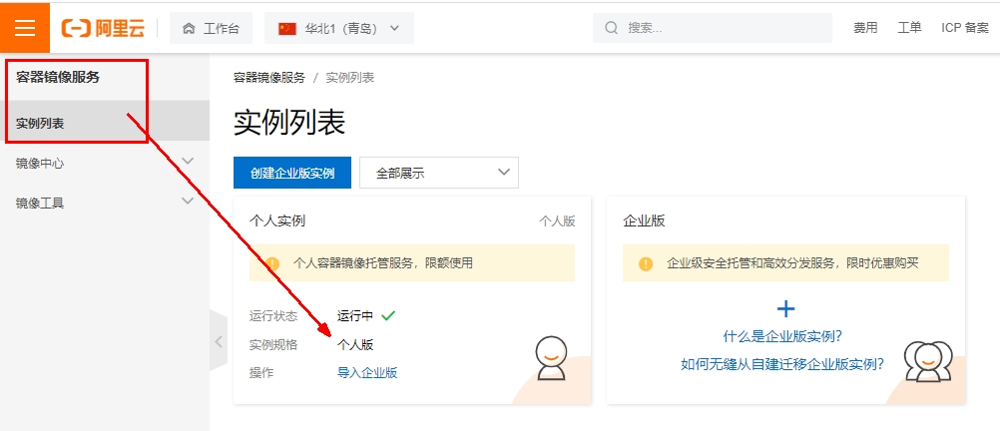
    -   命名空间
        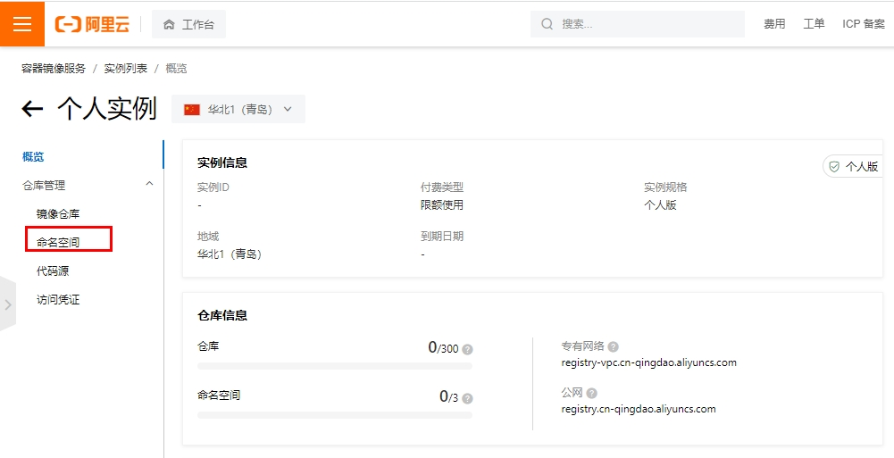
        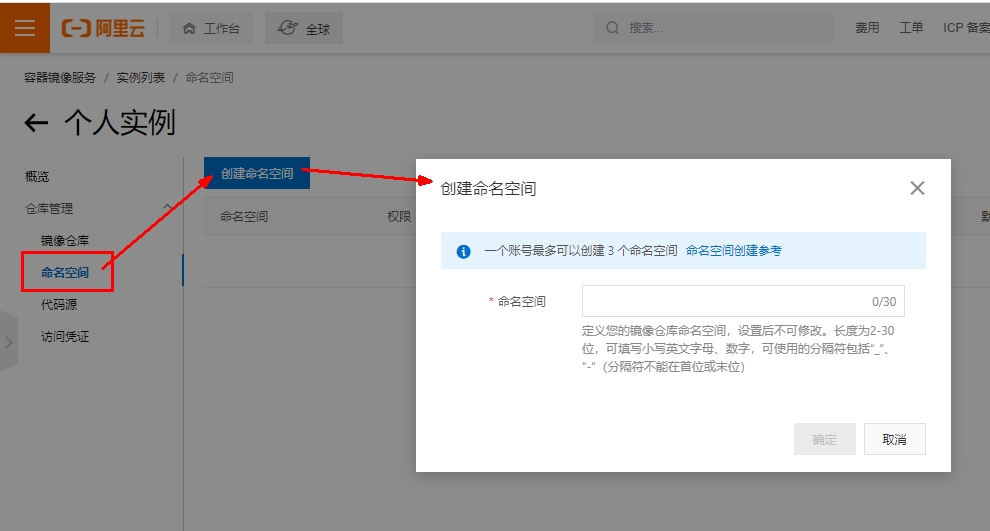
        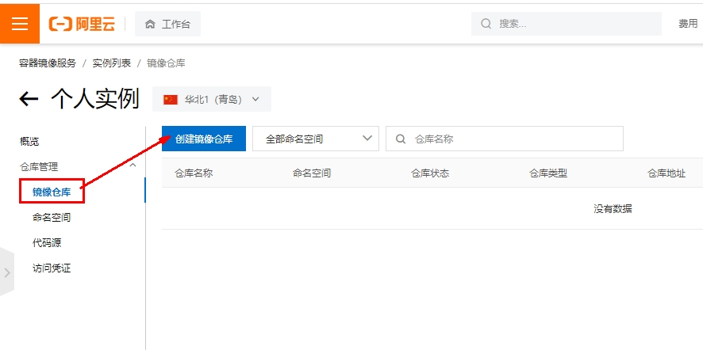
        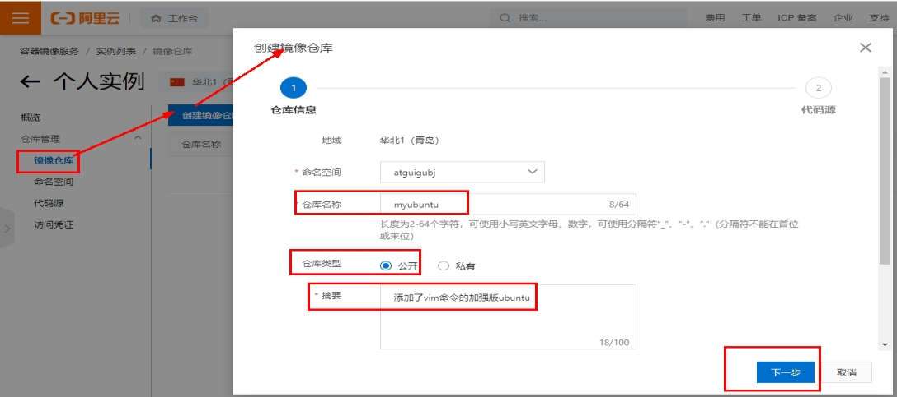
        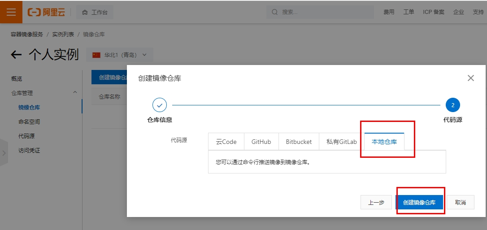
    -   进入管理界面获得脚本
        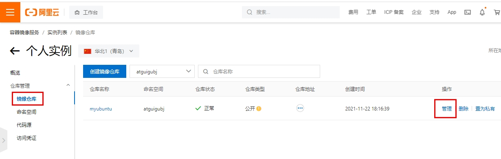
-   将镜像推送到阿里云

    -   管理界面脚本
        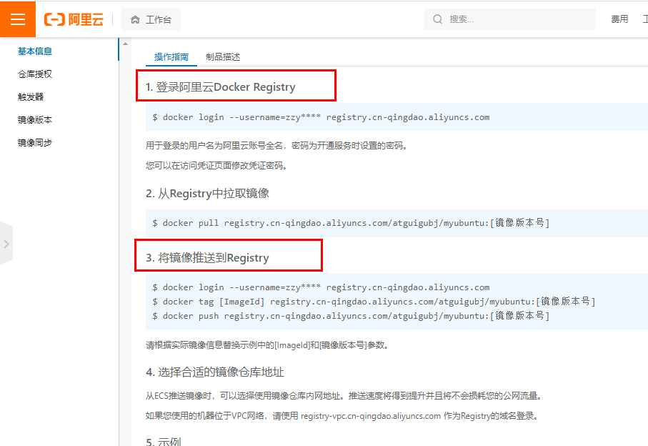
    -   脚本实例

    ```bash
    docker login --username=zzyybuy registry.cn-hangzhou.aliyuncs.com
    docker tag cea1bb40441c registry.cn-hangzhou.aliyuncs.com/atguiguwh/myubuntu:1.1
    docker push registry.cn-hangzhou.aliyuncs.com/atguiguwh/myubuntu:1.1

    ```

    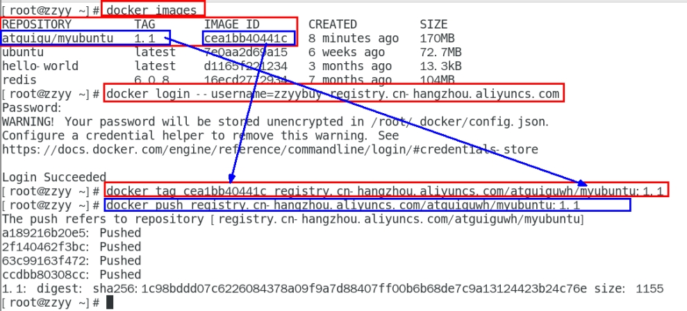

## 将阿里云上的镜像下载到本地

```bash
docker pull registry.cn-hangzhou.aliyuncs.com/atguiguwh/myubuntu:1.1
```

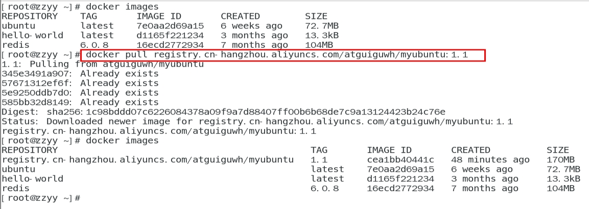
