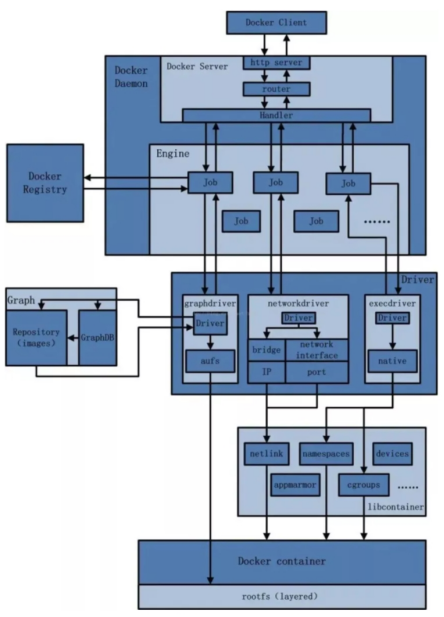
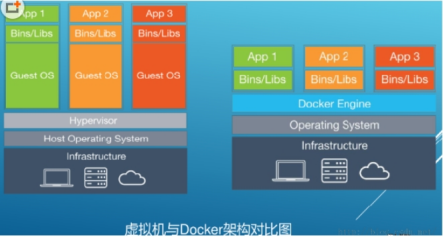

## Docker 运行的基本流程：

1. 用户是使用 Docker Client 与 Docker Daemon 建立通信，并发送请求给后者。

2. Docker Daemon 作为 Docker 架构中的主体部分，首先提供 Docker Server 的功能使其可以接受 Docker Client 的请求。

3. Docker Engine 执行 Docker 内部的一系列工作，每一项工作都是以一个 Job 的形式的存在。

4. Job 的运行过程中，当需要容器镜像时，则从 Docker Registry 中下载镜像，并通过镜像管理驱动 Graph driver 将下载镜像以 Graph 的形式存储。

5. 当需要为 Docker 创建网络环境时，通过网络管理驱动 Network driver 创建并配置 Docker 容器网络环境。

6. 当需要限制 Docker 容器运行资源或执行用户指令等操作时，则通过 Exec driver 来完成。

7. Libcontainer 是一项独立的容器管理包，Network driver 以及 Exec driver 都是通过 Libcontainer 来实现具体对容器进行的操作。

## 为什么 Docker 会比 VM 虚拟机快

1. docker 有着比虚拟机更少的抽象层

    由于 docker 不需要 Hypervisor(虚拟机)实现硬件资源虚拟化,运行在 docker 容器上的程序直接使用的都是实际物理机的硬件资源。因此在 CPU、内存利用率上 docker 将会在效率上有明显优势。
    

2. docker 利用的是宿主机的内核,而不需要加载操作系统 OS 内核

    当新建一个容器时,docker 不需要和虚拟机一样重新加载一个操作系统内核。进而避免引寻、加载操作系统内核返回等比较费时费资源的过程,当新建一个虚拟机时,虚拟机软件需要加载 OS,返回新建过程是分钟级别的。而 docker 由于直接利用宿主机的操作系统,则省略了返回过程,因此新建一个 docker 容器只需要几秒钟。
    | | Docker 容器| 虚拟机 |
    | --- | --- | --- |
    | 操作系统 | 与宿主机共享 OS | 宿主机 OS 上运行虚拟机 OS |
    | 存储大小 | 镜像小，便于储存与传输 | 镜像庞大 |
    | 运行性能 | 几乎无额外损失 | 有操作系统额外的 CPU、内存消耗 |
    | 移植性 | 轻便、灵活，适应于 Linux | 笨重，与虚拟化技术耦合度高 |
    | 硬件亲和性 | 软件开发者 | 硬件运维者 |
    | 部署速度 | 快（秒级） | 较慢（10S 以上） |
