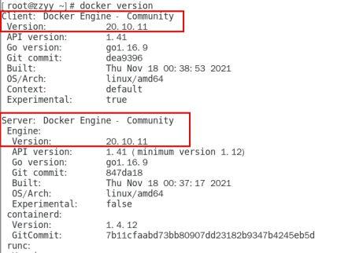
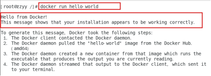
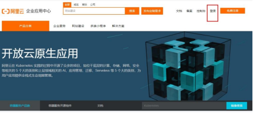
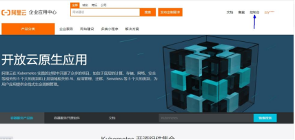
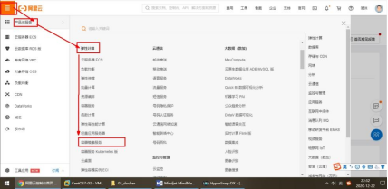
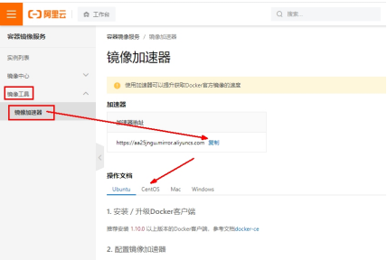
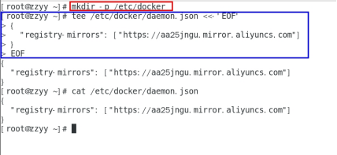
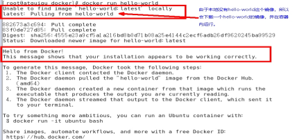
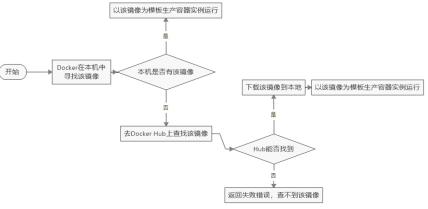

## CentOS7 安装 Docker

地址： https://docs.docker.com/engine/install/centos/

### 确定虚拟机是 CentOS7 及以上版本

```bash
cat /etc/redhat-release
```

### 卸载旧版本 Docker

旧版本的 Docker 曾经叫 `docker` 或者 `docker-engine`，如果已经安装了旧版本，请卸载它：

```bash
sudo yum remove docker \
         docker-client \
         docker-client-latest \
         docker-common \
         docker-latest \
         docker-latest-logrotate \
         docker-logrotate \
         docker-engine
```

如果成功了，会显示 `none of these packages are installed`。

### 安装 `gcc`

```bash
`yum -y install gcc`
`yum -y install gcc-c++`
```

### 安装 `yum-utils`

```bash
 sudo yum -y install yum-utils
```

### 设置 stable 镜像仓库

-   官方推荐

```bash
sudo yum-config-manager --add-repo https://download.docker.com/linux/centos/docker-ce.repo
```

-   阿里镜像源

```bash
yum-config-manager --add-repo http://mirrors.aliyun.com/docker-ce/linux/centos/docker-ce.repo
```

### 更新 yum 软件包索引

```bash
sudo yum makecache fast
```

### 安装 `docker-ce`

```bash
yum -y install docker-ce docker-ce-cli containerd.io
```

### 启动 Docker

```bash
systemctl start docker
```

测试是否安装成功

```bash
docker version
```



```bash
docker run hello-world
```



## 卸载 Docker

### 卸载 Docker 引擎， CLI 和容器包

```bash
sudo yum remove docker-ce docker-ce-cli containerd.io
```

### 卸载镜像、容器、卷和自定义卷

镜像、容器、卷和自定义卷不会自动删除，需要手动删除

```bash
sudo rm -rf /var/lib/docker
sudo rm -rf /var/lib/containerd
```

## 补充：阿里云镜像加速

地址：https://promotion.aliyun.com/ntms/act/kubernetes.html

### 获取加速器链接

-   登陆阿里云开发者平台
    
-   点击控制台
    
-   选择容器镜像服务
    
-   获取加速器地址
    
### 执行脚本
- 粘贴脚本直接执行

```bash
mkdir -p /etc/docker
```

```bash
tee /etc/docker/daemon.json <<-'EOF'
{
  "registry-mirrors": ["https://aa25jngu.mirror.aliyuncs.com"]
}
EOF
```

- 或者分步执行命令
```bash
mkdir -p /etc/docker
```
```bash
 #阿里云
{
  "registry-mirrors": ["https://｛自已的编码｝.mirror.aliyuncs.com"]
}
```
### 重启服务器
```bash
systemctl daemon-reload
systemctl restart docker
```
- 启动Docker后台容器(测试运行 hello-world)
```bash
docker run hello-world
```


### `docker run` 干了什么

