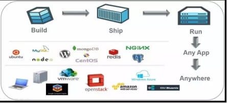
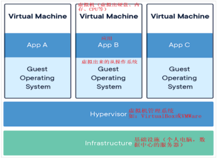
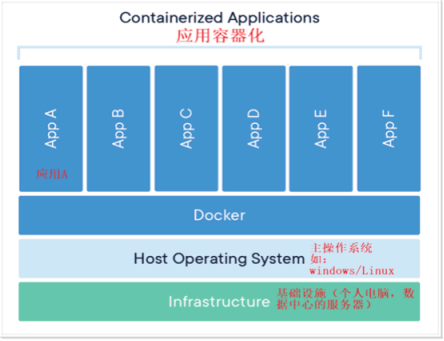
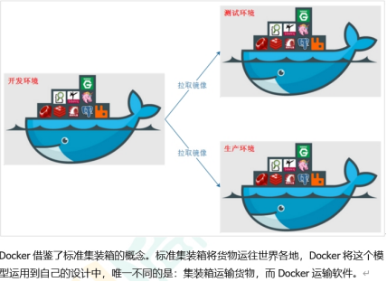

## Docker 理念

Docker 是基于 Go 语言实现的云开源项目。

Docker 的主要目标是“Build，Ship and Run Any App,Anywhere”，也就是通过对应用组件的封装、分发、部署、运行等生命周期的管理，使用户的 APP（可以是一个 WEB 应用或数据库应用等等）及其运行环境能够做到“一次镜像，处处运行”。

Linux 容器技术的出现就解决了这样一个问题，而 Docker 就是在它的基础上发展过来的。将应用打成镜像，通过镜像成为运行在 Docker 容器上面的实例，而 Docker 容器在任何操作系统上都是一致的，这就实现了跨平台、跨服务器。只需要一次配置好环境，换到别的机子上就可以一键部署好，大大简化了操作。

Docker 解决了运行环境和配置问题的软件容器， 方便做持续集成并有助于整体发布的容器虚拟化技术。

## 容器与虚拟机比较

### 传统虚拟机技术

虚拟机（virtual machine）就是带环境安装的一种解决方案。

传统虚拟机技术基于安装在主操作系统上的虚拟机管理系统（VirtualBox、VMware 等），创建虚拟机（虚拟出各种硬件），在虚拟机上安装操作系统，再从操作系统中安装部署各种应用。

虚拟机的缺点：
1. 资源占用多
2. 冗余步骤多
3. 启动慢

### 容器虚拟化技术
由于前面虚拟机存在某些缺点，Linux发展出了另一种虚拟化技术：
Linux容器(Linux Containers，缩写为 LXC)
Linux容器是与系统其他部分隔离开的一系列进程，从另一个镜像运行，并由该镜像提供支持进程所需的全部文件。容器提供的镜像包含了应用的所有依赖项，因而在从开发到测试再到生产的整个过程中，它都具有可移植性和一致性。
 
Linux 容器不是模拟一个完整的操作系统而是对进程进行隔离。有了容器，就可以将软件运行所需的所有资源打包到一个隔离的容器中。容器与虚拟机不同，不需要捆绑一整套操作系统，只需要软件工作所需的库资源和设置。系统因此而变得高效轻量并保证部署在任何环境中的软件都能始终如一地运行。

Docker 容器实在操作系统层面上实现虚拟化，直接复用本地主机的操作系统，而传统虚拟机则是在硬件层面实现虚拟化，Docker 优势体现为启动速度快、占用体积小。

### 对比
* 传统虚拟机技术是虚拟出一套硬件后，在其上运行一个完整操作系统，在该系统上再运行所需应用进程；
* 容器内的应用进程直接运行于宿主的内核，容器内没有自己的内核且也没有进行硬件虚拟。因此容器要比传统虚拟机更为轻便。
* 每个容器之间互相隔离，每个容器有自己的文件系统 ，容器之间进程不会相互影响，能区分计算资源。

### 应用场景

### 下载
* [Docker 官网 [点击跳转]](https://www.docker.com/products/docker-desktop)
* [Docker Hub官网 [点击跳转]](https://hub.docker.com/)