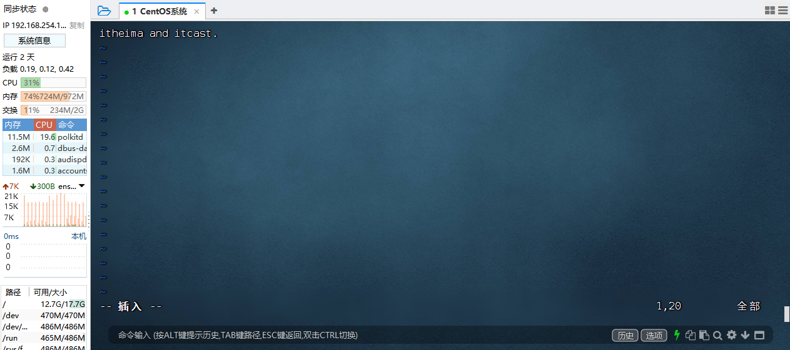
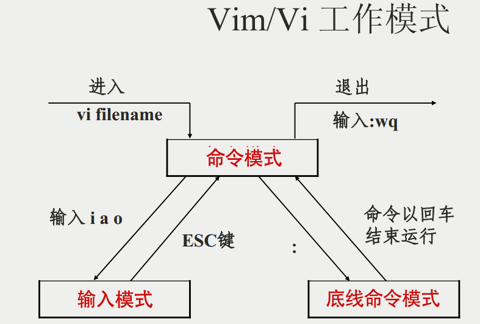
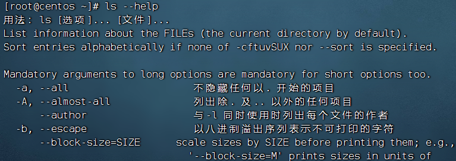

## Linux 命令基础格式
无论是什么命令，用于什么用途，在Linux中，命令有其通用的格式：
```bash
command [-options] [parameter]
```
- `command`： 命令本身。
- `options`：[可选，非必填] 命令的一些选项，可以通过选项控制命令的行为细节。
- `parameter`：[可选，非必填] 命令的参数，多数用于命令的指向目标等。
- `[]`: 表示可选


## `ls` 命令

功能：列出文件夹信息

语法：`ls [-l -h -a] [参数]`

- 参数：被查看的文件夹，不提供参数，表示查看当前工作目录
- -l，以列表形式查看
- -h，配合-l，以更加人性化的方式显示文件大小
- -a，显示隐藏文件


### 隐藏文件、文件夹

在Linux中以`.`开头的，均是隐藏的。

默认不显示出来，需要`-a`选项才可查看到。


## `cd` 命令

`cd` 命令，来自：<font color=red>C</font>hange <font color=red>D</font>irectory

`cd` 命令可以切换当前工作目录，语法：
```bash
cd [目标目录]
```
- 没有选项，只有参数，表示目标路径
- 使用参数，切换到指定路径
- 不使用参数，切换工作目录到当前用户的HOME

## `pwd` 命令

`pwd` 命令来自：<font color=red>P</font>rint <font color=red>W</font>ork <font color=red>D</font>irectory

功能：展示当前工作目录

语法：`pwd`


## `HOME` 目录

每一个用户在Linux系统中都有自己的专属工作目录，称之为HOME目录。

- 普通用户的HOME目录，默认在：`/home/用户名`

- root用户的HOME目录，在：`/root`


FinalShell 登陆终端后，默认的工作目录就是用户的HOME目录


## 相对路径、绝对路径

- 相对路径，==非==`/`开头的称之为相对路径

  相对路径表示以`当前目录`作为起点，去描述路径，如`test/a.txt`，表示当前工作目录内的test文件夹内的a.txt文件

- 绝对路径，==以==`/`开头的称之为绝对路径

  绝对路径从`根`开始描述路径


## 特殊路径符

- `.`，表示当前，比如./a.txt，表示当前文件夹内的`a.txt`文件
- `..`，表示上级目录，比如`../`表示上级目录，`../../`表示上级的上级目录
- `~`，表示用户的HOME目录，比如`cd ~`，即可切回用户HOME目录


## `mkdir` 命令

功能：创建文件夹

语法：`mkdir [-p] 参数`

- 参数：被创建文件夹的路径
- 选项：-p，可选，表示创建前置路径


## `touch` 命令

功能：创建文件

语法：`touch 参数`

- 参数：被创建的文件路径


## `cat` 命令

功能：查看文件内容

语法：`cat 参数`

- 参数：被查看的文件路径


## `more` 命令

功能：查看文件，可以支持翻页查看

语法：`more 参数`

- 参数：被查看的文件路径
- 在查看过程中：
  - `空格`键翻页
  - `q`退出查看


## `cp` 命令

功能：复制文件、文件夹

语法：`cp [-r] 参数1 参数2`

- 参数1，被复制的
- 参数2，要复制去的地方
- 选项：-r，可选，复制文件夹使用

示例：

- cp a.txt b.txt，复制当前目录下a.txt为b.txt
- cp a.txt test/，复制当前目录a.txt到test文件夹内
- cp -r test test2，复制文件夹test到当前文件夹内为test2存在


## `mv` 命令

功能：移动文件、文件夹

语法：`mv 参数1 参数2`

- 参数1：被移动的
- 参数2：要移动去的地方，参数2如果不存在，则会进行改名


## `rm` 命令

功能：删除文件、文件夹

语法：`rm [-r -f] 参数...参数`

- 参数：支持多个，每一个表示被删除的，空格进行分隔
- 选项：-r，删除文件夹使用
- 选项：-f，强制删除，不会给出确认提示，一般root用户会用到


> rm命令很危险，一定要注意，特别是切换到root用户的时候。


## `which` 命令

功能：查看命令的程序本体文件路径

语法：`which 参数`

- 参数：被查看的命令


## `find` 命令

功能：搜索文件

语法1按文件名搜索：`find 路径 -name 参数`

- 路径，搜索的起始路径
- 参数，搜索的关键字，支持通配符*， 比如：`*`test表示搜索任意以test结尾的文件


## `grep` 命令

功能：过滤关键字

语法：`grep [-n] 关键字 文件路径`

- 选项-n，可选，表示在结果中显示匹配的行的行号。
- 参数，关键字，必填，表示过滤的关键字，带有空格或其它特殊符号，建议使用””将关键字包围起来
- 参数，文件路径，必填，表示要过滤内容的文件路径，可作为内容输入端口


> 参数文件路径，可以作为管道符的输入


## `wc` 命令

功能：统计

语法：`wc [-c -m -l -w] 文件路径`

- 选项，-c，统计bytes数量
- 选项，-m，统计字符数量
- 选项，-l，统计行数
- 选项，-w，统计单词数量
- 参数，文件路径，被统计的文件，可作为内容输入端口


> 参数文件路径，可作为管道符的输入


## 管道符 `|`

写法：`|`

功能：将符号左边的结果，作为符号右边的输入

示例：

`cat a.txt | grep babala`，将cat a.txt的结果，作为grep命令的输入，用来过滤`babala`关键字


可以支持嵌套：

`cat a.txt | grep babala | grep hahala`


## `echo` 命令

功能：输出内容

语法：`echo 参数`

- 参数：被输出的内容


## `\` 反引号

功能：被两个反引号包围的内容，会作为命令执行

示例：

- echo \`pwd\`，会输出当前工作目录


## `tail` 命令

功能：查看文件尾部内容

语法：`tail [-f] 参数`

- 参数：被查看的文件
- 选项：-f，持续跟踪文件修改


## `head` 命令

功能：查看文件头部内容

语法：`head [-n] 参数`

- 参数：被查看的文件
- 选项：-n，查看的行数


## 重定向符

功能：将符号左边的结果，输出到右边指定的文件中去

- `>`，表示覆盖输出
- `>>`，表示追加输出


## `vi` 编辑器

vi 是 visual interface 的简称, 是 Linux 中最经典的文本编辑器

同图形化界面中的 文本编辑器一样，vi 是命令行下对文本文件进行编辑的绝佳选择。

vim 是 vi 的加强版本，兼容 vi 的所有指令，不仅能编辑文本，而且还具有 shell 程序编辑的功能，可以不同颜色的字体来辨别语法的正确性，极大方便了程序的设计和编辑性。



### vi\vim 编辑器的三种工作模式

#### **命令**模式（Command mode）
命令模式下，所敲的按键编辑器都理解为命令，以命令驱动执行不同的功能。
此模式下，不能自由进行文本编辑。

#### **输入**模式（Insert mode）
也就是所谓的编辑模式、插入模式。
此模式下，可以对文件内容进行自由编辑。

#### **底线命令**模式（Last line mode）
以 `:` 开始，通常用于文件的保存、退出。

### 实操
通过 vi/vim 命令编辑文件，会打开一个新的窗口，此时这个窗口就是：命令模式窗口
命令模式是 vi 编辑器的入口和出口，如下图
- 进入 vi 编辑器会进入命令模式
- 通过命令模式输入键盘指令，可以进入输入模式
- 输入模式需要退回到命令模式，然后通过命令可以进入底线命令模式

快速体验
1. 使用：`vim hello.txt`，编辑一个新文件，执行后进入的是命令模式
2. 在命令模式内，按键盘 i ，进入输入模式
3. 在输入模式内输入：`babala and lalaba`.
4. 输入完成后，按 esc 回退会命令模式
5. 在命令模式内，按键盘 `:` ，进入底线命令模式
6. 在底线命令内输入：`wq`，保存文件并退出 vi 编辑器


### 命令模式快捷键
|模式|命令|描述|
|-|-|-|
|命令模式|<font color=#be4d25>i</font>|在当前光标位置进入<font color=#be4d25>输入模式</font>|
|命令模式|<font color=#be4d25>a</font>|在当前光标位置之后<font color=#be4d25>输入模式</font>|
|命令模式|<font color=#be4d25>I</font>|在当前行的开头，进入<font color=#be4d25>输入模式</font>|
|命令模式|<font color=#be4d25>A</font>|在当前行的结尾，进入<font color=#be4d25>输入模式</font>|
|命令模式|<font color=#be4d25>o</font>|在当光标下一行，进入<font color=#be4d25>输入模式</font>|
|命令模式|<font color=#be4d25>O</font>|在当光标上一行，进入<font color=#be4d25>输入模式</font>|
|输入模式|<font color=#be4d25>esc</font>|在任何情况下输入 <font color=#be4d25>esc</font> 都能回到命令模式|
|命令模式|<font color=#be4d25>键盘 ↑、键盘 k</font>|向上移动光标|
|命令模式|<font color=#be4d25>键盘 ↓、键盘 j</font>|向下移动光标|
|命令模式|<font color=#be4d25>键盘 ←、键盘 h</font>|向左移动光标|
|命令模式|<font color=#be4d25>键盘 →、键盘 l</font>|向后移动光标|
|命令模式|<font color=#be4d25>0</font>（数字）|移动光标到当前行的开头|
|命令模式|<font color=#be4d25>$</font>|移动光标到当前行的结尾|
|命令模式|<font color=#be4d25>pageup(PgUp)</font>|向上翻页|
|命令模式|<font color=#be4d25>pagedoen(PgDn)</font>|向下翻页|
|命令模式|<font color=#be4d25>/</font>|进入搜索模式|
|命令模式|<font color=#be4d25>n</font>|向下继续搜索|
|命令模式|<font color=#be4d25>N</font>|向上继续搜索|
|命令模式|<font color=#be4d25>dd</font>|删除光标所在行的内容|
|命令模式|<font color=#be4d25>ndd</font>|n 是数字，表示删除当前光标向下 n 行|
|命令模式|<font color=#be4d25>yy</font>|复制当前行|
|命令模式|<font color=#be4d25>nyy</font>|n 是数字，表示复制当前光标向下 n 行|
|命令模式|<font color=#be4d25>p</font>|粘贴复制的内容|
|命令模式|<font color=#be4d25>u</font>|撤销修改|
|命令模式|<font color=#be4d25>ctrl + r</font>|反向撤销修改|
|命令模式|<font color=#be4d25>gg</font>|跳到首行|
|命令模式|<font color=#be4d25>G</font>|跳到行尾|
|命令模式|<font color=#be4d25>dG</font>|从当前行开始，向下全部删除|
|命令模式|<font color=#be4d25>dgg</font>|从当前行开始，向上全部删除|
|命令模式|<font color=#be4d25>d$</font>|从当前光标开始，删除到本行的结尾|
|命令模式|<font color=#be4d25>d0</font>|从当前光标开始，删除到本行的开头|


### 底线命令快捷键

|模式|命令|描述|
|-|-|-|
|底线命令模式|<font color=#be4d25>:wq</font>|保存并退出|
|底线命令模式|<font color=#be4d25>:q</font>|仅退出|
|底线命令模式|<font color=#be4d25>:q!</font>|强制退出|
|底线命令模式|<font color=#be4d25>:q!</font>|强制退出|
|底线命令模式|<font color=#be4d25>:w</font>|仅保存|
|底线命令模式|<font color=#be4d25>:set nu</font>|显示行号|
|底线命令模式|<font color=#be4d25>:set paste</font>|设置粘贴模式|


## 命令的选项

Linux命令，可以拥有的选项很多。

比如，简单的ls命令就有：`-a` `-A` `-b` `-c` `-C` `-d` `-D` `-f` `-F` `-g` `-G` `-h` `-H` `-i` `-I` `-k` `-l` `-L` `-m` `-n` `-N` `-o` `-p` `-q` `-Q` `-r-R` `-s` `-S` `-t` `-T` `-u` `-U` `-v` `-w` `-x` `-X` `-1`等选项，

这里不会列举所有命令的选项。用时可自行查询。


### 查看命令的帮助

可以通过：`命令 --help`查看命令的帮助手册



### 查看命令的详细手册

可以通过：`man 命令`查看某命令的详细手册
`man ls`，就是查看 `ls` 命令的详细手册
`man cd`，就是查看 `cd` 命令的详细手册
