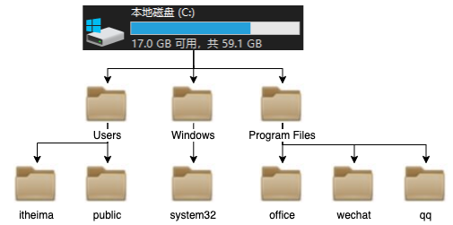
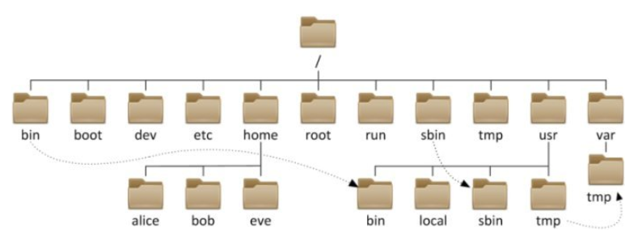
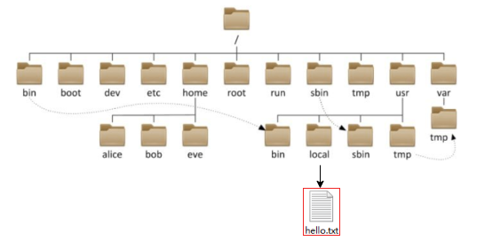

## 目录结构

### windows 系统目录结构

Windows 系统可以拥有多个盘符, 如 C盘、D盘、E盘

### Linux 系统目录结构

Linux 的目录结构是一个树型结构，且没有盘符这个概念, 只有一个根目录 `/`，所有文件都在它下面

## 路径的描述方式

### windows 系统路径的描述方式

在 Windows 系统中，路径之间的层级关系，使用：`\` 来表示

hello.txt 文件路径为 `D:\data\work\hello.txt`。

> `D:` 表示 D盘。
> `\` 表示层级关系。

### linux 系统路径的描述方式

在 Linux 系统中，路径之间的层级关系，使用：`/` 来表示

hello.txt 文件路径为 `/usr/local/hello.txt`。

> 最开头的 `/` 表示根目录。
> `/usr` 表示 `/` 下的 `usr` 目录，根目录后面的 `/` 表示层级关系。