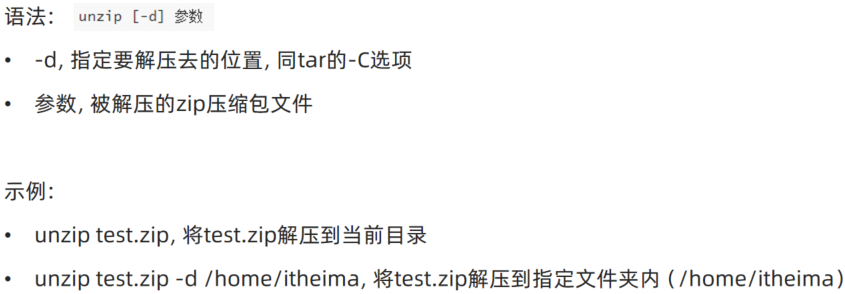

## 常用操作
### 强制停止
`Ctrl + C` 强制停止
- Linux 某些程序的运行，如果想强制停止，可使用快捷键 `Ctrl + C`。
- 命令输入错误，也可以通过快捷键 `Ctrl + C`，退出当前输入。

### 退出或登出
- 可以通过快捷键  `Ctrl + D`，退出当前登录用户。
- 也可以使用 `Ctrl + D` 退出某些程序专属界面，如 `python`

### 历史命令搜索
- 可以使用 `history` 命令，产看历史输入过的命令。
- 可以通过：`!` 命令前缀，自动执行上一次匹配前缀的命令
```bash
$ history
1  ls -l
2  ifconfig
3  ls
4  python
5  history

$ !py
python
```

- 可以通过快捷键：`ctrl + r`，输入内容去匹配历史命令
如果搜索到的内容是你需要的，那么：
    - 回车键可以直接执行
    - 键盘左右键，可以得到此命令（不执行）

### 光标移动快捷键
- `ctrl + a`，跳到命令开头
- `ctrl + e`，跳到命令结尾
- `ctrl + ←`，向左跳一个单词
- `ctrl + →`，向右跳一个单词

### 清屏
- 通过快捷键 `ctrl + l`，可以清空终端内容
- 通过命令 `clear` 得到同样效果

## 软件安装

-   CentOS 系统使用：
    -   `yum [install remove search] [-y] 软件名称`
        -   `install` 安装
        -   `remove` 卸载
        -   `search` 搜索
        -   `-y`，自动确认
-   Ubuntu 系统使用
    -   `apt [install remove search] [-y] 软件名称`
        -   `install` 安装
        -   `remove` 卸载
        -   `search` 搜索
        -   `-y`，自动确认

> `yum` 和 `apt` 均需要 root 权限

## `systemctl`

功能：控制系统服务的启动关闭等

语法：`systemctl start | stop | restart | disable | enable | status 服务名`

-   `start`，启动
-   `stop`，停止
-   `status`，查看状态
-   `disable`，关闭开机自启
-   `enable`，开启开机自启
-   `restart`，重启

## 软链接

功能：创建文件、文件夹软链接（快捷方式）

语法：`ln -s 参数1 参数2`

-   参数 1：被链接的
-   参数 2：要链接去的地方（快捷方式的名称和存放位置）

## 日期

语法：`date [-d] [+格式化字符串]`

-   `-d` 按照给定的字符串显示日期，一般用于日期计算

-   格式化字符串：通过特定的字符串标记，来控制显示的日期格式
    -   `%Y` 年%y 年份后两位数字 (00..99)
    -   `%m` 月份 (01..12)
    -   `%d` 日 (01..31)
    -   `%H` 小时 (00..23)
    -   `%M` 分钟 (00..59)
    -   `%S` 秒 (00..60)
    -   `%s` 自 1970-01-01 00:00:00 UTC 到现在的秒数

示例：

-   按照 `YYYY-MM-DD` 的格式显示日期

    ```bash
    $ date +%Y-%m-%d
    2025-5-11
    ```

-   按照 `YYYY-MM-DD hh:mm:ss` 的格式显示日期

    ```bash
    $ date "+%Y-%m-%d %H:%M:%S"
    2025-5-11 09:09:09
    ```

-   `-d` 选项日期计算

    ```bash
    date -d "+1 day" +%dy%m%d      # 获取明天的日期
    date -d "-1 day" +%dy%m%d      # 获取昨天的日期
    date -d "-1 month" +%dy%m%d    # 获取上月的日期
    date -d "+1 month" +%dy%m%d    # 获取下月的日期
    date -d "-1 year" +%dy%m%d     # 获取去年的日期
    date -d "+1 year" +%dy%m%d     # 获取明年的日期
    ```

-   支持的时间标记为：
    -   `year` 年
    -   `month` 月
    -   `day` 日
    -   `hour` 时
    -   `minte` 分
    -   `second` 秒

`-d` 选项可以和格式化字符串配合一起使用

## 时区

修改时区为中国时区

```bash
rf -f /etc/localtime
sudo ln -s /usr/share/zoneinfo/Asia/Shanghai /etc/localtime
```

## `ntp`

功能：同步时间

安装：`yum install -y ntp`

启动管理：`systemctl start | stop | restart | status | disable | enable ntpd`

手动校准时间：`ntpdate -u ntp.aliyun.com`

## IP 地址

格式：`a.b.c.d`

-   abcd 为 0~255 的数字

特殊 IP：

-   `127.0.0.1`，表示本机
-   `0.0.0.0`
    -   可以表示本机
    -   也可以表示任意 IP（看使用场景）

查看 ip：`ifconfig`

## 主机名

功能：Linux 系统的名称

查看：`hostname`

设置：`hostnamectl set-hostname 主机名`

## 配置 VMware 固定 IP

1. 修改 VMware 网络，参阅 PPT，图太多

2. 设置 Linux 内部固定 IP

    修改文件：`/etc/sysconfig/network-scripts/ifcfg-ens33`

    示例文件内容：

    ```shell
    TYPE="Ethernet"
    PROXY_METHOD="none"
    BROWSER_ONLY="no"
    BOOTPROTO="static"			# 改为static，固定IP
    DEFROUTE="yes"
    IPV4_FAILURE_FATAL="no"
    IPV6INIT="yes"
    IPV6_AUTOCONF="yes"
    IPV6_DEFROUTE="yes"
    IPV6_FAILURE_FATAL="no"
    IPV6_ADDR_GEN_MODE="stable-privacy"
    NAME="ens33"
    UUID="1b0011cb-0d2e-4eaa-8a11-af7d50ebc876"
    DEVICE="ens33"
    ONBOOT="yes"
    IPADDR="192.168.88.131"		# IP地址，自己设置，要匹配网络范围
    NETMASK="255.255.255.0"		# 子网掩码，固定写法255.255.255.0
    GATEWAY="192.168.88.2"		# 网关，要和VMware中配置的一致
    DNS1="192.168.88.2"			# DNS1服务器，和网关一致即可
    ```

## `ps` 命令

功能：查看进程信息

语法：`ps -ef`，查看全部进程信息，可以搭配 grep 做过滤：`ps -ef | grep xxx`

## `kill` 命令

语法

```bash
kill [-9] 进程ID
```

选项： `-9` 强制终止进程。不使用此选项会向进程发送信号要求其关闭，但是否关闭看进程自身的处理机制。


## `nmap` 命令

可以通过 Linux 命令去查看端口的占用情况
使用 `nmap` 命令，安装 `nmap`:

```bash
yum -y install nmap
```

语法：

```bash
nmap 被查看的IP地址
```

## `netstat` 命令

功能：查看端口占用

用法：`netstat -anp | grep xxx`

## `ping` 命令

测试网络是否联通

语法：`ping [-c num] 参数`

-   选项：`-c`，检查的次数，不使用 `-c` 选项，将无限次持续检查
-   参数：ip 或主机名，被检查的服务器的 ip 地址或主机名地址
    示例：
-   检查百度是否连通
    
    结果表示可以连通，延时 8ms 左右。
-   检查到 `39.155.66.10` 是否联通，只检查 3 次
    

## `wget` 命令

`wget` 是非交互式的文件下载器，可以在命令行内下载网络文件
语法：

```bash
wget [-b] URL
```

-   选项： `-b` 表示后台下载，会将日志写入到当前目录下的 wget.log 文件中
-   参数： `URL` 为要下载的文件的 URL
    示例：
-   下载 apache-hadoop 3.3.0 版本：

```bash
wget http://archive.apache.org/dist/hadoop/common/hadoop-3.3.0/hadoop-3.3.0.tar.gz
```

-   在后台下载：

```bash
wget -b http://archive.apache.org/dist/hadoop/common/hadoop-3.3.0/hadoop-3.3.0.tar.gz
```

-   通过 `tail` 命令监控后台下载进度：

```bash
tail -f wget-log
```

<font  color="red">注意：无论下载是否完成，都会生成要下载的文件，如果下载未完成，需要手动清理未完成的不可用文件</font>

## curl 命令


## top 命令

功能：查看主机运行状态

语法：`top`，查看基础信息

可用选项：


交互式模式中，可用快捷键：


## df 命令

查看磁盘占用


## iostat 命令

查看 CPU、磁盘的相关信息


## sar 命令

查看网络统计


## 环境变量

-   临时设置：export 变量名=变量值
-   永久设置：
    -   针对用户，设置用户 HOME 目录内：`.bashrc`文件
    -   针对全局，设置`/etc/profile`

### PATH 变量

记录了执行程序的搜索路径

可以将自定义路径加入 PATH 内，实现自定义命令在任意地方均可执行的效果

## $符号

可以取出指定的环境变量的值

语法：`$变量名`

示例：

`echo $PATH`，输出 PATH 环境变量的值

`echo ${PATH}ABC`，输出 PATH 环境变量的值以及 ABC

如果变量名和其它内容混淆在一起，可以使用${}

## 压缩解压

### 压缩

`tar -zcvf 压缩包 被压缩1...被压缩2...被压缩N`

-   -z 表示使用 gzip，可以不写

`zip [-r] 参数1 参数2 参数N`


### 解压

`tar -zxvf 被解压的文件 -C 要解压去的地方`

-   -z 表示使用 gzip，可以省略
-   -C，可以省略，指定要解压去的地方，不写解压到当前目录

`unzip [-d] 参数`



## su 命令

切换用户

语法：`su [-] [用户]`


## sudo 命令


比如：

```shell
itheima ALL=(ALL)       NOPASSWD: ALL
```

在 visudo 内配置如上内容，可以让 itheima 用户，无需密码直接使用`sudo`

## chmod 命令

修改文件、文件夹权限

语法：`chmod [-R] 权限 参数`

-   权限，要设置的权限，比如 755，表示：`rwxr-xr-x`

    

-   参数，被修改的文件、文件夹

-   选项-R，设置文件夹和其内部全部内容一样生效

## chown 命令

修改文件、文件夹所属用户、组

语法：`chown [-R] [用户][:][用户组] 文件或文件夹`


## 用户组管理


## 用户管理


## genenv 命令

-   `getenv group`，查看系统全部的用户组

    

-   `getenv passwd`，查看系统全部的用户

    

## env 命令

查看系统全部的环境变量

语法：`env`
