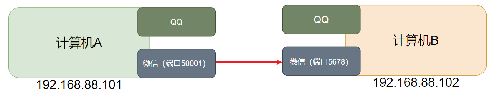
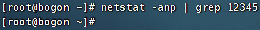
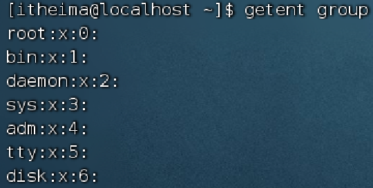

## 常用操作

### 强制停止

`Ctrl + C` 强制停止

-   Linux 某些程序的运行，如果想强制停止，可使用快捷键 `Ctrl + C`。
-   命令输入错误，也可以通过快捷键 `Ctrl + C`，退出当前输入。

### 退出或登出

-   可以通过快捷键 `Ctrl + D`，退出当前登录用户。
-   也可以使用 `Ctrl + D` 退出某些程序专属界面，如 `python`

### 历史命令搜索

-   可以使用 `history` 命令，产看历史输入过的命令。
-   可以通过：`!` 命令前缀，自动执行上一次匹配前缀的命令

```bash
$ history
1  ls -l
2  ifconfig
3  ls
4  python
5  history

$ !py
python
```

-   可以通过快捷键：`ctrl + r`，输入内容去匹配历史命令
    如果搜索到的内容是你需要的，那么： - 回车键可以直接执行 - 键盘左右键，可以得到此命令（不执行）

### 光标移动快捷键

-   `ctrl + a`，跳到命令开头
-   `ctrl + e`，跳到命令结尾
-   `ctrl + ←`，向左跳一个单词
-   `ctrl + →`，向右跳一个单词

### 清屏

-   通过快捷键 `ctrl + l`，可以清空终端内容
-   通过命令 `clear` 得到同样效果

## 软件安装

-   CentOS 系统使用：
    -   `yum [install remove search] [-y] 软件名称`
        -   `install` 安装
        -   `remove` 卸载
        -   `search` 搜索
        -   `-y`，自动确认
-   Ubuntu 系统使用
    -   `apt [install remove search] [-y] 软件名称`
        -   `install` 安装
        -   `remove` 卸载
        -   `search` 搜索
        -   `-y`，自动确认

> `yum` 和 `apt` 均需要 root 权限

## `systemctl`

功能：控制系统服务的启动关闭等

语法：`systemctl start | stop | restart | disable | enable | status 服务名`

-   `start`，启动
-   `stop`，停止
-   `status`，查看状态
-   `disable`，关闭开机自启
-   `enable`，开启开机自启
-   `restart`，重启

## 软链接

功能：创建文件、文件夹软链接（快捷方式）

语法：`ln -s 参数1 参数2`

-   参数 1：被链接的
-   参数 2：要链接去的地方（快捷方式的名称和存放位置）

## 日期

语法：`date [-d] [+格式化字符串]`

-   `-d` 按照给定的字符串显示日期，一般用于日期计算

-   格式化字符串：通过特定的字符串标记，来控制显示的日期格式
    -   `%Y` 年%y 年份后两位数字 (00..99)
    -   `%m` 月份 (01..12)
    -   `%d` 日 (01..31)
    -   `%H` 小时 (00..23)
    -   `%M` 分钟 (00..59)
    -   `%S` 秒 (00..60)
    -   `%s` 自 1970-01-01 00:00:00 UTC 到现在的秒数

示例：

-   按照 `YYYY-MM-DD` 的格式显示日期

    ```bash
    $ date +%Y-%m-%d
    2025-5-11
    ```

-   按照 `YYYY-MM-DD hh:mm:ss` 的格式显示日期

    ```bash
    $ date "+%Y-%m-%d %H:%M:%S"
    2025-5-11 09:09:09
    ```

-   `-d` 选项日期计算

    ```bash
    date -d "+1 day" +%dy%m%d      # 获取明天的日期
    date -d "-1 day" +%dy%m%d      # 获取昨天的日期
    date -d "-1 month" +%dy%m%d    # 获取上月的日期
    date -d "+1 month" +%dy%m%d    # 获取下月的日期
    date -d "-1 year" +%dy%m%d     # 获取去年的日期
    date -d "+1 year" +%dy%m%d     # 获取明年的日期
    ```

-   支持的时间标记为：
    -   `year` 年
    -   `month` 月
    -   `day` 日
    -   `hour` 时
    -   `minte` 分
    -   `second` 秒

`-d` 选项可以和格式化字符串配合一起使用

## 时区

修改时区为中国时区

```bash
rf -f /etc/localtime
sudo ln -s /usr/share/zoneinfo/Asia/Shanghai /etc/localtime
```

## `ntp`

功能：同步时间

安装：`yum install -y ntp`

启动管理：`systemctl start | stop | restart | status | disable | enable ntpd`

手动校准时间：`ntpdate -u ntp.aliyun.com`

## IP 地址

格式：`a.b.c.d`

-   abcd 为 0~255 的数字

特殊 IP：

-   `127.0.0.1`，表示本机
-   `0.0.0.0`
    -   可以表示本机
    -   也可以表示任意 IP（看使用场景）

查看 ip：`ifconfig`


如无法使用 ifconfig 命令，可以安装：

```bash
yum -y install net-tools
```

### 主机名

功能：Linux 系统的名称

查看：`hostname`

设置：`hostnamectl set-hostname 主机名`

### 配置 VMware 固定 IP

> 为什么需要固定 IP?
>
> 当前我们虚拟机的 Linux 操作系统，其 IP 地址是通过 DHCP 服务获取的。
> DHCP：动态获取 IP 地址，即每次重启设备后都会获取一次，可能导致 IP 地址频繁变更
>
> 原因 1：办公电脑 IP 地址变化无所谓，但是我们要远程连接到 Linux 系统，如果 IP 地址经常变化我们就要频繁修改适配很麻烦
>
> 原因 2：在刚刚我们配置了虚拟机 IP 地址和主机名的映射，如果 IP 频繁更改，我们也需要频繁更新映射关系

配置固定 IP 需要 2 个大步骤：

1. 在 VMware Workstation（或 Fusion）中配置 IP 地址网关和网段（IP 地址的范围）
   
   
   
   

2. 设置 Linux 内部固定 IP

    - 使用 vim 修改文件：`/etc/sysconfig/network-scripts/ifcfg-ens33`

    示例文件内容：

    ```shell
    TYPE="Ethernet"
    PROXY_METHOD="none"
    BROWSER_ONLY="no"
    BOOTPROTO="static"			# 改为static，固定IP
    DEFROUTE="yes"
    IPV4_FAILURE_FATAL="no"
    IPV6INIT="yes"
    IPV6_AUTOCONF="yes"
    IPV6_DEFROUTE="yes"
    IPV6_FAILURE_FATAL="no"
    IPV6_ADDR_GEN_MODE="stable-privacy"
    NAME="ens33"
    UUID="1b0011cb-0d2e-4eaa-8a11-af7d50ebc876"
    DEVICE="ens33"
    ONBOOT="yes"
    IPADDR="192.168.88.131"		# IP地址，自己设置，要匹配网络范围
    NETMASK="255.255.255.0"		# 子网掩码，固定写法255.255.255.0
    GATEWAY="192.168.88.2"		# 网关，要和VMware中配置的一致
    DNS1="192.168.88.2"			# DNS1服务器，和网关一致即可
    ```

    - 执行：`systemctl restart network` 重启网卡，执行 `ifconfig` 即可看到 ip 地址固定为 `192.168.88.130` 了

## 端口

Linux 系统是一个超大号小区，可以支持 65535 个端口，这 6 万多个端口分为 3 类进行使用：
公认端口：`1~1023`，通常用于一些系统内置或知名程序的预留使用，如 SSH 服务的 `22` 端口，HTTPS 服务的 `443` 端口
非特殊需要，不要占用这个范围的端口
注册端口：`1024~49151`，通常可以随意使用，用于松散的绑定一些程序/服务
动态端口：`49152~65535`，通常不会固定绑定程序，而是当程序对外进行网络链接时，用于临时使用。



如图中，计算机 A 的微信连接计算机 B 的微信，A 使用的 `50001` 即动态端口，临时找一个端口作为出口。
计算机 B 的微信使用端口 `5678`，即注册端口，长期绑定此端口等待别人连接。

### `nmap` 命令查看端口占用情况

可以通过 Linux 命令去查看端口的占用情况
使用 `nmap` 命令，安装 `nmap`:

```bash
yum -y install nmap
```

语法：

```bash
nmap 被查看的IP地址
```


可以看到，本机 `127.0.0.1`上有 5 个端口现在被程序占用了。
其中：
`22` 端口，一般是 SSH 服务使用，即 FinalShell 远程连接 Linux 所使用的端口

### `netstat` 命令查看端口占用

功能：查看端口占用

用法：

```bash
`netstat -anp | grep 端口号`
```

安装 `netstat`：

```bash
yum -y install net-tools
```


如图，可以看到当前系统 `6000` 端口被程序（进程号 `7174`）占用了
其中，`0.0.0.0:6000`，表示端口绑定在 `0.0.0.0` 这个 IP 地址上，表示允许外部访问



可以看到，当前系统 12345 端口无人使用。

## 下载和网络请求

### `ping` 命令

测试网络是否联通

语法：`ping [-c num] 参数`

-   选项：`-c`，检查的次数，不使用 `-c` 选项，将无限次持续检查
-   参数：ip 或主机名，被检查的服务器的 ip 地址或主机名地址
    示例：
-   检查百度是否连通
    
    结果表示可以连通，延时 8ms 左右。
-   检查到 `39.155.66.10` 是否联通，只检查 3 次
    

### `wget` 命令

`wget` 是非交互式的文件下载器，可以在命令行内下载网络文件
语法：

```bash
wget [-b] URL
```

-   选项： `-b` 表示后台下载，会将日志写入到当前目录下的 wget.log 文件中
-   参数： `URL` 为要下载的文件的 URL
    示例：
-   下载 apache-hadoop 3.3.0 版本：

```bash
wget http://archive.apache.org/dist/hadoop/common/hadoop-3.3.0/hadoop-3.3.0.tar.gz
```

-   在后台下载：

```bash
wget -b http://archive.apache.org/dist/hadoop/common/hadoop-3.3.0/hadoop-3.3.0.tar.gz
```

-   通过 `tail` 命令监控后台下载进度：

```bash
tail -f wget-log
```

<font  color="red">注意：无论下载是否完成，都会生成要下载的文件，如果下载未完成，需要手动清理未完成的不可用文件</font>

### `curl` 命令

`curl` 可以发送 http 网络请求，可用于：下载文件、获取信息等
语法：

```bash
curl [-O] url
```

选项：`-O`，用于下载文件，当 url 是下载链接时，可以使用此选项保存文件
参数：`url`，要发起请求的网络地址

> 示例：
> 向 cip.cc 发起网络请求：
>
> ```bash
>   curl cip.cc
> ```
>
> 
>
> 向 python.itheima.com 发起网络请求：
>
> ```bash
> curl python.itheima.com
> ```
>
> 通过 curl 下载 hadoop-3.3.0 安装包：
>
> ```bash
> curl -O http://archive.apache.org/dist/hadoop/common/hadoop-3.3.0/hadoop-3.3.0.tar.gz
> ```

## 进程管理

### `ps` 命令查看进程

功能：查看进程信息

语法：

```bash
ps [-ef]
```

查看全部进程信息，可以搭配 grep 做过滤：`ps -ef | grep xxx`
选项：`-e`，显示出全部的进程
选项：`-f`，以完全格式化的形式展示信息（展示全部信息）

从左到右分别是：
`UID`：进程所属的用户 ID
`PID`：进程的进程号 ID
`PPID`：进程的父 ID（启动此进程的其它进程）
`C`：此进程的 CPU 占用率（百分比）
`STIME`：进程的启动时间
`TTY`：启动此进程的终端序号，如显示?，表示非终端启动
`TIME`：进程占用 CPU 的时间
`CMD`：进程对应的名称或启动路径或启动命令

### `kill` 命令关闭进程

语法

```bash
kill [-9] 进程ID
```

选项： `-9` 强制终止进程。不使用此选项会向进程发送信号要求其关闭，但是否关闭看进程自身的处理机制。


## 查看主机运行状态

### top 命令

功能：命令查看 CPU、内存使用情况，类似 Windows 的任务管理器，默认<font color=red>每 5 秒</font>刷新一次

语法：`top`，按 q 或 ctrl + c 退出

### top命令内容详解


第一行：

top：命令名称，14:39:58：当前系统时间，up 6 min：启动了 6 分钟，2 users：2 个用户登录，load：1、5、15 分钟负载

第二行：

Tasks：175 个进程，1 running：1 个进程子在运行，174 sleeping：174 个进程睡眠，0 个停止进程，0 个僵尸进程

第三行：

%Cpu(s)：CPU 使用率，us：用户 CPU 使用率，sy：系统 CPU 使用率，ni：高优先级进程占用 CPU 时间百分比，id：空闲 CPU 率，wa：IO 等待 CPU 占用率，hi：CPU 硬件中断率，si：CPU 软件中断率，st：强制等待占用 CPU 率

第四、五行：

Kib Mem：物理内存，total：总量，free：空闲，used：使用，buff/cache：buff 和 cache 占用
KibSwap：虚拟内存（交换空间），total：总量，free：空闲，used：使用，buff/cache：buff 和 cache 占用


- PID：进程id
- USER：进程所属用户
- PR：进程优先级，越小越高
- NI：负值表示高优先级，正表示低优先级
- VIRT：进程使用虚拟内存，单位KB
- RES：进程使用物理内存，单位KB
- SHR：进程使用共享内存，单位KB
- S：进程状态（S休眠，R运行，Z僵死状态，N负数优先级，I空闲状态）
- %CPU：进程占用CPU率
- %MEM：进程占用内存率
- TIME+：进程使用CPU时间总计，单位10毫秒
- COMMAND：进程的命令或名称或程序文件路径

可用选项：


交互式模式中，可用快捷键：


## df 命令

查看磁盘占用


## iostat 命令

查看 CPU、磁盘的相关信息


## sar 命令

查看网络统计


## 环境变量

-   临时设置：export 变量名=变量值
-   永久设置：
    -   针对用户，设置用户 HOME 目录内：`.bashrc`文件
    -   针对全局，设置`/etc/profile`

### PATH 变量

记录了执行程序的搜索路径

可以将自定义路径加入 PATH 内，实现自定义命令在任意地方均可执行的效果

## $符号

可以取出指定的环境变量的值

语法：`$变量名`

示例：

`echo $PATH`，输出 PATH 环境变量的值

`echo ${PATH}ABC`，输出 PATH 环境变量的值以及 ABC

如果变量名和其它内容混淆在一起，可以使用${}

## 压缩解压

### 压缩

`tar -zcvf 压缩包 被压缩1...被压缩2...被压缩N`

-   -z 表示使用 gzip，可以不写

`zip [-r] 参数1 参数2 参数N`


### 解压

`tar -zxvf 被解压的文件 -C 要解压去的地方`

-   -z 表示使用 gzip，可以省略
-   -C，可以省略，指定要解压去的地方，不写解压到当前目录

`unzip [-d] 参数`


## su 命令

切换用户

语法：`su [-] [用户]`


## sudo 命令


比如：

```shell
itheima ALL=(ALL)       NOPASSWD: ALL
```

在 visudo 内配置如上内容，可以让 itheima 用户，无需密码直接使用`sudo`

## chmod 命令

修改文件、文件夹权限

语法：`chmod [-R] 权限 参数`

-   权限，要设置的权限，比如 755，表示：`rwxr-xr-x`

    

-   参数，被修改的文件、文件夹

-   选项-R，设置文件夹和其内部全部内容一样生效

## chown 命令

修改文件、文件夹所属用户、组

语法：`chown [-R] [用户][:][用户组] 文件或文件夹`


## 用户组管理


## 用户管理


## genenv 命令

-   `getenv group`，查看系统全部的用户组

    

-   `getenv passwd`，查看系统全部的用户

    

## env 命令

查看系统全部的环境变量

语法：`env`
