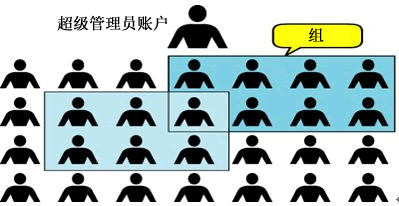
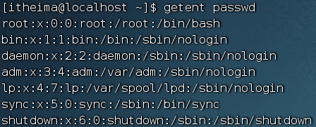
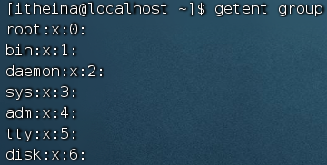
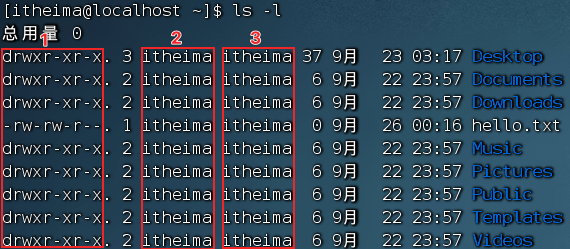
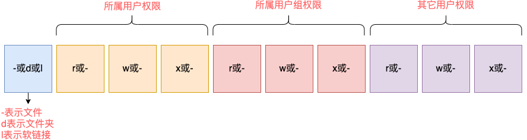

## Root 用户

无论是 Windows、MacOS、Linux 均采用多用户的管理模式进行权限管理。

在 Linux 系统中，拥有最大权限的账户名为：root（超级管理员）



root 用户拥有最大的系统操作权限，而普通用户在许多地方的权限是受限的。

> -   普通用户的权限，一般在其 HOME 目录内是不受限的
> -   一旦出了 HOME 目录，大多数地方，普通用户仅有只读和执行权限，无修改权限

### `su` 和 `exit` 命令

`su` 命令就是用于账户切换的系统命令，其来源英文单词：<font color=red>S</font>witch <font color=red>U</font>ser

语法：

```bash
su [-] [username]
```

-   `-` 符号是可选的，表示是否在切换用户后加载环境变量，建议带上
-   参数：用户名，表示要切换的用户，用户名也可以省略，省略表示切换到 root
-   <font color=red>切换用户后，可以通过 `exit` 命令退回上一个用户，也可以使用快捷键：ctrl + d </font>
-   使用普通用户，切换到其它用户<font color=red>需要输入密码</font>，如切换到 root 用户
-   使用 root 用户切换到其它用户，<font color=red>无需密码</font>，可以直接切换

### `sudo` 命令

以使用 `sudo` 命令，为普通的命令授权，临时以 root 身份执行。

语法： `sudo command`

-   在其它命令之前，带上 sudo，即可为这一条命令临时赋予 root 授权
-   不是所有的用户都有权利使用 sudo，我们需要为普通用户<font color=red>配置 sudo 认证</font>

### 为普通用户配置 `sudo` 认证

切换到 root 用户，执行 `visudo` 命令，会自动通过 vi 编辑器打开：/etc/sudoers
在文件的最后添加：
```txt
babala ALL=(ALL)   NOPASSWD:ALL
```
其中最后的 `NOPASSWD:ALL` 表示使用 `sudo` 命令，无需输入密码

执行 `wz` 保存

## 用户、用户组


Linux系统中可以配置多个用户，配置多个用户组，用户可以加入多个用户组中。

Linux中关于权限的管控级别有2个级别，分别是：
- 针对用户的权限控制
- 针对用户组的权限控制

比如，针对某文件，可以控制用户的权限，也可以控制用户组的权限。

### 用户组管理

<font color=red>以下命令需root用户执行</font>

- 创建用户组
```bash
groupadd 用户组名
```

- 删除用户组
```bash
groupdel 用户组名
```

### 用户管理

<font color=red>以下命令需root用户执行</font>

- 创建用户
```bash
useradd [-g -d] 用户名
```
`-g` 指定用户的组，不指定 `-g`，会创建同名组并自动加入，指定 `-g` 需要组已经存在，如已存在同名组，必须使用 `-g`
`-d` 指定用户HOME路径，不指定，HOME目录默认在：`/home/用户名`

- 删除用户
```bash
userdel [-r] 用户名
```
`-r` 删除用户的HOME目录，不使用 `-r`，删除用户时，HOME目录保留

- 查看用户所属组
```bash
id [用户名]
```
参数：用户名，被查看的用户，如果不提供则查看自身

- 修改用户所属组
```bash
usermod -aG 用户组 用户名
```
将指定用户加入指定用户组

### 查看用户
使用 `getent` 命令，可以查看当前系统中有哪些用户

语法： 
```bash
getent passwd
```


共有 7 份信息：`用户名:密码(x):用户ID:组ID:描述信息(无用):HOME目录:执行终端(默认bash)`

### 查看用户组
使用 `getent` 命令，同样可以查看当前系统中有哪些用户组

语法：
```bash
getent group
```


包含3份信息: `组名称:组认证(显示为x):组ID`

## 查看权限控制

通过 `ls -l` 可以以列表形式查看内容，并显示权限细节



- 序号 1，表示文件、文件夹的权限控制信息
- 序号 2，表示文件、文件夹所属用户
- 序号 3，表示文件、文件夹所属用户组

权限信息总共分为10个槽位

> 举例：`drwxr-xr-x`，表示：
> - 这是一个文件夹，首字母 `d` 表示
> - 所属用户(右上角图序号2)的权限是：有 `r` 有 `w` 有 `x`，`rwx`
> - 所属用户组(右上角图序号3)的权限是：有 `r` 无 `w` 有 `x`，`r-x` （`-`表示无此权限）
> - 其它用户的权限是：有 `r` 无 `w` 有 `x`，`r-x`

### `rwx`
- `r` 表示读权限
- `w` 表示写权限
- `x` 表示执行权限
针对文件、文件夹的不同，`rwx` 的含义有细微差别
- `r`，针对文件可以查看文件内容
    - 针对文件夹，可以查看文件夹内容，如 `ls` 命令
- `w`，针对文件表示可以修改此文件
    - 针对文件夹，可以在文件夹内：创建、删除、改名等操作
- `x`，针对文件表示可以将文件作为程序执行
    - 针对文件夹，表示可以更改工作目录到此文件夹，即 `cd` 进入

## 修改权限控制 - chmod

### `chmod` 命令
可以使用 `chmod` 命令，修改文件、文件夹的权限信息。
> 注意，只有文件、文件夹的所属用户或root用户可以修改。
语法：
```bash
chmod [-R] 权限 文件或文件夹
```
选项：`-R`，对文件夹内的全部内容应用同样的操作

示例：
- `chmod u=rwx,g=rx,o=x hello.txt`，将文件权限修改为：`rwxr-x--x`
    - 其中：`u` 表示user所属用户权限，`g` 表示group组权限，`o` 表示other其它用户权限
- `chmod -R u=rwx,g=rx,o=x test`，将文件夹 test 以及文件夹内全部内容权限设置为：`rwxr-x--x`

除此之外，还有快捷写法：`chmod 751 hello.txt`

将hello.txt的权限修改为 `751`

### 权限的数字序号
权限可以用 `3` 位数字来代表，第一位数字表示用户权限，第二位表示用户组权限，第三位表示其它用户权限。
数字的细节如下：`r` 记为 `4`，`w` 记为 `2`，`x` 记为 `1`，可以有：
- `0`：无任何权限，	即 `---`
- `1`：仅有x权限，	即 `--x`
- `2`：仅有w权限	即 `-w-`
- `3`：有w和x权限	即 `-wx`
- `4`：仅有r权限	即 `r--`
- `5`：有r和x权限	即 `r-x`
- `6`：有r和w权限	即 `rw-`
- `7`：有全部权限	即 `rwx`
所以 `751` 表示： `rwx(7) r-x(5) --x(1)`

## 修改所属用户、用户组- chown

使用 `chown` 命令，可以修改文件、文件夹的所属用户和用户组
<font color=red>普通用户无法修改所属为其它用户或组，所以此命令只适用于 root 用户执行</font>
语法：
```bash
chown [-R] [用户] [用户组]:文件或文件夹
```

- 选项，`-R`，同 `chmod`，对文件夹内全部内容应用相同规则
- 选项，用户，修改所属用户
- 选项，用户组，修改所属用户组
- `:` 用于分隔用户和用户组
示例：
`chown root hello.txt`，将 hello.txt 所属用户修改为 root
`chown :root hello.txt`，将 hello.txt 所属用户组修改为 root
`chown root:babala hello.txt`，将 hello.txt 所属用户修改为 root，用户组修改为 babala
`chown -R root test`，将文件夹 test 的所属用户修改为 root 并对文件夹内全部内容应用同样规则