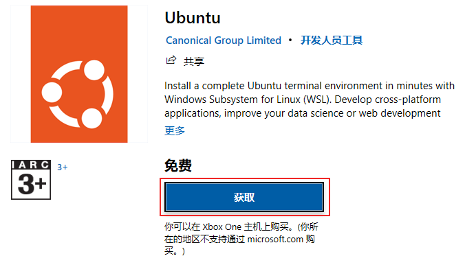

## VMware WorkStation 安装
下载地址： https://www.vmware.com/products/desktop-hypervisor/workstation-and-fusion

下载完成后检验：

## 在 VMware上安装 Linux
### 下载 centos 镜像
下载地址: https://www.centos.org/download/

### 在 VMware 中安装 CentOS 操作系统
1. 打开VMware软件

2. 创建虚拟机

## FinalShell 连接 Linux

在 VMware 中操作 Linux 的命令行页面不太方便，主要是：
- 内容的复制、粘贴跨越VMware不方便
- 文件的上传、下载跨越VMware不方便
- 也就是和Linux系统的各类交互，跨越VMware不方便

可以通过第三方软件 [FinalShell](https://www.hostbuf.com/) 远程连接到 Linux 操作系统上，并通过 FinalShell 去操作Linux系统。

**连接到Linux系统**
1. 先查询到 Linux 系统的IP地址

2. 打开Finshell软件，配置到 Linux 系统的连接

3. 按图示配置连接，并点击确定

4. 打开连接管理器， 双击刚刚配置好的连接

5. 点击接受并保存

6. 连接成功

> 注意：
> Linux 虚拟机重启，有可能 IP 会发生改变
> 如果 IP 发生改变， 需要在 FinalShell 中修改连接的 IP 地址

## WSL（Windows Subsystem for Linux）

WSL（Windows Subsystem for Linux），是用于Windows系统之上的Linux子系统。传统方式获取Linux操作系统环境，是安装完整的虚拟机，如VMware，使用 WSL ，可以以非常轻量化的方式，得到 Linux 系统环境。

### WSL 部署
WSL 是 Windows10 自带功能，需要开启，无需下载
1. 找到 “应用和功能”

2. 点击 “程序和功能”

3. 点击 “启用或关闭 Windows 功能”

4. 勾选  “适用于 Linux 的 Windows 子系统”

点击确定后会进行部署
最后重启即可
5. 打开 Windows 应用商店，搜索 Ubuntu，点击获取并安装

6. 启动 Ubuntu

7. 登录 Ubuntu
输入用户名用以创建一个用户：

输入两次密码确认（注意，输入密码没有反馈，不用理会，正常输入即可）

至此，得到了一个可用的 Ubuntu 操作系统环境
